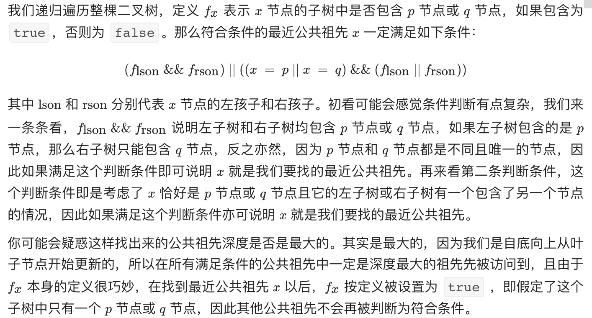

# 题目

给定一个二叉树, 找到该树中两个指定节点的最近公共祖先。

# 解题思路



# 代码

```java
/**
 * Definition for a binary tree node.
 * public class TreeNode {
 *     int val;
 *     TreeNode left;
 *     TreeNode right;
 *     TreeNode(int x) { val = x; }
 * }
 */
class Solution {

  

    private TreeNode ans = null;

    public TreeNode lowestCommonAncestor(TreeNode root, TreeNode p, TreeNode q) {        
        dfs(root, p, q);
        return ans; 
    }

    public boolean dfs(TreeNode root, TreeNode p, TreeNode q){
        if (root == null) {
            return false;
        }
        boolean lson = dfs(root.left, p, q);
        boolean rson = dfs(root.right, p, q);

        if (lson && rson || ((root.val == p.val || root.val == q.val) && (lson || rson))){
            ans = root;
        }
        return  lson || rson || (root.val == p.val || root.val == q.val);
    }


}
```

