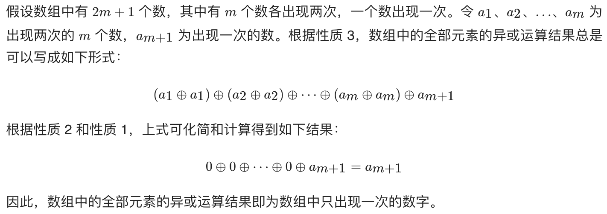

# 题目

给定一个**非空**整数数组，除了某个元素只出现一次以外，其余每个元素均出现两次。找出那个只出现了一次的元素。

# 解题思路
 

# 代码

```java
class Solution {
    public int singleNumber(int[] nums) {
        int single = 0;
        for (int num : nums) {
            single ^= num;
        }
        return single;
    }
}
```

