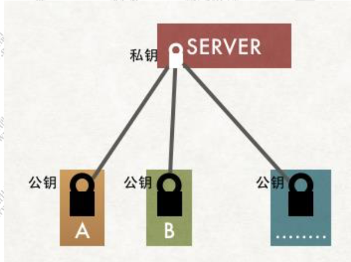
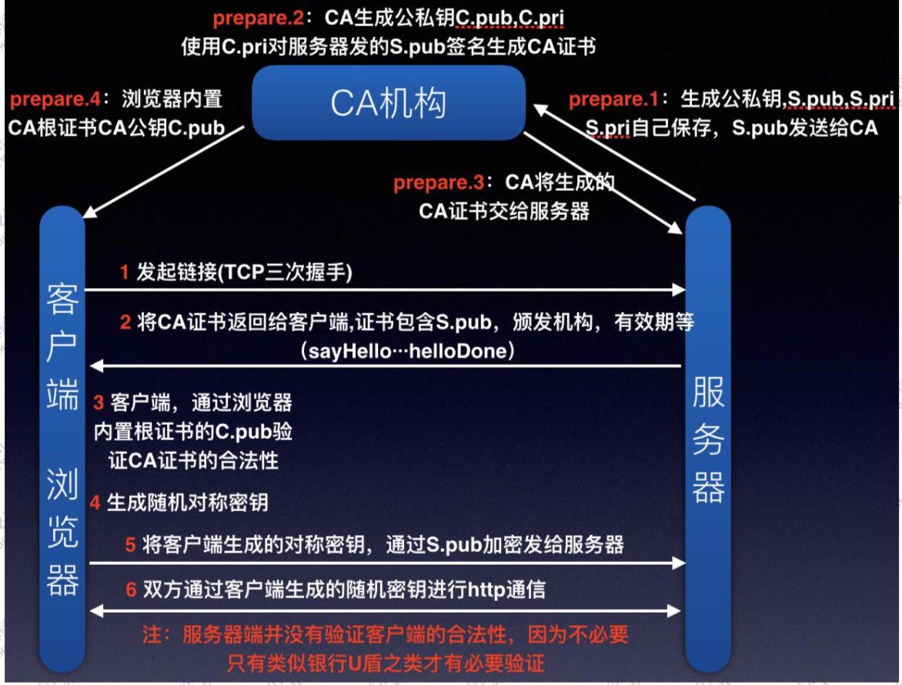

# HTTP

在最早的 http 协议中，每进行一次 http 通信，就需要做一次 tcp 的连接。而一次连接需要进 行 3 次握手，这种通信方式会增加通信量的开销。所以在 HTTP/1.1 中改用了持久连接，就是在一次连接建立之后，只要客户端或者服务端没有 明确提出断开连接，那么这个 tcp 连接会一直保持连接状态

## 特点

HTTP 协议本身不会对请求和响应之间的 通信状态做保存。

通过在请求和响应报文 中写入 Cookie 信息来控制客户端的状态;Cookie 会根据从服务器端发送的响应报文内的一 个叫做 Set-Cookie 的首部字段信息，通知客户端保存 Cookie。当下次客户端再往该服务器 发送请求时，客户端会自动在请求报文中加入 Cookie 值后发送出去

当程序需要为某个客户端的请求创建一个 session 的时候，如果不存在 Session，则尝试根据 requestedSessionId 查找 Session，如果存在 Session 的 话则直接返回，如果不存在的话，则创建新的 Session，并且把 sessionId 添加到 Cookie 中， 后续的请求便会携带该 Cookie，这样便可以根据 Cookie 中的 sessionId 找到原来创建的 Session 了

# HTTPS

https 是一种加密的超文本传输协议，它与 HTTP 在协议差异在于对数据传输的过程中，https 对数据做了完全加密。由于 http 协议或者 https 协议都是处于 TCP 传输层之上，同时网络协 议又是一个分层的结构，所以在 tcp 协议层之上增加了一层 SSL(Secure Socket Layer，安 全层)或者 TLS(Transport Layer Security) 安全层传输协议组合使用用于构造加密通道;

## 对称秘钥

对称加密算法来实现，密钥 S 扮演着加密和解密的角色。

协商过程，意味着又是基于一个网络传输的情况下去动态分配密钥，可是这个协商过程又是不安全的。

## 非对称加密

非对称加密算法的特点是：私钥加密后的密文，只要有公钥，都能解密，但是公钥加密后的密文，只有私钥可以解密。私钥只有一个人有，而公钥可以发给所有人。

这样就可以保证 A/B 向服务器端方向发送的消息是安全的。似乎我们通过非对称加密算法解决了密钥的协商的问题。

使用非对称加密算法，让 A、B 客户端安全地持有公钥，服务端把需要传递给客户端的公钥，通过第三方机构提供的私钥对公钥内容进行加密后，再传递给客户端。通过第三方机构私钥对服务端公钥加密以后的内容，就是一个简陋版本的 “数字证书”。这个证书中包含【服务器公钥】。户端拿到证书后根据证书上的方法自己生成一个证书编号，如果生成的证书编号与证书上的证书编号相同，那么说明这个证书是真实的。浏览器和操作系统都会维护一个权威的第三方机构列表(包括他们的公钥)。

证书就是 HTTPS 中的数字证书，证书编号就是数字签名，而第三方机构就是数字证书的签发机构(CA)

## HTTPS原理

