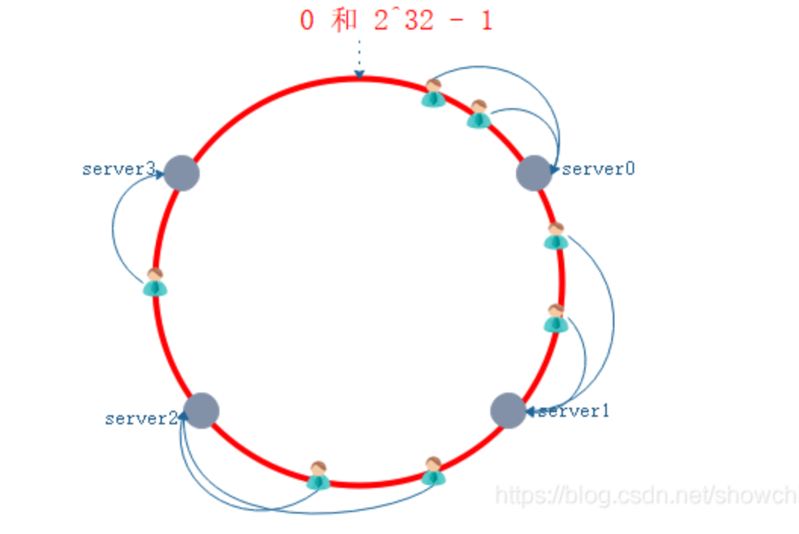
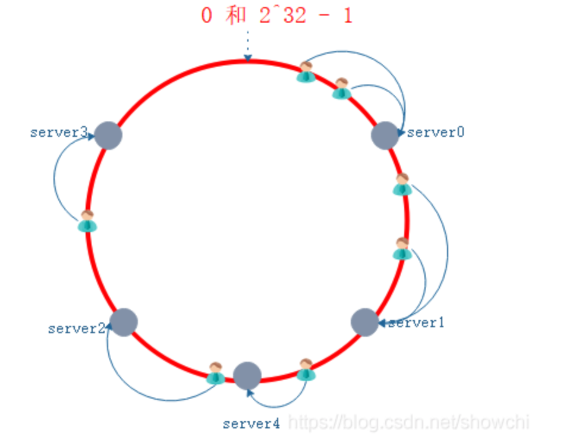
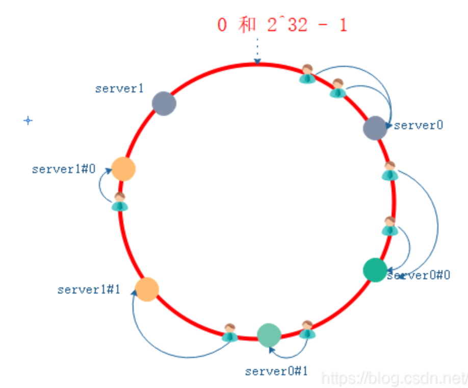

# 普通Hash

hash计算方式为 **hash = 请求%serverCount**

当发生宕机或者扩容的时候，我们之前计算的所有hash都需要重新计算，在生产环境下我们后台服务器很多台，客户端也有很多，那么影响是很⼤的，缩容和扩容都会存在这样的问题，⼤量⽤户的请求会被路由到其他的⽬标服务器处理，⽤户在原来服务器中的会话都会丢失。

# 一致性Hash

一致性Hash的出现就解决了上述的问题，在发生宕机或者和扩容的时候尽可能少的影响请求的分发。

我们对服务器求hash然后把服务器放到hash环上的对应位置上，当有请求到来时，对请求进行计算，把请求放到hash环的对应位置，然后顺时针获得最近的服务器节点。

当发生服务宕机或者扩容是请求转发也是会发生变化的，当发生扩容或者宕机的时候只会影响极少数一部分的用户，最大限度上提高的体验。

当然一致性hash也可能存在一些问题的，比如如下图所示， 服务器分布及其不合理， 大量的请求都落在同一个服务器上，对服务的压力较大。针对这种情况我们可以用增加虚拟节点的方式来尽可能更合理的分发请求来，减轻对某一服务的压力。

