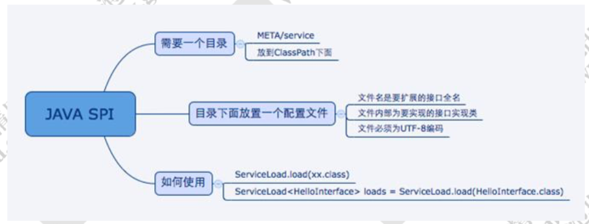
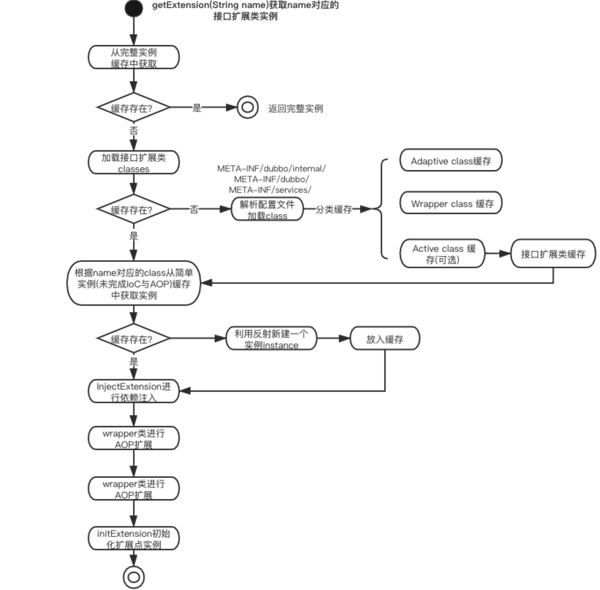
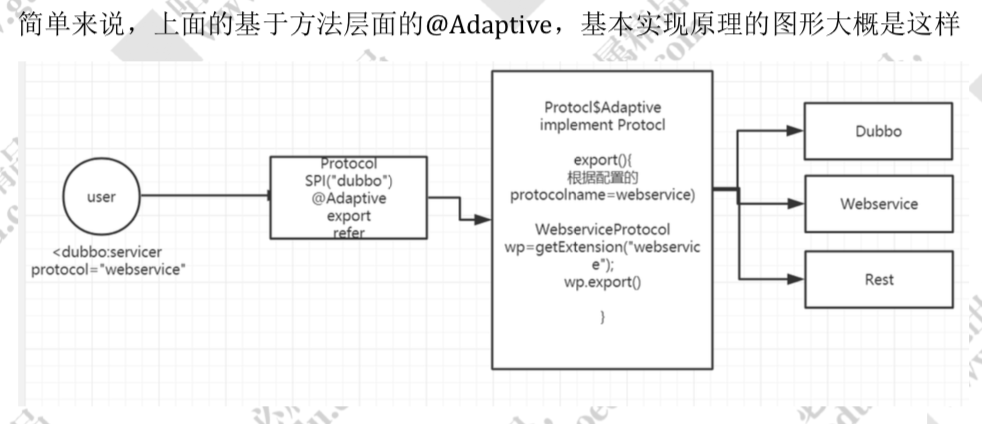

# SPI

spi，简单来说，就是 `service provider interface`，说白了是什么意思呢，比如你有个接口，现在这个接口有 3 个实现类，那么在系统运行的时候对这个接口到底选择哪个实现类呢？这就需要 spi 了，需要**根据指定的配置**或者是**默认的配置**，去**找到对应的实现类**加载进来，然后用这个实现类的实例对象。

举个栗子。

你有一个接口 A。A1/A2/A3 分别是接口A的不同实现。你通过配置 `接口 A = 实现 A2`，那么在系统实际运行的时候，会加载你的配置，用实现 A2 实例化一个对象来提供服务。

spi 机制一般用在哪儿？**插件扩展的场景**，比如说你开发了一个给别人使用的开源框架，如果你想让别人自己写个插件，插到你的开源框架里面，从而扩展某个功能，这个时候 spi 思想就用上了。

# Java SPI

1. 需要在 classpath 下创建一个目录，该目录命名必须是:META-INF/service
2. 在该目录下创建一个 properties 文件，文件名是扩展的接口的全路径名称，文件内部描述的是该扩展接口的所有实现类 
3. 通过 java.util.ServiceLoader 的加载机制来发现



## 缺点

1. JDK 标准的 SPI 会一次性加载实例化扩展点的所有实现，有的扩展点初始化很耗时或者如果有些实现类并没有用到， 会很浪费资源。

2. 如果扩展点加载失败，会导致调用方报错，而且这个错误很难定位。
3. 获取某个实现类的方式不够灵活，只能通过Iterator形式获取，不能根据某个参数来获取对应的实现类。

# Dubbo SPI

能够被扩展的接口，必须要有@SPI()，Dubbo自定义的注解

@SPI("value") ， 表示当前扩展点的默认实现

## 静态扩展点

1. 需要在 resource 目录下配置 META-INF/dubbo 或者 META-INF/dubbo/internal 或者 META-INF/services，并基于 SPI 接口去创建一个文件。

2. 文件名称和接口名称保持一致，文件内容和 SPI 有差异，内容是 KEY 对应 Value

3. 调用

   ExtensionLoader.getExtensionLoader(xxx.class).getExtension("");

   @SPI注解，被此注解标记的接口，就表示是一个可扩展的接口，并标注默认值

### 实现原理



## **Adaptive** 自适应扩展点

@Adaptive。是一个自适应扩展点的标识。它可以修饰在类上，也可以修饰在方法上面。

放在类上，说明当前类是一个确定的自适应扩展点的类。如果是放在方法级别，那么需要生成一个动态字节码（使用javassi），来进行转发。

比如Protocol 这个接口，定义了 export 和 refer 两个抽象方法，这两个方法分别带有@Adaptive 的标识，标识是一个自适应方法。实现取决于在使用 dubbo 的时候所配置的协议名称。方法层面的 Adaptive 就决定了当前这个方法会采用何种协议来发布服务。

```java
Compiler compiler=ExtensionLoader.getExtensionLoader(Compiler.class).getAdaptiveExtension();
//我们传入一个 Compiler 接口，它会返回一个 AdaptiveCompiler。这个就叫自适应。
```

###  实现原理

```java
getAdaptiveExtension()--> 
  	createAdaptiveExtension()-->   
  			getAdaptiveExtensionClass()-->
  					getExtensionClasses()-->
  							loadExtensionClasses()
```

```java
public T getAdaptiveExtension() {                  
  //获取
  Object instance = cachedAdaptiveInstance.get();       
  if (instance == null) { 
    //创建自适应扩展                          
    instance = createAdaptiveExtension();  
    //设置缓存                              
    cachedAdaptiveInstance.set(instance);   
  }                    
  return (T) instance;  
}

private T createAdaptiveExtension() {         
  //获取自适应扩展类，通过反射实例化 ，实现依赖注入           
  return 
    injectExtension((T)               
                    gtAdaptiveExtensionClass().newInstance());    
}

private Class<?> getAdaptiveExtensionClass() {      
  //getExtensionClasses->loadFile直接从配置文件中解析加载
  //会加载当前传入的类型的所有扩展点，保存在一个 hashmap 中
  getExtensionClasses();       
  //如果缓存中已经找到自适应类的话直接返回，意思也就是这个spi有   
  //aptive的注解类  
  if (cachedAdaptiveClass != null) {         
    return cachedAdaptiveClass;        
  }        
  //否则需要代理类生成相关代理      
  return cachedAdaptiveClass = createAdaptiveExtensionClass();   
}

 private Class<?> createAdaptiveExtensionClass() {
    //具体就是生成代理类    
   String code = createAdaptiveExtensionClassCode();     
   ClassLoader classLoader = findClassLoader();        
   com.alibaba.dubbo.common.compiler.Compiler compiler =     ExtensionLoader.getExtensionLoader(com.alibaba.dubbo.common.com                                       					piler.Compiler.class).getAdaptiveExtension();        
   //来编译上面生成的类并返回
   return compiler.compile(code, classLoader);    
 }
```



## 激活拓展点

自动激活扩展点，类似springboot 的时候用到的 conditional，根据条件进行自动激活。但是这里设计的初衷是，对于一个类会加载多个扩展点的实现，这个时候可以通过自动激活扩展点进行动态加载， 从而简化配置我们的配置工作 

@Activate 提供了一些配置来允许我们配置加载条件，比如 group 过滤，比如 key 过滤。

group 表示客户端和和服务端都会加载，value 表示 url 中有 cache_key 的时候。