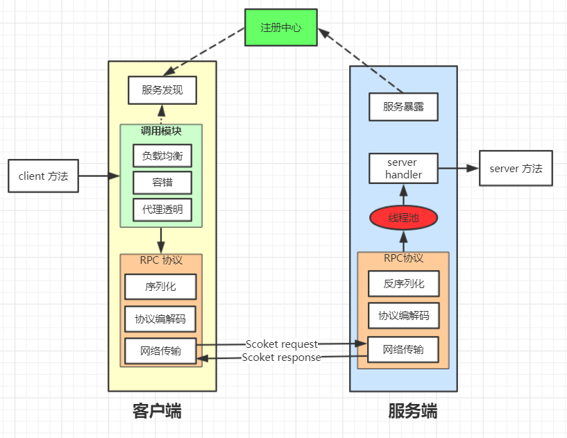
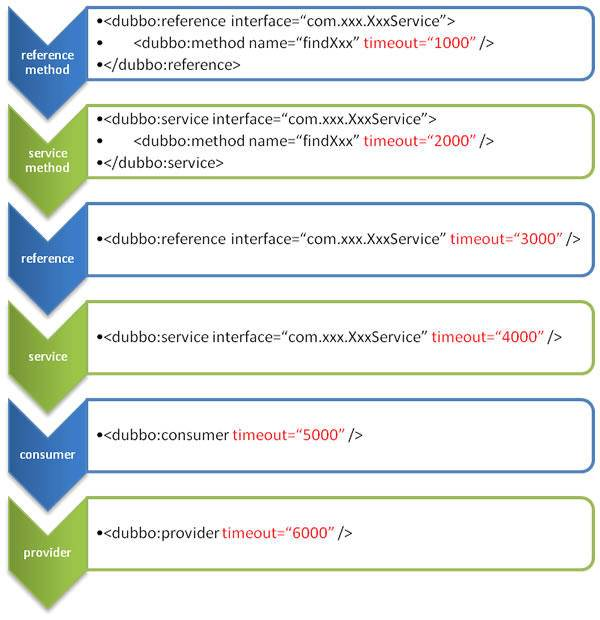
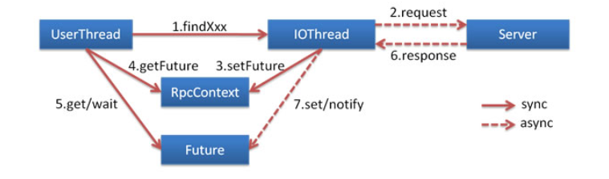
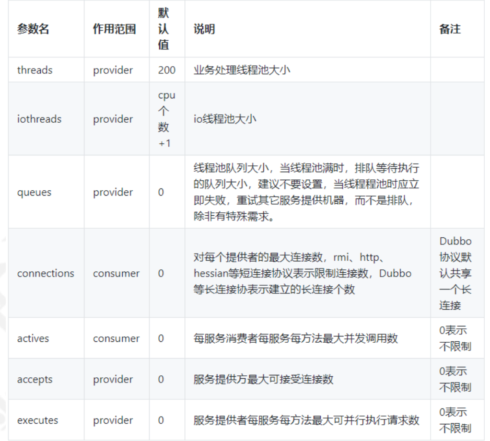
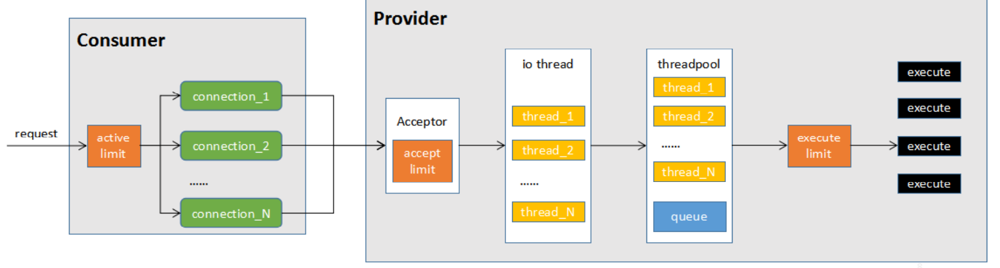

# Dubbo架构



# 负载均衡

## 随机权重

权重随机算法，根据权重值进行随机负载。

## 最少活跃调用

活跃调用数越小，表明该服务提供者效率越高，单位时间内可处理更多的请求。每个服务提供者对应一个活跃数 active。初始情况下，所有服务提供者活跃数均为 0。 每收到一个请求，活跃数加 1，完成请求后则将活跃数减 1。

## hash一致性

hash 一致性算法，相同参数的请求总是发到同一提供者。当某一台提供者挂时，原本发往该提供者的请求，基于虚拟节点，平摊到其它提供者， 不会引起剧烈变动。

## 加权轮询

经过加权后，每台服务器能够得到的请求数比例，接近他们的权重比。

# 集群容错

## Failover Cluster

缺省为 failover 重试。失败自动切换，当出现失败，重试其它服务器。可通过 retries="2" 来设置重试次数(不含第一次)。

## Failfast Cluster

快速失败，只发起一次调用，失败立即报错。通常用于非幂等性的写操作，比如新增记录。

## Failback Cluster

失败自动恢复，后台记录失败请求，定时重发。通常用于消息通知操作。

## Forking Cluster

并行调用多个服务器，只要一个成功即返回。 通常用于实时性要求较高的读操作，但需要浪费更多服务资源。 可通过 forks="2" 来设置最大并行数。

# 服务降级

当某个非关键服务出现错误时，可以通过降级功能来临时屏蔽这个服务。降级可以有几个层面的分类: 自动降级和人工降级; 按照功能可以分为:读服务降级和写服务降级。

1. 对一些非核心服务进行人工降级，在大促之前通过降级开关关闭哪些推荐内容、评 价等对主流程没有影响的功能
2. 故障降级，比如调用的远程服务挂了，网络故障、或者 RPC 服务返回异常。 那么可以直接降级，降级的方案比如设置默认值、兜底数据。
3. 限流降级，流量特别大的情况下，因为突发访问量特别大可能会导致系统支撑不了。可以采用限流来限制访问量。当达到阀值时，后续的请求被降级，比如进入排队页面，比如跳转到错误页。

服务降级策略分为两种，mock=force:return+null，mock=fail:return+null。

- mock=force:return+null 表示消费方对该服务的方法调用都直接返回 null
  值，不发起远程调用。用来屏蔽不重要服务不可用时对调用方的影响。
- mock=fail:return+null 表示消费方对该服务的方法调用在失败后，再返回 null
  值，不抛异常。用来容忍不重要服务不稳定时对调用方的影响。

```java
@Reference(
loadbalance = "random",
mock =
"com.springboot.practice.springbootdubboclient.MockSayHelloService",
timeout =1000,
cluster = "failfast")
IHelloService helloService;
```

# 启动时检查

Dubbo 缺省会在启动时检查依赖的服务是否可用，不可用时会抛出异常，阻止 Spring 初始化完成，以便上线时，能及早发现问题，默认check="true"。可以通过 check="false" 关闭检查，比如，测试时，有些服务不关心，或者出现了循环依赖，必须有一方先启动。

# 多版本支持

当一个接口实现，出现不兼容升级时，可以用版本号过渡，版本号不同的服务相互间不引用。

# Dubbo配置

服务端配置客户端来使用。其参数传递机制是服务端所有配置都会封装到URL参数，在通过注册中心传递到客户端。

超时总共有6处可以配置。如果6处都配置了不同的值，最后肯定只会有一个超时值生效，其优先级如下：



# 异步调用

异步调用是指发起远程调用之后获取结果的方式。

请求分为三种类型。同步等待结果返回(默认)。异步等待结果返回。不需要返回结果。Dubbo 中关于异步等待结果返回的实现流程如下图：



```java
//配置如下
<dubbo:reference id="asyncDemoService"          interface="com.tuling.teach.service.async.AsyncDemoService">
    <!-- async：true 异步调用 false 同步调用-->
    <dubbo:method name="sayHello1" async="false"/>
    <dubbo:method name="sayHello2" async="false"/>
     <dubbo:method name="notReturn" return="false"/>
</dubbo:reference>
```

```java
//*异步调用结果获取Demo*
demoService.sayHello1("han");
Future<Object> future1 = RpcContext.getContext().getFuture();
demoService.sayHello2("han2");
Future<Object> future2 = RpcContext.getContext().getFuture();
Object r1 = null, r2 = null;
// wait 直到拿到结果或超时
r1 = future1.get();
// wait 直到拿到结果或超时
r2 = future2.get();
```

# 性能调优相关参数





1、当consumer发起一个请求时，首先经过active limit(参数actives)进行方法级别的限制，其实现方式为CHM中存放计数器(AtomicInteger)，请求时加1，请求完成(包括异常)减1,如果超过actives则等 待有其他请求完成后重试或者超时后失败。

2、从多个连接(connections)中选择一个连接发送数据，对于默认的netty实现来说，由于可以复用连接，默认一个连接就可以。不过如果你在压测，且只有一个consumer,一个provider，此时适当的加大 connections确实能够增强网络传输能力。但线上业务由于有多个consumer多个provider，因此不建议增加connections参数。

3、连接到达provider时(如dubbo的初次连接)，首先会判断总连接数是否超限(acceps)，超过限制连接将被拒绝。

4、连接成功后，具体的请求交给io thread处理。io threads虽然是处理数据的读写，但io部分为异步， 更多的消耗的是cpu，因此iothreads默认cpu个数+1是比较合理的设置，不建议调整此参数。

5、数据读取并反序列化以后，交给业务线程池处理，默认情况下线程池为fixed，且排队队列为 0(queues)，这种情况下，最大并发等于业务线程池大小(threads)，如果希望有请求的堆积能力，可以调整queues参数。如果希望快速失败由其他节点处理(官方推荐方式)，则不修改queues，只调整 threads。

6、execute limit(参数executes)是方法级别的并发限制，原理与actives类似，只是少了等待的过 程，即受限后立即失败。

# 优雅下线

为了实现优雅停机，Dubbo 需要解决一些问题：新的请求不能再发往正在停机的 Dubbo 服务提供者。若关闭服务提供者，已经接收到服务请求，需要处理完毕才能下线服务。若关闭服务消费者，已经发出的服务请求，需要等待响应返回。

我们服务下线过程中，AbstractConfig中的DubboShutdownHook，是JVM退出时的钩子线程，会在JVM退出之前执行。

以 ZK 为例，Dubbo 将会删除其对应服务节点，然后取消订阅。由于 ZK 节点信息变更，ZK 服务端将会通知 dubbo 消费者下线该服务节点，最后再关闭服务与 ZK 连接。通过注册中心，Dubbo 可以及时通知消费者下线服务，新的请求也不再发往下线的节点，也就解决上面提到的第一个问题：新的请求不能再发往正在停机的 Dubbo 服务提供者。注销Protocol，首先关闭 `Server` ，停止接收新的请求，然后再关闭 `Client`。

2.7.X 版本新增 `ShutdownHookListener`，继承 Spring `ApplicationListener` 接口，用以监听 Spring 相关事件。这里 `ShutdownHookListener` 仅仅监听 Spring 关闭事件，当 Spring 开始关闭，将会触发 `ShutdownHookListener` 内部逻辑。

# 序列化

dubbo 支持 hession、Java 二进制序列化、json、SOAP 文本序列化多种序列化协议。但是 hessian 是其默认的序列化协议。

Hessian 的对象序列化机制有 8 种原始类型：boolean、 int、string。3 种递归类型：lists and arrays、maps 、object ，ref：用来表示对共享对象的引用。

### 