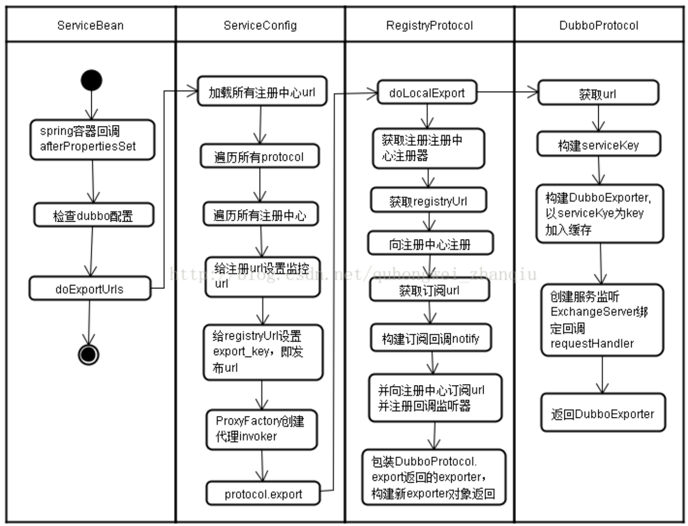

# 服务发布过程

1. 配置文件解析或者注解解析
2. 服务暴露
3. 服务注册
4. 启动 netty 服务实现远程监听

# 解析配置文件

Spring通过两个接口来解析自定义的标签。NamespaceHandler，注册一堆 BeanDefinitionParser。BeanDefinitionParser，用于解析每个 element 的内容。

spring框架初始化时会扫描所有classpath的spring.handlers文件，加载NamespaceHandler到Map中。Spring在解析自定义的标签的时候，会在这个Map中查找对应NamespaceHandler进行解析工作。

dubbo定义了DubboNamespaceHandler ，继承了NamespaceHandlerSupport。不需要实现所有的解析工作，只要将自定义schema中的元素解析器注册进来就可以。

DubboBeanDefinitionParser类去解析标签，每个标签会解析到对应的实体上，每个实体中的属性对应标签中的属性。

涉及到服务发布和服务调用的两个配置的解析，使用的是 ServiceBean 和 referenceBean

## ServiceBean解析

在 ServiceBean 中，我们暂且只需要关注两个方法，分别是

1. 在初始化 bean 的时候会执行该方法 afterPropertiesSet,
2. spring 容器启动后会发一个事件通知 onApplicationEvent

### afterPropertiesSet

这个方法里面，就是把 dubbo 中配置的 application、registry、service、protocol 等信息，加载到对应的 config 实体中，便于后续的使用。

### onApplicationEvent

spring 容器启动之后，会收到一个这样的事件通知，这里面做了两个事情。 判断服务是否已经发布过。如果没有发布，则调用 export 进行服务发布的流程(这里就是入口)。

```java
public void onApplicationEvent(ContextRefreshedEvent event) { 
  if (!isExported() && !isUnexported()) {
    if (logger.isInfoEnabled()){
      logger.info("The service ready on spring started. 
                  service: " + getInterface());
    }                 
    export(); 
   }
  }
```

# 服务暴露

## export()

serviceBean 中，重写了 export 方法，实现了 一个事件的发布。并且调用了 super.export() ，也就是会调用父类的 export 方法。调用ServiceConfig.export()。

```java

public synchronized void export() { 
  checkAndUpdateSubConfigs(); //检查并且更新配置信息
  if (!shouldExport()) {
    //当前的服务是否需要发布, 通过配置实现:@Service(export = false) 
    return;
  }
  if (shouldDelay()) {
    //检查是否需要延时发布,@Service(delay=)实现，通过定时器来实现
    delayExportExecutor.schedule(this::doExport, getDelay(), 
                                 TimeUnit.MILLISECONDS);
  } else {
    doExport(); //如果没有配置 delay，则直接调用 export 进行发布
  } 
}
//这里仍然还是在实现发布前的各种判断
protected synchronized void doExport() { 
  //前面各种判断
  doExportUrls();    
}

```

## doExportUrls()

最终调用doExportUrls()，加载所有配置的注册中心地址，遍历所有配置的协议protocols，针对每种协议发布一个对应协议的服务。

```java
private void doExportUrls() { 
  //加载所有配置的注册中心的地址，组装成一个URL  //(registry://ip:port/org.apache.dubbo.registry.RegistryService
  List<URL> registryURLs = loadRegistries(true);
  for (ProtocolConfig protocolConfig : protocols) {
    doExportUrlsFor1Protocol(protocolConfig, registryURLs);
  }
}
```

## doExportUrlsFor1Protocol()  

1. 把配置的<dubbo:method>参数进行解析，保存到 map 集合中
2.  获得当前服务需要暴露的 ip 和端口
3. 把解析到的所有数据，组装成一个 URL，大概应该是: dubbo://192.168.13.1:20881/ISayHelloService

```java
private void doExportUrlsFor1Protocol(ProtocolConfig     
                      protocolConfig, List<URL> registryURLs) {
  //获得当前服务要发布的目标 ip 和 port
  //组装 URL，url地址包含了版本号，接口名，方法列表，序列化方法，过期时间
  URL url = new URL(name, host, port,    
                    getContextPath(protocolConfig).map(p -> p +  
                           "/" + path).orElse(path), map);                                                                                                                                                                                                          
  String scope = url.getParameter(SCOPE_KEY); 
  if (!SCOPE_NONE.equalsIgnoreCase(scope)) {
    //injvm 发布到本地
    if (!SCOPE_REMOTE.equalsIgnoreCase(scope)) {    
      exportLocal(url);
    }
    //发布远程服务
    if (!SCOPE_LOCAL.equalsIgnoreCase(scope)) {
      for (URL registryURL : registryURLs) {
        //Invoker 是一个代理类，代表一个可执行体，可向它发起invoke 调
        //用
        Invoker<?> invoker = proxyFactory.getInvoker(ref, (Class) interfaceClass,                                                 
                                                     registryURL.addParameterAndEncoded (EXPORT_KEY, url.toFullString()));
        //对 invoker 做了委托，把 invoker 交给
        //DelegateProviderMetaDataInvoker 来处理
        DelegateProviderMetaDataInvoker wrapperInvoker = new 
          DelegateProviderMetaDataInvoker(invoker, this);
        //调用 protocol.export(invoker)来发布这个代理
        Exporter<?> exporter = protocol.export(wrapperInvoker);  
        //添加到 exporters 集合
        exporters.add(exporter);
      }
    }
  } 
```

## protocol.export

它是一个自适应扩展点，一个在方法层面上的自适应扩展，意味着它实现了对于 export 这个方法的适配。Protocol 是一个动态代理类，会根据 url 中配置的 protocol name 来实现对应协议的适配。当前的场景中，protocol 会是调用谁呢?目前发布的 invoker(URL)，实际上是一个 registry://协议，所以 Protocol$Adaptive，会通过 getExtension(extName)得到一个 RegistryProtocol

## RegistryProtocol.export

RegistryProtocol 是用来实现服务注册的。实现对应协议的服务发布。实现服务注册。实现订阅服务重写。

```java
public <T> Exporter<T> export(final Invoker<T> originInvoker) 
                                         throws RpcException { 
  //这里获得的是 zookeeper 注册中心的 url: zookeeper://ip:port
  URL registryUrl = getRegistryUrl(originInvoker); 
  //这里是获得服务提供者的 url, dubbo://ip:port...
  URL providerUrl = getProviderUrl(originInvoker);
  //这里就交给了具体的协议去暴露服务(很重要)
  final ExporterChangeableWrapper<T> exporter = 
                     doLocalExport(originInvoker, providerUrl); 
  
  //===========下面是服务注册的代码=============
  // 根据 invoker 中的url获取Registry实例: zookeeperRegistry
  final Registry registry = getRegistry(originInvoker);
  //获取要注册到注册中心的 URL: dubbo://ip:port
  final URL registeredProviderUrl = 
           getRegisteredProviderUrl(providerUrl, registryUrl); 
  ProviderInvokerWrapper<T> providerInvokerWrapper = 
    ProviderConsumerRegTable.registerProvider(
            originInvoker,registryUrl, registeredProviderUrl);
  boolean register = registeredProviderUrl.getParameter("register", true); 
  if (register) {
    //是否配置了注册中心，如果是， 则需要注册
    //注册到注册中心的 URL
    register(registryUrl, registeredProviderUrl); 
    providerInvokerWrapper.setReg(true);
  }
  //设置注册中心的订阅                                              
  registry.subscribe(overrideSubscribeUrl, 
                     overrideSubscribeListener);
  exporter.setRegisterUrl(registeredProviderUrl); 
  exporter.setSubscribeUrl(overrideSubscribeUrl); 
  //保证每次 export 都返回一个新的 exporter 实例 
  return new DestroyableExporter<>(exporter);
}
```

## doLocalExport

先通过 doLocalExport 来暴露一个服务，本质上应该是启动一个通信服务,主要的步骤是将本地 ip 和端口打开，进行监听.

```java
private <T> ExporterChangeableWrapper<T> doLocalExport(final                                                                         
                   Invoker<T> originInvoker, URL providerUrl) {
  //originInvoker 中获得发布协议的 url:dubbo://ip:port/...
  String key = getCacheKey(originInvoker);
  return (ExporterChangeableWrapper<T>) 
    //bounds: 一个 prviderUrl 服务 export 之后，缓存到 bounds 中，
    //所以一个 providerUrl 只会对应一个 exporter
    bounds.computeIfAbsent(key, s -> {
      //对原有的 invoker,委托给了 InvokerDelegate
      Invoker<?> invokerDelegate = new InvokerDelegate<>
        (originInvoker, providerUrl);
      return new ExporterChangeableWrapper<>((Exporter<T>)                                          
             protocol.export(invokerDelegate), originInvoker);
      });
}
```

## DubboProtocol.export

基于动态代理的适配，过渡到了 DubboProtocol 这个协议类。

 同时Wrapper 对 Protocol 进行装饰，装饰器分别为:

1. QosProtocolWrapper。如果当前配置了注册中心，则会启动一个 Qos server.qos 是 dubbo 的在线运维命令
2. ProtocolListenerWrapper
3. ProtocolFilterWrapper。使用责任链模式，对 invoker 进行 filter 的包装，实现请求的过滤。

```java
public <T> Exporter<T> export(Invoker<T> invoker) { 
  URL url = invoker.getUrl();
  //获取服务标识，由服务组名，服务名，服务版本号以及端口组成。比如 
  //${group}/ISayHelloService:${version}:20880 
  String key = serviceKey(url);
  //创建 DubboExporter
  DubboExporter<T> exporter = new DubboExporter<T>(invoker, 
                                             key, exporterMap);
  // 将 <key, exporter> 键值对放入缓存中 
  exporterMap.put(key, exporter);
  //启动服务 
  openServer(url);
  //优化序列化 
  optimizeSerialization(url);
  return exporter; 
}
```

## openServer()

去开启一个服务，并且放入到缓存中 ，同一个端口上仅允许启动一个服务器实例。

```java
private void openServer(URL url) {
  // 获取 host:port，并将其作为服务器实例的key，用于标识当前的服务器实例 
  String key = url.getAddress();
  //client 也可以暴露一个只有 server 可以调用的服务
  boolean isServer = url.getParameter(Constants.IS_SERVER_KEY, 
                                      true); 
  if (isServer) {
    //是否在 serverMap 中缓存了
    ExchangeServer server = serverMap.get(key);
    if (server == null) { synchronized (this) {
      server = serverMap.get(key); if (server == null) {
        // 创建服务器实例
        serverMap.put(key, createServer(url)); 
      }
    }
    } else {
      //服务器已创建，则根据 url 中的配置重置服务器              
      server.reset(url);           
    }
 } 
}
```

## createServer()

创建服务,开启心跳检测，默认使用 netty。组装 url.

```java
private ExchangeServer createServer(URL url) { 
  //组装 url，在 url 中添加心跳时间、编解码参数
  url = URLBuilder.from(url)
    // 当服务关闭以后，发送一个只读的事件，默认是开启状态            
    .addParameterIfAbsent(Constants.CHANNEL_READONLYEVENT_SENT_KEY,Boolean.TRUE.toString()) 
    // 启动心跳配置
    .addParameterIfAbsent(Constants.HEARTBEAT_KEY,String.valueOf(Constants.DEFAULT_HEARTBEAT)) .addParameter(Constants.CODEC_KEY, 
                                                                                                            DubboCodec.NAME)
    .build();
  String str = url.getParameter(Constants.SERVER_KEY, Constants.DEFAULT_REMOTING_SERVER); 
  //通过 SPI 检测是否存在 server 参数所代表的 Transporter 拓展，不存在则抛出异常
  if (str != null && str.length() > 0 && !ExtensionLoader.getExtensionLoader(Transporter.class).hasExten sion(str)) {
    throw new RpcException("Unsupported server type: " + str + ", url: " + url); }
//创建 ExchangeServer. 
  ExchangeServer server;
  try {
    server = Exchangers.bind(url, requestHandler); 
  } catch (RemotingException e) {
    throw new RpcException("Fail to start server(url: " + url + ") " + e.getMessage(), e);
  }
  
  //Exchangers.bind
  public static ExchangeServer bind(URL url, ExchangeHandler handler) throws RemotingException { 
    if (url == null) {
      throw new IllegalArgumentException("url == null"); 
    }
    if (handler == null) {
      throw new IllegalArgumentException("handler == null");
    }
    //获取 Exchanger，默认为 HeaderExchanger。
    //调用 HeaderExchanger 的 bind 方法创建 ExchangeServer 实例
    url = url.addParameterIfAbsent(Constants.CODEC_KEY, "exchange");  
    return getExchanger(url).bind(url, handler); }
  
```

## headerExchanger.bind

这里面包含多个逻辑

new DecodeHandler(new HeaderExchangeHandler(handler))

Transporters.bind

new HeaderExchangeServer

```java
public ExchangeServer bind(URL url, ExchangeHandler handler) throws RemotingException {
  return new HeaderExchangeServer(Transporters.bind(url, new DecodeHandler(new HeaderExchangeHandler(han
                                                                                                     dler)))); 
}

//Transporters.bind
public static Server bind(URL url, ChannelHandler... handlers) throws RemotingException { 
  if (url == null) 
  {
    throw new IllegalArgumentException("url == null"); 
  }
if (handlers == null || handlers.length == 0) {
  throw new IllegalArgumentException("handlers == null");
}
  ChannelHandler handler;
  if (handlers.length == 1) {
    handler = handlers[0];
  } else {
    // 如果 handlers 元素数量大于1，则创建 ChannelHandler 分发器 
    handler = new ChannelHandlerDispatcher(handlers);
  }
  // 获取自适应 Transporter 实例，并调用实例方法 
  return getTransporter().bind(url, handler);
}
```

## getTransporter

getTransporter 是一个自适应扩展点，它针对 bind 方法添加了自适应注解，意味着bind 方法的具体实现，会基于 Transporter$Adaptive 方法进行适配，这里面默认的通信协议是 netty，所以它会采用 netty4 的实现，也就是

```java
org.apache.dubbo.remoting.transport.netty4.NettyTransporter

public static Transporter getTransporter() { 
  return ExtensionLoader.getExtensionLoader(Transporter.class).getAdaptiveExtension();
}

//NettyTransporter.bind
//创建一个 nettyserver
public Server bind(URL url, ChannelHandler listener) throws RemotingException { 
  return new NettyServer(url, listener);
}
```

## NettyServer

初始化一个 nettyserver，并且从 url 中获得相应的 ip/ port。然后调用 doOpen()。doOpen()是服务发布的最终逻辑。

```java
protected void doOpen() throws Throwable {
  bootstrap = new ServerBootstrap();
  bossGroup = new NioEventLoopGroup(1, new DefaultThreadFactory("NettyServerBoss", true));
  workerGroup = new NioEventLoopGroup(getUrl().getPositiveParameter(Constants.IO_THREADS_KEY, Constants. DEFAULT_IO_THREADS),
                                      new DefaultThreadFactory("NettyServerWorker", true));
  final NettyServerHandler nettyServerHandler = new NettyServerHandler(getUrl(), this);
  channels = nettyServerHandler.getChannels();
  bootstrap.group(bossGroup, workerGroup) .channel(NioServerSocketChannel.class) .childOption(ChannelOption.TCP_NODELAY, 
                                                                                              Boolean.TRUE) 
    .childOption(ChannelOption.SO_REUSEADDR, Boolean.TRUE) .childOption(ChannelOption.ALLOCATOR, PooledByteBufAllocator.DEFAULT) 
    .childHandler(new ChannelInitializer<NioSocketChannel>() {
      @Override
      protected void initChannel(NioSocketChannel ch) throws Exception {
        // FIXME: should we use getTimeout()?
        int idleTimeout = UrlUtils.getIdleTimeout(getUrl());
        NettyCodecAdapter adapter = new NettyCodecAdapter(getCodec(), getUrl(), NettyServer.this);
        ch.pipeline()//.addLast("logging",new LoggingHandler(LogLevel.INFO))//for debug .addLast("decoder", adapter.getDecoder())
          .addLast("encoder", adapter.getEncoder())
          .addLast("server-idle-handler", new IdleStateHandler(0, 0, idleTimeout, MILLISECONDS))
          .addLast("handler", nettyServerHandler);
      } 
    });
  //bind
  ChannelFuture channelFuture = bootstrap.bind(getBindAddress()); 
  channelFuture.syncUninterruptibly();
  channel = channelFuture.channel();
}
```

这里用到了一个handler来处理客户端传递过来的请求。nettyServerHandler，这个 handler 是一个链路，它的正确组成应该是

MultiMessageHandler(heartbeatHandler(AllChannelHandler(DecodeHandler(HeaderExchangeHeadler(dubboProtocol

后续接收到的请求，会一层一层的处理。

## 总结

一个service标签的serviceBean生成了一个代理好的Invoker，这个invoker放在一个叫exporter的对象下，然后这个exporter放在了serviceBean的一个exporterMap中，准备被调用。然后创建的nettyServer放在了serviceBean的变量protocol下的一个变量serverMap里面，这样一个serverBean的netty服务，方法代理类都生成好了。注意protocol是单例生成的，所以如果有bean打开过nettyServer，别的bean就不会再打开。

# 服务注册

从protocol.export()中抽离服务注册的代码

```java
final Registry registry = getRegistry(originInvoker);
  //获取要注册到注册中心的 URL: dubbo://ip:port
  final URL registeredProviderUrl = 
           getRegisteredProviderUrl(providerUrl, registryUrl); 
  ProviderInvokerWrapper<T> providerInvokerWrapper = 
    ProviderConsumerRegTable.registerProvider(
            originInvoker,registryUrl, registeredProviderUrl);
  boolean register = registeredProviderUrl.getParameter("register", true); 
  if (register) {
    //是否配置了注册中心，如果是， 则需要注册
    //注册到注册中心的 URL
    register(registryUrl, registeredProviderUrl); 
    providerInvokerWrapper.setReg(true);
  }
```

```java
服务注册流程
 >getRegistry //获得指定的注册中心实现 
   >ZookeeperRegistryFactory#getRegistry// 
    >createRegistry// 创建注册中心
      >ZookeeperRegistry//CuratorZookeeperTransport实现zk的连接
 > register// 服务注册
  >registry.register // 
    >FailbackRegistry.register//失败重试注册
     >ZookeeperRegistry.doRegister //调用curator服务地址注册到zk
```

## getRegistry

1. 把url转化为对应配置的注册中心的具体协议
2. 根据具体协议，从registryFactory中获得指定的注册中心实现

```java
private Registry getRegistry(final Invoker<?> originInvoker) { 
  //把url转化为配置的具体协议，比如zookeeper://ip:port. 这样后续获得的注册中心就会是基于zk的实现
  URL registryUrl = getRegistryUrl(originInvoker); 
  return registryFactory.getRegistry(registryUrl);
}
```

根据RegistryFactory的实现，getRegistry是一个自适应的方法，根据url中protocol传入的值进行适配。由于在前面的代码中，url中的protocol已经改成了zookeeper，那么这个时候根据zookeeper获得的spi 扩展点应该是ZookeeperRegistryFactory。

## ZookeeperRegistryFactory

这个方法中并没有 getRegistry 方法，而是在父类 AbstractRegistryFactory。从缓存 REGISTRIES 中，根据 key 获得对应的 Registry。如果不存在，则创建 Registry。

## createRegistry

创建一个 zookeeperRegistry，把 url 和 zookeepertransporter 作为参数传入。zookeeperTransporter 这个属性也是基于依赖注入来赋值的，，这个的值应该是CuratorZookeeperTransporter，表示具体使用什么框架来和 zk 产生连接。

## register

```java
public void register(URL registryUrl, URL registeredProviderUrl) { 
  Registry registry = registryFactory.getRegistry(registryUrl); 
  registry.register(registeredProviderUrl);
}
```

 registry.register 将 dubbo://的协议地址注册到 zookeeper 上。

这个方法会调用 FailbackRegistry 类中的 register。因ZookeeperRegistry 类中并没有 register 这个方法。其父类FailbackRegistry 中存在 register 方法，而这个类又重写了 AbstractRegistry 类中的 register 方法。可以直接定位到FailbackRegistry 这个类中的 register 方法中。最终调用curator的客户端把服务地址注册到zk

# Invoker

```java
//----- 1.代理工程，用来生成invoker。自适应扩展点，调用JavassisProxyFactory
Invoker<?> invoker = proxyFactory.getInvoker(ref, (Class) interfaceClass,
registryURL.addParameterAndEncoded(Constants.EXPORT_KEY, url.toFullString()));
//----- 2.一个动态类库，用来实现动态代理。构建好了代理类之后，返回一个AbstractproxyInvoker,并且它实现了doInvoke方法。
JavassistProxyFactory.getInvoker
```

Invoke本质上应该是一个代理，经过层层包装最终进行了发布。当消费者发起请求的时候，会获得这个invoker进行调用。

最终发布出去的invoker, 也不是单纯的一个代理，也是经过多层包装 InvokerDelegate(DelegateProviderMetaDataInvoker(AbstractProxyInvoker()))

# 发布活动图



