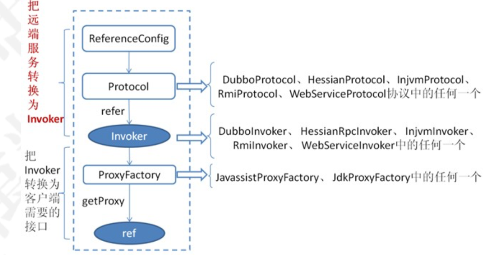
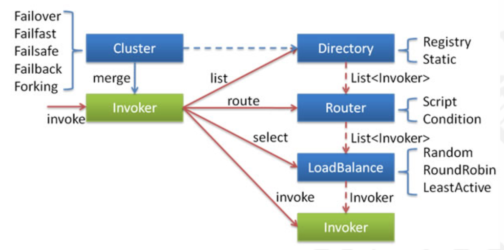

# 服务消费过程



服务消费主要有以下几个功能：生成远程服务的代理。获得目标服务的url地址。实现远程网络通信。实现负载均衡。实现集群容错。

# 服务消费者初始化

```java
//消费端的代码解析是从下面这段代码开始的
<dubbo:reference id="xxxService" interface="xxx.xxx.Service"/>
 //注解的方式的初始化入口
   ReferenceAnnotationBeanPostProcessor->ReferenceBeanInvocationHandler.init- >ReferenceConfig.get() 
  //获得一个远程代理类
```

## ReferenceConfig.get

```java
public synchronized T get() { 
  checkAndUpdateSubConfigs(); //检查和修改配置       
  if (destroyed) {            
    throw new IllegalStateException;        
  }
  if (ref == null) { //如果当前接口的远程代理引用为空，则进行初始化 
    init();
  }
  return ref; 
}
```

## init()

初始化的过程，和服务发布的过程类似，会有特别多的判断以及参数的组装。需要关注 createProxy，创建代理类的方法。map是所有前面相关变量的参数和参数值。

```java
 private void init() { 
   //省略...
    ref = createProxy(map);
   //省略... 
 }
```

## createProxy

1. 判断是否为本地调用，如果是则使用injvm协议进行调用
2. 判断是否为点对点调用，如果是则把url保存到urls集合中，如果url为1，进入步骤4，如果urls>1，则执行5
3. 如果是配置了注册中心，遍历注册中心，把url添加到urls集合，url为1，进入步骤4，如果urls>1，则执行5
4. 直接构建invoker
5. 构建invokers集合，通过cluster合并多个invoker
6. 最后调用 ProxyFactory 生成代理类

```java
 private T createProxy(Map<String, String> map) {
   //如果只配置了一个注册中心或者一个服务提供者，直接使用refprotocol.refer 
   if (urls.size() == 1) {                  
     invoker = refprotocol.refer(interfaceClass, urls.get(0));            
   } else {
     List<Invoker<?>> invokers = new ArrayList<Invoker<?>>(); 
     URL registryURL = null;
     for (URL url : urls) {
       //遍历urls生成多个invoker
       invokers.add(refprotocol.refer(interfaceClass, url));
       if (Constants.REGISTRY_PROTOCOL.equals(url.getProtocol())) {
        registryURL = url; // use last registry url
       } 
     }
     if (registryURL != null) { //如果registryUrl不为空，构建静态directory       
       // 使用RegistryAwareCluster                    
       URL u = registryURL.addParameter(Constants.CLUSTER_KEY,RegistryAwareCluster.NAME);
       // 通过Cluster将多个invoker合并 
       //RegistryAwareClusterInvoker(StaticDirectory) ->FailoverClusterInvoker(RegistryDirectory, will execute route) -> Invoker
     } 
   }      
   invoker = cluster.join(new StaticDirectory(u, invokers));
 } else {
    invoker = cluster.join(new StaticDirectory(invokers));
 }
// create service proxy        
return (T) proxyFactory.getProxy(invoker);
}

```

## protocol.refer

这里通过指定的协议来调用refer生成一个invoker对象，invoker是一个代理对象。那么在当前的消费端而言，invoker主要用于执行远程调用。

这个protocol，又是一个自适应扩展点，它得到的是Protocol$Adaptive。根据当前的协议url，得到一个指定的扩展点，传递进来的参数中，协议地址为 registry://，所以，我们可以直接定位到RegistryProtocol.refer代码。

## RegistryProtocol.refer

1. 组装注册中心协议的url 。

2. 判断是否配置了group，如果有，则cluster=getMergeableCluster()，构建invoker 。

3. doRefer构建invoker

```java
 public <T> Invoker<T> refer(Class<T> type, URL url) throws RpcException { 
   //根据配置的协议，生成注册中心的url: zookeeper://    
   url = URLBuilder.from(url)                
     .setProtocol(url.getParameter(REGISTRY_KEY, DEFAULT_REGISTRY))              
     .removeParameter(REGISTRY_KEY)              
     .build();        
   Registry registry = registryFactory.getRegistry(url);        
   if (RegistryService.class.equals(type)) {            
     return proxyFactory.getInvoker((T) registry, type, url);       
   }
   // 解析group参数，根据group决定cluster的类型       
   Map<String, String> qs = StringUtils.parseQueryString(url.getParameterAndDecoded(REFER_KEY));        
   String group = qs.get(Constants.GROUP_KEY);        
   if (group != null && group.length() > 0) {            
     if ((COMMA_SPLIT_PATTERN.split(group)).length > 1 ||"*".equals(group)) {              
       return doRefer(getMergeableCluster(), registry, type, url);           
     }
   }  
   //只有一个组或者没有组配置，直接执行
   return doRefer(cluster, registry, type, url); 
 }
```

## doRefer

构建一个RegistryDirectory 

构建一个consumer://协议的地址，注册到注册中心 

订阅zookeeper中节点的变化。监听providers，configuraion等节点数据

调用cluster.join方法。Cluster将多个服务节点合并为一个，并生成一个invoker。

```java
 private <T> Invoker<T> doRefer(Cluster cluster, Registry registry, Class<T>type, URL url) {
   //RegistryDirectory初始化
   RegistryDirectory<T> directory = new RegistryDirectory<T>(type, url); 
   //设置注册中心
   directory.setRegistry(registry);
   //设置协议
   directory.setProtocol(protocol);
   // all attributes of REFER_KEY
   Map<String, String> parameters = new HashMap<String, String>(directory.getUrl().getParameters()); 
   //注册consumer://协议的url        
   URL subscribeUrl = new URL(CONSUMER_PROTOCOL,parameters.remove(REGISTER_IP_KEY), 0, type.getName(), parameters);        
   if (!ANY_VALUE.equals(url.getServiceInterface()) &&url.getParameter(REGISTER_KEY, true)) {    
     directory.setRegisteredConsumerUrl(getRegisteredConsumerUrl(subscribeUrl,url));  
     //注册服务消费者
     registry.register(directory.getRegisteredConsumerUrl());                
   }
   directory.buildRouterChain(subscribeUrl); 
   //订阅事件监听(providers，configuraion等节点数据)        
   directory.subscribe(subscribeUrl.addParameter(CATEGORY_KEY,PROVIDERS_CATEGORY + "," + CONFIGURATORS_CATEGORY + "," 
                                                 +ROUTERS_CATEGORY)); 
   //构建invoker。一个注册中心可能有多个服务提供者，将多个服务合并为一个invoker        
   Invoker invoker = cluster.join(directory);        
   ProviderConsumerRegTable.registerConsumer(invoker, url, subscribeUrl,directory);      
   return invoker;    
 }
```

## cluster.join

cluster其实是在RegistryProtocol中通过set方法完成依赖注入的，它是一个Cluster扩展点的定义并且做了包装，实际是调用MockClusterWrapper(FailOverCluster.join)。返回的invoker应该是MockClusterWrapper(FailOverCluster(directory))。

## proxyFactory.getProxy

拿到invoker之后，会调用获得一个动态代理类

```java
return (T) proxyFactory.getProxy(invoker);

//proxyFactory又是一个自适应扩展点
 public <T> T getProxy(Invoker<T> invoker, Class<?>[]interfaces) {       
   return (T) Proxy.getProxy(interfaces).newInstance(new InvokerInvocationHandler(invoker));    
 }
```

通过这个方法生成了一个动态代理类，并且对invoker再做了一层处理，InvokerInvocationHandler。 意味着后续发起服务调用的时候，会由InvokerInvocationHandler来进行处理。

@Reference注入的一个对象实例本质上就是一个动态代理类，通过调用这个类中的方法，会触发 handler.invoke(), 而这个handler就是InvokerInvocationHandler。

## 服务订阅

### directory.subscribe

doRefer这个方法中，directory.subscribe这个方法，它是实现服务的目标服务订阅。

订阅注册中心指定节点的变化，如果发生变化，则通知到RegistryDirectory。Directory和服务的注册以及服务的发现有非常大的关联。

```java
public void subscribe(URL url) {
  setConsumerUrl(url); //设置consumerUrl 
  //把当前RegistryDirectory作为listener，去监听zk上节点的变化 
  consumerConfigurationListener.addNotifyListener(this); 
  serviceConfigurationListener = new ReferenceConfigurationListener(this,url); 
  registry.subscribe(url, this);//订阅 -> 这里的registryzookeeperRegsitry
  //监听providers，configuraion,rouers节点下面子节点变化
}
```

### FailbackRegistry.subscribe

移除失效的listener，调用doSubscribe进行订阅。listener为RegistryDirectory，后续要用到。

### ZookeeperRegistry.doSubscribe

这个方法是订阅，逻辑实现比较多，可以分两段来看，这里的实现把所有Service层发起的订阅以及指定 的Service层发起的订阅分开处理。所有Service层类似于监控中心发起的订阅。指定的Service层发起的 订阅可以看作是服务消费者的订阅。我只需要关心指定service层发起的订阅即可。

```java
public void doSubscribe(final URL url, final NotifyListener listener) {        
  try {
    if (Constants.ANY_VALUE.equals(url.getServiceInterface())) { 
      //省略部分代码           
    } else {               
      List<URL> urls = new ArrayList<>();                
      for (String path : toCategoriesPath(url)) {                   
        ConcurrentMap<NotifyListener, ChildListener> listeners =zkListeners.get(url);
        // 如果之前该路径没有添加过listener，则创建一个map来放置listener 
        if (listeners == null) {                        
          zkListeners.putIfAbsent(url, new ConcurrentHashMap<>());                        
          listeners = zkListeners.get(url);                  
        }                             
        ChildListener zkListener = listeners.get(listener);
        if (zkListener == null) {
          // 如果没有添加过对于子节点的listener，则创建,通知服务变化 回调NotifyListener                        
          listeners.putIfAbsent(listener, (parentPath,currentChilds) -> ZookeeperRegistry.this.notify(url, listener,
                                                              toUrlsWithEmpty(url,parentPath, currentChilds)));                        
          zkListener = listeners.get(listener);    
        } 
        //添加path节点的当前节点及子节点监听，并且获取子节点信息 //也就是dubbo://ip:port/...
        zkClient.create(path, false);
        List<String> children = zkClient.addChildListener(path,zkListener);
        if (children != null) {           
          urls.addAll(toUrlsWithEmpty(url, path, children));
        } 
      }
      //调用notify进行通知，对已经可用的列表进行通知 
      notify(url, listener, urls);
    }        
  } catch (Throwable e) {
            throw new RpcException();        
  }
}
```

### FailbackRegistry.notify

调用FailbackRegistry.notify， 对参数进行判断。 然后调用AbstractRegistry.notify方法。

AbstractRegistry.notify会针对每一个category，调用listener.notify进行通知，然后更新本地的缓存文件。

消费端的listener是最开始传递过来的RegistryDirectory，这里会触发RegistryDirectory.notify。

### RegistryDirectory.notify

Invoker的网络连接以及后续的配置变更，都会调用这个notify方法。urls表示zk的path数据，这里表示的是dubbo://。

```java
 public synchronized void notify(List<URL> urls) { 
   //对url列表进行校验、过滤，然后分成 config、router、provider 3个分组map       
   Map<String, List<URL>> categoryUrls = urls.stream()                
     .filter(Objects::nonNull)              
     .filter(this::isValidCategory)                
     .filter(this::isNotCompatibleFor26x)              
     .collect(Collectors.groupingBy(url -> {                   
       if (UrlUtils.isConfigurator(url)) {                       
         return CONFIGURATORS_CATEGORY;                    
       } else if (UrlUtils.isRoute(url)) {                    
         return ROUTERS_CATEGORY;                 
       } else if (UrlUtils.isProvider(url)) {                        
         return PROVIDERS_CATEGORY;
       }                    
       return ""                
     }));        
   List<URL> configuratorURLs = categoryUrls.getOrDefault(CONFIGURATORS_CATEGORY, Collections.emptyList());   
   this.configurators = Configurator.toConfigurators(configuratorURLs).orElse(this.configurators); 
   // 如果router 路由节点有变化，则从新将router 下的数据生成router        
   List<URL> routerURLs = categoryUrls.getOrDefault(ROUTERS_CATEGORY,Collections.emptyList());        
   toRouters(routerURLs).ifPresent(this::addRouters);
   // 获得provider URL，然后调用refreshOverrideAndInvoker进行刷新    
   List<URL> providerURLs = categoryUrls.getOrDefault(PROVIDERS_CATEGORY,Collections.emptyList());        
   refreshOverrideAndInvoker(providerURLs);    
 }
```

## 构建Invoker

### refreshOverrideAndInvoker

逐个调用注册中心里面的配置，覆盖原来的url，组成最新的url 放入overrideDirectoryUrl 存储。根据 provider urls，重新刷新Invoker

```java
 private void refreshOverrideAndInvoker(List<URL> urls) {
    // mock zookeeper://xxx?mock=return null
    overrideDirectoryUrl();
    refreshInvoker(urls);
}
```

### refreshInvoker

```java
 private void refreshInvoker(List<URL> invokerUrls) {      
   Assert.notNull(invokerUrls, "invokerUrls should not be null");       
   if (invokerUrls.size() == 1&& invokerUrls.get(0) != null&& Constants.EMPTY_PROTOCOL.equals(invokerUrls.get(0).getProtocol())) { 
     //省略部分代码，如果是空协议，则直接返回不允许访问       
   } else {            
     this.forbidden = false; // Allow to access            
     Map<String, Invoker<T>> oldUrlInvokerMap = this.urlInvokerMap; //local reference
       if (invokerUrls.isEmpty()) {//如果url为空，则直接返回 
         return;
       }
     //根据provider url，生成新的invoker          
     Map<String, Invoker<T>> newUrlInvokerMap =toInvokers(invokerUrls);     
     //转化为list
     List<Invoker<T>> newInvokers = Collections.unmodifiableList(newArrayList<>(newUrlInvokerMap.values()));       
     routerChain.setInvokers(newInvokers);
     //如果服务配置了分组，则把分组下的provider包装成StaticDirectory,组成一个 invoker//实际上就是按照group进行合并
     this.invokers = multiGroup ? toMergeInvokerList(newInvokers) : newInvokers;
     this.urlInvokerMap = newUrlInvokerMap;
     try {
       //旧的url 是否在新map里面存在，不存在，就是销毁url对应的Invoker 
       destroyUnusedInvokers(oldUrlInvokerMap, newUrlInvokerMap);
        } catch (Exception e) {
                logger.warn("destroyUnusedInvokers error. ", e);
     } 
   }
}     
```

### toInvokers

这个方法初始化了invoker。用到了protocol.refer来构建了一个invoker。

```java
invoker = new InvokerDelegate<>(protocol.refer(serviceType, url),url,providerUrl);               
```

构建完成之后，会保存在Map<String, Invoker\<T>> newUrlInvokerMap这个集合中。

### protocol.refer

调用指定的协议来进行远程引用。protocol是一个Protocol$Adaptive类 而真正的实现应该是:

ProtocolListenerWrapper(ProtocolFilterWrapper(QosProtocolWrapper(DubboProtocol.refer) 。前面的包装过程，在服务发布的时候已经分析过了，我们直接进入DubboProtocol.refer方法。

### DubboProtocol.refer

优化序列化，构建DubboInvoker。在构建DubboInvoker时，会构建一个ExchangeClient，通过getClients(url)方法，建立服务通信。

```java
@Override   
public <T> Invoker<T> refer(Class<T> serviceType, URL url) throwsRpcException {        
  optimizeSerialization(url);        
  // create rpc invoker. 构建DubboInvoker      
  DubboInvoker<T> invoker = new DubboInvoker<T>(serviceType, url,getClients(url), invokers);       
  invokers.add(invoker);       
  return invoker;
}
```

## 客户端连接

### getClients

```java
//获得客户端连接的方法。判断是否为共享连接，默认是共享同一个连接进行通信。是否配置了多个连接通道 connections，默认只有一个。
>getClients(url) 
  //获得一个共享连接。检查当前的key检查连接是否已经创建过并且可用，如果是则直接返回并且增加连接的个数。否则初始化连接并缓存。key = url.getAddress();
	>getSharedClient()
  	//根据连接数配置，来构建指定个数的链接。默认为1
  	>buildReferenceCountExchangeClientList
  		//初始化客户端连接的方法了，根据url中配置的参数进行远程通信的构建
  		>initClient()
  			//创建一个客户端连接
  			>Exchangers.connect()
  				>HeaderExchange.connect
  					//使用netty构建了一个客户端连接
  					>NettyTransport.connect
  						>return new NettyClient(url, listener);
  	
  
```

## Directory

Directory 的用途是保存 Invoker，其实现类 RegistryDirectory 是一个动态服务目录，可感知注册中心配置的变化，它所持有的 Inovker 列表会随着注册中心内容的变化而变化。每次变化后，RegistryDirectory 会动态增删 Inovker。

在RegistryDirectory中有一个成员属性，保存了服务地方地址对应的invoke信息。

```java
private volatile Map<String, Invoker<T>> urlInvokerMap;
```

这个invoker是动态的，基于注册中心的变化而变化的。它的初始化过程的链路是 RegistryDirectory.notify->refreshInvoker->toInvokers 西面的这段代码中。返回的是一个DubboInvoker对象。

## 总结

RegistryProtocol.refer 过程中有一个关键步骤，即在监听到服务提供者url时触发 RegistryDirectory.notify() 方法。

RegistryDirectory.notify() 方法调用 refreshInvoker() 方法将服务提供者urls转换为对应的远程invoker ，最终调用到 DubboProtocol.refer() 方法生成对应的 DubboInvoker 。

DubboInvoker 的构造方法中有一项入参 ExchangeClient[] clients ，即对应网络客户端 Client 。DubboInvoker就是通过调用 client.request() 方法完成网络通信的请求发送和响应接收功能。

Client 的具体生成过程就是通过 DubboProtocol 的 initClient(URL url) 方法创建了一个HeaderExchangeClient。

# 服务调用 

消费者初始化完成之后，会生成一个proxy，而这个proxy本质上是一个动态代理类。

## avassistProxyFactory.getProxy

```java
public <T> T getProxy(Invoker<T> invoker, Class<?>[] interfaces) {
   return (T) Proxy.getProxy(interfaces).newInstance(new InvokerInvocationHandler(invoker)); 
}

```

这个invoker实际上是:MockClusterWrapper(FailoverCluster(directory)) 然后通过InvokerInvocationHandler做了一层包装变成了 InvokerInvocationHandler(MockClusterWrapper(FailoverCluster(directory))

## proxy.getProxy

这个方法里面，会生成一个动态代理的方法。它代理了当前这个接口的方法，并且方法里面是使用handler.invoke进行调用的。

而handler又是这样一个实现: InvokerInvocationHandler(MockClusterWrapper(FailoverCluster(directory)))

## 调用流程

```java
//这个方法主要判断当前调用的远程方法，如果是tostring、hashcode、equals，就直接返回 
//否则，调用invoker.invoke,进入到 MockClusterWrapper.invoke 方法
InvokerInvocationHandler.invoke
	//是否客户端强制配置了mock调用，是否出现异常,使用Mock实现服务降级。正常则进入下一个invoke。
  >MockClusterInvoker.invoke
  //下一个invoke，应该进入FailoverClusterInvoke。调用父类AbstractClusterInvoker.invoke。
  //1.绑定attachments，Dubbo中，可以通过 RpcContext 上的 setAttachment 和 getAttachment 在 服务消费方和提供方之间进行参数的隐式传递
  //2.从directory里面获得invoker列表，通过服务路由对invoker筛选
  //3.initLoadBalance 初始化负载均衡机制
  //4.执行doInvoke
  >AbstractClusterInvoker.invoke
  	//获得重试的次数进行循环。通过负载均衡获得目标DubboInvoker。如果执行成功则返回结果,如果出现异常则抛出
  	>FailoverClusterInvoker.doInvoke
  		//1.将目标方法以及版本好作为参数放入到Invocation中
  		//2.获得客户端连接
  		>DubboInvoker.doInvoker
				//创建请求对象,netty请求
  			>currentClient.request
  				//NettyClient
  				>channel.send(req);
  		
```

## 总结



这里的 Invoker 是 Provider 的一个可调用 Service 的抽象， Invoker 封装了 Provider 地 址及 Service 接口信息。

Directory 代表多个 Invoker ，可以把它看成 List\<Invoker> 。它的值可能是动态变化的，比如注册中心推送变更

Cluster 将 Directory 中的多个 Invoker 伪装成一个 Invoker ，对上层透明，伪装过程包含了容错逻辑，调用失败后，重试另一个。

Router 负责从多个 Invoker 中按路由规则选出子集，比如读写分离，应用隔离等

LoadBalance 负责从多个 Invoker 中选出具体的一个用于本次调用，选的过程包含了负载均衡 算法，调用失败后，需要重选。

最后调用DubboInvoker，通过Netty发送请求对象。

# 服务端消息接收处理

服务端通过Netty接收消息

```java
@Override 
public void channelRead(ChannelHandlerContext ctx, Object msg) throwsException {      
  NettyChannel channel = NettyChannel.getOrAddChannel(ctx.channel(), url,handler);        
  try {           
    handler.received(channel, msg);       
  } finally {            
    NettyChannel.removeChannelIfDisconnected(ctx.channel());
  } 
}

//
NettyHandler
  //复合消息处理,拆分成多个Message
  ->MultiMessageHandler
  	//心跳消息处理，接收心跳并发送心跳响应
  	->HeartbeatHandler
  		//业务线程转化处理器，把接收到的消息封装成ChannelEventRunnable可执行任务给线程池处理。
  		//用来接收消息事件，并且根据事件的种类来分别执行不同的操作
  		->AllChannelHandler
  			//业务解码处理器
  			->DecodeHandler
  				//对消息进行分类，针对不同的消息类型做了不同的逻辑调用
  				->HeaderExchangeHandler
  						//正常双向请求消息调用
  						->handleRequest
  							->DubboProtocol$requestHandler(receive)
  								->reply
```

## ExchangeHandler.reply

把message转化为Invocation 

调用getInvoker获得一个Invoker对象 

通过Resultresult=invoker.invoke(inv)，进行反射调用

```java
 public CompletableFuture<Object> reply(ExchangeChannel channel, Object message){
   Invocation inv = (Invocation) message; 
   Invoker<?> invoker = getInvoker(channel, inv);    
   RpcContext rpcContext = RpcContext.getContext();           
   rpcContext.setRemoteAddress(channel.getRemoteAddress());           
   Result result = invoker.invoke(inv);
 }
```

## getInvoker

获得一个invoker的实现。

```java
Invoker<?> getInvoker(Channel channel, Invocation inv){    
  String serviceKey = serviceKey(port, path,inv.getAttachments().get(Constants.VERSION_KEY),
                                   inv.getAttachments().get(Constants.GROUP_KEY));           
  DubboExporter<?> exporter = (DubboExporter<?>)exporterMap.get(serviceKey);
  return exporter.getInvoker();  
}
```

exporterMap是在服务发布的过程中，保存的Invoker。key就是对应的interface:port。在服务发布时，实际上是把invoker包装成了DubboExpoter。然后放入到exporterMap中。

