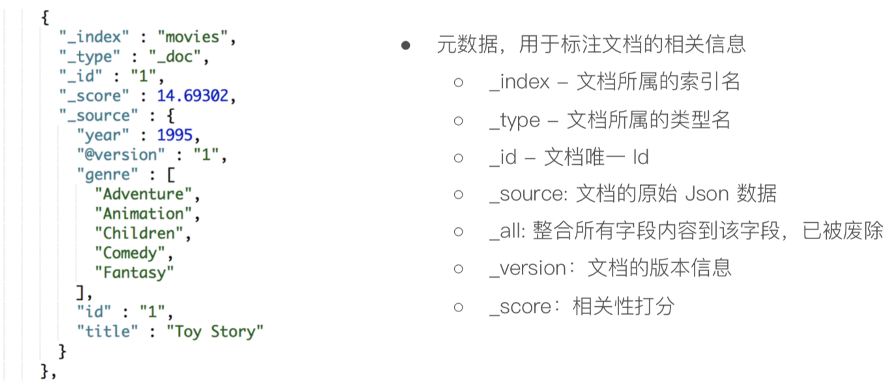

# 版本

5.x。打分机制从TF-IDF改为BM 25。移除避免同一文档并发更新的竞争锁。支持分片上的聚合缓存。

6.x。跨集群复制，索引生命周期管理，sql支持。

7.0。移除单索引多type支持。默认主分片改为1。

# 基本概念

## 节点

Date Node：保存数据的节点

Coordinaing Node：负责接受Client的请求，将请求分发到合适的节点，最终把结果汇集到一起。每个节点默认起到该作用。

Maser-eligible nodes：可以参加选主流程的节点

Master Node

Ingest Node：在数据被索引之前，通过预定义好的处理管道对数据进行预处理。默认情况下，所有节点都启用Ingest

## 分片

主分片：用以解决数据水平扩展，能将数据分布到集群所有节点上。索引创建时制定，后续不允许修改，除非reindex。

副本分片：是主分片的拷贝，提高可用性和读取的吞吐。

# 倒排索引

倒排索引包含两个部分

单词词典。记录所有文档的单词，记录单词到倒排列表的关联关系。

倒排列表。记录了单词对应的文档组合。由文档id，词频，单词在文档中的位置，单词开始结束的偏移量。

在 term dictionary 的基础上添加了 term index 来加速检索， term index 是一棵 trie 树（前缀树），缓存在内存中。从 term index 查到对应的 term dictionary 的 block 位置之后，再去磁盘上找 term，大大减少了磁盘的 random access 次数。

# 分词器

# 基本操作

document是不可变的，如果要修改document的内容，更新时，将老的document标记为deleted，然后新增我们给定的一个document。

# 聚合分析

## 分类

Bucket Aggregaion：一些满足特定条件文档的集合

Metric Aggregaion：一些数学运算，可以对文档字段进行统计分析

Pipeline Aggregaion：对其他的聚合结果进行二次聚合

Matric Aggregaion：支持对多个字段的操作并提供一个结果矩阵

## 实现

Fielddate和Doc Values。Doc Values对Text无效。

Doc Values采用列式压缩存储。

|      | Doc Values                 | Field data                   |
| ---- | -------------------------- | ---------------------------- |
| 时间 | 索引时，和倒排索引一起创建 | 搜索时动态创建               |
| 位置 | 磁盘文件                   | JVM Heap                     |
| 优点 | 避免大量内存占用           | 索引速度快                   |
| 缺点 | 降低索引速度，占用磁盘空间 | 动态创建开销大，占用内存空间 |

|          | **行式存储**                                                 | **列式存储**                                                 |
| -------- | ------------------------------------------------------------ | ------------------------------------------------------------ |
| **优点** | Ø 数据被保存在一起Ø **INSERT/UPDATE**容易                    | Ø 查询时**只有涉及到的列**会被读取Ø **投影(projection)**很高效Ø **任何列**都能作为**索引** |
| **缺点** | Ø 选择(Selection)时即使只涉及某几列，**所有数据也都会被读取** | Ø 选择完成时，被选择的**列要重新组装**Ø INSERT/UPDATE比较麻烦 |

## 精准度

调整shard size大小。从shard上额外多获取数据。

# 分页

1. 简单from+size。必须小于10000。
2. search after。不支持制定页数，只能往下翻。
3. Scroll API。scoll搜索会在第一次搜索的时候，保存一个当时的视图快照，之后只会基于该旧的视图快照提供数据搜索。获得的结果会有一个scoll_id，下一次再发送scoll请求的时候，必须带上这个scoll_id。

# 重建索引

# 并发控制

ES采用的是乐观并发控制，第一次创建一个document的时候，它的_version内部版本号就是1；以后，每次对这个document执行修改或者删除操作，都会对这个_version版本号自动加1；哪怕是删除，也会对这条数据的版本号加1

version_type=external，唯一的区别在于，_version，只有当你提供的version与es中的_version一模一样的时候，才可以进行修改，只要不一样，就报错；当version_type=external的时候，只有当你提供的version比es中的_version大的时候，才能完成修改

retry_on_conflict=5重试机制。

# 相关性算分

词频TF。检索词出现的次数除以文档的总字数。

逆文档频率IDF。log(全部文档数/检索词出现的文档总数)

ES 5以后没人算法改为BM 25。

Boosting是控制相关度的一种手段，在索引、字段、查询子条件。

boost>1，相关度提升，0到1，权重降低，小于0，贡献负分