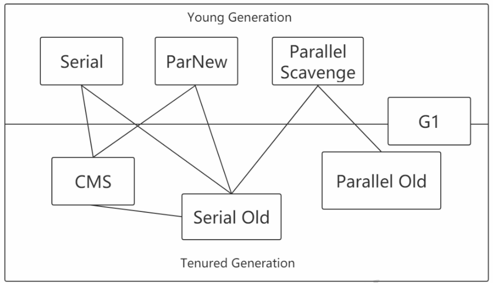
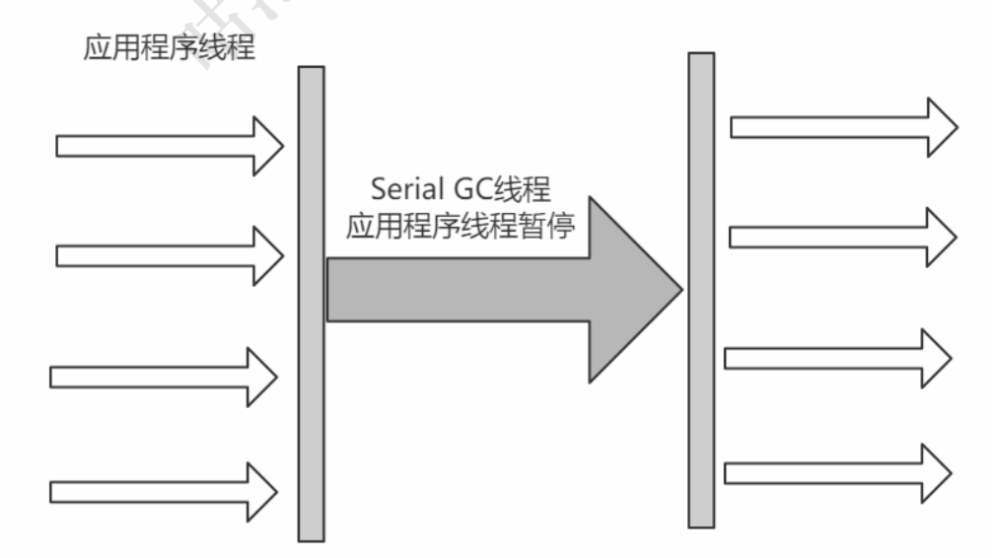
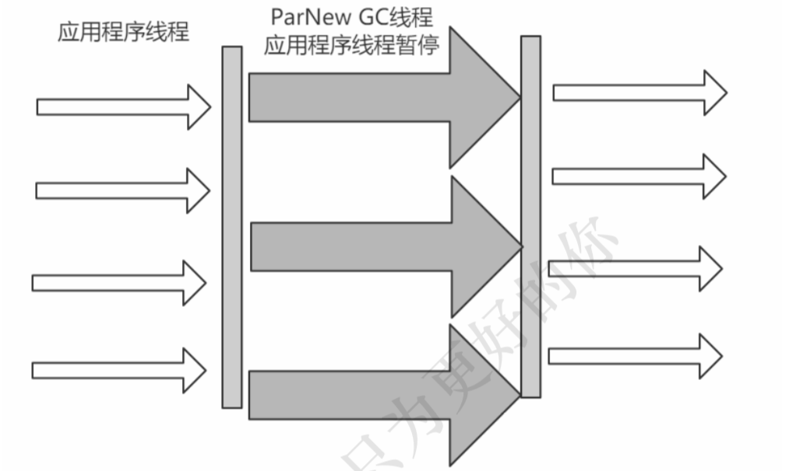
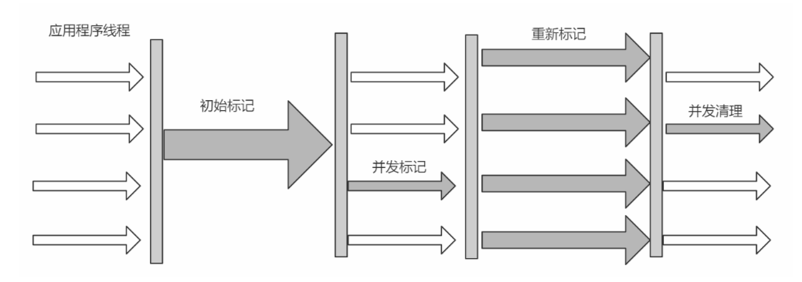
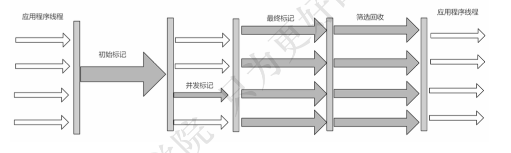
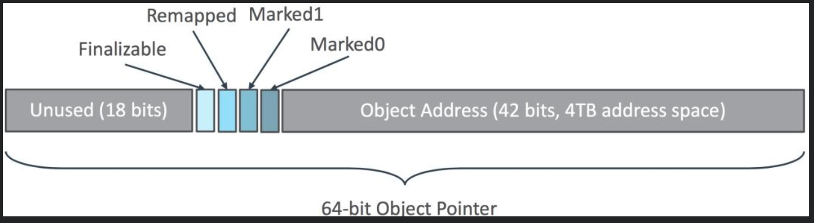

# 内存分配

## 对象优先在Eden区分配

大多数情况下，对象在新生代中 Eden 区分配。

当Eden区没有足够空间进行分配时，虚拟机将发起一次Minor GC，剩余存活的对象会被挪到为空的那块survivor 区。GC期间虚拟机如果发现无法存入 Survior空间，这种情况会把存活的对象部分挪到老年代，部分可能还会放在Survivor区。下一次eden区满了后又会触发minor gc，把eden区和survivor去垃圾对象回收，把剩余存活的对象一次性挪动到另外一块为空的survivor区。

### 逃逸分析

## 大对象直接进入老年代

大对象就是需要大量连续内存空间的对象(比如:字符串、数组)。JVM参数 - XX:PretenureSizeThreshold 可以设置大对象的大小，如果对象超过设置大小会直接进入老年代，不会进入年轻代，这个参数只在 Serial 和ParNew两个收集器下有效。

## 长期存活的对象进入老年代

对象在 Eden 出生并经过第一次 Minor GC 后仍然能够存活，并且能被 Survivor 容纳的话，将被移动到 Survivor 空间中，并将对象年龄设为1。对象 在 Survivor 中每熬过一次 MinorGC，年龄就增加1岁，当它的年龄增加到一定 程度(默认为15岁)，就会被晋升到老年代中。对象晋升到老年代的年龄阈 值，可以通过参数来-XX：MaxTenuringThreshold设置。

当前放对象的Survivor区域里(其中一块区域，放对象的那块s区)，一批对象的总大小大于这块Survivor区域内存大小的50%，那么此时大于等于这批对象年龄最大值的对象，就可以直接进入老年代了。

象动态年龄判断机制一般是在minor gc之后触发的。

## 空间分配担保

-XX:-HandlePromotionFailure设置是否允许，jdk1.8默认设置。

年轻代每次Minor Gc之前，JVM都会计算下老年代剩余可用空间是否小于年轻代里现有的所有对象大小之和(包括垃圾对象)。如果允许担保，就会看老年代的可用内存大小，是否大于之前每一次minor gc后进入老年代的对象的平均大小。如果小于，那么就会触发一次Full gc。如果大于则尝试进行一次Minor Gc。

# 垃圾回收

## 回收内存区域

* 堆内存。对象，数组。

* 方法区。废弃常量，无用的类。

  废弃常量。不使用的字符串常量、不使用的符号引用。

  无用的类。该类所有的实例都已经被回收。加载该类的ClassLoader已经被回收。 该类对应的java.lang.Class对象在任何地方没有被引用，也无法通过反射访问该类的方法。

## 回收方式

* Minor GC/Young GC：新生代的的垃圾收集。

* Major GC/Full GC：一般会回收老年代，年轻代，方法区的垃圾。

  system.gc()，老年代不够用，方法区不够用，当新生代的对象无法被老年代担保成功时。

## 判断对象被回收

### 引用计数法

给对象中添加一个引用计数器，每当有一个地方引用它，计数器就加1；当引用失效，计数器就减1。任何时候计数器为0的对象就是不可能再被使用的。

这个方法实现简单，效率高，其最主要的原因是它很难解决对象之间相互循环引用的问题。

### 可达性分析

这个算法的基本思想就是通过一系列的称为 “GC Roots” 的对象作为起点， 从这些节点开始向下搜索，找到的对象都标记为非垃圾对象，其余未标记的对象都是垃圾对象。

能作为GC Root：虚拟机栈的本地变量表、static成员、常量引用、本地方法栈的变量等。

可达性分析中标记为不可达的对象，需进行一次筛选。 筛选的条件是此对象是否有必要执行finalize()方法。 当对象没有覆盖finalize方法，对象将直接被回收。如果这个对象覆盖了finalize方法，对象要在finalize()中与引用链上的任何的一个对象建立关联可避免被回收。

### 对象引用

* 强引用。普通的变量引用。Object obj = new Object()
* 软引用。将对象用SoftReference软引用类型的对象包裹，正常情况不会被回收，但是GC做完后发现释放不出空间存放新的对象，则会把这些软引用的对象 回收掉。软引用可用来实现内存敏感的高速缓存。
* 弱引用。将对象用WeakReference软引用类型的对象包裹，描述非必须对象，GC会直接回收掉。
* 虚引用。提供PhanomReference来实现，目的是为了能在这个类被回收时得到一个通知。

## 垃圾收集算法

### 标记—清除

标记出所有需要回收的对象，在标记完成后统一回收所有被标记的对象。标记清除后会产生大量不连续的碎片。标记和清除两个过程都比较耗时，效率不高。

### 复制算法

将内存分为大小相同的两块，每次使用其中的一块。当这一块的内存使用完后，就将还存活的对象复制到另一块去，然后再把使用的空间一次清理掉。这样就使每次的内存回收都是对内存区间的一半进行回收。

### 标记—整理

标记过程与“标记-清除”算法一样，但后续步骤是让所有存活的对象向一段移动，然后直接清理掉端边界以外的内存。

### 标记实现方案

1. 把标记直接记录在对象头上，如Serial收集器

2. 把标记记录在与对象相互独立的数据结构上，如G1、CMS使用了一种相当于堆内存的1/64大小的，称为BitMap的结构来记录标记信息
3. 直接把标记信息记在引用对象的指针上，如ZGC

## 垃圾收集器

### Serial收集器

它是一种单线程收集器，不仅仅意味着它只会使用一个CPU或者一条收集线程去完成垃圾收集工作，更重要的是其在进行垃圾收集的时候需要暂停其他所有的工作线程。

新生代采用复制算法，老年代采用标记-整理算法。

### ParNew收集器

ParNew收集器就是Serial收集器的多线程版本，除了使用多线程进行垃圾收集外，其余行为 (控制参数、收集算法、回收策略等等)和Serial收集器完全一样。默认的收集线程数跟cpu核数相同，当然也可以用参数(-XX:ParallelGCThreads)指定收集线程数。

### Parallel Scavenge收集器
使用复制算法的收集器，又是并行的多线程收集器，看上去和ParNew一样，但是Parallel Scanvenge更关注系统的吞吐量 。

吞吐量=运行用户代码的时间/(运行用户代码的时间+垃圾收集时间)。若吞吐量越大，意味着垃圾收集的时间越短，则用户代码可以充分利用CPU资源，尽快完成程序 的运算任务。

-XX:MaxGCPauseMillis控制最大的垃圾收集停顿时间。

 -XX:GCTimeRatio直接设置吞吐量的大小。

### Parallel Old收集器

Parallel Old收集器是Parallel Scavenge收集器的老年代版本，使用多线程和"标记-整理算法"进行垃圾回收。吞吐量优先。

### CMS收集器

CMS(Concurrent Mark Sweep)收集器是一种以获取最短回收停顿时间为目标的收集器。采用的是"标记-清除算法",整个过程分为4步。

1. 初始标记。标记GC Roots关联到的对象，Stop The World，速度很快

2. 并发标记 。进行GC Roots Tracing

3. 并发预清理。此阶段标记从新生代晋升的对象**、**新分配到老年代的对象以及在并发阶段被修改了的对象。可以减少下一个stop-the-world 重新标记阶段的工作量

4. 并发可中止预清理阶段。获得所期望的eden空间占用率。预清理阶段后，如果Eden 空间占用大于 CMSScheduleRemarkEdenSizeThreshold 设置的值, 会启动可中止预清理，直到占用率达到 CMSScheduleRemarkEdenPenetration 设置的值或扫描多长时间

5. 重新标记 。为了修正并发标记期间因为用户程序继续运行而导致标记 产生变动的那一部分对象的标记记录。这个阶段依然需要扫描新生代

6. 并发清除 。开启用户线程，同时GC线程开始对未标记的区域做清扫。

   

#### 缺点

1. 对CPU资源敏感。在并发阶段，会占用一部分线程导致应用程序变慢降低总吞吐量。默认回收线程数（处理器核心线程数+3）/4。
2. 无法处理浮动垃圾。在并发清理阶段又产生垃圾，这种浮动垃圾只能等到下一次gc再清理。
3. 回收算法-“标记-清除”算法会导致收集结束时会有大量空间碎片产生。
4. 并发失败(concurrent mode failure)。CMS运行期间预留的内存无法满足程序分配新对象的需求，会导致一次并发失败。此时会暂停用户线程，用serial old垃圾收集器来回收。

#### 相关参数

1. -XX:+UseConcMarkSweepGC:启用cms
2. -XX:ConcGCThreads:并发的GC线程数
3.  -XX:+UseCMSCompactAtFullCollection:FullGC之后做压缩整理(减少碎片)
4. -XX:CMSFullGCsBeforeCompaction:多少次FullGC之后压缩一次，默认是0，代表每次FullGC后都会压缩一次
5. -XX:CMSInitiatingOccupancyFraction: 当老年代使用达到该比例时会触发FullGC(默认 是92，这是百分比)
6. -XX:+CMSScavengeBeforeRemark:在CMS 重新标记前启动一次minor gc，目的在于减少老年代对年轻代的引用，降低CMS GC的标记阶段时的开销，一般CMS的GC耗时 80%都在 remark阶段。

### G1收集器

G1 (Garbage-First)是一款面向服务器的垃圾收集器,主要针对配备多颗处理器及大容量内存的机器. 以极高概率满足GC停顿时间要求的同时,还具备高吞吐量性能特征。

回收算法主要用的是复制算法。

G1将Java堆划分为多个大小相等的独立区域(Region)。一般Region大小等于堆大小除以2048，可以用参数"-XX:G1HeapRegionSize"手动指定Region大小。

G1保留了年轻代和老年代的概念，但不再是物理隔阂了，它们都是(可以不连续)Region的集合。一个Region可能之前是年轻代，如果Region进行了垃圾回收，之后可能又会变成老年代，也就是 说Region的区域功能可能会动态变化。G1有专门分配大对象的Region叫Humongous区，而不是让大对象直接进入老年代的 Region中

1. 初始标记(Initial Marking) ， 暂停用户线程，并记录下gc roots直接能引用的对象，并且修改TAMS的值
2. 并发标记(Concurrent Marking) 
3. 最终标记(Final Marking)
4. 筛选回收， 对各个Region的回收价值和成本进行排序（collecton set），根据用户所期望的GC停顿时间制定回收计划。可以用JVM参数 -XX:MaxGCPauseMillis指定

#### G1垃圾收集分类

##### YoungGC 

YoungGC并不是说现有的Eden区放满了就会马上触发，而且G1会计算下现在Eden区回收大概要多久时间，如果回收时间远远小于参数 -XX:MaxGCPauseMills 设定的值，那么增加年轻代 的region，继续给新对象存放，不会马上做Young GC，直到下一次Eden区放满，G1计算回收时 间接近参数 -XX:MaxGCPauseMills 设定的值，那么就会触发Young GC。

##### MixedGC

不是FullGC，老年代的堆占有率达到参数(-XX:InitiatingHeapOccupancyPercen)设定的值 则触发，回收所有的Young和部分Old(根据期望的GC停顿时间确定old区垃圾收集的优先顺序)以 及大对象区，正常情况G1的垃圾收集是先做MixedGC，主要使用复制算法，需要把各个region中 存活的对象拷贝到别的region里去，拷贝过程中如果发现没有足够的空region能够承载拷贝对象 就会触发一次Full GC

##### Full GC

停止系统程序，然后采用单线程进行标记、清理和压缩整理，好空闲出来一批Region来供下一次MixedGC使用，这个过程是非常耗时的。

#### Remember Set

每个Region被分成了多个Card，在不同Region中的Card会相互引用。每个Region都有一个RSet，RSet记录了其他Region中的对象引用本Region中对象的关系。

G1的RSet是在Card Table的基础上实现的：每个Region会记录下别的Region有指向自己的指针，并标记这些指针分别在哪些Card的范围内。 这个RSet其实是一个Hash Table，Key是别的Region的起始地址，Value是一个集合，里面的元素是Card Table的Index。

#### SATB

全称是Snapshot-At-The-Beginning，由字面理解，是GC开始时活着的对象的一个快照。它是通过Root Tracing得到的，作用是维持并发GC的正确性。

Region中有两个top-at-mark-start（TAMS）指针，分别为prevTAMS和nextTAMS。在TAMS以上的对象是新分配的，这是一种隐式的标记，即默认它们是存活的。

### ZGC收集器

ZGC以低延迟为首要目标的一款垃圾收集器。它是基于动态Region内存布局，不设年龄分代，使用了读屏障、染色指针和内存多重映射等技术来实现可并发的标记-整理算法的收集器。在JDK 11新加入，还在实验阶段，主要特点是：回收TB级内存（最大4T），停顿时间不超过10ms。

ZGC的Region可以具有如图所示的大、中、小三类容量。小型容量固定为2MB，用于放置小于256KB的小对象。中型容量固定为32MB，用于放置大于等于256KB但小于4MB的对象。大型容量不固定，可以动态变化，用于放置4MB或以上的大对象。

ZGC将Linux下46位中的高4位取出，用来存储4个标志位，剩余的42位可以支持4T的内存。

Finalizable：表示是否只能通过finalize()方法才能被访问到，其他不行；

Remapped：表示是否进入了重分配集（即被移动过）；

Marked1、Marked0：表示对象的三色标记状态（黑色，白色，灰色）；

#### 收集流程

并发标记：遍历对象图做可达性分析的阶段，初始标记和最终标记也会出现短暂的停顿，整个标记阶段只会更新染色指针中的Marked 0、Marked 1标志位。

并发预备重分配：这个阶段需要根据特定的查询条件统计得出本次收集过程要清理哪些Region，将这些Region组成重分配集（Relocation Set）。ZGC每次回收都会扫描所有的Region，用范围更大的扫描成本换取省去G1中记忆集的维护成本。

并发重分配：把重分配集中的存活对象复制到新的Region上，并为重分配集中的每个Region维护一个转发表（Forward Table），记录从旧对象到新对象的转向关系。ZGC收集器能仅从引用上就明确得知一个对象是否处于重分配集之中，如果用户线程此时并发访问了位于重分配集中的对象，这次访问将会被预置的内存屏障所截获，然后立即根据Region上的转发表记录将访问转发到新复制的对象上，并同时修正更新该引用的值，使其直接指向新对象，ZGC将这种行为称为指针的“自愈”（Self-Healing）能力。

并发重映射：重映射所做的就是修正整个堆中指向重分配集中旧对象的所有引用。合并到下一次垃圾收集循环中的并发标记阶段里去完成。