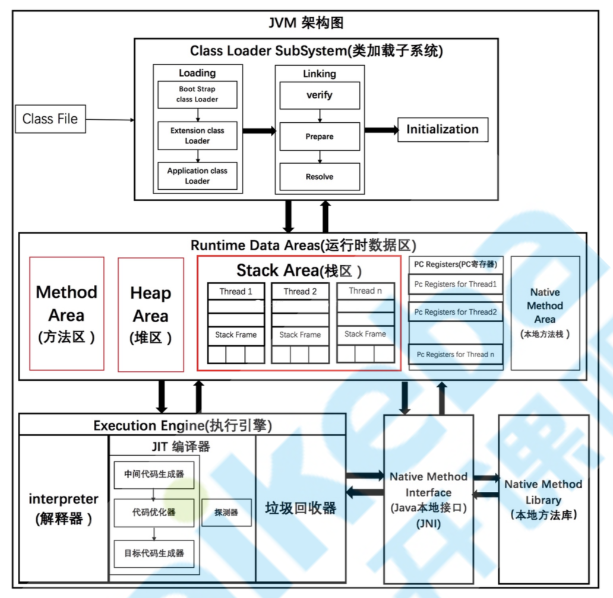
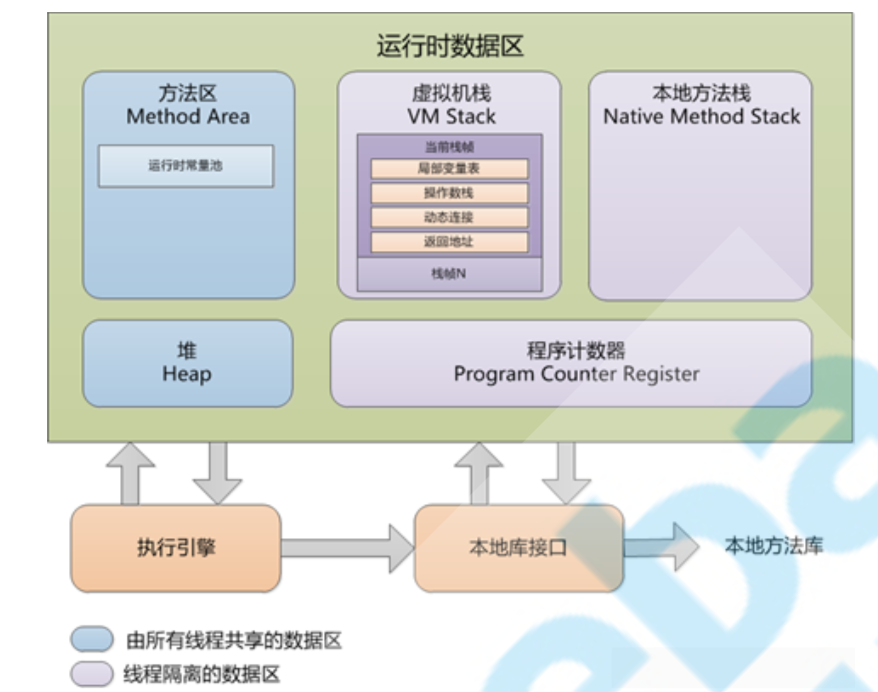
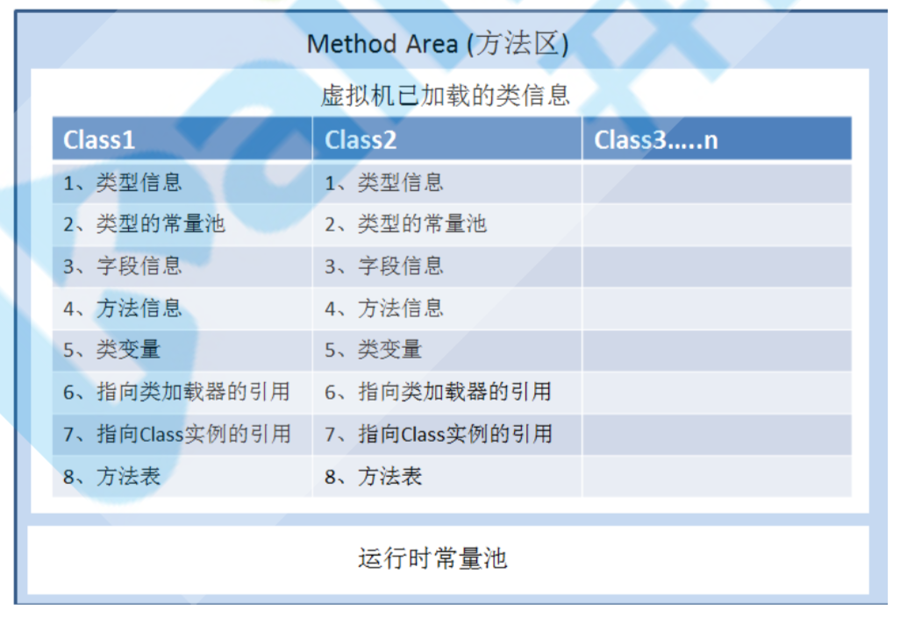
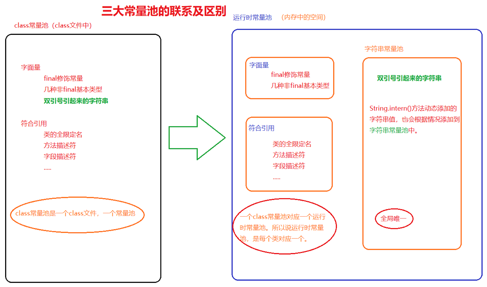
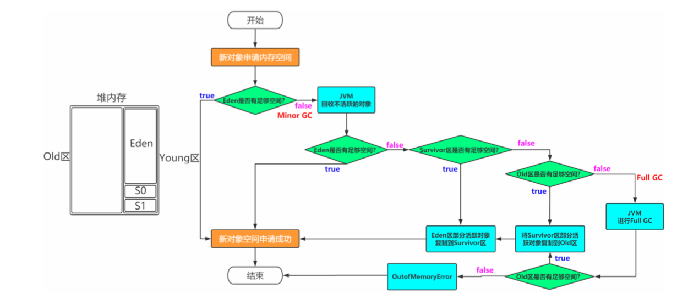
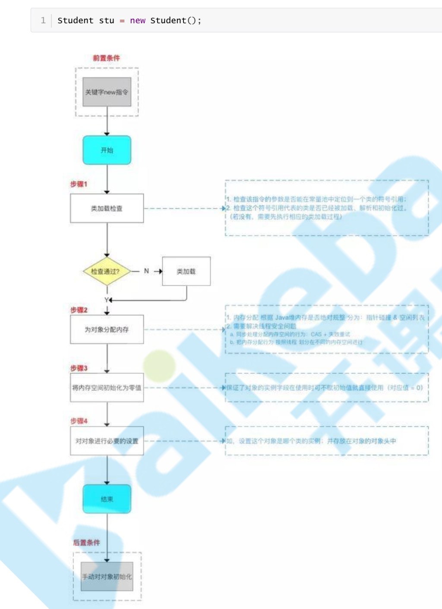
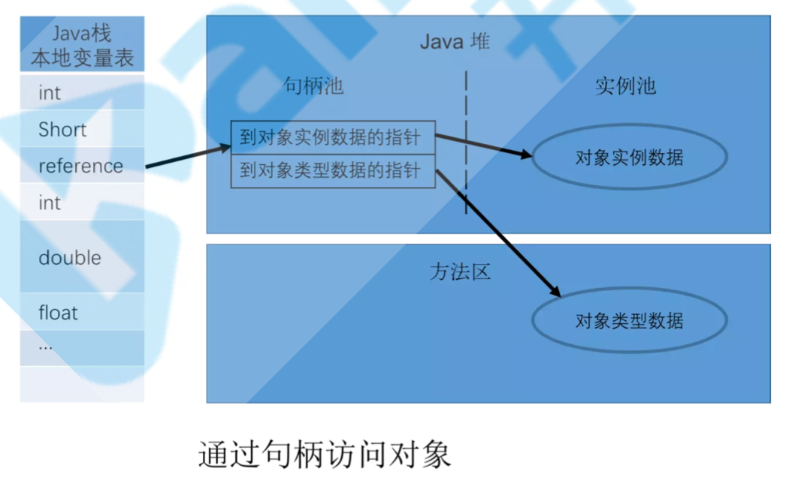
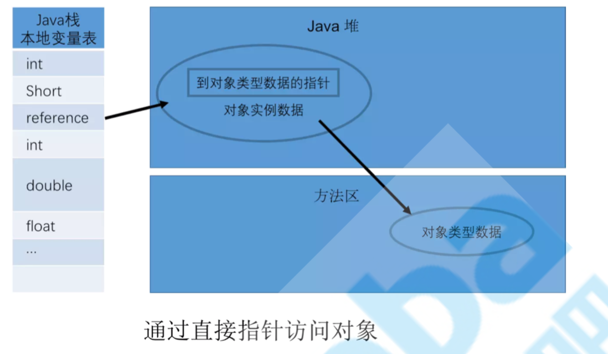

# JVM架构

# 运行时数据区

线程共享区域：JVM启动的时候，这块区域就开始分配空间。

线程私有区域：没有线程的时候，这块区域是不存在的。这块空间的生命周期特别短暂，不存在垃圾回收的问题。

## 方法区

**类型信息：**类型的全限定名、超类的全限定名、类型标志(该类是类类型还是接口类型)、类的访问描述符(public、private、default、abstract、final、static)。

**类型的常量池：**存放该类所用到的常量的有序集合，包括直接常量(如字符串、整数、浮点数的常量)和对其他类型、字段、方法的符号引用。常量池中每一个保存的常量都有一个索引，就像数组中的字段一样。因为 常量池中保存着所有类型使用到的类型、字段、方法的字符引用，所以它也是动态连接的主要对象(在 动态链接中起到核心作用)。

**字段信息：**字段修饰符(public、protect、private、default) 、字段的类型、字段名称

**方法信息：**方法修饰符、方法返回类型、方法名、方法参数个数、类型、顺序等、方法字节码、操作数栈和该方法在栈帧中的局部变量区大小。

**类变量(静态变量)：**指该类所有对象共享的变量，即使没有任何实例对象时，也可以访问的类变量。它们与类进行绑定。

**指向类加载器的引用：**每一个被JVM加载的类型，都保存这个类加载器的引用，类加载器动态链接时会用到。

**指向class实例的引用：**类加载的过程中，虚拟机会创建该类型的Class实例，方法区中必须保存对该对象的引用。通过 Class.forName(String className)来查找获得该实例的引用，然后创建该类的对象。

**方法表：**为了提高访问效率，JVM可能会对每个装载的非抽象类，都创建一个数组，数组的每个元素是实例可能调用的方法的直接引用，包括父类中继承过来的方法。这个表在抽象类或者接口中是没有的。

**运行时常量池**：用于存放编译器生成的各种字面常量和符号引用，这部分内容被类加载后进入方法区的运行时常量池中存放。 

字面量：文本字符串，被声明为final的常量池、基本数据类型的值。

符号引用：类和结构的完全限定名、字段名称和描述符、方法名称和描述符。

-MetaspaceSize（指定初始空间大小）

-MaxMetaspaceSize（元空间最大值）

### class文件常量池和运行时常量池

class文件常量池存储的是当class文件被java虚拟机加载进来后存放在方法区的一些字面量和符号引用，字面量包括字符串，基本类型的常量。

运行时常量池是当class文件被加载完成后，java虚拟机会将class文件常量池里的内容转移到运行时常量池里，运行时常量池也是每个类都有一个。在class文件常量池的符号引用有一部分是会被转变为直接引用的，比如说类的静态方法或私有方法，实例构造方法，父类方法，这是因为这些方法不能被重写其他版本，所以能在加载的时候就可以将符号引用转变为直接引用，而其他的一些方法是在这个方法被第一次调用的时候才会将符号引用转变为直接引用的。

运行时常量池相对于Class文件常量池的另外一个特征具有动态性，可以在运行期间将新的常量放入池中(典型的如String类的intern()方法)。

### 永久代和元空间

方法区在JDK 8中就是Metaspace，在JDK6或7中就是Perm Space

#### 区别

存储位置不同，永久代物理是堆的一部分，和新生代，老年代地址是连续的，而元空间属于本地内存。由于永久代它的大小是比较小的，而元空间的大小是决定于内地内存的。 所以说永久代使用不当，比较容易出现OOM异常。而元空间一般不会。

存储内容不同，元空间存储类的元信息，静态变量和常量池等并入堆中。相当于永久代的数据被分到了堆和元空间中。

#### 永久代替换为元空间

字符串存在永久代中，容易出现性能问题和永久代内存溢出。字符串常量池存放到堆中。

类及方法的信息等比较难确定其大小，因此对于永久代的大小指定比较困难，太小容易出现永久代溢出，太大则容易导致老年代溢出。

永久代会为 GC 带来不必要的复杂度，并且回收效率偏低。

## 堆

Java堆中，主要是用来存储对象和数组的。堆被划分为老年代和年轻代。

-Xms（最小值）,-Xmx（最大值），-Xmn（年轻代）

### 内存分配原则

1. 优先在 Eden 分配,如果 Eden 空间不足虚拟机则会进行一次 MinorGC
2. 大对象直接接入老年代
3. 长期存活的对象进入老年代，每个对象都有一个【age】，当age到达设定的年龄的时候就会进入老年代，默认是15岁。

### 对象创建

### 内存分配方式

| 分配方法 |      说明      |         收集器          |
| :------: | :------------: | :---------------------: |
| 指针碰撞 |  内存地址连续  |    Serial 和 ParNew     |
| 空闲列表 | 内存地址不连续 | CMS 收集器和 Mark-Sweep |

### 内存分配安全

CAS，比较和交换(Compare And Swap)：CAS 是乐观锁的一种实现方式。所谓乐观锁就是，每次不加锁而是假设没有冲突而去完成某项操作，如果因为冲突失败就重试，直到成功为止。

TLAB，本地线程分配缓冲(Thread Local Allocation Buffer即TLAB)：为每一个线程预先分配一块内存，JVM在给线程中的对象分配内存时，首先在TLAB分配，当对象大于TLAB中的剩余内存或TLAB的内存已用尽时，再采用上述的CAS进行内存分配。

### 对象内存布局

#### 对象头

1. 用于存储对象自身的运行数据，如GC分代年龄，锁状态标志，线程持有的锁等
2. 另一部分是类型指针，即对象指向它的类元数据的指针，虚拟机通过这个指针来确定这个对象是哪一个类的实例

#### 实例数据

存储的是对象真正有效的信息。

#### 对齐填充

这部分并不是必须要存在的，没有特别的含义，在jvm中对象的大小必须是8字节的整数倍，而对象头也 是8字节的倍数，当对象实例数据部分没有对齐时，就需要通过对齐填充来补全。

### 对象访问定位

句柄：稳定，对象被移动只要修改句柄中的地址

直接指针：访问速度快，节省了一次指针定位的开销

## 程序计数器

程序计数器占用的内存空间很小，由于Java虚拟机的多线程是通过线程轮流切换，并分配处理器执行时间的方式来实现的，在任意时刻，一个处理器只会执行一条线程中的指令。因此，为了线程切换后能够恢复到正确的执行位置，每条线程需要有一个独立的程序计数器(线程私有)。

如果线程正在执行Java方法，则计数器记录的是正在执行的虚拟机字节码指令的地址； 如果正在执行的是Native方法，则这个计数器为空。

## 本地方法栈

如果当前线程执行的方法是Native类型的（使用native关键字修饰的方法，主要指的是c语言），这些方法就会在本地方法栈中执行。

## 虚拟机栈

虚拟机栈是一个线程执行的区域，保存着一个线程中方法的调用状态。

每一个被线程执行的方法，为该栈中的栈帧，即每个方法对应一个栈帧。
调用一个方法，就会向栈中压入一个栈帧；一个方法调用完成，就会把该栈帧从栈中弹出。

-Xss设置大小

#### 栈帧

每个栈帧中包括局部变量表、操作数栈、指向运行时常量池的引用(动态链接)、方法返回地址。

1. 局部变量表：方法中定义的局部变量以及方法的参数存放在这张表中 局部变量表中的变量不可直接使用，如需要使用的话，必须通过相关指令将其加载至操作数栈中作为操作数使用。
2. 操作数栈：以压栈和出栈的方式存储操作数
3. 动态链接；每个栈帧都包含一个指向运行时常量池中该栈帧所属方法的引用，持有这个引用是为了支持方法调用过程中的动态连接。
4. 当一个方法开始执行后,只有两种方式可以退出，一种是遇到方法返回的字节码指令;一种是遇见异常，并且 这个异常没有在方法体内得到处理。

