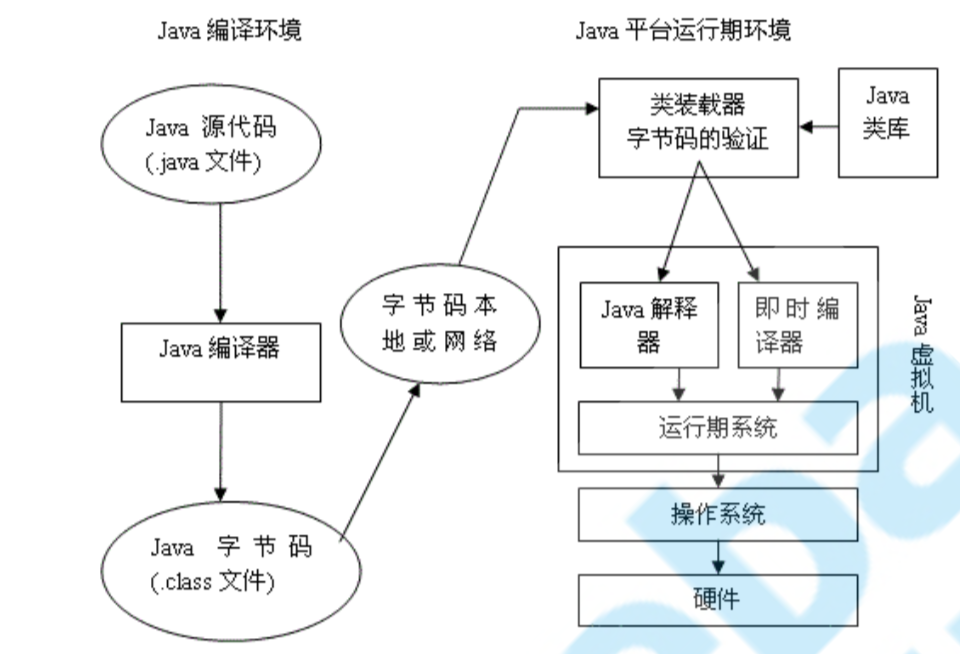
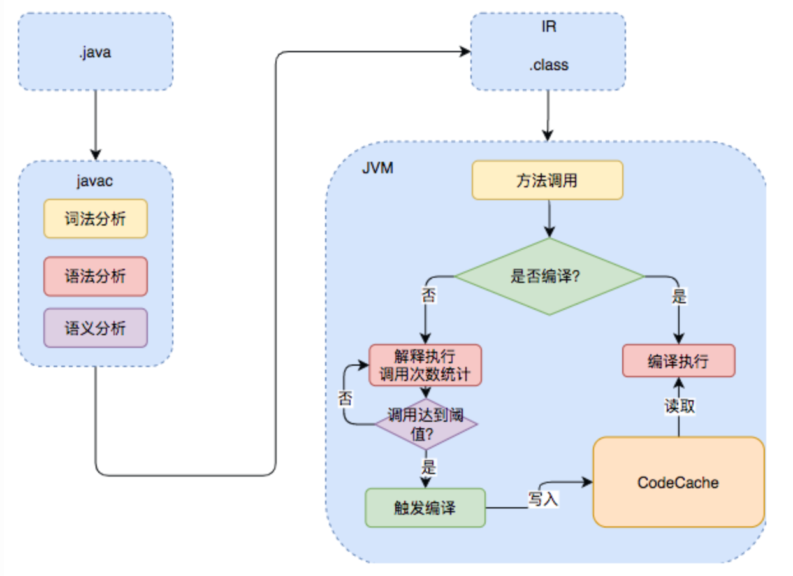
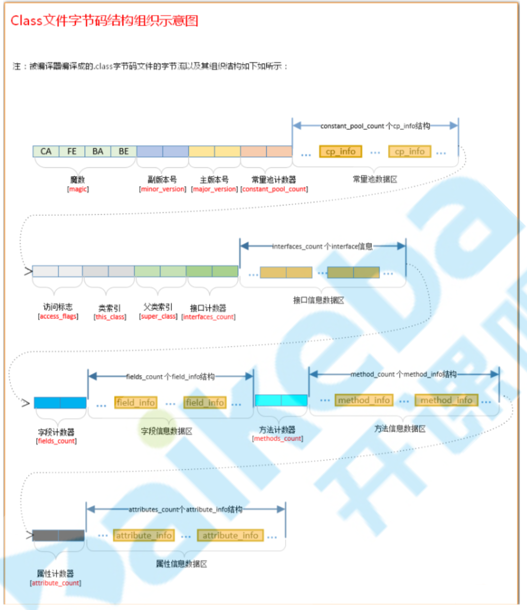
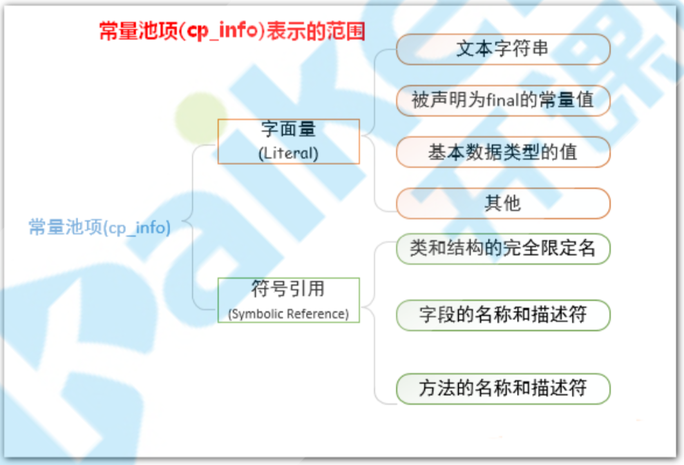
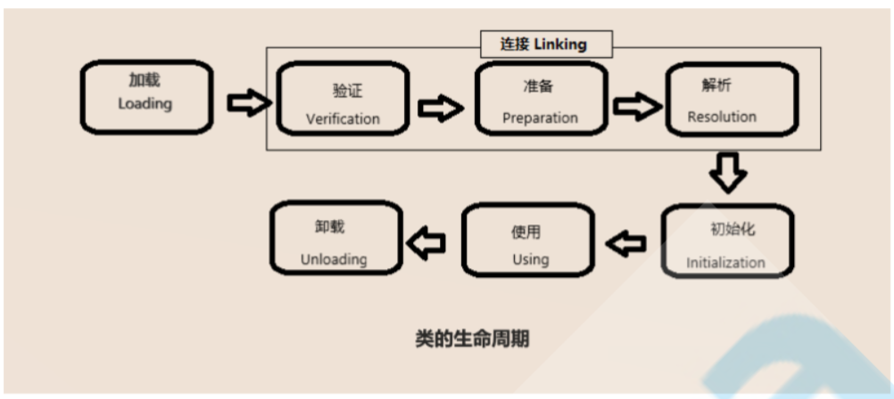
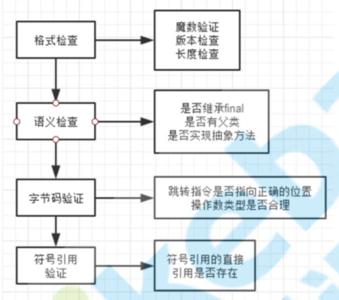
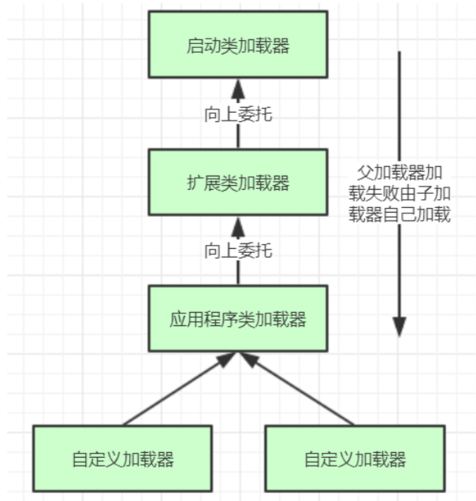
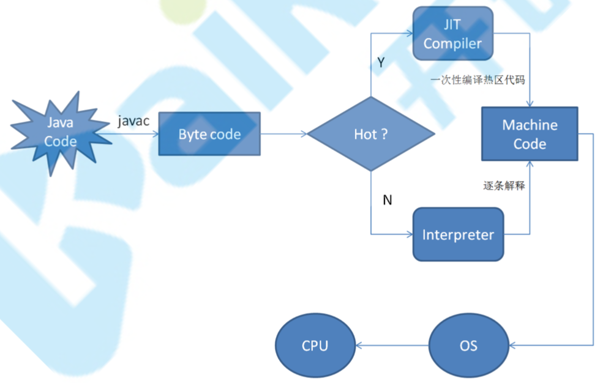

# JVM程序执行流程





# Class文件详解



## 魔数和版本号

所有的由Java编译器编译而成的class文件的前4个字节是0xCAFEBABE。

JVM会首先读取文件的前4个字节，判断该4个字节是否是“0xCAFEBABE”，如果是，则JVM会认为可以将此文件当作class文件来加载并使用。

## 常量池

包括常量池计数器和数据区



## 访问标志

用于表示某个类或者接口的访问权限及基础属性。如public、final、interface、abstract。

## 类索引、父类索引、接口索引

类索引用于确定这个类的全限定名，父类索引用于确定这个类父类的全限定名，接口索引用来描述这个类实现了哪些接口。

## 字段表集合

描述当前类或接口声明的所有字段，不包括从父类或父接 口继承的部分。

## 方法表集合

描述当前类或接口中声明的方法，不包括从父类或父接口继承的方法。

# 类加载

## 类加载时机

1. 遇到 new 、 getstatic 、 putstatic 和 invokestatic 这四条字节码指令时，如果对应的类没有初始化，则要对对应的类先进行初始化。

   这四个指令对应到我们java代码中的场景分别是:

   new关键字实例化对象的时候; 读取或设置一个类的静态字段(读取被final修饰，已在编译器把结果放入常量池的静态字段除外) ;调用类的静态方法时。

2. 使用 java.lang.reflect 包方法时对类进行反射调用的时候。

3. 初始化一个类的时候发现其父类还没初始化，要先初始化其父类。

4. 当虚拟机开始启动时，用户需要指定一个主类，虚拟机会先执行这个主类的初始化

## 类加载过程



### 加载

1. 通过一个类的全限定名来获取定义此类的二进制流
2. 将这个字节流所代表的静态存储结构转化为方法区的运行时数据结构
3. 在内存中生成一个代表这个类的java.lang.Class对象，作为方法区中这个类的各种数据的访问入口

### 验证



### 准备

仅仅为类变量(即static修饰的字段变量)分配内存并且设置该类变量的初始值即零值。

不包含用final修饰的static，因为final在编译的时候就会分配了(编译器的优化)。同时也不会为实例变量分配初始化。

### 解析

解析是虚拟机将常量池的符号引用替换为直接引用的过程。

符号引用指向了类的名称或者方法的名称或者字段的名称等，不是内存中的表示方式。

直接引用可以是:直接指向目标的指针、相对偏移量、一个能间接定位到目标的句柄。

### 初始化

到了此阶段，才真正开始执行类中定义的Java程序代码(初始化成为代码设定的默认值)。

其实初始化过程就是调用类初始化方法的过程，完成对static修饰的类变量的手动赋值还有主动调用静 态代码

### 卸载

当一个类对应的对象都已经回收的时候，会触发卸载。

# 类加载器



## 双亲委派

双亲委派机制，加载某个类时会先委托父加载器寻找目标类，找不 到再委托上层父加载器加载，如果所有父加载器在自己的加载类路径下都找不到目标类，则在自己的类加载路径中查找并载入目标类。

JVM在判定两个class是否相同时，不仅要判断两个类名是否相同，而且要判断是否由同一个类加载器实例加载的。

```java
protected synchronized Class<?> loadClass(String name, boolean resolve) throws ClassNotFoundException {
    //1 首先检查类是否被加载
    Class c = findLoadedClass(name);
    if (c == null) {
        try {
            if (parent != null) {
             //2 没有则调用父类加载器的loadClass()方法；
                c = parent.loadClass(name, false);
            } else {
            //3 若父类加载器为空，则默认使用启动类加载器作为父加载器；
                c = findBootstrapClass0(name);
            }
        } catch (ClassNotFoundException e) {
           //4 若父类加载失败，抛出ClassNotFoundException 异常后
          //再调用自己的findClass() 方法。
            c = findClass(name);
        }
    }
    if (resolve) {
        
        resolveClass(c);
    }
    return c;
}
```

### 优点

* 沙箱安全机制：自己写的java.lang.String.class类不会被加载，这样便可以防止核心API库被随意篡改 
* 避免类的重复加载:当父亲已经加载了该类时，就没有必要子ClassLoader再加载一次，保证被加载类的唯一性

### 破坏

可以继承ClassLoader类，然后重写其中的loadClass方法或者重写findClass方法

# 编译

## 前端编译

Java的执行过程整体可以分为两个部分，第一步由javac将源码编译成字节码，在这个过程中会进行词法分析、语法分析、语义分析，编译原理中这部分的编译称为前端编译。

泛型、自动装箱、自动拆箱、遍历循环（for-each），都是前端编译实现

## 后端编译

接下来无需编译直接逐条将字节码解释执行，在解释执行的过程中，虚拟机同时对程序运行的信息进行收集，在这些信息的基础上，编译器会逐渐发挥作用，它会进行后端编译——把字节码编译成机器码，但不是所有的代码都会被编译，只有被JVM认定为的热点代码，才可能被编译。

Java程序最初是通过解释器(Interpreter)进行解释执行的，当虚拟机发现某个方法或代码块的运行特别频繁时，就会把这些代码认定为“**热点代码**”。为了提高热点代码的执行效率，在运行时，虚拟机将会把这些代码编译成与本地平台相关的机器码，并进行各种层次的优化，完成这个任务的编译器称为即时编译器（JIT）。

编译器和解释器的协调工作流程



解释器可以省去编译的时间，立即执行。在程序运行后，编译器把代码编译成本地代码之后，可以获取更高的执行效率。同时，编译后代码相对于字节码占用空间多。当程序运行环境中内存限制较大，使用解释器执行节约内存，反之可以使用编译执行提升效率 。

### 热点代码

运行过程中会被即时编译器编译的热点代码有两类：被多次调用的方法和被多次执行的循环体。两种情况，编译器都是以整个方法作为编译对象。

判断是不是热点代码有下面两种方式

1. 基于采样的热点探测。虚拟机会周期性地检查各个线程的栈顶，如果发现某些方法经常出现在栈顶，那这个方法就是热点方法。
2. 基于计数器的热点探测。采用这种方法的虚拟机会为每个方法(甚至是代码块)建立计数器，统计方法的执行次数，如果执行次数超过一定的阀值，就认为它是热点方法。

### 编译器

HotSpot虚拟机中内置了两个即时编译器:Client Complier和Server Complier，简称为C1、C2编译器，分别用在客户端和服务端。用户也可以使用“-client”或“-server”参数去强制指定。用Client Complier获取更高的编译速度，用Server Complier 来获取更好的编译质量。

### JIT优化

#### 公共子表达式消除

如果一个表达式E已经 计算过了，并且从先前的计算到现在E中所有变量的值都没有发生变化，那么E的这次出现就成为了公共 子表达式。

```java
int d = (c*b)*12+a+(a+b*c);
//优化为
int d = E*12+a+(a+E);
```

#### 方法内联

将方法调用直接使用方法体中的代码进行替换，这就是方法内联，减少了方 法调用过程中压栈与入栈的开销。

```java
private int add4(int x1， int x2， int x3， int x4) { return add2(x1， x2) + add2(x3， x4);
}
private int add2(int x1， int x2) {
    return x1 + x2;
}
//优化后
private int add4(int x1， int x2， int x3， int x4) { 
  return x1 + x2 + x3 + x4;
}
```

#### 逃逸分析

通过逃逸分析，Java Hotspot编译器能够 分析出一个新的对象的引用的使用范围从而决定是否要将这个对象分配到堆上。


