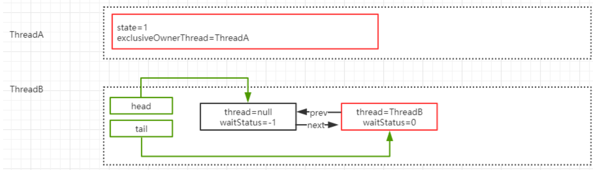
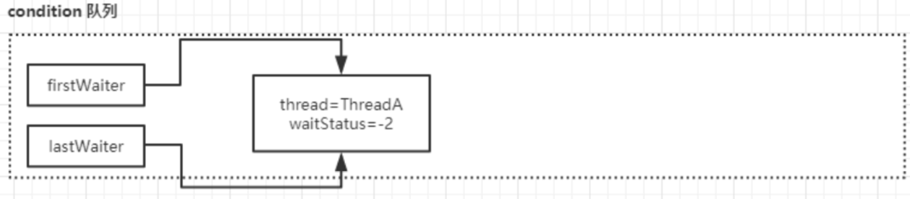
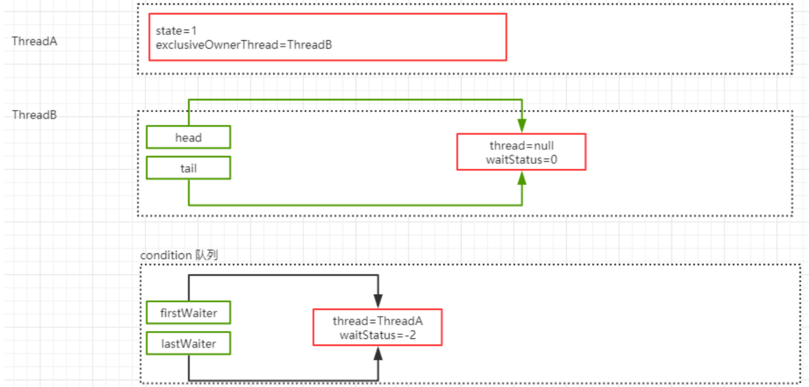
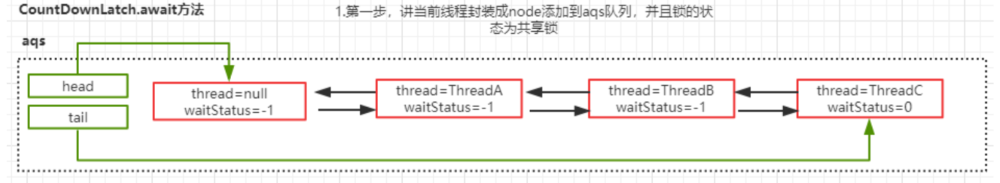

# Condition

## Condition 基本使用

```java
ReentrantLock lock = new ReentrantLock();
Condition condition = lock.newCondition();
condition.await();
condition.signal();
```

## **Condition** **源码分析**

调用 Condition，需要获得 Lock 锁，意味着会存在一个 AQS 同步队列。假如两个线程同时运行的话，那么 AQS 的队列可能是下面这种情况。



### condition.await

调用 Condition 的 await()方法(或者以 await 开头的方法)，会使当前线程进入等待队列并释 放锁，同时线程状态变为等待状态。当从 await()方法返回时，当前线程一定获取了 Condition 相关联的锁。

```java
public final void await() throws InterruptedException {
  if (Thread.interrupted()) //表示await允许被中断
    throw new InterruptedException();
  //创建一个新的节点，节点状态为 condition，采用的数据结构为单向链表
  Node node = addConditionWaiter(); 
  //释放当前的锁，得到锁的状态，并唤醒AQS队列中的一个线程
  int savedState = fullyRelease(node); 
  int interruptMode = 0;
  //如果当前节点没有在同步队列上，即还没有被 signal，则将当前线程阻塞
  while (!isOnSyncQueue(node)) {
    //判断这个节点是否在 AQS 队列上，第一次判断的是 false，因为前面释放   
    //锁了
    LockSupport.park(this); //通过 park 挂起当前线程
    if((interruptMode = checkInterruptWhileWaiting(node)) != 0)
      break;
  }
  // 当这个线程醒来,会尝试拿锁,acquireQueued返回false 就是拿到锁了
  if (acquireQueued(node, savedState) && interruptMode != 
      THROW_IE)
    interruptMode = REINTERRUPT;
  if (node.nextWaiter != null) // clean up if cancelled
   unlinkCancelledWaiters();
  // 如果线程被中断了,需要抛出异常.或者什么都不做 
  if (interruptMode != 0)
    reportInterruptAfterWait(interruptMode);
```

#### addConditionWaiter

这个方法的主要作用是把当前线程封装成 Node，添加到等待队列。这里的队列不再是双向链表，而是单向链表。

```java
private Node addConditionWaiter() {

  Node t = lastWaiter;
  if (t != null && t.waitStatus != Node.CONDITION) {
    unlinkCancelledWaiters();  
    t = lastWaiter;
  }
  //构建一个Node，waitStatus=CONDITION。 这里的链表是一个单向的  
  Node node = new Node(Thread.currentThread(), Node.CONDITION)   
  if (t == null)   
      firstWaiter = node; 
  else  
    t.nextWaiter = node;  
  lastWaiter = node; 
  return node;
}
```

执行完 addConditionWaiter 这个方法之后，就会产生一个这样的 condition 队列。



#### fullyRelease

fullRelease，就是如果当前锁存在多次重入，那么在这个方法中只需要释放一次就会把所有的重入次数归零。

```java
final int fullyRelease(Node node) {
  boolean failed = true;
  try {
    int savedState = getState(); //获得重入的次数
    if (release(savedState)) {//释放锁并且唤醒下一个同步队列中的线程
      failed = false;
      return savedState;
    } else {
      throw new IllegalMonitorStateException();
    }
  } finally {
    if (failed)
      node.waitStatus = Node.CANCELLED;
  }
}
```

此时，同步队列会触发锁的释放和重新竞争。ThreadB 获得了锁。



#### isOnSyncQueue

判断当前节点是否在同步队列中，返回 false 表示不在，返回 true 表示在。如果不在 AQS 同步队列，说明当前节点没有唤醒去争抢同步锁，所以需要把当前线程阻塞起来，直到其他的线程调用 signal 唤醒。

1. 如果 ThreadA 的 waitStatus 的状态为 CONDITION，说明它存在于 condition 队列中，不在 AQS 队列。因为 AQS 队列的状态一定不可能有 CONDITION
2. 如果 node.prev 为空，说明也不存在于 AQS 队列，原因是 prev=null 在 AQS 队列中只有一种可能性，就是它是 head 节点，head 节点意味着它是获得锁的节点。
3. 如果 node.next 不等于空，说明一定存在于 AQS 队列中，因为只有 AQS 队列才会存在next 和 prev 的关系
4. findNodeFromTail，表示从 tail 节点往前扫描 AQS 队列，一旦发现 AQS 队列的节点和当前节点相等，说明节点一定存在于 AQS 队列中

```java
final boolean isOnSyncQueue(Node node) {
  if (node.waitStatus == Node.CONDITION || node.prev== null)
    return false;
  if (node.next != null) // If has successor,it mustbe on queue
    return true;
  return findNodeFromTail(node);
}
```

### Condition.signal

await 方法会阻塞 ThreadA，然后 ThreadB 抢占到了锁获得了执行权限，这个时候在 ThreadB 中调用了 Condition 的 signal()方法，将会唤醒在等待队列中节点。

```java
public final void signal() {
  //先判断当前线程是否获得了锁，这个判断比较简单，直接用获得锁的线程和当前线程相比即可
  if (!isHeldExclusively()) 
    throw new IllegalMonitorStateException();
  Node first = firstWaiter; // 拿到 Condition 队列上第一个节点 
  if (first != null)      
    doSignal(first);
}
```

```java
private void doSignal(Node first) {
  do {
    //从 Condition 队列中删除 first 节点
    if ( (firstWaiter = first.nextWaiter) == null)
      lastWaiter = null; // 将 next 节点设置成 null 
    first.nextWaiter = null;
} while(!transferForSignal(first&&(first =firstWaiter) !=null);
}
```

#### transferForSignal

该方法先是 CAS 修改了节点状态，如果成功，将这个节点放到 AQS 队列中，然后唤醒 这个节点上的线程。此时，那个节点就会在 await 方法中苏醒。

```java
final boolean transferForSignal(Node node) {
  //更新节点的状态为0如果更新失败，只有一种可能就是节点被 CANCELLED 了
  if (!compareAndSetWaitStatus(node, Node.CONDITION, 0))
    return false;
  //调用enq，把当前节点添加到AQS队列。并且返回返回按当前节点
  Node p = enq(node);
  int ws = p.waitStatus;
  // 如果上一个节点的状态被取消了, 或设置上一个节点的状态为SIGNAL失败了
  if (ws > 0 || !compareAndSetWaitStatus(p, ws, Node.SIGNAL))  
    LockSupport.unpark(node.thread); // 唤醒节点上的线程.
  //如果node的prev节点已经是signal状态，那么被阻塞线程唤醒工作由 AQS 队
  //列来完成
  return true; 
```

# CountDownLatch

## CountDownLatch基本使用

```java
CountDownLatch countDownLatch = new CountDownLatch(3);
//countDown() 方法每次调用都会将 state 减 1，直到 state 的值为 0
countDownLatch.countDown();
//await 是一个阻 塞方法，当 state 减为 0 的时候，await 方法才会返回
countDownLatch.await();
```

## CountDownLatch源码分析

### countDownLatch.await()

```java
public void await() throws InterruptedException {   
  sync.acquireSharedInterruptibly(1);    
}

public final void acquireSharedInterruptibly(int arg) throws InterruptedException {
  if (Thread.interrupted())
    throw new InterruptedException();
  if (tryAcquireShared(arg) < 0) //state如果不等于0，说明当前线程需要加入到共享锁队列中    
    doAcquireSharedInterruptibly(arg);
}
```

#### doAcquireSharedInterruptibly

```java
private void doAcquireSharedInterruptibly(int arg)throws InterruptedException {
  final Node node = addWaiter(Node.SHARED); //创建一个共享模式的节点添加到队列中
  boolean failed = true; 
  try {
    for (;;) {
      final Node p = node.predecessor(); 
      if (p == head) {
        int r = tryAcquireShared(arg);//就判断尝试获取锁
        if (r >= 0) {//r>=0表示获取到了执行权限，这个时候因为state!=0，所以不会执行这段代码
          setHeadAndPropagate(node, r); 
          p.next = null; // help GC 
          failed = false;
          return;
        }  
      }
      //阻塞线程
      if (shouldParkAfterFailedAcquire(p, node) &&parkAndCheckInterrupt())
        throw new InterruptedException();
    }
  } finally {
    if (failed) cancelAcquire(node);
  } 
}

protected int tryAcquireShared(int acquires) {            
  return (getState() == 0) ? 1 : -1;        
}
```

假如这个时候有 3 个线程调用了 await 方法，由于这个时候 state 的值还不为 0，所以这三个线程都会加入到 AQS 队列中。并且三个线程都处于阻塞状态。



### CountDownLatch.countDown

```java
public void countDown() {  
  sync.releaseShared(1);    
}

public final boolean releaseShared(int arg) { 
  if (tryReleaseShared(arg)) {  
    doReleaseShared();
    return true; }
  return false; 
}

//用自旋的方式减1
protected boolean tryReleaseShared(int releases) {
   // Decrement count; signal when transition to zero
  for (;;) {
    int c = getState(); 
    if (c == 0)
      return false;
    int nextc = c-1;
    if (compareAndSetState(c, nextc)) 
      return nextc == 0;
  }  
}
```

#### AQS. doReleaseShared

共享锁的释放和独占锁的释放有一定的差别。前面唤醒锁的逻辑和独占锁是一样，先判断头结点是不是 SIGNAL 状态，如果是，则修改为 0，并且唤醒头结点的下一个节点。

标识为 PROPAGATE状态的节点，是共享锁模式下的节点状态，处于这个状态下的节点，会对线程的唤醒进行传播。

```java
private void doReleaseShared() { 
  for (;;) {
    Node h = head;
    if (h != null && h != tail) {
      int ws = h.waitStatus; 
      if (ws == Node.SIGNAL){                
        if (!compareAndSetWaitStatus(h, Node.SIGNAL, 0))
          continue; // loop to recheck cases  
        unparkSuccessor(h);
      }
      // 这个 CAS 失败的场景是:执行到这里的时候，刚好有一个节点入队，入队会将这个 ws 设置为 -1
      else if (ws == 0 && !compareAndSetWaitStatus(h,0,Node.PROPAGATE))
        continue; // loop on failed CAS    
    }
    // 如果到这里的时候，前面唤醒的线程已经占领了 head，那么再 循环
    // 通过检查头节点是否改变了，如果改变了就继续循环
    if (h == head) // loop if head changed
      break; 
  }
}


```

h == head说明头节点还没有被刚刚用 unparkSuccessor 唤醒的线程(这里可以理解为 ThreadB)占有，此时 break 退出循环。
 h != head说明头节点被刚刚唤醒的线程(这里可以理解为 ThreadB)占有，那么这里重新进入下一轮循环，唤醒下一个节点。我们知道，等到 ThreadB 被唤醒后，其实是会主动唤醒 ThreadC。

### 唤醒之后

一旦线程被唤醒，代码又会继续回到 doAcquireSharedInterruptibly 中来执行。如果当前 state 满足=0 的条件，则会执行 setHeadAndPropagate 方法。

```java
private void setHeadAndPropagate(Node node, int propagate) {
  Node h = head; // Record old head for check below 
  setHead(node);
  if (propagate > 0 || h == null || h.waitStatus < 0 ||(h = head) == null || h.waitStatus < 0) { 
    Node s = node.next;
    if (s == null || s.isShared()) 
      doReleaseShared();
}
```

# PROPAGATE状态存在的意义

在setHeadAndPropagate中我们可以看到如下的一段代码:

```java
if (propagate > 0 || h == null || h.waitStatus < 0 ||
       (h = head) == null || h.waitStatus < 0) {
       Node s = node.next;
       if (s == null || s.isShared())
           doReleaseShared();
}
```

为什么不只是用propagate > 0来判断呢？我们知道目前AQS代码中的Node.PROPAGATE状态就是为了此处可以读取到h.waitStatus < 0（PROPAGATE值为-3）。

看一下下面的bug

```java
import java.util.concurrent.Semaphore;

public class TestSemaphore {

   private static Semaphore sem = new Semaphore(0);

   private static class Thread1 extends Thread {
       @Override
       public void run() {
           sem.acquireUninterruptibly();
       }
   }

   private static class Thread2 extends Thread {
       @Override
       public void run() {
           sem.release();
       }
   }

   public static void main(String[] args) throws InterruptedException {
       for (int i = 0; i < 10000000; i++) {
           Thread t1 = new Thread1();
           Thread t2 = new Thread1();
           Thread t3 = new Thread2();
           Thread t4 = new Thread2();
           t1.start();
           t2.start();
           t3.start();
           t4.start();
           t1.join();
           t2.join();
           t3.join();
           t4.join();
           System.out.println(i);
       }
   }
}
```

让我们来分析一下上面的程序：

上面的程序循环中做的事情就是放出4个线程，其中2个线程用于获取信号量，另外2个用于释放信号量。每次循环主线程会等待所有子线程执行完毕。出现bug也就是线程hang住的问题就在于两个获取信号量的线程有一个会没办法被唤醒，队列就死掉了。

在AQS的共享锁中，一个被park的线程，不考虑线程中断和前驱节点取消的情况，有两种情况可以被unpark：一种是其他线程释放信号量，调用unparkSuccessor；另一种是其他线程获取共享锁时通过传播机制来唤醒后继节点。

我们假设某次循环中队列里排队的节点为情况为：head -> t1的node -> t2的node(也就是tail)

信号量释放的顺序为t3先释放，t4后释放:

时刻1: t3调用releaseShared，调用了unparkSuccessor(h)，head的等待状态从-1变为0

时刻2: t1由于t3释放了信号量，被t3唤醒，调用Semaphore.NonfairSync的tryAcquireShared，返回值为0

时刻3: t4调用releaseShared,读到此时h.waitStatus为0(此时读到的head和时刻1中为同一个head)，不满足条件,因此不会调用unparkSuccessor(h)。

时刻4: t1获取信号量成功，调用setHeadAndPropagate时，因为不满足propagate > 0（时刻2的返回值也就是propagate==0）,从而不会唤醒后继节点

这就好比是一个精巧的多米诺骨牌最终由于设计的失误导致动力无法传递下去，至此AQS中的同步队列宣告死亡。

那么引入PROPAGATE是怎么解决问题的呢？引入之后，调用releaseShared方法不再简单粗暴地直接unparkSuccessor,而是将传播行为抽了一个doReleaseShared方法出来。再看上面的那种情况:

时刻1：t3调用releaseShared -> doReleaseShared -> unparkSuccessor，完了之后head的等待状态为0

时刻2：t1由于t3释放了信号量，被t3唤醒，调用Semaphore.NonfairSync的tryAcquireShared，返回值为0

时刻3：t4调用releaseShared，读到此时h.waitStatus为0(此时读到的head和时刻1中为同一个head)，将等待状态置为PROPAGATE

时刻4：t1获取信号量成功，调用setHeadAndPropagate时，可以读到`h.waitStatus < 0`，从而可以接下来调用doReleaseShared唤醒t2

也就是说，上面会产生线程hang住bug的case在引入PROPAGATE后可以被规避掉。在PROPAGATE引入之前，之所以可能会出现线程hang住的情况，就是在于releaseShared有竞争的情况下，可能会有队列中处于等待状态的节点因为第一个线程完成释放唤醒，第二个线程获取到锁，但还没设置好head，又有新线程释放锁，但是读到老的head状态为0导致释放但不唤醒，最终后一个等待线程既没有被释放线程唤醒，也没有被持锁线程唤醒。所以，仅仅靠tryAcquireShared的返回值来决定是否要将唤醒传递下去是不充分的。

