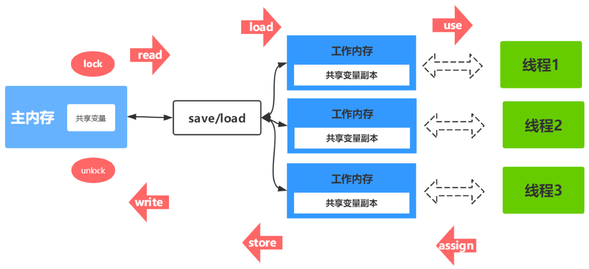

# JMM的定义

Java内存模型(Java Memory Model简称JMM)是一种抽象的概念，并不真实存在，它描述的是一组规则或规范，通过这组规范定义了程序中各个变量(包括实例字段，静态字段和构成数组对象的元素)的访问方式。

JMM 抽象模型分为主内存、工作内存。主内存是共享内存区域，所有变量都存储在主内存。工作内存是每个线程独占的，线程对变量的操作(读取赋值等)必须在工作内存中进行，首先要将变量从主内存拷贝到自己的工作内存空间，然后对变量进行操作，操作完成后再将变量写回主内存。线程间的通信(传值)必须通过主内存来完成。

此处的主内存和工作内存跟JVM内存划分（堆、栈、方法区）是在不同的层次上进行的。主内存从某个程度上讲应该包括了堆和方法区，而工作内存从某个程度上讲则应该包括程序计数器、虚拟机栈以及本地方法栈。从更底层的来说，主内存对应的是硬件的物理内存，工作内存对应的是寄存器和高速缓存。

# JMM内存交互操作

1. lock(锁定)作用于主内存的变量，把一个变量标记为一条线程独占状态

2. unlock(解锁):作用于主内存的变量，把一个处于锁定状态的变量释放出来，释放后的变量才可以被其他线程锁定。

3. read(读取):作用于主内存的变量，把一个变量值从主内存传输到线程的工作内存中，以便随后的load动作使用。

4. load(载入):作用于工作内存的变量，它把read操作从主内存中得到的变量值放入工作内存的变量副本中。

5. use(使用):作用于工作内存的变量，把工作内存中的一个变量值传递给执行引擎。

6. assign(赋值):作用于工作内存的变量，它把一个从执行引擎接收到的值赋给工作内存的变量。

7. store(存储):作用于工作内存的变量，把工作内存中的一个变量的值传送到主内存中， 以便随后的write的操作。

8. write(写入):作用于工作内存的变量，它把store操作从工作内存中的一个变量的值传送到主内存的变量中。

   

# JMM内存同步规则

* 如果要把一个变量从主内存中复制到工作内存中，就需要按顺序地执行read和load操作， 如果把变量从工作内存中同步到主内存中，就需要按顺序地执行store和write操作。
* 不允许一个线程无原因地(没有发生过任何assign操作)把数据从工作内存同步回主内存中
* 一个新的变量只能在主内存中诞生，不允许在工作内存中直接使用一个未被初始化(load 或者assign)的变量。即就是对一个变量实施use和store操作之前，必须先自行assign和load 操作。
* 一个变量在同一时刻只允许一条线程对其进行lock操作，但lock操作可以被同一线程重复 执行多次，多次执行lock后，只有执行相同次数的unlock操作，变量才会被解锁。lock和 unlock必须成对出现。
* 如果对一个变量执行lock操作，将会清空工作内存中此变量的值，在执行引擎使用这个变 量之前需要重新执行load或assign操作初始化变量的值。
* 对一个变量执行unlock操作之前，必须先把此变量同步到主内存中(执行store和write操 作)

