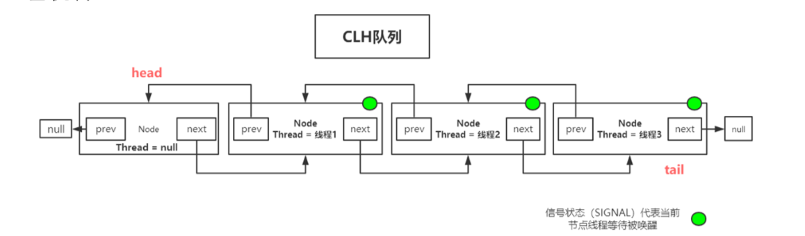
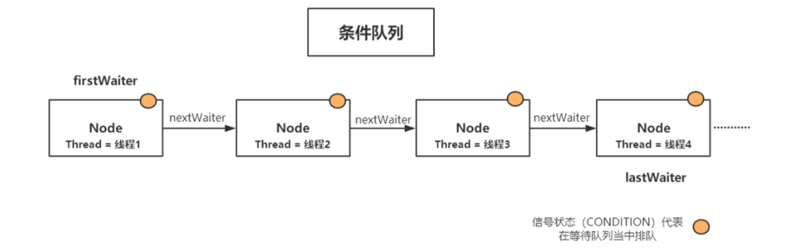
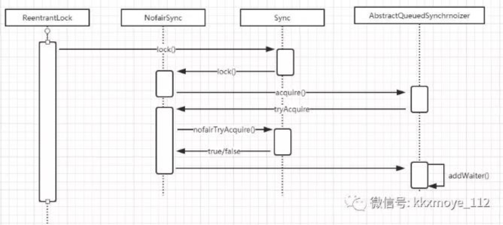
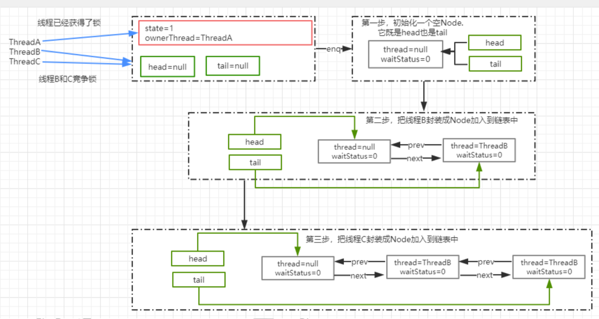
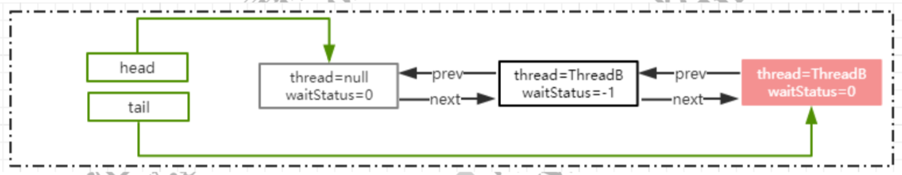

# Lock

几个常见的锁实现

* ReentrantLock:表示重入锁，它是唯一一个实现了 Lock 接口的类。重入锁指的是线程在获得锁之后，再次获取该锁不需要阻塞，而是直接关联一次计数器增加重入次数
* ReentrantReadWriteLock:重入读写锁，它实现了 ReadWriteLock 接口，在这个类中维护了两个锁，ReadLock和WriteLock，他们都分别实现了 Lock 接口。读写锁是一种适合读多写少的场景下解决线程安全问题的工具，基本原则是: 读和读不互斥、读和写互斥、写和写互斥。
* StampedLock: stampedLock 是 JDK8 引入的新的锁机制，可以简单认为是读写锁的一个改进版本，读写锁虽然通过分离读和写的功能使得读和读之间可以完全并发，但是读和写是有冲突的，如果大量的读线程存在，可能会引起写线程的饥饿。stampedLock 是一种乐观的读策略，使得乐观锁完全不会阻塞写线程

# 使用案例

```java
//Reenrantlock
Lock lock=new ReentrantLock(); 
lock.lock(); 
lock.unlock();
//ReentrantReadWriteLock
ReentrantReadWriteLock rwl=new ReentrantReadWriteLock();
Lock read=rwl.readLock(); 
Lock write=rwl.writeLock();
```

# ReentrantLock的实现原理

## AQS

AQS，全称 AbstractQueuedSynchronizer，它是一个同步工具也是 Lock 用来实现线程同步的核心组件。

* AQS内部维护属性volatile int state表示资源的可用状态
* AQS定义两种资源共享方式。Exclusive-独占，Share-共享
* AQS定义两种队列。同步等待队列，条件等待队列

### 同步等待队列

同步等待队列是一个 FIFO 的双向链表。当线程争抢锁失败后会封装成 Node 加入到队列中，当获取锁的线程释放锁以 后，会从队列中唤醒一个阻塞的节点(线程)。



### 条件等待队列

条件等待队列使某个或者某些线程一起等待某个条件(Condition)，只有当该条件具备时，这些等待线程才会被唤醒，从而重新争夺锁。



## 源码分析

### 锁的获取流程

#### 时序图

ReentrantLock.lock()调用时序图



#### ReentrantLock.lock()

这个是reentrantLock获取锁的入口，Sync有两个具体的实现NofairSync和FailSync。

```java
public void lock() {
  sync.lock();
}
```

#### NofairSync.lock()

CAS 成功，就表示成功获得了锁。CAS 失败，调用 acquire(1)走锁竞争

```java
final void lock() {
  if (compareAndSetState(0, 1))
    setExclusiveOwnerThread(Thread.currentThread());
  else
    acquire(1);
}
```

#### AQS.accquire()

```java
public final void acquire(int arg) {
  if (!tryAcquire(arg) &&
      acquireQueued(addWaiter(Node.EXCLUSIVE), arg))
    selfInterrupt();
}
```

1. 通过 tryAcquire 尝试获取独占锁，如果成功返回 true，失败返回 false。
2. 如果 tryAcquire 失败，则会通过 addWaiter 方法将当前线程封装成 Node 添加到 AQS 队列尾部。
3. acquireQueued，将 Node 作为参数，通过自旋去尝试获取锁。

##### NonfairSync.tryAcquire

``` java
protected final boolean tryAcquire(int acquires) {
  return nonfairTryAcquire(acquires);
}
```

###### ReentrantLock.nofairTryAcquire

获取当前线程，判断当前的锁的状态。如果 state=0 表示当前是无锁状态，通过 cas 更新 state 状态的值 。当前线程是属于重入，则增加重入次数

```java
final boolean nonfairTryAcquire(int acquires) {
  //获取当前执行的线程
  final Thread current = Thread.currentThread();
  int c = getState();//获得 state 的值
  if (c == 0) {//表示无锁状态
    //cas替换state的值，cas 成功表示获取锁成功
    if (compareAndSetState(0, acquires)) {
      //保存当前获得锁的线程,下次再来的时候不要再尝试竞争锁
      setExclusiveOwnerThread(current);
      return true;
    }
  }else if (current == getExclusiveOwnerThread()) {
    //如果同一个线程来获得锁，直接增加重入次数
    int nextc = c + acquires;
    if (nextc < 0) // overflow
      throw new Error("Maximum lock count exceeded");
    setState(nextc);
    return true;
  }
  return false;
}
```

##### AQS.addWaiter

当 tryAcquire 方法获取锁失败以后，则会先调用addWaiter将当前线程封装成Node。传递Node.EXCLUSIVE，表示独占状态。当前链表中的 tail 节点是否为空，如果不为空，则通过 cas 操作把当前线程的node 添加到 AQS 队列。如果为空或者 cas 失败，调用 enq 将节点添加到 AQS 队列

```java
private Node addWaiter(Node mode) {
  //把当前线程封装为 Node
  Node node = new Node(Thread.currentThread(), mode);
  //tail 是 AQS 中表示同步队列队尾的属性，默认是 null
  Node pred = tail; 
  if (pred != null) {//tail 不为空的情况下，说明队列中存在节点
    node.prev = pred;//把当前线程的 Node 的 prev 指向 tail
    //通过 cas 把 node加入到 AQS 队列，也就是设置为 tail指向当前 node
    if (compareAndSetTail(pred, node)) {
      //设置成功以后，把原 tail 节点的next指向当前 node
      pred.next = node;
      return node;
    }
  }
  enq(node);//tail=null,把 node 添加到同步队列
  return node;
}

```

```java
//enq 就是通过自旋操作把当前节点加入到队列中
private Node enq(final Node node) {
  for (;;) {
    Node t = tail;
    if (t == null) { // Must initialize
      if (compareAndSetHead(new Node()))
        tail = head;
    } else {
      node.prev = t;
      if (compareAndSetTail(t, node)) {
        t.next = node;
        return t;
      }
    }
  }
}
```

###### 图解分析

假设 3 个线程来争抢锁，那么截止到 enq 方法运行结束之后，或者调用 addwaiter 方法结束后，AQS 中的链表结构图



##### AQS.acquireQueued

通过 addWaiter 方法把线程添加到链表后，会接着把 Node 作为参数传递给 acquireQueued 方法，去竞争锁

1. 获取当前节点的 prev 节点.如果 prev 节点为 head 节点，那么它就有资格去争抢锁，调用 tryAcquire 抢占锁.
2. 如果获得锁失败，则根据 waitStatus 决定是否需要挂起线程

```java
final boolean acquireQueued(final Node node, int arg) {
  boolean failed = true;
  try {
    boolean interrupted = false;
    for (;;) {
      final Node p = node.predecessor();//获取当前节点的 prev 节点
      if (p == head && tryAcquire(arg)) {
        //如果是 head 节点，说明有资格去争抢锁
        setHead(node); //获得锁的节点设置为 head
        p.next = null; //把原 head 节点从链表中移除
        failed = false;
        return interrupted;
      }
//ThreadA 可能还没释放锁，使得 ThreadB 在执行tryAcquire时会返回false
      if (shouldParkAfterFailedAcquire(p, node) && 
          parkAndCheckInterrupt())
        interrupted = true; //返回当前线程在等待过程中有没有中断过。
    }
  } finally {
    if (failed) cancelAcquire(node);
  } 
}
```

###### shouldParkAfterFailedAcquire

这个方法的主要作用是，通过Node的状态来判断，竞争锁失败以后是否应该被挂起。如果pred 节点状态为 SIGNAL，那就表示可以放心挂起当前线程。通过循环扫描链表把 CANCELLED 状态的节点移除。修改 pred 节点的状态为 SIGNAL，返回 false。

```java
private static boolean shouldParkAfterFailedAcquire(Node pred, 
      Node node) {
  int ws = pred.waitStatus;//前置节点的waitStatus 
  if (ws == Node.SIGNAL)
    return true;//返回 true，意味着可以直接放心的挂起了
  if (ws > 0) {//ws大于0，意味着prev节点取消了排队，直接移除这个节点
    do {
      node.prev = pred = pred.prev;
      //相当于: pred=pred.prev; node.prev=pred;
    } while (pred.waitStatus > 0); //从列表中移除 CANCELLED 的节点
    pred.next = node;
  } else {//利用 cas 设置 prev 节点的状态为 SIGNAL(-1)
    compareAndSetWaitStatus(pred, ws, Node.SIGNAL);
  }
  return false;
}
```

###### parkAndCheckInterrupt

LockSupport.park 挂起当前线程

Thread.interrupted，返回当前线程是否被其他线程触发过中断请求。如果返回 true，意味着在 acquire 方法中会执行selfInterrupt()

```java
private final boolean parkAndCheckInterrupt() {
  LockSupport.park(this);
  return Thread.interrupted(); 
}
```

###### 图解分析


### 锁的释放流程

#### ReentrantLock.unlock

在 unlock 中，会调用 release 方法来释放锁

```java
public final boolean release(int arg) {
  if (tryRelease(arg)) { //释放锁成功
    Node h = head; //得到 aqs 中 head 节点
    //如果 head 节点不为空并且状态!=0.调用唤醒后续节点
    if (h != null && h.waitStatus != 0)
      unparkSuccessor(h);
    return true;
  }
  return false;
}
```

##### ReentrantLock.tryRelease

这个方法可以认为是一个设置锁状态的操作，通过将 state 状态减掉传入的参数值 (参数是 1)，如果结果状态为 0，就将排它锁的 Owner 设置为 null，以使得其它的线程有机会进行执行。

 ```java
protected final boolean tryRelease(int releases)
{
  int c = getState() - releases;
  if (Thread.currentThread() != getExclusiveOwnerThread())
    throw new IllegalMonitorStateException();
  boolean free = false;
  if (c == 0) {
    free = true;
    setExclusiveOwnerThread(null);
  }
  setState(c);
  return free;
}
 ```

##### **unparkSuccessor**

```java
private void unparkSuccessor(Node node) {
  int ws = node.waitStatus;//获得 head 节点的状态
  if (ws < 0)
    compareAndSetWaitStatus(node, ws, 0);//设置 head 节点状态为 0
  Node s = node.next;//得到head节点的下一个节点
  //如果下一个节点为 null 或者 status>0 表示 cancelled 状态. 通过               
  //从尾部节点开始扫描，找到距离 head 最近的一个
  if (s == null || s.waitStatus > 0) {  
    waitStatus<=0 的节点 s = null;
    for (Node t = tail; t != null && t != node; t = t.prev)
      if (t.waitStatus <= 0) s = t;
  }
  if (s != null) //next节点不为空，直接唤醒这个线程即可     
    LockSupport.unpark(s.thread);
}
```

#### 挂起的线程继续执行

通过 ReentrantLock.unlock，原本挂起的线程被唤醒以后继续执行。原来被挂起的线程是在 acquireQueued 方法中，所以被唤醒以后继续从这个方法开始执行。

设置新的头节点，新 head 节点的 prev=null。把原 head 节点的 next 节点指向为 null。

#### 图解分析

通过锁的释放，原本的结构就发生了一些变化。head 节点的 waitStatus 变成了 0，ThreadB 被唤醒。



设置新 head 节点的 prev=null，设置原 head 节点的 next 节点为 null。


# 公平锁和非公平锁

FairSync.tryAcquire

```java
protected final boolean tryAcquire(int acquires) { 
  final Thread current = Thread.currentThread(); 
  int c = getState();
  if (c == 0) {
    if (!hasQueuedPredecessors() && compareAndSetState(0,                                                      acquires)) { 
      setExclusiveOwnerThread(current); 
      return true;
    } 
  }
  else if (current == getExclusiveOwnerThread()) { 
    int nextc = c + acquires;
    if (nextc < 0)
      throw new Error("Maximum lock count exceeded"); 
    setState(nextc);
    return true;
  }
  return false; 
}
```

这个方法与 nonfairTryAcquire(int acquires)比较，不同的地方在于判断条件多了hasQueuedPredecessors()方法，也就是加入了同步队列中当前节点是否有前驱节点]的判断，如果该方法返回 true，则表示有线程比当前线程更早地请求获取锁， 因此需要等待前驱线程获取并释放锁之后才能继续获取锁。