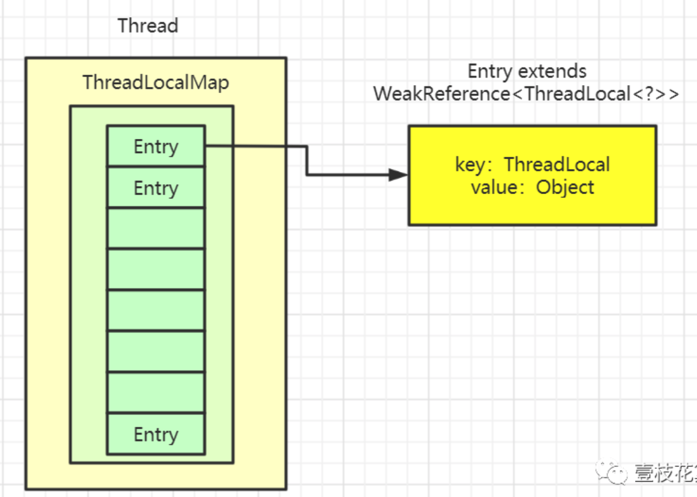
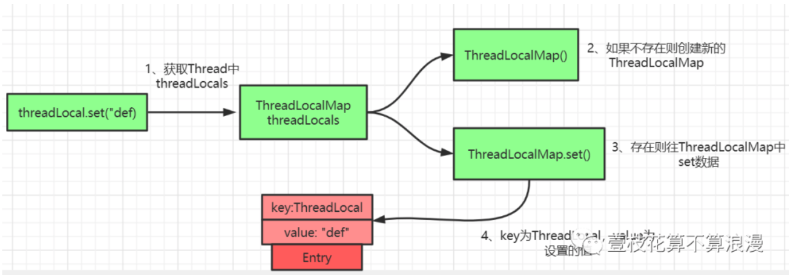
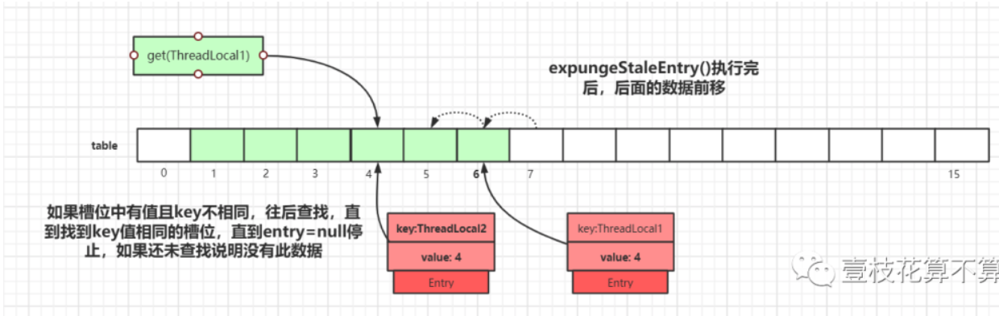

# 数据结构

`Thread`类有一个类型为`ThreadLocal.ThreadLocalMap`的实例变量`threadLocals`，也就是说每个线程有一个自己的`ThreadLocalMap`。

`ThreadLocalMap`有自己的独立实现，可以简单地将它的`key`视作`ThreadLocal`，`value`为代码中放入的值（实际上`key`并不是`ThreadLocal`本身，而是它的一个**弱引用**）。

每个线程在往`ThreadLocal`里放值的时候，都会往自己的`ThreadLocalMap`里存，读也是以`ThreadLocal`作为引用，在自己的`map`里找对应的`key`，从而实现了**线程隔离**。

注意`Entry`， 它的`key`是`ThreadLocal<?> k` ，继承自`WeakReference`， 也就是我们常说的弱引用类型。

# Set方法

1. 通过`hash`计算后的槽位对应的`Entry`数据为空，直接将数据放到该槽位即可。
2. 槽位数据不为空，`key`值与当前`ThreadLocal`通过`hash`计算获取的`key`值一致，直接更新
3. 槽位数据不为空，往后遍历过程中，遇到`key`过期的`Entry`，进行探测式数据清理工作。经过一轮探测式清理后，`key`过期的数据会被清理掉，没过期的数据经过`rehash`重定位后所处的桶位置理论上更接近`i= key.hashCode & (tab.len - 1)`的位置

# 扩容

扩容后的`tab`的大小为`oldLen * 2`，然后遍历老的散列表，重新计算`hash`位置，然后放到新的`tab`数组中，如果出现`hash`冲突则往后寻找最近的`entry`为`null`的槽位，遍历完成之后，`oldTab`中所有的`entry`数据都已经放入到新的`tab`中了

# Get方法

# 子线程获取

使用`ThreadLocal`的时候，在异步场景下是无法给子线程共享父线程中创建的线程副本数据的。为了解决这个问题，JDK中还有一个`InheritableThreadLocal`类。

实现原理是子线程是通过在父线程中通过调用`new Thread()`方法来创建子线程，`Thread#init`方法在`Thread`的构造方法中被调用。在`init`方法中拷贝父线程数据到子线程中。