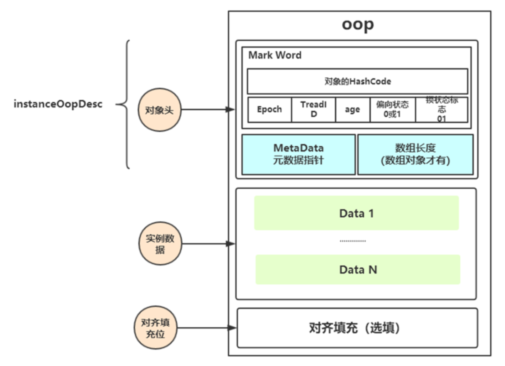
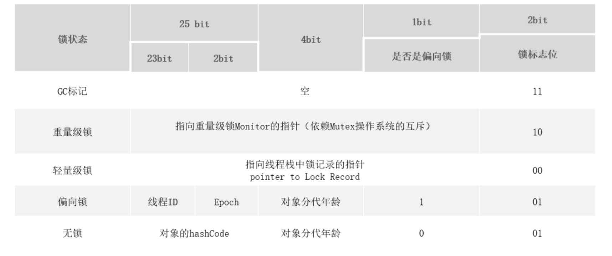
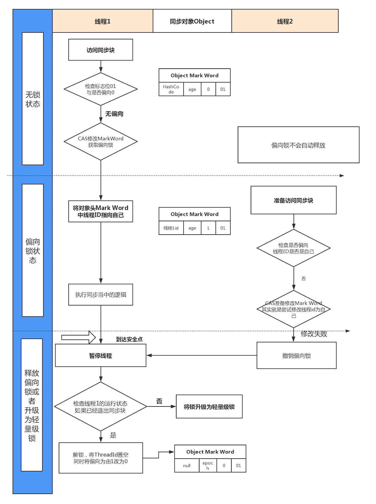
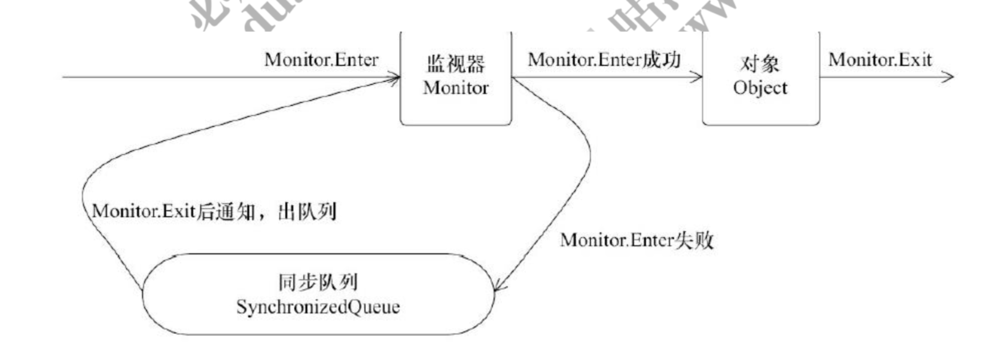

# **synchronized** 的基本认识

synchronized 有三种方式来加锁，分别是

1. 修饰实例方法，作用于当前实例加锁，进入同步代码前要获得当前实例的锁

2. 静态方法，作用于当前类对象加锁，进入同步代码前要获得当前类对象的锁

3. 修饰代码块，指定加锁对象，对给定对象加锁，进入同步代码库前要获得给定对象的锁。

不同的修饰类型，代表锁的控制粒度。

# synchronized存储

HotSpot虚拟机中，对象在内存中存储的布局可以分为三块区域：对象头 (Header)、实例数据(Instance Data)和对齐填充(Padding)。

对象头：比如 hash码，对象所属的年代，对象锁，锁状态标志，偏向锁(线程)ID，偏向时间，数组长度(数组对象)等

实例数据：即创建对象时，对象中成员变量，方法等。

对齐填充：对象的大小必须是8字节的整数倍。

 instanceOopDesc继承自 oopDesc，oopDesc 的定义载 Hotspot 源码中的 oop.hpp 文件中。oopDesc 的定义包含两个成员mark 和 _metadata。_mark 表示对象标记、属于 markOop 类型，也就是Mark World。metadata 表示类元信息，类元信息存储的是对象指向它的类元数据的首地址。

## Mark World

Mark word 记录了对象和锁有关的信息，当某个对象被 synchronized 关键字当成同步锁时，那么围绕这个锁的一系列操作都和 Mark word 有关系。

## 为什么任何对象都可以实现锁

1. 首先，Java 中的每个对象都派生自 Object 类，而每个Java Object 在 JVM 内部都有一个 native 的 C++对象oop/oopDesc 进行对应。
2. 线程在获取锁的时候，实际上就是获得一个监视器对象(monitor)，monitor 可以认为是一个同步对象，所有的 Java 对象是天生携带 monitor。

# 锁的升级

锁的状态总共有四种，无锁状态、偏向锁、轻量级锁和重量级锁。随着锁的
竞争，锁可以从偏向锁升级到轻量级锁，再升级的重量级锁，但是锁的升级是单
向的，也就是说只能从低到高升级，不会出现锁的降级。

## 偏向锁

偏向锁的核心思想是，如果一个线程获得了锁，那么锁就进入偏向模式，此时Mark Word 的结构也变为偏向锁结构，会在对象头中存储当前线程的ID。当这个线程再次请求锁时，无需再做任何同步操作，即获取锁的过程。

当存在 2 个以上的线程竞争，如果开启偏向锁，反而会提升获取锁的资源消耗。所以可以通过 jvm 参数UseBiasedLocking 来设置开启或关闭偏向锁。

## 轻量级锁

倘若偏向锁失败，虚拟机会尝试使用一种称为轻量级锁的优化手段(1.6之后加入的)，此时Mark Word 的结构也变为轻量级锁的结构。轻量级锁所适应的场景是线程交替执行同步块的场合，如果存在同一时间访问同一锁的场合，就会导致轻量级锁膨胀为重量级锁。

### 自旋锁

轻量级锁失败后，虚拟机为了避免线程真实地在操作系统层面挂起，会进行自旋锁的优化手段。如果直接挂起，线程之间的切换需要从用户态转换到核心态。默认情况下自旋的次数是 10 次， 可以通过 preBlockSpin 来修改。在 JDK1.6 之后，引入了自适应自旋锁，自适应意味着自旋的次数不是固定不变的，而是根据前一次在同一个锁上自旋的时间以及锁的拥有者的状态来决定。

## 重量级锁

当轻量级锁膨胀到重量级锁之后，意味着线程只能被挂起阻塞来等待被唤醒了。在字节码中会看到一个 monitorenter 和 monitorexit。monitorenter 表示去获得一个对象监视器。monitorexit 表示释放 monitor 监视器的所有权，使得其他被阻塞的线程可以尝试去获得这个监视器

monitor 依赖操作系统的 MutexLock(互斥锁)来实现的, 线程被阻塞后便进入内核(Linux)调度状态，这个会导致系统在用户态与内核态之间来回切换，严重影响锁的性能。

任意线程对 Object(Object 由 synchronized 保护)的访问，首先要获得 Object 的监视器。如果获取失败，线程进入同步队列，线程状态变为 BLOCKED。当访问 Object 的前驱(获得了锁的线程)释放了锁，则该释放操作唤醒阻塞在同步队列中的线程，使其重新尝试对监视器的获取。