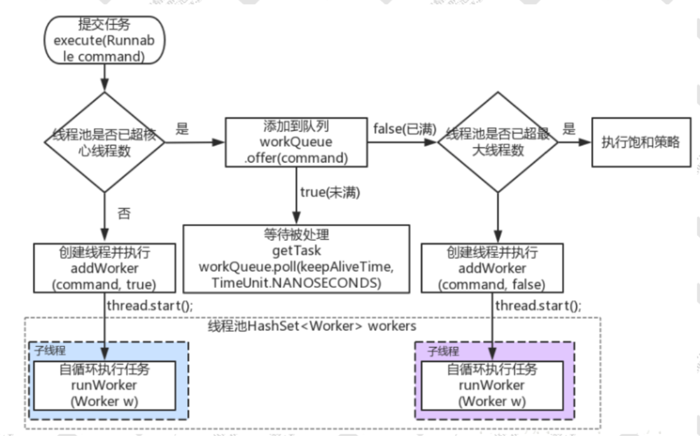
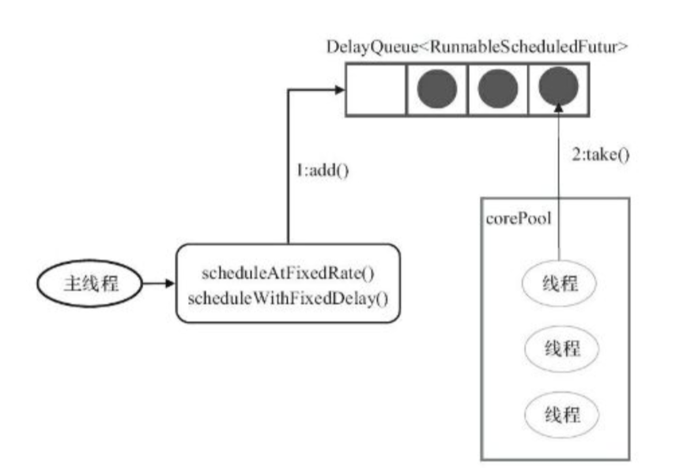
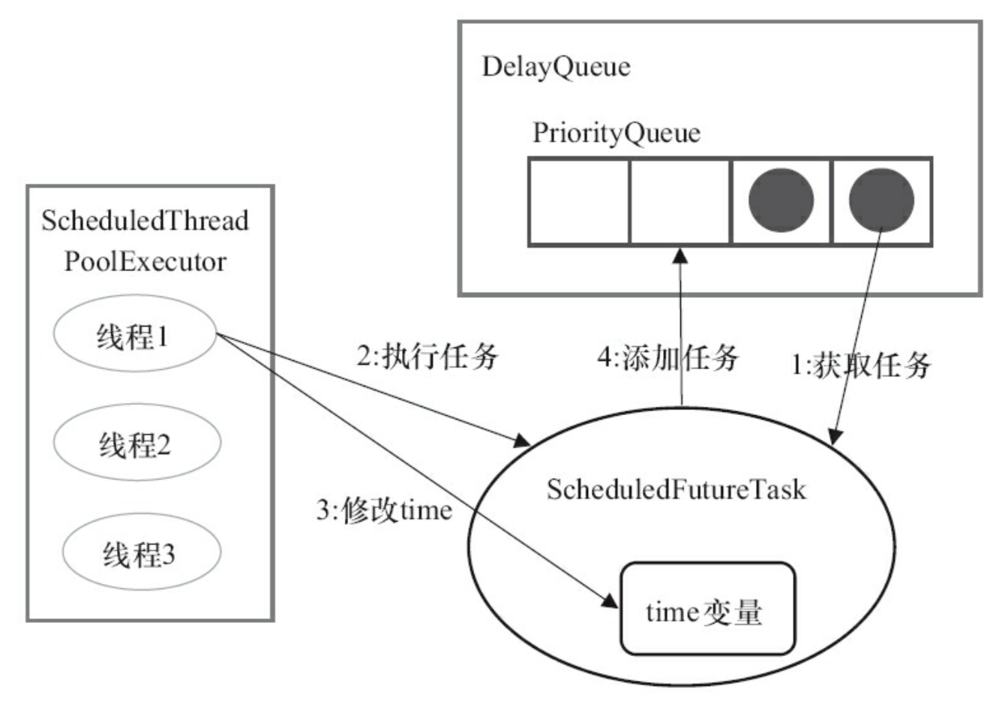

# Executor框架

Java多线程程序通常把应用分解为若干个任务，然后使用用户级的调度器（Executor框架）将这些任务映射为固定数量的线程。

Executor框架主要由3大部分组成如下:

任务： `Runnable`或`Callable`接口及其实现类

任务执行器： 主要是`Executor`及扩展Executor的`ExecutorService`接口的一些实现类。Executor框架有两个重要的实现类，一个是线程池执器`ThreadPoolExecutor`、另一个是定时任务执行器`ScheduledThreadPoolExecutor` .

任务的结果: `Future`接口及其默认实现`FutureTask`

## Runnable和Callable

1. Runnable执行方法是run(),Callable是call()
2. 实现Runnable接口的任务线程无返回值；实现Callable接口的任务线程能返回执行结果，调用FutureTask.get()方法实现
3. call方法可以抛出异常，run方法若有异常只能在内部消化
4. Runnable可以作为Thread构造器的参数，通过开启新的线程来执行，也可以通过线程池来执行。而Callable只能通过线程池执行。

# Java中提供的线程池

ThreadPoolExecutor 默认线程池 

ScheduledThreadPoolExecutor 定时线程池

## ThreadpoolExecutor

```java
public ThreadPoolExecutor(int corePoolSize, //核心线程数量
int maximumPoolSize, //最大线程数
long keepAliveTime, //超时时间,超出核心线程数量以外的线程空余存活时间
TimeUnit unit, //存活时间单位
BlockingQueue<Runnable> workQueue,//保存执行任务的队列
ThreadFactory threadFactory,//创建新线程使用的工厂                        
RejectedExecutionHandler handler //当任务无法执行的时候的处理方式
```

## newFixedThreadPool

```java
public static ExecutorService newFixedThreadPool(int nThreads){ 
  return new ThreadPoolExecutor(nThreads, nThreads,
                          0L, TimeUnit.MILLISECONDS,
                         new LinkedBlockingQueue<Runnable>());
}
```

核心线程数和最大线程数都是指定值，当线程数超过核心线程数后，任务都会被放到阻塞队列中。另外 keepAliveTime 为 0，也就是超出核心线程数量以外的线程空余存活时间。阻塞队列是 LinkedBlockingQueue，使用的是默认容量 Integer.MAX_VALUE， 相当于没有上限。

## newCachedThreadPool

```java
public static ExecutorService newCachedThreadPool() { 
  return new ThreadPoolExecutor(0, Integer.MAX_VALUE,
    60L, TimeUnit.SECONDS,new SynchronousQueue<Runnable>());
}
```

创建一个可缓存线程池，如果线程池长度超过处理需要，可灵活回收空闲线程，若无可回收，则新建线程。并且没有核心线程，非核心线程数无上限，但是每个空闲的时间只有 60 秒，超过后就会被回收。

## newSingleThreadExecuto 

它只会用唯一的工作线程来执行任务，保证所有任务按照指定顺序(FIFO, LIFO, 优先级)执行

## newScheduledThreadPool

 创建一个可以指定线程的数量的线程池，但是这个线程池还带有延迟和周期性执行任务的功能，类似定时器。

## 执行流程



## 线程池状态

1. RUNNING：能够接收新任务，以及对已添加的任务进行处理。初始化状态是RUNNING。
2. SHUTDOWN：不接收新任务，但能处理已添加的任务。调用线程池的shutdown()接口时，线程池由RUNNING -> SHUTDOWN。
3. STOP：不接收新任务，不处理已添加的任务，并且会中断正在处理的任务。调用线程池的shutdownNow()。
4. TIDYING：当所有的任务已终止，ctl记录的”任务数量”为0，线程池会变为TIDYING 状态。当线程池变为TIDYING状态时，会执行钩子函数terminated()。terminated()在 ThreadPoolExecutor类中是空的，若用户想在线程池变为TIDYING时，进行相应的处理；可以通过重载terminated()函数来实现。由STOP -> TIDYING。
5. TERMINATED：线程池彻底终止，就变成TERMINATED状态。线程池处在TIDYING状态时，执行完terminated()之后，就会由 TIDYING - > TERMINATED。

## 优点

- **降低资源消耗**：通过重复利用已创建的线程降低线程创建和销毁造成的消耗。
- **提高响应速度**：当任务到达时，可以不需要等待线程创建就能立即执行。
- **提高线程的可管理性**：线程是稀缺资源，如果无限制的创建，不仅会消耗系统资源，还会降低系统的稳定性，使用线程池可以进行统一的分配，监控和调优。

# 原理分析

## execute()

```java
public void execute(Runnable command) { 
  if (command == null)
    throw new NullPointerException(); 
  int c = ctl.get();
  //1.当前池中线程比核心数少，新建一个线程执行任务
  if (workerCountOf(c) < corePoolSize) {
    if (addWorker(command, true)) 
      return;
    c = ctl.get(); 
  }
  //2.核心池已满，但任务队列未满，添加到队列中
  if (isRunning(c) && workQueue.offer(command)) {
    //任务成功添加到队列以后，再次检查是否需要添加新的线程，因为已存在的线   
    //程可能被销毁了 
    int recheck = ctl.get();
    if (! isRunning(recheck) && remove(command))
      //如果线程池处于非运行状态，并且把当前的任务从任务队列中移除成功，
      //则拒绝该任务
      reject(command);
    else if (workerCountOf(recheck) == 0)
      //如果之前的线程已被销毁完，新建一个线程
      addWorker(null, false);
  }
  //3.核心池已满，队列已满，试着创建一个新线程
  else if (!addWorker(command, false)) 
    //如果创建新线程失败了，说明线程池被关闭或者线程池完全满了，拒绝任务
    reject(command); 
}
```

## ctl

ctl 是对线程池的运行状态和线程池中有效线程的数量进行控制的一个字段， 它包含两部分的信息：线程池的运行状态 (runState) 和线程池内有效线程的数量 (workerCount)，这里可以看到，使用了Integer类型来保存，高3位保存runState，低29位保存 workerCount。

```java
private final AtomicInteger ctl = new AtomicInteger(ctlOf(RUNNING,0));
private static final int COUNT_BITS = Integer.SIZE - 3;
private static final int CAPACITY   = (1 << COUNT_BITS) - 1;
//runStateOf:获取运行状态;
private static int runStateOf(int c){ return c & ~CAPACITY; }
//workerCountOf:获取活动线程数;
private static int workerCountOf(int c){ return c & CAPACITY; }
//ctlOf:获取运行状态和活动线程数的值。
private static int ctlOf(int rs, int wc) { return rs | wc; } 
```

## addWorker()

addWorker方法的主要工作是在线程池中创建一个新的线程并执行，用循环 CAS 操作来将线程数加 1。

firstTask参数用于指定新增的线程执行的第一个任务，core参数为true表示判断corePoolSize，false表示判断maximumPoolSize。

```java
private boolean addWorker(Runnable firstTask, boolean core) { 
  retry: //goto语句,避免死循环
  for (;;) {
    int c = ctl.get();
    int rs = runStateOf(c);
    if (rs >= SHUTDOWN && ! (rs == SHUTDOWN && firstTask == 
                             null &&! workQueue.isEmpty())) 
      return false;  
    for (;;) { //自旋
      int wc = workerCountOf(c);//获得Worker工作线程数
      //如果工作线程数大于默认容量大小或者大于核心线程数大小，则直接返回 
      //false 表示不能再添加 worker。
      if (wc >= CAPACITY ||
          wc >= (core ? corePoolSize : maximumPoolSize)) 
        return false;
      //通过cas来增加工作线程数， 如果 cas 失败，则直接重试
      if (compareAndIncrementWorkerCount(c))
        break retry;
      c = ctl.get(); // Re-read ctl //再次获取ctl的值
      if (runStateOf(c) != rs) //如果不相等，说明线程的状态发生变化
        continue retry;
    } 
  }
  //上面对worker数量做原子+1操作,下面才是正式构建一个worker
  boolean workerStarted = false; //工作线程是否启动的标识
  boolean workerAdded = false; //工作线程是否已经添加成功的标识 
  Worker w = null;
  try {
    w = new Worker(firstTask); //构建一个Worker
    final Thread t = w.thread; //从 worker 对象中取出线程
    if (t != null) {
      final ReentrantLock mainLock = this.mainLock;
      mainLock.lock(); //这里有个重入锁，避免并发问题 
      try {
        int rs = runStateOf(ctl.get()); 
        //只有当前线程池是正在运行状态，[或是 SHUTDOWN 且 firstTask 
        //为空]，才能添加到 workers 集合中
        if (rs <SHUTDOWN ||(rs==SHUTDOWN && firstTas== null)) {
          //刚封装的线程就是 alive，抛异常
          if (t.isAlive()) 
            throw new IllegalThreadStateException            
            //将新创建的Worker添加到workers集合中           
            workers.add(w); 
          int s = workers.size();   
          if (s > largestPoolSize)    
            largestPoolSize = s; //更新线程池出现过的最大线程数 
          workerAdded = true;//表示工作线程创建成功了
        }
      } finally {
        mainLock.unlock(); //释放锁
      }
      if (workerAdded) {
        t.start();//如果worker添加成功，启动线程
        workerStarted = true; 
      }
    }
} finally {
    if (! workerStarted)
      //如果添加失败，递减实际工作线程数，从workers集合中移除该worker
      addWorkerFailed(w); 
  }
  return workerStarted;//返回结果 
}

```

## Worker()类说明

addWorker 方法只是构造了一个 Worker，并且把 firstTask 封装到 worker 中。每个worker,都是一个线程，同时里面包含了一个firstTask，即初始化时要被首先执行的任务。最终执行任务的是 runWorker()方法。

```java
private final class Worker extends AbstractQueuedSynchronizer   
  implements Runnable{
  private static final long serialVersionUID =
    6138294804551838833L;
  //真正执行task的线程，由 ThreadFactury 创建
  final Thread thread; 
  Runnable firstTask; //这就是需要执行的 task 
  volatile long completedTasks; //完成的任务数，用于线程池统计
  Worker(Runnable firstTask) {
    setState(-1); //初始状态 -1,防止在调用 runWorker()前中断 
    this.firstTask = firstTask;
    this.thread = getThreadFactory().newThread(this);
  }
  public void run() { 
    runWorker(this);//执行task任务
  }
}
```

## runWorker()

线程池中执行任务的真正处理逻辑，主要做下面几件事。

如果 task 不为空,则开始执行 task。如果 task 为空，则通过 getTask()再去取任务，如果不为空,则执行该任务。执行完毕后,通过 while 循环继续 getTask()取任务。如果 getTask()取到的任务依然是空。那么整个runWorker()方法执行完毕。runWorker 方法执行完之后，也就是 Worker 中的 run 方法执行完，由 JVM 自动回收。

```java
final void runWorker(Worker w) { 
  Thread wt = Thread.currentThread(); 
  Runnable task = w.firstTask; 
  w.firstTask = null;
  w.unlock(); // 允许中断
  boolean completedAbruptly = true;
  try {
    //实现了线程复用，如果 task 为空，则通过 getTask 来获取任务
    while (task != null || (task = getTask()) != null) {
      w.lock(); 
      //上锁，为了在shutdown()时不终止正在运行的 worker
      //对于 stop 状态以上是要中断线程的
      if ((runStateAtLeast(ctl.get(), STOP) ||
           (Thread.interrupted() && runStateAtLeast(ctl.get(), 
                                STOP))) && !wt.isInterrupted())
        wt.interrupt(); 
      try {
        beforeExecute(wt, task);//默认没有实现，可以重写
        Throwable thrown = null; try {
          task.run(); //执行任务中的run方法 
        } catch (RuntimeException x) {
          thrown = x; throw x; 
        } catch (Error x) {
          thrown = x; 
          throw x; 
        } catch (Throwable x) {
          thrown = x; throw new Error(x); 
        } finally {          
          afterExecute(task, thrown); //默认而也是没有实现 
        }
      } finally {
        //置空任务(这样下次循环开始时,task 依然为 null,需要再通过 
        //getTask()取) + 记录该 Worker 完成任务数量 + 解锁 
          task = null;
        w.completedTasks++;        
        w.unlock();        
      }
    }
    completedAbruptly = false; 
  } finally {
    //1.将入参 worker 从数组 workers 里删除掉;
    //2.根据allowCoreThreadTimeOut来决定是否补充新的Worker
    processWorkerExit(w, completedAbruptly);       
  }
}
```

## getTask()

worker 线程会从阻塞队列中获取需要执行的任务。在线程从工作队列 poll 任务时，加上了超时限制，如果线程在 keepAliveTime 的时间内 poll 不到任务，销毁线程。

```java
private Runnable getTask() {
  boolean timedOut = false; // Did the last poll() time out?
  for (;;) {//自旋
    int c = ctl.get();
    int rs = runStateOf(c);
    if (rs >= SHUTDOWN && (rs >= STOP || workQueue.isEmpty())){               
      decrementWorkerCount();
      return null;//返回 null，则当前 worker 线程会退出 
    }
    int wc = workerCountOf(c);
    // timed变量用于判断是否需要进行超时控制。
    //超过核心线程数量的线程，需要进行超时控制
    boolean timed = allowCoreThreadTimeOut ||wc > corePoolSize; 
    //timed && timedOut 如果为 true，表示当前操作需要进行超时控制，
    //并且上次从阻塞队列中 获取任务发生了超时
    if ((wc > maximumPoolSize || (timed && timedOut)) && (wc > 
                                    1 ||workQueue.isEmpty())) {
      if (compareAndDecrementWorkerCount(c))
        return null; 
      continue;

    } try {
      //根据 timed 来判断，如果为 true，则通过阻塞队列 poll 方法进行超
      //时控制，如果在 keepaliveTime 时间内没有获取到任务，则返回 
      //null.否则通过 take 方法阻塞式获取队列中的任务
      Runnable r = timed ?
        workQueue.poll(keepAliveTime, TimeUnit.NANOSECONDS) : 
      workQueue.take();
      if (r != null)//如果拿到的任务不为空，则直接返回给worker进行处理
        return r;
      //如果 r==null，说明已经超时了，设置 timedOut=true，在下次自旋
      //的时候进行回收
      timedOut = true;
    } catch (InterruptedException retry) {
      // 如果获取任务时当前线程发生了中断，则设置 timedOut 为false 并
      //返回循环重试 
      timedOut = false; 
    }
  } 
}
```

# 线程池使用

## 线程池大小

CPU 密集型，主要是执行计算任务，响应时间很快，cpu 一直在运行，那线程池的最大线程数可以配置为 cpu 核心数+1

如果是 IO 密集型，主要是进行 IO 操作，cpu 出于空闲状态， 线程池设定最佳线程数目 = (线程池设定的线程等待时间+线程 CPU 时间)/ 线程 CPU 时间 )* CPU 数目

## 线程初始化

默认情况下，创建线程池之后，线程池中是没有线程的，需要提交任务之后才会创建线程。 在实际中如果需要线程池创建之后立即创建线程，可以通过以下两个方法办到： 

prestartCoreThread()：初始化一个核心线程 

prestartAllCoreThreads()：初始化所有核心线程

## 线程池关闭

ThreadPoolExecutor 提供了两个方法，用于线程池的关闭，分别是 shutdown()和shutdownNow()。shutdown()不会立即终止线程池，而是要等所有任务缓存队列中的任务都执行完后才终止，但再也不会接受新的任务。shutdownNow()立即终止线程池，并尝试打断正在执行的任务，并且清空任务缓存队列，返回尚未执行的任务。

## 线程池容量的动态调整

ThreadPoolExecutor 提供了动态调整线程池容量大小的方法setCorePoolSize()和 setMaximumPoolSize()

## 任务缓存队列

workQueue 的类型为 BlockingQueue，通常可以取下面三种类型:

1. ArrayBlockingQueue:基于数组的先进先出队列，此队列创建时必须指定大小;
2. LinkedBlockingQueue:基于链表的先进先出队列，如果创建时没有指定此队列大小，则默认为 Integer.MAX_VALUE;
3. SynchronousQueue:这个队列比较特殊，它不会保存提交的任务，而是将直接新建一个线程来执行新来的任务。

## 线程池监控

线程池提供了相应的扩展方法，通过重写线程池的 beforeExecute、afterExecute 和 shutdown 等方式就可以实现对线程的监控.

```java
public long getTaskCount() //线程池已执行与未执行的任务总数 
public long getCompletedTaskCount() //已完成的任务数 
public int getPoolSize() //线程池当前的线程数
public int getActiveCount() //线程池中正在执行任务的线程数量
```

# submit执行

线程池的执行任务有两种方法，一种是 submit、一种是 execute。区别：

1. execute 只可以接收一个 Runnable 的参数 。submit 可以接收 Runable 和 Callable 这两种类型的参数
2. execute 如果出现异常会抛出。submit 方法调用不会抛异常，除非调用 Future.get
3. execute 没有返回值。submit 传入一个 Callable，可以得到一个 Future 的返回值

Future 表示一个任务的生命周期，并提供了相应的方法来判断是否已经完成或取消，以及获取任务的结果和取消任务等。

```java
public interface Future<V> {
  //取消当前任务
  boolean cancel(boolean mayInterruptIfRunning);
  // 当前的 Future 是否被取消，返回 true 表示已取消 
  boolean isCancelled();
  // 当前 Future 是否已结束。包括运行完成、抛出异常以及取消，都表示当前 
  //Future 已结束 
  boolean isDone();
  // 获取 Future 的结果值。如果当前 Future 还没有结束，那么当前线程就等
  //待，直到 Future 运行结束，那么会唤醒等待结果值的线程的。
  V get() throws InterruptedException, ExecutionException;
  // 获取 Future 的结果值。与 get()相比较多了允许设置超时时间 V 
  get(long timeout, TimeUnit unit)
    throws InterruptedException, ExecutionException,
  TimeoutException;
}
```


# 定时线程池

ScheduledThreadPoolExecutor，它用来处理延时任务或定时任务。



将任务封装成SchduledFutureTask，包含任务开始的时间、任务的序号 任务执行的时间间隔。

有三种提交任务的方式: 

1. schedule。该方法指任务在指定延迟时间到达后触发，只会执行一次
2. scheduledAtFixedRate，执行周期固定，不管任务执行时间
3.  scheduledWithFixedDelay，固定延迟，

## DelayedWorkQueue

ScheduledThreadPoolExecutor自己实现阻塞的工作队列，

DelayedWorkQueue是一个基于堆的数据结构，类似于DelayQueue和 PriorityQueue，无界队列。 DelayedWorkQueue的工作就是按照执行时间的升序来排列，执行时间距离当前时间越近的任务在队列的前面。保证每次出队的任务都是当前队列中执行时间最靠前的。由于它是基于堆结构的队列，堆结构在执行插入和删除操作时的最坏时间复杂度是logN。

## 执行流程



1. 线程从DeayQueue中获取已到期的SchduledFutureTask。

2. 执行SchduledFutureTask
3. 修改SchduledFutureTask的time变量为下次将要执行的时间
4. 将修改后的SchduledFutureTask放回DeayQueue。