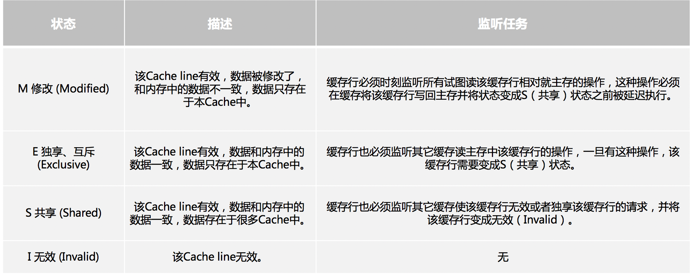
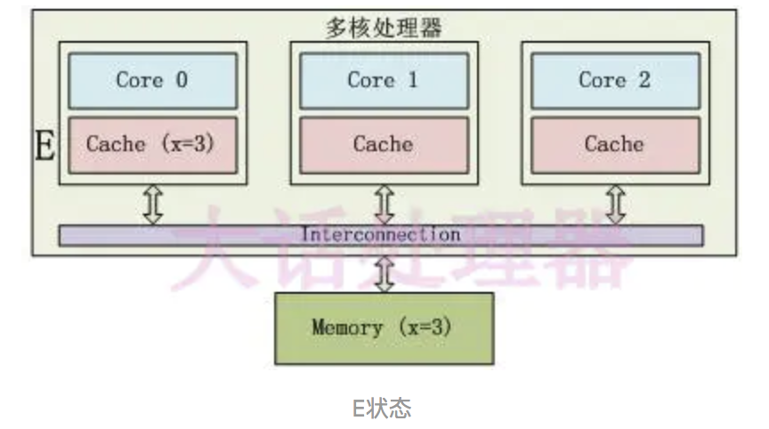
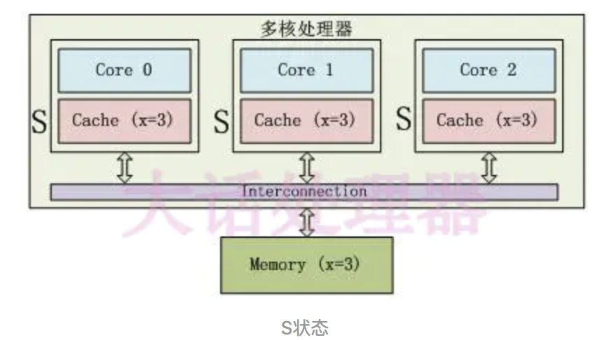
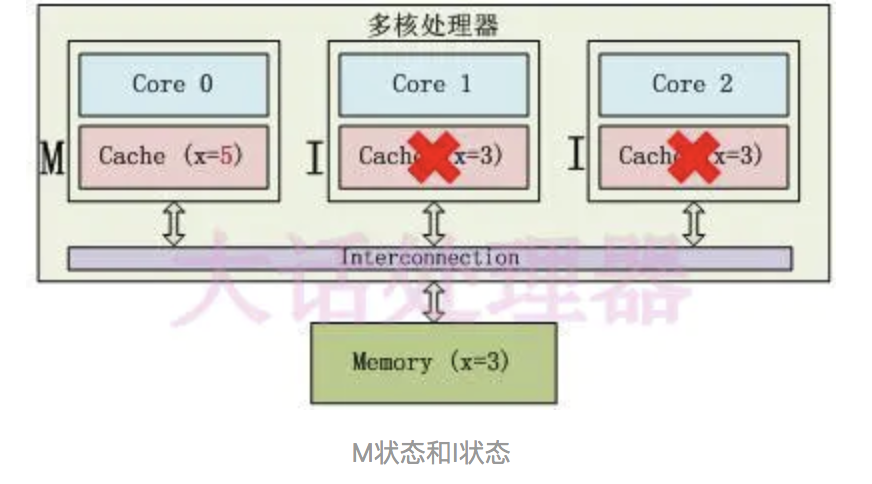
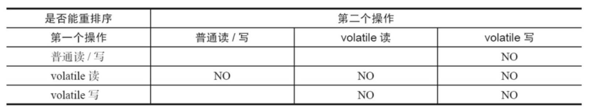
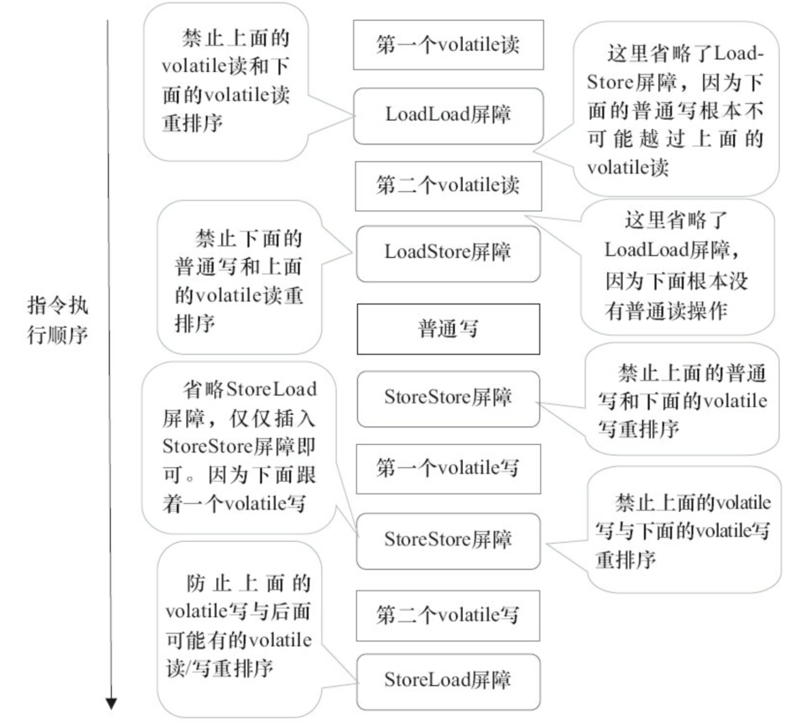

# volatile的特性

volatile是Java虚拟机提供的轻量级的同步机制。volatile关键字有如下作用 

* 可见性。保证被volatile修饰的共享变量对所有线程总数可见
* 有序性。禁止指令重排序优化
* 不能保证原子性。对单个volatile变量的读写具有原子性。对i++这种复合操作不具有原子性

# volatile的可见性

**JMM内存交互层面**：volatile修饰的变量的read、load、use操作和assign、store、write必须是连续的，即修改后必须立即同步回主内存，使用时必须从主内存刷新，由此保证volatile变量的可见性。

**底层实现**：通过汇编的**lock**前缀指令，它会锁定变量缓存行区域并写回主内存，这个操作称为“缓存锁定”，缓存一致性机制会阻止同时修改被两个以上处理器缓存的内存区域数据。一个处理器的缓存回写到内存内存会导致其他处理器的缓存无效。

## 缓存一致性

解决缓存不一致的问题，在 CPU 层面做了很多事情， 主要提供了两种解决办法：**总线锁和缓存锁**

* 总线锁。在多CPU下，当其中一个处理器要对共享内存进行操作的时候，在总线上发出一个 LOCK# 信号，这个信号使得其他处理器无法通过总线来访问到共 享内存中的数据，总线锁定把 CPU 和内存之间的通信锁住了，这使得锁定期间，其他处理器不能操作其他内存地址的数据。所以总线锁定的开销比较大。
* 缓存锁。就是控制锁的保护粒度，保证对于被多个 CPU 缓存的同一份数据是一致的就行，它核心机制是基于缓存一致性协议来实现的。

### 缓存一致性协议

最常见的就是 MESI 协议。



只有Core 0访问变量x，它的Cache line状态为E(Exclusive)。



3个Core都访问变量x，它们对应的Cache line为S(Shared)状态。



Core 0修改了x的值之后，这个Cache line变成了M(Modified)状态，其他Core对应的Cache line变成了I(Invalid)状态。



在MESI协议中，每个Cache的Cache控制器不仅知道自己的读写操作，而且也监听(snoop)其它Cache的读写操作。每个Cache line所处的状态根据本核和其它核的读写操作在4个状态间进行迁移。

# volatile的有序性

java语言规范规定JVM线程内部维持顺序化语义。即只要程序的最终结果与它顺序化情况的结果相等，那么指令的执行顺序可以与代码顺序不一致，此过程叫指令的重排序。重排序分为编译器重排序和处理器重排序。

为了实现volatile内存语义，JMM会分别限制这两种类型的重排序类型。

## 禁止编译器重排序

下图是JMM针对编译器制定的volatile重排序规则表。



当第二个操作是volatile写时，不管第一个操作是什么，都不能重排序。这个规则确保 volatile写之前的操作不会被编译器重排序到volatile写之后。当第一个操作是volatile读时，不管第二个操作是什么，都不能重排序。这个规则确保 volatile读之后的操作不会被编译器重排序到volatile读之前。当第一个操作是volatile写，第二个操作是volatile读时，不能重排序。

## 禁止处理器重排序

编译器在生成字节码时，会在指令序列中插入内存屏障来禁止特定类型的处理器重排序。

下面是基于保守策略的JMM内存屏障插入策略。

在每个volatile写操作的前面插入一个StoreStore屏障。在每个volatile写操作的后面插入一个StoreLoad屏障。在每个volatile读操作的后面插入一个LoadLoad屏障。在每个volatile读操作的后面插入一个LoadStore屏障。

|      屏障类型      |         指令示例         |                             说明                             |
| :----------------: | :----------------------: | :----------------------------------------------------------: |
|  LoadLoadBarriers  |   Load1;LoadLoad;Load2   | 该屏障确保Load1数据的装载先于Load2及其后所有装载指令的的操作 |
| StoreStoreBarriers | Store1;StoreStore;Store2 | 该屏障确保Store1立刻刷新数据到内存(使其对其他处理器可见)的操作先于Store2及其后所有存储指令的操作 |
| LoadStoreBarriers  |  Load1;LoadStore;Store2  | 确保Load1的数据装载先于Store2及其后所有的存储指令刷新数据到内存的操作 |
| StoreLoadBarriers  |  Store1;StoreLoad;Load1  | 该屏障确保Store1立刻刷新数据到内存的操作先于Load2及其后所有装载装载指令的操作.它会使该屏障之前的所有内存访问指令(存储指令和访问指令)完成之后,才执行该屏障之后的内存访问指令 |

下面通过具体的示例代码进行说明

```java
class VolatileBarrierExample  {          
  int a;   
  volatile int v1 = 1;
  volatile int v2  =  2;
  void readAndWrite()  {
    int i = v1;  // 第一个volatile读
    int j = v2; // 第二个volatile读
    a = i + j;  // 普通写
    v1  =  i  +  1; // 第一个volatile写
    v2  =  j  *  2; // 第二个 volatile
  }
}
```



# volatile不能保证原子性

```java
 public class VolatileVisibility  {                                
   public static volatile int i = 0;
   public static void increase(){
     i++;
   }
 }
```

在并发场景下，i变量的任何改变都会立马反应到其他线程中，但是如此存在多条线程同时 调用increase()方法的话，就会出现线程安全问题，毕竟i++操作并不具备原子性，该操作是先读取值，然后写回一个新值，相当于原来的值加上1，分两步完成，如果第二个线程在第一 个线程读取旧值和写回新值期间读取i的域值，那么第二个线程就会与第一个线程一起看到同一个值，并执行相同值的加1操作，这也就造成了线程安全失败。

# 总线风暴

由于Volatile的MESI缓存一致性协议，需要不断的从主内存嗅探和cas不断循环，无效交互会导致总线带宽达到峰值。