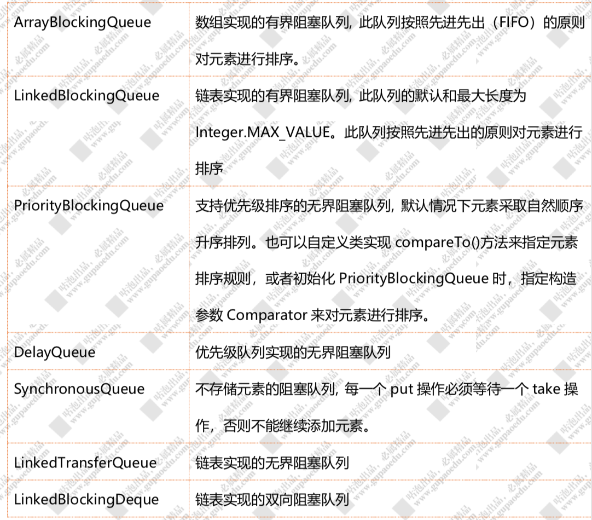

# 阻塞队列



## ArrayBlockingQueue

### add

add 方法可以看到，add 方法最终还是调用 offer 方法来添加数据。

判断添加的数据是否为空，添加重入锁，判断队列长度，如果队列长度等于数组长度，表示满了 直接返回 false，否则，直接调用 enqueue 将元素添加到队列中

enqueue，这个是最核心的逻辑，方法内部通过 putIndex 索引直接将 元素添加到数组 items。putIndex 为等于数组长度的时候重新设置为 0。因为 ArrayBlockingQueue 是一个 FIFO 的队列，队列添加元素时，是从队尾获取 putIndex 来存储元素，当 putIndex 等于数组长度时，下次就需要从数组头部开始添加了

# put 

put 方法和 add 方法功能一样，差异是 put 方法如果队列满了，会阻塞

# take 

take 方法是一种阻塞获取队列中元素的方法 它的实现原理很简单，有就删除没有就阻塞，注意这个阻 塞是可以中断的，如果队列没有数据那么就加入 notEmpty 条件队列等待(有数据就直接取走，方法结束)，如果有新的 put 线程添加了数据，那么 put 操作将会唤醒 take 线程。

# 原子操作类

1. 原子更新基本类型

AtomicBoolean、AtomicInteger、AtomicLong 

2. 原子更新数组

AtomicIntegerArray 、 AtomicLongArray 、AtomicReferenceArray

3. 原子更新引用

AtomicReference 、 AtomicReferenceFieldUpdater 、 AtomicMarkableReference(更新带有标记位的引用类型)

4. 原子更新字段 

AtomicIntegerFieldUpdater、AtomicLongFieldUpdater、 AtomicStampedReference

## AtomicInteger 原理分析

```java
public final int getAndIncrement() {
  return unsafe.getAndAddInt(this,valueOffset, 1); 
}

public final boolean compareAndSet(int expect, int update) {
  return unsafe.compareAndSwapInt(this, valueOffset, expect, update);
}
```

valueOffset。通过 unsafe.objectFieldOffset() 获取当前 Value 这个变量在内存中的偏移量，后续会基于 这个偏移量从内存中得到 value 的值来和当前的值做比较， 实现乐观锁。

getAndAddInt。通过 do/while 循环，基于 CAS 乐观锁来做原子递增。实 际上前面的 valueOffset 的作用就是从主内存中获得当前 value 的值和预期值做一个比较，如果相等，对 value 做递增并结束循环

## Java8优化

大量的线程同时并发修改一个AtomicInteger，可能有**很多线程会不停的自旋**，进入一个无限重复的循环中。

Java 8推出了一个新的类，**LongAdder**，他就是尝试使用分段CAS以及自动分段迁移的方式来大幅度提升多线程高并发执行CAS操作的性能！

在LongAdder的底层实现中，首先有一个base值，刚开始多线程来不停的累加数值，都是对base进行累加的，比如刚开始累加成了base = 5。

接着如果发现并发更新的线程数量过多，就会开始施行**分段CAS的机制**，也就是内部会搞一个Cell数组，每个数组是一个数值分段。

这时，让大量的线程分别去对不同Cell内部的value值进行CAS累加操作，这样就把CAS计算压力分散到了不同的Cell分段数值中了！

而且他内部实现了**自动分段迁移的机制**，也就是如果某个Cell的value执行CAS失败了，那么就会自动去找另外一个Cell分段内的value值进行CAS操作。

最后，如果你要从LongAdder中获取当前累加的总值，就会把base值和所有Cell分段数值加起来返回给你。