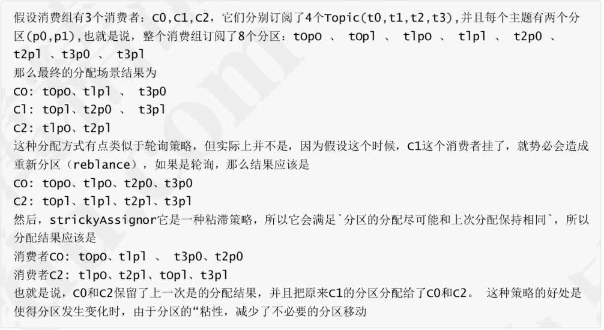

# 架构

一个典型的 kafka 集群包含若干 Producer，若干个 Broker(kafka 支持水平扩展)、若干个 Consumer Group，以及一个 zookeeper 集群。kafka 通过 zookeeper 管理集群配置及服务协同。broker，producer 和 consumer三者通过 zookeeper 管理协调请求和转发。producer 发送消息到 broker 的过程是 push，而 consumer 从 broker 消费消息的过程是 pull，主动去拉数据。而不是 broker 把数据主动发送给 consumer。

服务端(brokers)和客户端(producer、consumer)通信通过TCP协议完成。

# 基本概念

| Broker        | 消息中间件处理节点，一个Kafka节点就是 一个broker，一个或者多个Broker可以组 成一个Kafka集群 |
| :------------ | ------------------------------------------------------------ |
| Topic         | Kafka根据topic对消息进行归类，发布到 Kafka集群的每条消息都需要指定一个topic |
| Producer      | 消息生产者，向Broker发送消息的客户端                         |
| Consumer      | 消息消费者，从Broker读取消息的客户端                         |
| ComsumerGroup | 每个Consumer属于一个特定的Consumer Group，一条消息可以被多个不同的 Consumer Group消费，但是一个 Consumer Group中只能有一个Consumer 能够消费该消息 |
| Partition     | 物理上的概念，一个topic可以分为多个 partition，每个partition内部消息是有序的 |

针对每个partition，都有一个broker起到“leader”的作用，0个或多个其他的broker作为“follwers”的作用。 leader处理所有的针对这个partition的读写请求，而followers被动复制leader的结果。如果这个leader失效了，其中的一个follower将会自动的变成新的leader。

一个partition同一个时刻在一个consumer group中只有一个consumer instance在消费，从而保证顺序。 consumer group中的consumer instance的数量不能比一个Topic中的partition的数量多，否则，多出来的 consumer消费不到消息。

Kafka只在partition的范围内保证消息消费的局部顺序性，不能在同一个topic中的多个partition中保证总的消费顺序性。如果有在总体上保证消费顺序的需求，那么我们可以通过将topic的partition数量设置为1，将consumer group中的 consumer instance数量也设置为1。

# Producer

kafka对于消息的发送，可以支持同步和异步。

producer 先从 zookeeper 的 "/brokers/.../state" 节点找到该 partition 的 leader。

从本质上来说，kafka都是采用异步的方式来发送消息到broker，但是kafka并不是每次发送消息都会直接发送到broker上，而是把消息放到了一个发送队列中，然后通过一个后台线程不断从队列取出消息进行发送，发送成功后会触发callback。kafka客户端会积累一定量的消息统一组装成一个批量消息发送出 去，触发条件是前面提到的batch.size和linger.ms

而同步发送的方法，无非就是通过future.get()来等待消息的发送返回结果，但是这种方法会严重影响消息发送的性能。

## batch.size

生产者发送多个消息到broker上的同一个分区时，为了减少网络请求带来的性能开销，通过批量的方式 来提交消息，可以通过这个参数来控制批量提交的字节数大小，默认大小是16384byte,也就是16kb， 意味着当一批消息大小达到指定的batch.size的时候会统一发送

## linger.ms

Producer默认会把两次发送时间间隔内收集到的所有Requests进行一次聚合然后再发送，以此提高吞 吐量，而linger.ms就是为每次发送到broker的请求增加一些delay，以此来聚合更多的Message请求。

## 消息路由

默认情况下，kafka采用的是hash取模的分区算法。如果Key为null，则会随机分配一个分区。这个随机是在这个参数”metadata.max.age.ms”的时间范围内随机选择一个。对于这个时间段内，如果key为 null，则只会发送到唯一的分区。这个值默认情况下是10分钟更新一次。

## ACK

1. 生产者把消息发送到leader副本，leader副本在成功写入到本地日志之后就告诉生产者 消息提交成功，但是如果isr集合中的follower副本还没来得及同步leader副本的消息， leader挂了，就会造成消息丢失

2. -1 ，消息不仅仅写入到leader副本，并且被ISR集合中所有副本同步完成之后才告诉生产者已 经提交成功，这个时候即使leader副本挂了也不会造成数据丢失。 
3. 0:表示producer不需要等待broker的消息确认。这个选项时延最小但同时风险最大(因为当server宕机时，数据将会丢失)。

# Comsumer

## kafka中长轮询

像 Kafka 在拉请求中有参数，可以使得消费者请求在 “长轮询” 中阻塞等待。

简单的说就是消费者去 Broker 拉消息，定义了一个超时时间，也就是说消费者去请求消息，如果有的话马上返回消息，如果没有的话消费者等着直到超时，然后再次发起拉消息请求。

并且 Broker 也得配合，如果消费者请求过来，有消息肯定马上返回，没有消息那就建立一个延迟操作，等条件满足了再返回

## enable.auto.commit

消费者消费消息以后自动提交，只有当消息提交以后，该消息才不会被再次接收到，还可以配合 auto.commit.interval.ms控制自动提交的频率。

当然，我们也可以通过consumer.commitSync()的方式实现手动提交 

## auto.offset.reset

这个参数是针对新的groupid中的消费者而言的，当有新groupid的消费者来消费指定的topic时，对于 该参数的配置，会有不同的语义

auto.offset.reset=latest，新的消费者将会从其他消费者最后消费的offset处开始消费Topic下的 消息

auto.offset.reset= earliest，新的消费者会从该topic最早的消息开始消费 

auto.offset.reset=none，新的消费者加入以后，由于之前不存在offset，则会直接抛出异常。

## max.poll.records

此设置限制每次调用poll返回的消息数，这样可以更容易的预测每次poll间隔要处理的最大值。通过调整此值，可以减少poll间隔

## 分区分配策略

在多个partition以及多个consumer的情况下，消费者是如何消费消息的

### 范围分区(Range)

假设n = 分区数/消费者数量

m= 分区数%消费者数量 

那么前m个消费者每个分配n+l个分区，后面的(消费者数量-m)个消费者每个分配n个分区

### 轮询分区(RoundRobin)

轮询分区策略是把所有partition和所有consumer线程都列出来，然后按照hashcode进行排序。最后通过轮询算法分配partition给消费线程。如果所有consumer实例的订阅是相同的，那么partition会均匀分布。

使用轮询分区策略必须满足两个条件：每个主题的消费者实例具有相同数量的流。每个消费者订阅的主题必须是相同的

### 粘滞策略(StrickyAssignor)

主要有两个目的：分区的分配尽可能的均匀。分区的分配尽可能和上次分配保持相同。当两者发生冲突时， 第 一 个目标优先于第二个目标。

## 消费位置0ffset

每个topic可以划分多个分区(每个Topic至少有一个分 区)，同一topic下的不同分区包含的消息是不同的。每个消息在被添加到分区时，都会被分配一个 offset(称之为偏移量)，它是消息在此分区中的唯一编号，kafka通过offset保证消息在分区内的顺序，offset的顺序不跨分区，即kafka只保证在同一个分区内的消息是有序的; 对于应用层的消费来说，每次消费一个消息并且提交以后，会保存当前消费到的最近的一个offset

在kafka中，提供了一个`consumer_offsets_`的一个topic，把offset信息写入到这个topic中。

`consumer_offsets_`保存了每个consumer group某一时刻提交的offset信息。 consumer_offsets 默认有50个分区，副本数量只有1。当前的consumer_group的位移信息保存分区通过如下公式进行计算：

Math.abs(“groupid”.hashCode())%groupMetadataTopicPartitionCount

具体内容如下

[consumer_offsets_group/*消费组ID*/,consumer_offsets_test/*topic*/,1/*partition*/]::OffsetAndMetadata(offset=4/*提交的消费位移信息*/, leaderEpoch=Optional.empty, metadata=, commitTimestamp=1543567461031, expireTimestamp=None)

# 消息的存储

kafka是使用日志文件的方式来保存生产者和发送者的消息，每条消息都有一 个offset值来表示它在分区中的偏移量。日志并不是直接对应在一个磁盘上的日志文件，而是对应磁盘上的一个目录，这个目录的命名规则是<topic_name>_<partition_id>。

对于一个 topic，在集群中创建多个 partition，partition 分布规则如下：

1. 将所有 N Broker 和待分配的 i 个 Partition 排序

2. 将第 i 个 Partition 分配到第(i mod n)个 Broker 上
3. 将第 i 个 Partition 的第 j 个副本分配到第((i + j) mod n)个 Broker 上

## 文件存储机制

 kafka 以 segment 为 单位又把 partition 进行细分。每个 partition 相当于一个巨型文件被平均分配到多个大小相等的 segment 数据文件中

segment file由2大部分组成，分别为.index和.log，分别表示为索引文件和日志文件。index中存储了索引以及物理偏移量。 log存储了消息的内容。

一个日志文件对应两个索引文件：OffsetIndex 和 TimeIndex。TimeIndex索引文件格式：它是映射时间戳和相对offset。

segment文件命名：partion全局的第一个segment从0开始，后续每个segment文件名为上一个 segment文件最后一条消息的offset值进行递增。

## 查找过程

1. 根据offset的值，查找segment段中的index索引文件。由于索引文件命名是以上一个文件的最后 一个offset进行命名的，所以，使用二分查找算法能够根据offset快速定位到指定的索引文件。
2. 找到索引文件后，根据offset进行定位，找到索引文件中的符合范围的索引。(kafka采用稀疏索引的方式来提高查找性能)
3. 得到position以后，再到对应的log文件中，从position出开始查找offset对应的消息，将每条消息的offset与目标offset进行比较，直到找到消息

## 日志清除

日志的清理策略有两个

1. 根据消息的保留时间，当消息在kafka中保存的时间超过了指定的时间，就会触发清理过程
2. 根据topic存储的数据大小，当topic所占的日志文件大小大于一定的阀值，则可以开始删除最旧的消息。

kafka会启动一个后台线程，定期检查是否存在可以删除的消息。通过log.retention.bytes和log.retention.hours这两个参数来设置，当其中任意一个达到要求，都会执行删除。 默认的保留时间是7天

## 日志压缩

服务端会在后台启动启动Cleaner线程池，定期将相同的key进行合并，只保留最新的value值。

# 高性能

## 顺序读写

每个分区下包含若干个只能追加写的提交日志：新消息被追加到文件的最末端。

## 零拷贝

在消费者获取消息时，服务器先从 硬盘读取数据到内存，然后把内存中的数据原封不动的通 过 socket 发送给消费者。

传统的模式，及到 4 次上下文切换以及 4 次数据复制，并且有两次复制操作是由 CPU 完成。但是这个过程中，数据完全没有 进行变化，仅仅是从磁盘复制到网卡缓冲区。

零拷贝，在 Linux 中，是通过 sendfile 系统调用来完成的。使用 sendfile，只需要一次拷贝就行，允许操作系统将数据直接从页缓存发送网卡缓存中。

## 页缓存

Kafka中大量使用了页缓存， 消息都是先被写入页缓存， 然后由操作系统负责具体的刷盘任务。Kafka中同样提供了同步刷盘及间断性强制刷盘(fsync), 可以通过 log.flush.interval.messages 和 log.flush.interval.ms 参数来控制。

**MMAP**也就是**内存映射文件**，它的工作原理是直接利用操作系统的 Page 来实现文件到物理内存的直接映射，完成映射之后对物理内存的操作会被同步到硬盘上。通过**MMAP**技术进程可以像读写硬盘一样读写内存（逻辑内存），不必关心内存的大小，因为有虚拟内存兜底。这种方式可以获取很大的I/O提升，省去了用户空间到内核空间复制的开销。

Kafka提供了一个参数：producer.type 来控制是不是主动 flush，如果Kafka写入到MMAP之后就立即flush然后再返回Producer叫同步(sync)；写入MMAP之后立即返回Producer不调用flush叫异步(async)。

## 批量数据处理

Kafka 把所有的消息都存放在一个一个的文件中，当消费者需要数据的时候 Kafka 直接把文件发送给消费者。发送文件还有一个好处就是可以对文件进行批量压缩，减少网络IO损耗。