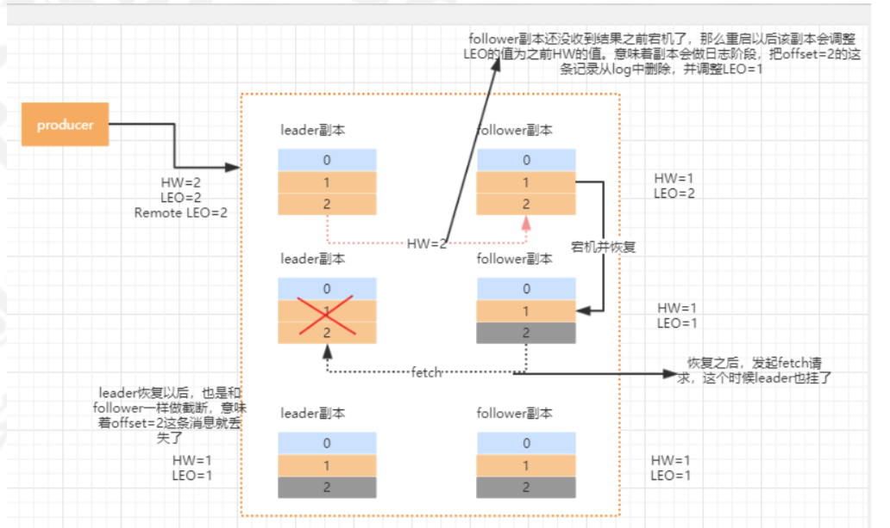

# 控制器Controller

在Kafka集群中会有一个或者多个broker，其中有一个broker会被选举为控制器(Kafka Controller)，它负责管理整个 集群中所有分区和副本的状态。

当某个分区的leader副本出现故障时，由控制器负责为该分区选举新的leader副本。 

当检测到某个分区的ISR集合发生变化时，由控制器负责通知所有broker更新其元数据信息。 

当使用kafka-topics.sh脚本为某个topic增加分区数量时，同样还是由控制器负责分区的重新分配。

## 选举

在kafka集群启动的时候，会自动选举一台broker作为controller来管理整个集群，选举的过程是集群中每个broker都会尝试在zookeeper上创建一个 /controller 临时节点，zookeeper会保证有且仅有一个broker能创建成功，这个broker 就会成为集群的总控器controller。

当这个controller角色的broker宕机了，此时zookeeper临时节点会消失，集群里其他broker会一直监听这个临时节点，发现临时节点消失了，就竞争再次创建临时节点，zookeeper又会保证有一个broker 成为新的controller。

## 功能

1. 监听broker相关的变化。为Zookeeper中的/brokers/ids/节点添加BrokerChangeListener，用来处理broker 增减的变化。
2. 监听topic相关的变化。为Zookeeper中的/brokers/topics节点添加TopicChangeListener，用来处理topic增减 的变化。为Zookeeper中的/admin/delete_topics节点添加TopicDeletionListener，用来处理删除topic的动作。 
3. 从Zookeeper中读取获取当前所有与topic、partition以及broker有关的信息并进行相应的管理。对于所有topic 所对应的Zookeeper中的/brokers/topics/[topic]节点添加PartitionModificationsListener，用来监听topic中的 分区分配变化。

4. 更新集群的元数据信息，同步到其他普通的broker节点中。

# Partition副本

消息的读写操作都只会由leader节点来接收和处理。follower副本只负责同步数据以及当 leader副本所在的broker挂了以后，会从follower副本中选取新的leader。

LEO：即日志末端位移(log end offset)，记录了该副本底层日志(log)中下一条消息的位移值。

HW：取一个partition对应的ISR中最小的LEO作为HW， leader会等待该消息被所有ISR中的replicas同步后更新HW， 此时消息才能被consumer消费。对于同一个副本，HW值不会大于LEO值。小于等于HW值的所有消息都被认为是“已备份”的(replicated)。

ISR副本:包含了leader副本和所有与leader副本保持同步的follower副本

## 副本协同

kafka通过ISR集合来维护一个分区副本信息。ISR集合中的副本必须满足两个条件：

1. 副本所在节点必须维持着与zookeeper的连接
2. replica.lag.time.max.ms:该follower在此时间间隔内需要追上leader的offset，则该follower就会被剔除isr列表。kafk副本管理器会启动一个副本过期检查的定时任务

## 副本同步

**初始状态下**，leader和follower的HW和LEO都是0，leader副本会保存remote LEO，表示所有follower LEO，也会被初始化为0。follower会不断地个leader发送FETCH 请求，这个请求会被leader寄存，当在指定的时间之后会强制完成请求，或有消息发送会唤醒 fetch请求。

**leader收到请求**，把消息追加到log文件，同时更新leader副本的LEO。
leader会比较自己的LEO以及remote LEO的最小值，与HW的值相比进行更新。

**follower 发送fetch请求**，leader读取log数据、把消息内容和当前分区的HW值发送给follower副本。

**follower收到response**，将消息写入到本地log，同时更新follower的LEO。HW为本地的LEO和leader返回的HW进行比较取小的值。

**follower发第二次fetch请求**，leader读取log数据，根据follower的offset更新remote LEO。更新当前分区的HW。把数据和当前分区的HW值返回给follower副本，这个时候如果没有数据，则返回为空。

**follower收到response**，如果有数据则写本地日志，并且更新LEO，更新follower的HW值。

### 数据丢失

min.insync.replicas=1，即ISR中的最小副本数是1。一旦消息被写入leader端log即被认为是“已提交”，而延迟一轮FETCH RPC更新HW值的设计使 得follower HW值是异步延迟更新的，倘若在这个过程中leader发生变更，那么成为新leader的 follower的HW值就有可能是过期的，使得clients端认为是成功提交的消息被删除。

在kafka0.11.0.0版本之后，引入了一个leader epoch来解决这个问题，所谓的leader epoch实际上是 一对值(epoch，offset)。当leader发生过变更，epoch 就+1，而offset则是对应这个epoch版本的leader写入第一条消息的offset。这个信息会持久化在对应的分区的leader-epoch-checkpoint文件中。

## 副本选举

KafkaController会监听ZooKeeper的/brokers/ids节点路径，一旦发现有broker挂了，执行下面的逻辑

leader副本在该broker上的分区就要重新进行leader选举，目前的选举策略是

1. 优先从isr列表中选出第一个作为leader副本，
2. 如果isr列表为空，则查看该topic的unclean.leader.election.enable配置。为true则代表允许选用非isr列表的副本作为leader。false的话，则表示不允许，直接抛出NoReplicaOnlineException异常，造成leader副本选举失败。
3. 一旦选举成功，则将选举后的leader和isr和其他副本信息写入到该分区的对应的zk路径上。

# 消费端Rebalance

Kafka提供了一个角色coordinator来执行对于consumer group的管理。
 如下情况可能会触发消费者rebalance

1. 同一个consumer group内消费者数量发生变化
2. 动态给topic增加了分区
3. 消费组订阅了更多的topic

## 选择组协调器

每个consumer group都会选择一个broker作为自己的组协调器coordinator，负责监控 这个消费组里的所有消费者的心跳，以及判断是否宕机，然后开启消费者rebalance

consumer消费的offset要提交到__consumer_offsets的哪个分区，这个分区leader对应的broker 就是这个consumer group的coordinator。

GroupCoordinator会在zookeeper上添加watcher，当消费者加入或者退出consumer group时，会修改zookeeper上保存的数据，触发Rebalance操作

## JOIN GROUP

所有的成员都会向coordinator发送joinGroup的请 求。一旦所有成员都发送了joinGroup请求，那么coordinator会选择一个consumer担任leader角色， 并把组成员信息和订阅信息发送消费者

leader选举算法比较简单，如果消费组内没有leader，那么第一个加入消费组的消费者就是消费者 leader，如果这个时候leader消费者退出了消费组，那么重新选举一个leader，这个选举很随意，类似于随机算法。

每个消费者都可以设置自己的分区分配策略，对于消费组而言，会从各个消费者上报过来的分区分配略中通过投票来决定。

## SYNC GROUP

每个消费者都会向coordinator发送syncgroup请求，不过只有leader节点会发送分配方案。当leader把方案发给coordinator以后，coordinator会把结果设置到 SyncGroupResponse。成员处理SyncGroupResponse响应，知道自己应该消费哪个分区。

# MetaData

对于集群中的每一个broker都保存着相同的完整的整个集群的metadata信息

metadata信息里包括了每个topic的所有partition的信息，broker信息，

Kafka客户端从任一broker都可以获取到需要的metadata信息

集群中有broker或分区数据发生了变更就需要更新，通过发送异步更新请求(UpdateMetadata request)来维护一致性。

# Zookeeper作用

## Broker注册

在Zookeeper上会有一个专门用来进行Broker服务器列表记录的节点：/brokers/ids。每个Broker在启动时，都会到Zookeeper上进行注册，即到/brokers/ids下创建属于自己的节点。创建完节点后，每个Broker就会将自己的IP地址和端口信息记录到该节点中去。其中，Broker创建的节点类型是临时节点，一旦Broker宕机，则对应的临时节点也会被自动删除。

## Topic注册

同一个Topic的消息会被分成多个分区并将其分布在多个Broker上，这些分区信息及与Broker的对应关系也都是由Zookeeper在维护，由专门的节点来记录。

如/brokers/topics/login/3->2，这个节点表示Broker ID为3的一个Broker服务器，对于"login"这个Topic的消息，提供了2个分区进行消息存储，同样，这个分区节点也是临时节点。

## 生产者负载均衡

使用Zookeeper进行负载均衡，由于每个Broker启动时，都会完成Broker注册过程，生产者会通过该节点的变化来动态地感知到Broker服务器列表的变更，这样就可以实现动态的负载均衡机制。

## 控制器选举

