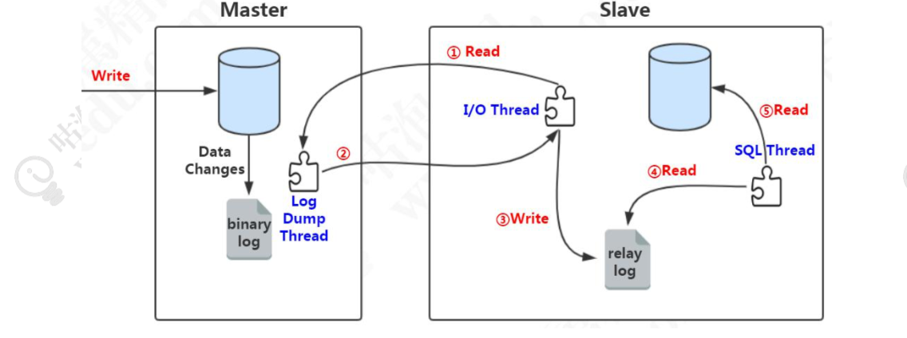
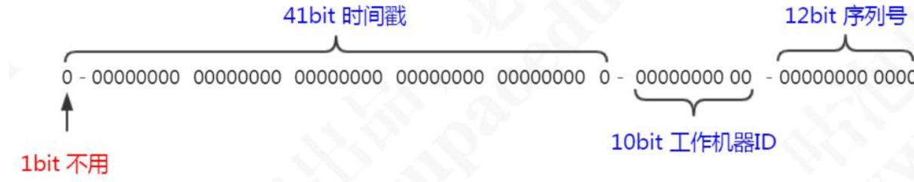

# 优化思路

## 连接配置优化

增加服务端的可用连接数，及时释放不活动的连接。

客户端减少从服务端获取的连接数，引入连接池，实现连接的重用。建议连接池大小是机器核数乘以 2 加 1

## 缓存，架构优化

# 主从复制　

1. 将读操作和写操作分离到不同的数据库上，避免主服务器出现性能瓶颈；　　　　

2. 主服务器进行写操作时，不影响查询查询，降低阻塞提高并发　　　

3. 数据拥有多个容灾副本，提高数据安全性，同时当主服务器故障时，可立即切换到其他服务器，提高系统可用性；

## binlog

### 格式

STATEMENT：记录每一条修改数据的 SQL 语句(减少日志量，节约 IO)。 

ROW：记录哪条数据被修改了，修改成什么样子了(5.7 以后默认)。 

MIXED：结合两种方式，一般的语句用 STATEMENT，函数之类的用 ROW。

## 原理

1. slave 服务器执行 start slave，开启主从复制开关， slave 服务器的 IO 线程请 求从 master 服务器读取 binlog(如果该线程追赶上了主库，会进入睡眠状态)。
2. master 服务器创建 Log Dump 线程，把 binlog 发送给 slave 服务器。slave 服 务器把读取到的 binlog 日志内容写入中继日志 relay log(会记录位置信息，以便下次继 续读取)。
3. slave 服务器的 SQL 线程会实时检测 relay log 中新增的日志内容，把 relay log 解析成 SQL 语句，并执行。

## 异步与同步复制

在主从复制的过程中，MySQL 默认是异步复制的。也就是说， 对于主节点来说，写入 binlog，事务结束，就返回给客户端了。对于 slave 来说，接收 到 binlog，就完事儿了，master 不关心 slave 的数据有没有写入成功。

同步复制，等待全部从库的事务执行完毕，才返回给客户端呢。

## 半同步复制

主库在执行完客户端提交的事务后不是立刻返回给客户端，而是等待至少一个从库接收到 binlog 并写到 relay log 中才返回给客户端。master 不会等待很长的时间，但是 返回给客户端的时候，数据就即将写入成功了，因为它只剩最后一步读取 relay log，写入从库。

## 异步复制之 **GTID** 复制

把在主库上并行执行的事务，分为一个组，并且给他们编号， 这一个组的事务在从库上面也可以并行执行。这个编号，我们把它叫做 GTID(Global Transaction Identifiers)，这种主从复制的方式，我们把它叫做基于 GTID 的复制。

和原来的日志相比，多了last-commited和sequence-number。last-commited是事务提交时上次事物的编号，如果具备同一个last-commited说明在一个组内，可以并发执行。

如果我们要使用 GTID 复制，我们可以通过修改配置参数打开它，默认是关闭的：show global variables like 'gtid_mode';

## 主从一致

1. 强制读主
2. 在cache里记录哪些数据发生过写请求，路由决定读主还是读从。

# 分库分表

## 垂直切分

垂直分表有两种，一种是单库的，一种是多库的。

单库分表，比如：商户信息表，拆分成基本信息表，联系方式表，结算信息表，附件表等等。

多库垂直分表就是把原来存储在一个库的不同的表，拆分到不同的数据库

## 水平切分

## 问题

### 跨库关联查询

1. 字段冗余。查询合同库的合同表的时候需要关联客户库的客户表，我们可以直接把一些经常关联查询的客户字段放到合同表
2. 数据同步。比如商户系统要查询产品系统的产品表，我们干脆在商户系统创建一 张产品表，通过 ETL 或者其他方式定时同步产品数据
3. 全局表。在所有的数据库都存储相同的基础数据。
4. ER 表(绑定表)。把父表和数据和从属于父表的数据落到一个节点上

### 全局事务

1. 全局事务。比如 XA 两阶段提交
2. 基于可靠消息服务的分布式事务。消息中间件
3. 柔性事务 TCC
4. 最大努力通知，通过消息中间件向其他系统发送消息(重复投递+定期校对)

### 排序、翻页、函数计算问题

需要先在每个分片上执行相应的函数，然后将各个分片的结果集进行汇总和再次计算，最终将结果返回。

### 全局主键

1. uuid

2. 数据库。把序号维护在数据库的一张表中。这张表记录了全局主键的类型、位数、起始值，当前值。当其他应用需要获得全局 ID 时，先 for update 锁行，取到值+1 后并且更新后 返回。并发性比较差。

3. 雪花算法

   

强依赖机器时钟，如果时钟回拨，则可能导致生成 ID 重复。