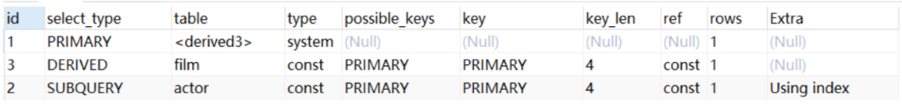
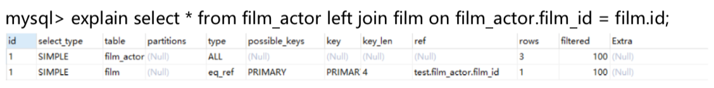
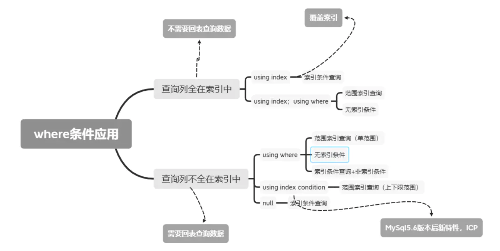

# 慢查询日志

MySQL慢查询就是在日志中记录运行比较慢的SQL语句，这个功能需要开启才能用。

```mysql
long_query_time = 10   #指执行超过多久的SQL会被日志记录下来
log-slow-queries = /var/lib/mysql/mysql-slow.log #日志地址
log_queries_not_using_indexes #未使用索引查询
log_output  #日志存储方式
```

# Explain执行计划

```mysql
explain select (select 1 from actor where id = 1) from (select * from film where id = 1) 
```



## id列

id列的编号是 select 的序列号，有几个 select 就有几个id，并且id的顺序是按 select 出现的 顺序增长的。id列越大执行优先级越高，id相同则从上往下执行，id为NULL最后执行。

## select_type列

select_type 表示对应行是简单还是复杂的查询。

1. simple：简单查询。查询不包含子查询和union
2. primary：复杂查询中最外层的 select
3. subquery：包含在 select 中的子查询(不在 from 子句中)
4. derived：包含在 from 子句中的子查询。MySQL会将结果存放在一个临时表中，也称为派生表
5. union：在 union 中的第二个和随后的 select

## table列

这一列表示 explain 的一行正在访问哪个表。

当 from 子句中有子查询时，table列是 \<derivenN\> 格式，表示当前查询依赖 id=N 的查询，于是先执行 id=N 的查询。

## type列

这一列表示关联类型或访问类型，即MySQL决定如何查找表中的行，查找数据行记录的大概范围。

依次从最优到最差分别为:system > const > eq_ref > ref > range > index > ALL 。一般来说，得保证查询达到range级别，最好达到ref

**NUll：**mysql能够在优化阶段分解查询语句，在执行阶段用不着再访问表或索引。例如在索引列中选取最小值，可以单独查找索引来完成，不需要在执行时访问表

**const：**mysql能对查询的某部分进行优化并将其转化成一个常量。用于 primary key 或 unique key 的所有列与常数比较时，所以表最多有一个匹配行，读取1次，速度比较快。

**system：**是const的特例，表里只有一条元组匹配

**eq_ref：**primary key 或 unique key 索引的所有部分被连接使用 ，最多只会返回一条符合条件的记录。这可能是在 const 之外最好的联接类型了，简单的 select 查询不会出现这种 type。



**ref：**相比 eq_ref，不使用唯一索引，而是使用普通索引或者唯一性索引的部分前缀，索引要和某个值相比较，可能会找到多个符合条件的行

**range：**范围扫描通常出现在 in(), between ,> ,<, >= 等操作中。使用一个索引来检索给定 范围的行。

**index：**index:扫描全表索引，这通常比ALL快一些。

**ALL：**ALL:即全表扫描，意味着mysql需要从头到尾去查找所需要的行。通常情况下这需要增加索引来进行优化了

## possible_keys列

这一列显示查询可能使用哪些索引来查找。

explain 时可能出现 possible_keys 有列，而 key 显示 NULL 的情况，这种情况是因为表中数据不多，mysql认为索引对此查询帮助不大，选择了全表查询。

## key列

这一列显示mysql实际采用哪个索引来优化对该表的访问。

如果没有使用索引，则该列是 NULL。如果想强制mysql使用或忽视key列中的索引，在查询中使用 force index、ignore index。

## key_len列

这一列显示了mysql在索引里使用的字节数，通过这个值可以算出具体使用了索引中的哪些列。如果字段允许为 NULL，需要1字节记录是否为 NULL。

key_len计算规则如下：

**char(n)：**n字节长度，**varchar(n)：**2字节存储字符串长度，如果是utf-8，则长度 3n +2，**tinyint：**1字节，**smallint：**2字节 ，**int：**4字节，**bigint：**8字节 ，**date：**3字节，**timestamp：**4字节，**datetime：**8字节

## ref列

这一列显示了在key列记录的索引中，表查找值所用到的列或常量，常见的有:const(常量)，字段名(例:film.id)

## rows列

这一列是mysql估计要读取并检测的行数，注意这个不是结果集里的行数。

## Extra列

这一列展示的是额外信息。常见的重要值如下。

**Using index：**使用覆盖索引

**Using where，Using index condition：**



**Using temporary：**mysql需要创建一张临时表来处理查询。出现这种情况一般是要进行 优化的，首先是想到用索引来优化。

**Using filesort：**将用外部排序而不是索引排序，数据较小时从内存排序，否则需要在磁盘 完成排序。这种情况下一般也是要考虑使用索引来优化的。

**Select tables optimized away：**使用某些聚合函数(比如 max、min)来访问存在索引的某个字段