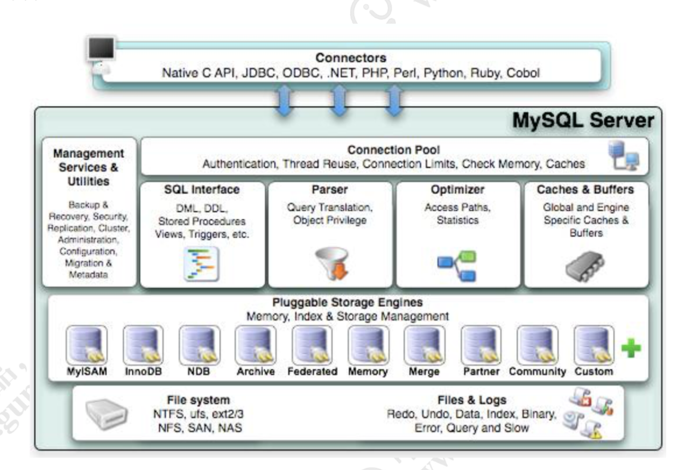
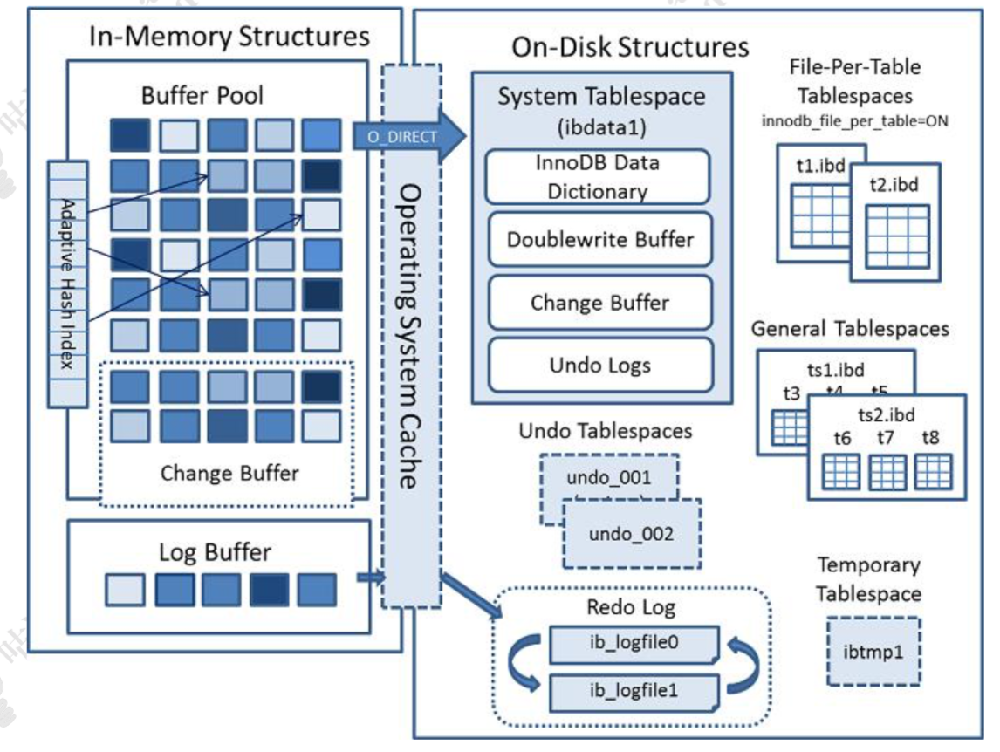
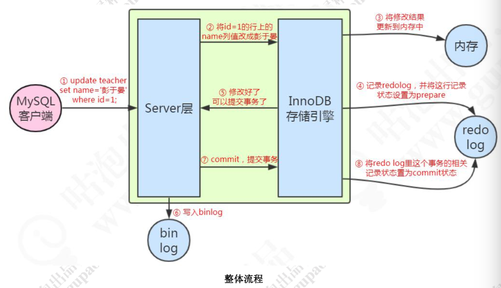

# MySql体系结构

## MySql模块详解

1. Connectors：用来支持各种语言和 SQL 的交互，比如 PHP，Python，Java 的 JDBC
2. Management Serveices & Utilities：系统管理和控制工具，包括备份恢复、MySQL 复制、集群等等
3. Connection Pool：连接池，管理需要缓冲的资源，包括用户密码权限线程等等
4. SQL Interface：用来接收用户的 SQL 命令，返回用户需要的查询结果
5. Parser：用来解析 SQL 语句
6. Optimizer：查询优化器
7. Cache and Buffer：查询缓存，除了行记录的缓存之外，还有表缓存，Key 缓存，权限缓存等等
8. Pluggable Storage Engines：插件式存储引擎，它提供 API 给服务层使用，跟具体的文件打交道

## Parser解析器

这一步主要是对语句基于 SQL 语法进行词法和语法分析和语义的解析。

词法分析就是把一个完整的 SQL 语句打碎成一个个的单词。第二步是语法分析，语法分析会对 SQL 做一些语法检查，比如单引号有没有闭合。然后根据 MySQL 定义的语法规则，根据 SQL 语句生成一个数据结构，解析树。

解析 SQL 时有预处理器。，它会检查生成的解析树，解决解析器无法解析的语义。比如，它会检查表和列名是否存在，检查名字和别名，保证没有歧义。

## Optimizer优化器

查询优化器的目的就是根据解析树生成不同的执行计划(Execution Plan)，然后选择一种最优的执行计划，MySQL 里面使用的是基于开销(cost)的优化器，那种执行计划开销最小，就用哪种。优化器最终会把解析树变成一个查询执行计划，查询执行计划是一个数据结构。

MySQL 的优化器能处理哪些优化类型呢? 举两个简单的例子:当我们对多张表进行关联查询的时候，以哪个表的数据作为基准表。有多个索引可以使用的时候，选择哪个索引。

## 存储引擎

|          |                  Innodb                   |                     Myisam                      |
| :------: | :---------------------------------------: | :---------------------------------------------: |
| 存储文件 | .frm 表定义文件 ，.ibd 数据文件和索引文件 | .frm 表定义文件， .myd 数据文件 ，.myi 索引文件 |
|    锁    |                表锁，行锁                 |                      表锁                       |
|   事务   |                   支持                    |                     不支持                      |
|  count   |                   扫表                    |            专门存储 (加where也扫表)             |
|   外键   |                   支持                    |                     不支持                      |

# InnoDB内存和磁盘结构 

## 内存结构

### buffer Pool

Buffer Pool 缓存的是页面信息，包括数据页、索引页。

InnoDB 操作数据有一个最小的逻辑单位，叫做页(索引页和数据页)。我们对于数据的操作，不是每次都直接操作磁盘，因为磁盘的速度太慢了。InnoDB 使用了一种缓冲池的技术，也就是把磁盘读到的页放到一块内存区域里面。这个内存区域就叫 Buffer Pool。

下一次读取相同的页，先判断是不是在缓冲池里面，如果是，就直接读取，不用再次访问磁盘。修改数据的时候，先修改缓冲池里面的页。内存的数据页和磁盘数据不一致的时候， 我们把它叫做脏页。InnoDB 里面有专门的后台线程把Buffer Pool的数据写入到磁盘，每隔一段时间就一次性地把多个修改写入磁盘。

### Change Buffer

如果这个数据页不是唯一索引，不存在数据重复的情况，也就不需要从磁盘加载索引页判断数据是不是重复(唯一性检查)。这种情况下可以先把修改记录在内存的缓冲池中，从而提升更新语句(Insert、Delete、Update)的执行速度。这一块区域就是 Change Buffer。

最后把 Change Buffer 记录到数据页的操作叫做 merge。什么时候发生 merge，有几种情况:在访问这个数据页的时候，或者通过后台线程、或者数据库 shut down、 redo log 写满时触发。

### 自适应hash

InnoDB 只支持显式创建 B+Tree 索引，对于一些热点数据页， InnoDB 会自动建立自适应 Hash 索引，也就是在 B+Tree 索引基础上建立 Hash 索引， 这个过程对于客户端是不可控制的，隐式的。

### LogBuffer

如果 Buffer Pool 里面的脏页还没有刷入磁盘时，数据库宕机或者重启，这些数据丢失。为了避免这个问题，InnoDB 把所有对页面的修改操作专门写入一个日志文件，并且在数据库启动时从这个文件进行恢复操作，用它来实现事务的持久性。

这个文件就是磁盘的 redo log(叫做重做日志)，对应于/var/lib/mysql/目录下的 ib_logfile0 和 ib_logfile1。在 Buffer Pool 里面有一块内存区域 (Log Buffer)专门用来保存即将要写入日志文件的数据

## 磁盘结构

### 系统表空间

数据字典：由内部系统表组成，存储表和索引的元数据(定义信息)。 

双写缓冲：如果出现了 写入失效，就用页的副本来还原这个页，然后再应用 redo log。这个页的副本就是 double write，InnoDB 的双写技术。通过它实现了数据页的可靠性

### 独占表空间

我们可以让每张表独占一个表空间。这个开关通过 innodb_file_per_table 设置，开启后，则每张表会开辟一个表空间，这个文件就是数据目录下的 ibd 文件，存放表的索引和数据。

### undo log tablespace

undo log( 撤销日志或回滚日志)记了事务发生之前的数据状态。 如果修改数据时出现异常，可以用 undo log 来实现回滚操作(保持原子性）

### 后台进程

后台线程的主要作用是负责刷新内存池中的数据和把修改的数据页刷新到磁盘。

master thread 负责刷新缓存数据到磁盘并协调调度其它后台进程。

IO thread 分为 insert buffer、log、read、write 进程。分别用来处理 insert buffer、 重做日志、读写请求的 IO 回调。

purge thread 用来回收 undo 页。

page cleaner thread 用来刷新脏页。

除了 InnoDB 架构中的日志文件，MySQL 的 Server 层也有一个日志文件，叫做binlog，它可以被所有的存储引擎使用。

### 更新语句执行流程

例如一条语句:update teacher set name='盆鱼宴' where id=1; 

1、先查询到这条数据，如果有缓存，也会用到缓存。

2、把 name 改成盆鱼宴，然后调用引擎的 API 接口，写入这一行数据到内存，同时记录 redo log。这时 redo log 进入 prepare 状态，然后告诉执行器，执行完成了，可以随时提交。

3、执行器收到通知后记录 binlog，然后调用存储引擎接口，设置 redo log 为 commit 状态。

4、更新完成。

