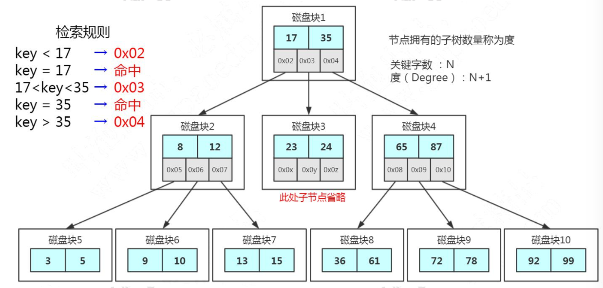
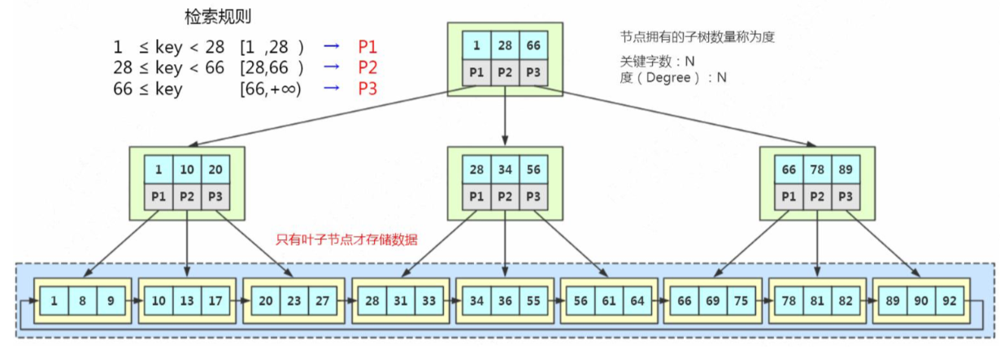
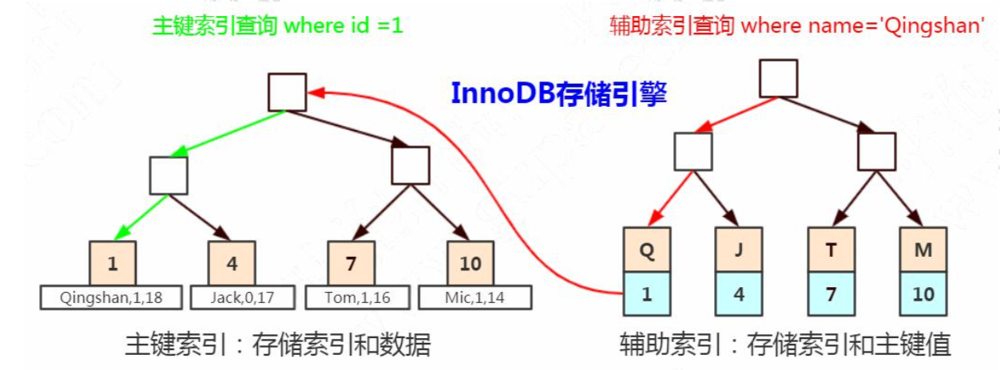
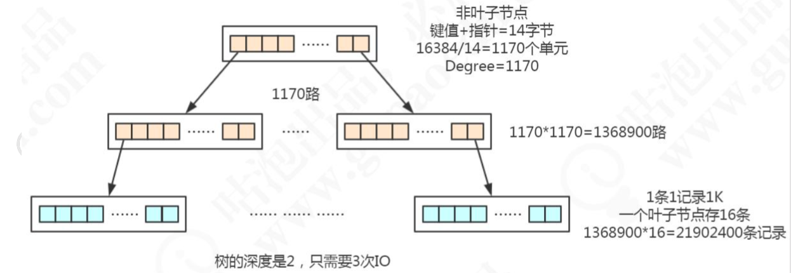
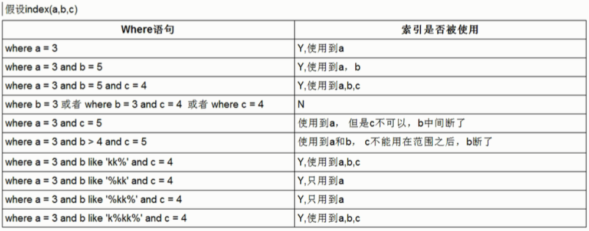

# 索引数据结构

## 常见模型

哈希表是一种以键-值（key-value）存储数据的结构，适用于只有等值查询的场景

有序数组在等值查询和范围查询场景中的性能就都非常优秀，有序数组索引只适用于静态存储引擎，比如你要保存的是2017年某个城市的所有人口信息，这类不会再修改的数据

二叉查找树，左子树所有的节点都小于父节点，右子树所有的节点都大于父节点。二叉查找树既能够实现快速查找，又能够实现快速插入。它的查找耗时是和这棵树的深度相关的，在最坏的情况下时间复杂度会退化成O(n)。

平衡二叉树(AVL树)，左右子树深度差绝对值不能超过 1。会进行左旋和右旋。每个节点存储的数据太少，找到需要的数据，要访问更多节点，跟磁盘交互次数会过多。

## 多路平衡查找树（B Tree）



B Tree 保持平衡：比如路数是3的时候，我们插入数据 1、2、3，在插入 3 的时候，子节点会变成 4 路，这个时候必须进行分裂。把中间的数据 2 提上去，把 1 和 3 变 成 2 的子节点。

节点的分裂和合并，其实就是 InnoDB 页的分裂和合并。可以看到，在更新索引的时候会有大量的索引的结构的调整，所以解释了为什么我们不要在频繁更新的列上建索引，或者为什么不要更新主键。

##  B+树(加强版多路平衡查找树)



1. 它的关键字的数量是跟路数相等的
2. B+Tree 的根节点和枝节点中都不会存储数据，只有叶子节点才存储数据。搜索
3. B+Tree 的每个叶子节点增加了一个指向相邻叶子节点的指针，它的最后一个数据会指向下一个叶子节点的第一个数据，形成了一个有序链表的结构。
4. 它是根据左闭右开的区间 [ )来检索数据。

InnoDB 中的 B+Tree 的特点:

1. 扫库、扫表能力更强(对表进行全表扫描，只需要遍历叶子节点就可以 了，不需要遍历整棵 B+Tree 拿到所有的数据)
2.  B+Tree 的磁盘读写能力相对于 B Tree 来说更强(根节点和枝节点不保存数据区， 所以一个节点可以保存更多的关键字，一次磁盘加载的关键字更多)
3. 排序能力更强(因为叶子节点上有下一个数据区的指针，数据形成了链表)
4. 效率更加稳定(B+Tree 永远是在叶子节点拿到数据，所以 IO 次数是稳定的)

## 索引落地形式

在 InnoDB 里面，它是以主键为索引来组织数据的存储的，所以索引文件和数据文件是同一个文件，都在.ibd 文件里面。



聚集索引(聚簇索引)就是索引键值的逻辑顺序跟表数据行的物理存储顺序是一致的。主键索引是聚集索引，非主键都是非聚集索引。辅助索引存储的是辅助索引和主键值。如果使用辅助索引查询，会根据主键值在主 键索引中查询，最终取得数据。

辅助索引里面存储的是主键值，能够节省空间消耗，同时因为有分叉和合并的操作，键值的地址会发生变化，所以在辅助索引里面不能存储地址。

假设一条记录是 1K，一个叶子节点(一页)可以存储 16 条记录。非叶子节点可以存储多少个指针?

假设索引字段是 bigint 类型，长度为 8 字节。指针大小在 InnoDB 源码中设置为 6 字节，这样一共 14 字节。非叶子节点(一页)可以存储 16384/14=1170 个这样的单元(键值+指针)，代表有 1170 个指针。

树深度为 2 的时候，有 1170^2 个叶子节点，可以存储的数据为 1170\*1170\*16=21902400。



# 索引使用

## 索引类型

1. 普通索引，也叫非唯一索引，是最普通的索引，没有任何的限制。
2. 唯一索引，键值不能重复。主键索引是一种特殊的唯一索引，键值不能为空。主键索引用 primay key 创建。
3. 全文索引，针对比较大的数据，解决like查询效率低的问题，可以创建全文索引。只有文本类型的字段才可以创建全文索引，比如 char、varchar、text。

## 联合索引

由多个字段组成的索引 使用顺序就是创建的顺序,省空间、容易形成覆盖索引。联合索引最左匹配原则。



## 覆盖索引

非主键索引，我们先通过索引找到主键索引的键值，再通过主键值查出索引里面没有的数据，它比基于主键索引的查询多扫描了一棵索引树，这个过程就叫回表。

在辅助索引里面，不管是单列索引还是联合索引，如果 select 的数据列只用从索引 中就能够取得，不必从数据区中读取，这时候使用的索引就叫做覆盖索引，这样就避免 了回表。

## 前缀索引

使用字符串的前几个字符作为索引，不能在 ORDER BY 或 GROUP BY 中使用前缀索引，也不能把它们用作覆盖索引(Covering Index)。

索引选择性，不重复的个数与总个数的比值。

count(distinct left(city,4))/count(*) as sel4

## 索引下推

 last_name 和 first_name 上面创建联合索引。

``` mysql
select * from employees where last_name='wang' and first_name LIKE '%zi';
```

这条 SQL 有两种执行方式:

1、根据联合索引查出所有姓 wang 的二级索引数据，然后回表，到主键索引上查询 全部符合条件的数据(3 条数据)。然后返回给 Server 层，在 Server 层过滤出名字以 zi 结尾的员工。

2、根据联合索引查出所有姓 wang 的二级索引数据(3 个索引)，然后从二级索引 中筛选出 first_name 以 zi 结尾的索引(1 个索引)，然后再回表，到主键索引上查询全 部符合条件的数据(1 条数据)，返回给 Server 层。

关闭索引下推，执行1。

```mysql
set optimizer_switch='index_condition_pushdown=off';
```

索引的比较是在存储引擎进行的，数据记录的比较，是在 Server层进行的。而当 first_name 的条件不能用于索引过滤时，Server 层不把first_name 的条件传递给存储引擎，所以读取了两条没有必要的记录。

开启索引下推，执行2。

索引条件下推(Index Condition Pushdown)，5.6 以后完善的功能。只适用于二级索引。目标是减少访问表的完整行的读数量从而减少 I/O 操作。

## 普通索引还是唯一索引

普通索引和唯一索引，这两类索引在查询能力上是没差别的，主要考虑的是对更新性能的影响。

第一种情况是，**这个记录要更新的目标页在内存中**。这时，InnoDB的处理流程如下：

- 对于唯一索引来说，找到3和5之间的位置，判断到没有冲突，插入这个值，语句执行结束；
- 对于普通索引来说，找到3和5之间的位置，插入这个值，语句执行结束。

这样看来，普通索引和唯一索引对更新语句性能影响的差别，只是一个判断，只会耗费微小的CPU时间。

第二种情况是，**这个记录要更新的目标页不在内存中**。这时，InnoDB的处理流程如下：

- 对于唯一索引来说，需要将数据页读入内存，判断到没有冲突，插入这个值，语句执行结束；
- 对于普通索引来说，则是将更新记录在change buffer，语句执行就结束了。

如果所有的更新后面，都马上伴随着对这个记录的查询，那么你应该关闭change buffer

# 索引使用原则

1. 在用于 where 判断 order 排序和 join 的(on)字段上创建索引。
2. 索引个数不要太多，浪费空间，更新变慢。
3. 区分度低的字段，不要建索引。 离散度太低，导致扫描行数过多。
4. 频繁更新的值，不要作为主键或者索引。导致页分裂
5. 组合索引把散列性高(区分度高)的值放在前面。
6. 不建议用无序的值(例如身份证、UUID )作为索引。
7. 如果索引了多列，要遵守最左前缀法则。指的是查询从索引的最左前列开始并且不跳过索引中的列。
8. 不在索引列上做任何操作(计算、函数、(自动or手动)类型转换)，会导致索引失效而转向全表扫描
9. 不能使用索引中范围条件右边的列。
10. 少用or或in，用它查询时，mysql不一定使用索引，mysql内部优化器会根据检索比例、 表大小等多个因素整体评估是否使用索引。可以讲大的范围拆分成多个小范围。

## 用不到索引

1. 索引列上使用函数(replace\SUBSTR\CONCAT\sum count avg)、表达式、 计算(+ - * /)不会使用索引
2. 字符串不加引号，出现隐式转换，不会使用索引
3. like 条件中前面带%
4. 负向查询，NOT LIKE 不能。!= (<>)和 NOT IN 在某些情况下可以。

用不用索引，最终都是优化器说了算。优化器是基于 cost 开销(Cost Base Optimizer)，它不是基于规则(Rule-Based Optimizer)，也不是基于语义。怎么样开销小就怎么来。

# 索引优化 

## order by与group by

MySQL支持两种方式的排序filesort和index，Using index是指MySQL扫描索引本身完成排序。index效率高，filesort效率低。

建立索引，（name，age，position）

### Using Index 的情况

```mysql
select * from employees where name = 'LiLei' and position = 'dev' order by age;
```

查询用到了name索引，age索引列用在排序过程中

```mysql
select *from employees where name='LiLei'order by age,position;
```

查找只用到索引name，age和position用于排序

```mysq
select * from employees where name = 'LiLei' and age = 18 order by position，age;
```

因为age为常量，在排序中被优化，所以索引未颠倒

### Using Filesort

```mysql
select *from employees where name='LiLei'order by position;
```

查询使用了name索引，由于用了position进行排序，跳过了 age。

```mysql
select *from employees where name='LiLei'order by position,age;
```

索引的创建顺序为 name,age,position，但是排序的时候age和position颠倒位置了

```mysql
select *from employees where name='LiLei'order by age asc,position desc;
```

position desc变成了降序，导致与索引的排序方式不同，Mysql8以上版本有降序索引可以支持该种查询方式。

```java 
select *from employees where name in ('LiLei','hanmei') order by age,position;
```

对于排序来说，多个相等条件也是范围查询

### 优化总结

1. order by满足两种情况会使用Using index。order by语句使用索引最左前列。使用where子句与order by子句条件列组合满足索引最左前列
2. 尽量在索引列上完成排序，遵循索引建立(索引创建的顺序)时的最左前缀法则。
3. 如果order by的条件不在索引列上，就会产生Using filesort。
4. group by与order by很类似，其实质是先排序后分组，遵照索引创建顺序的最左前缀法则。对于group by的优化如果不需要排序的可以加上order by null禁止排序。注意，where高于having，能写在where中 的限定条件就不要去having限定了。

### filesort排序原理

filesort使用两种排序方式

单路排序：是一次性取出满足条件行的所有字段，然后在sort buffer中进行排序。

双路排序(回表排序)：是首先根据相应的条件取出相应的排序字段和可以直接定位行数据的行 ID，然后在 sort buffer 中进行排序，排序完后需要再次取回其它需要的字段。

MySQL 通过比较系统变量 max_length_for_sort_data(默认1024字节) 的大小和需要查询的字段总大小来判断使用哪种排序模式。

如果比查询字段的总长度大，那么使用单路排序模式。否则使用双路排序模式。

## 分页查询优化

```mysql
select * from employees limit 90000,5;
```

表示从表 employees 中取出从 90001 行开始的 5 行记录。看似只查询了 5 条记录，实际这条 SQL 是先读取 90005 条记录，然后抛弃前 10000 条记录，然后读到后面 5 条想要的数据。因此要查询一张大表比较靠后的数据，执行效率是非常低的。

### 根据自增且连续的主键排序的分页查询

该 SQL 表示查询从第 90001开始的五行数据，没添加单独 order by，表示通过主键排序。我们再看表 employees ，因为主键是自增并且连续的，所以可以改写成按照主键去查询从第 90001开始的五行数据。

```mysql
select * from employees where id > 90000 limit 5;
```

改写得满足两个条件。主键自增且连续，结果是按照主键排序的。

### 非主键字段排序的分页查询

```mysql
select * from employees ORDER BY name limit 90000,5;
```

没有使用 name 字段的索引，原因是扫描整个索引并查找到没索引的行(可能要遍历多个索引树)的成本比扫描全表的成本更高，所以优化器放弃使用索引。

关键是让排序时返回的字段尽可能少，所以可以让排序和分页操作先查出主键，然后根据主键查到对应的记录，SQL 改写如下

```mysql
select * from employees e inner join (select id from employees order by name limit 90000,5) ed on e.id = ed.id;
```

原 SQL 使用的是 filesort 排序，而优化后的 SQL 使用的是索引排序。

## join关联查询优化

```mysql
示例表:
CREATETABLE`t1`(
`id` int(11) NOT NULL AUTO_INCREMENT,
`a` int(11) DEFAULT NULL,
`b` int(11) DEFAULT NULL,
 PRIMARY KEY (`id`),
 KEY `idx_a` (`a`)
 )ENGINE=InnoDBAUTO_INCREMENT=10001DEFAULTCHARSET=utf8;
 
 create table t2 like t1;
 往t1表插入1万行记录，往t2表插入100行记录
```

###  嵌套循环连接 Nested-Loop Join(NLJ) 算法

一次一行循环地从第一张表(称为驱动表)中读取行，在这行数据中取到关联字段，根据关联字段在另一张表(被驱动表)里取出满足条件的行，然后取出两张表的结果合集。

```mysql
select * from t1 inner join t2 on t1.a= t2.a;
```

驱动表是 t2，被驱动表是 t1。先执行的就是驱动表。优化器一般会优先选择小表做驱动表。一般 join 语句中，如果执行计划 Extra 中未出现 Using join buffer 则表示使用的 join 算法是 NLJ。

上面sql的大致流程如下：

1. 从表 t2 中读取一行数据;
2. 从第 1 步的数据中，取出关联字段 a，到表 t1 中查找;
3. 取出表 t1 中满足条件的行，跟 t2 中获取到的结果合并，作为结果返回给客户端; 
4. 重复上面 3 步。

整个过程会读取 t2 表的所有数据(扫描100行)，然后遍历这每行数据中字段 a 的值，根据 t2 表中 a 的值索引扫描 t1 表 中的对应行(扫描100次 t1 表的索引，1次扫描可以认为最终只扫描 t1 表一行完整数据，也就是总共 t1 表也扫描了100 行)。因此整个过程扫描了 200 行。 

如果被驱动表的关联字段没索引，使用NLJ算法性能会比较低。mysql会选择Block Nested-Loop Join 算法。

### 基于块的嵌套循环连接 Block Nested-Loop Join(BNL)算法

把驱动表的数据读入到 join_buffer 中，然后扫描被驱动表，把被驱动表每一行取出来跟 join_buffer 中的数据做对比。

```mysql
select * from t1 inner join t2 on t1.b= t2.b;
```

上面sql的大致流程如下:

1. 把 t2 的所有数据放入到 join_buffer 中。
2. 把表 t1 中每一行取出来，跟 join_buffer 中的数据做对比。
3. 返回满足 join 条件的数据。

整个过程对表 t1 和 t2 都做了一次全表扫描，因此扫描的总行数为10000(表 t1 的数据总量) + 100(表 t2 的数据总量) = 10100。并且 join_buffer 里的数据是无序的，因此对表 t1 中的每一行，都要做 100 次判断，所以内存中的判断次数是 100 * 10000= 100 万次。

被驱动表的关联字段没索引，使用 Nested-Loop Join，那么扫描行数为 100 * 10000 = 100万次，这个是磁盘扫描。相比于磁盘扫描，BNL的内存计算会快得多。

### 关联sql优化

关联字段加索引，让mysql做join操作时尽量选择NLJ算法。

小标驱动大表，写多表连接sql时如果明确知道哪张表是小表可以用straight_join写法固定连接驱动方式，省去mysql优化器自己判断的时间。只适用于inner join，因为left join，right join已经代表指定了表的执行顺序。

## in和exsits优化

原则：小表驱动大表，即小的数据集驱动大的数据集。

in：当B表的数据集小于A表的数据集时，in优于exists

``` mysql
select * from A where id in(select id from B)
 #等价于:
 for(select id from B){
 select * from A where A.id = B.id
}
```

exists：当A表的数据集小于B表的数据集时，exists优于in

```mysql
 select * from A where exists(select 1 from B where B.id=A.id) 
 #等价于:
 for(select * from A){
 select * from B where B.id = A.id
}
```


## count（）

```mysql
select count(1) from employees;
select count(id) from employees;
select count(name) from employees;
select count(*) from employees;
```

**对于count(主键id)来说**，InnoDB引擎会遍历整张表，把每一行的id值都取出来，返回给server层。server层拿到id后，判断是不可能为空的，就按行累加。

**对于count(1)来说**，InnoDB引擎遍历整张表，但不取值。server层对于返回的每一行，放一个数字“1”进去，判断是不可能为空的，按行累加。

**count(\*)是例外**，并不会把全部字段取出来，而是专门做了优化，不取值。count(*)肯定不是null，按行累加。

**对于count(字段)来说**：

1. 如果这个“字段”是定义为not null的话，一行行地从记录里面读出这个字段，判断不能为null，按行累加；
2. 如果这个“字段”定义允许为null，那么执行的时候，判断到有可能是null，还要把值取出来再判断一下，不是null才累加。

按照效率排序的话，count(字段)<count(主键id)<count(1)≈count(*)

mysql最终选择辅助索引而不是主键聚集索引，因为二级索引相对主键索引存储数据更少，检索性能应该更高。

如果只需要知道表总行数的估计值可以用如下sql查询，性能很高。

```mysql
show table status like 'employees';
```

# 索引选择错误

选择索引是优化器的工作。优化器选择索引的目的，是找到一个最优的执行方案，并用最小的代价去执行语句。在数据库里面，扫描行数是影响执行代价的因素之一。扫描的行数越少，意味着访问磁盘数据的次数越少，消耗的CPU资源越少。优化器还会结合是否使用临时表、是否排序等因素进行综合判断。

**扫描行数，**只能根据统计信息来估算记录数。采样统计的时候，InnoDB默认会选择N个数据页，统计这些页面上的不同值，得到一个平均值，然后乘以这个索引的页面数，就得到了这个索引的基数。

## 解决方案

一种方法是，像我们第一个例子一样，采用force index强行选择一个索引。analyze table t 命令，可以用来重新统计索引信息

第二种方法就是，我们可以考虑修改语句，引导MySQL使用我们期望的索引

第三种方法是，在有些场景下，我们可以新建一个更合适的索引，来提供给优化器做选择，或删掉误用的索引

