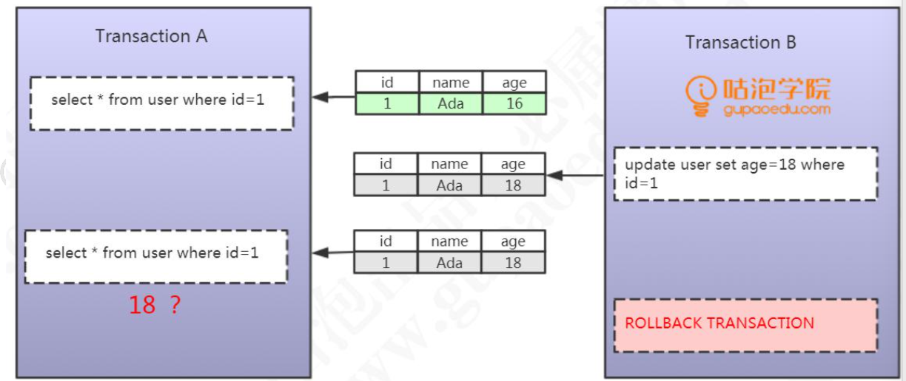
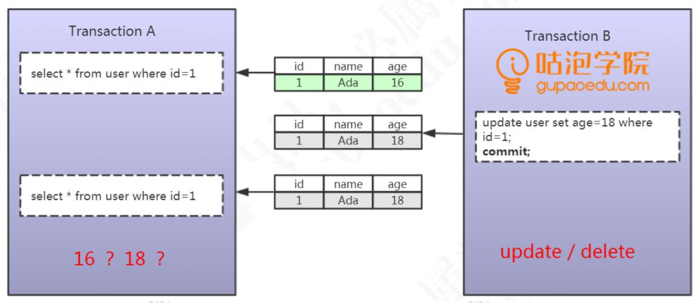
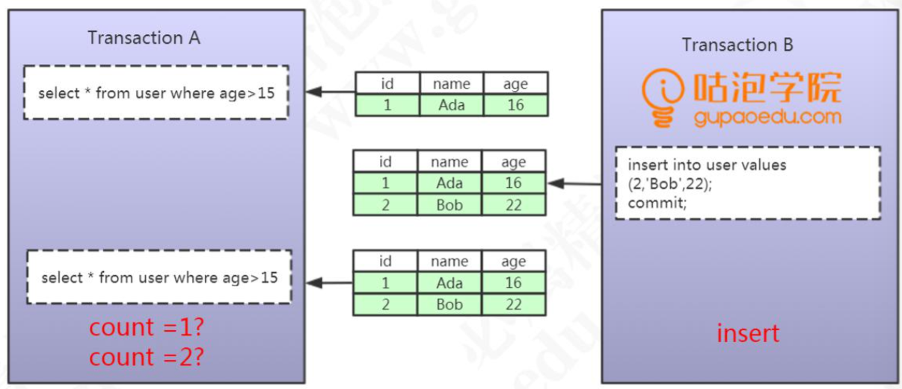
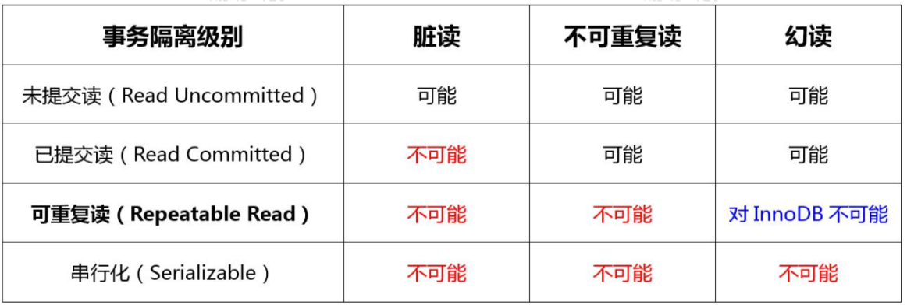
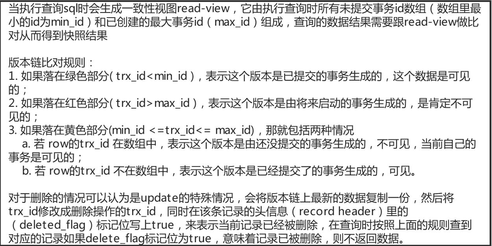
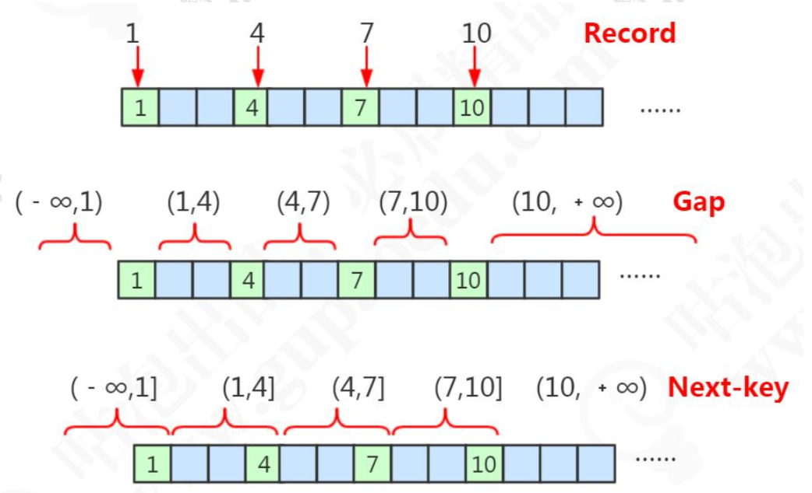

# MySql事务

## 事务特性

事务的四大特性:ACID。

第一个，原子性，Atomicity。数据库的一系列操作，要么都是成功，要么都是失败，不可能出现部分成功或者部分失败的情况。原子性，在 InnoDB 里面是通过 undo log 来实现的，它记录了数据修改之前的值(逻 辑日志)，一旦发生异常，就可以用 undo log 来实现回滚操作。

第二个，一致性，consistent，指的是数据库的完整性约束没有被破坏，事务执行的前后都是合法的数据状态。比如主键必须是唯一的，字段长度符合要求。除了数据库自身的完整性约束，还有一个是用户自定义的完整性。

第三个，隔离性，Isolation，就是多个的事务，对表或者行的并发操作，应该是透明的，互相不干扰的。通过这种方式，我们最终也是保证业务数据的一致性。

第四个，持久性，Durable，对数据库的任意 的操作，增删改，只要事务提交成功，那么结果就是永久性的。持久性是通过 redo log 和 double write 双写缓冲来实现的，我们操作数据的时候，会先写到内存的 buffer pool 里面，同时记录 redo log，如果在刷盘之前出现异常，在 重启后就可以读取 redo log 的内容，写入到磁盘，保证数据的持久性。当然，恢复成功的前提是数据页本身没有被破坏，是完整的，这个通过双写缓冲 (double write)保证。

## 事务带来问题

### 脏读

事务A读取到了事务B已经修改但尚未提交的数据，还在这个数据基础上做了操作。此时，如果B事务回滚，A读取的数据无效，不符合一致性要求



### 不可重复读

事务A读取到了事务B已提交的数据，导致前后两次读取数据不一致的情 况，我们把它叫做不可重复读



### 幻读

一个事务按相同的查询条件重新读取以前检索过的数据，却发现其他事务插入了满足其查询条件的新数据，这种现象就称为“幻读”。  一句话:事务A读取到了事务B提交的新增数据。

不可重复读是修改或者删除，幻读是插入。



## 隔离级别

论是脏读，还是不可重复读，还是幻读，它们都是数据库的读一致性的问题。读一致性的问题，必须要由数据库提供一定的事务隔离机制来解决。InnoDB 对数据库事务隔离级别。



Read Uncommitted(未提交读)，一个事务可以读取到其他事务未提交的数据，会出现脏读，所以叫做 RU。

Read Committed(已提交读)，也就是一个事务只能读取到其他事务已提交的数据，不能读取到其他事务未提交的数据，它解决了脏读的问题。

Repeatable Read (可重复读)，它解决了不可重复读的问题，也就是在同一个事务里面多次读取同样的数据结果是一样的，但是在这个级别下，没有定义解决幻读的问题。

Serializable(串行化)，在这个隔离级别里面，所有的事务都是串行执行的，也就是对数据的操作需要排队，已经不存在事务的并发操作了，所以它解决了所有的问题。

# MVCC

如果要解决读一致性的问题，实现事务隔离，总体上来说，我们有两大类的方案。

第一种，读取数据时锁定要操作的数据，不允许其他的事务修改。这种方案叫做基于锁的并发控制 Lock Based Concurrency Control(LBCC)。

第二种，在修改数据的时候给它建立一个备份或者叫快照，后面再来读取这个快照就行了。这种方案叫做多版本的并发控制 Multi Version Concurrency Control (MVCC)。

### MVCC实现

MVCC 在mysql 中的实现依赖的是 undo log 与 read view 。

在MVCC并发控制中，读操作可以分成两类。快照读与当前读。

快照读，读取的是记录的可见版本 (有可能是历史版本)，不用加锁。简单的select操作，属于快照读，不加锁。

当前读，读取的是记录的最新版本，并且当前读返回的记录，都会加上锁，保证其他事务不会再并发修改这条记录。插入/更新/删除操作，属于当前读，需要加锁

InnoDB 为每行记录都实现了两个隐藏字段

DB_TRX_ID，理解为创建版本号，在数据新增或者修改为新数据的时候，记录当前事务ID，编号是自动递增。

DB_ROLL_PTR，回滚指针，指向回滚段中的undo log。理解为删除版本号，数据被删除或记录为旧数据的时候，记录当前事务 ID。使用UPDATE语句修改该行数据时，会首先使用排他锁锁定改行，将该行当前的值复制到undo log中，然后再真正地修改当前行的值，最后填写事务ID，使用回滚指针指向undo log中修改前的行。

查找规则：只能查找创建时间小于等于当前事务 ID 的数据，和删除时间大于当前事务 ID 的行(或未删除)。

### Undolog

undo log分为两种：insert undo log和update undo log

insert undo log：是在 insert 操作中产生的 undo log。因为 insert 操作的记录只对事务本身可见， rollback 在该事务中直接删除 ，不需要进行 purge 操作。

update undo log ：是 update 或 delete 操作中产生的 undo log，因为会对已经存在的记录产生影响， rollback时MVCC机制会找他的历史版本进行恢复。因此 update undo log 不能在事务提交时就进行删除，而是将事务提交时放到入 history list 上， 等待 purge 线程进行最后的删除操作。

### Read View

MySQL中的事务在开始到提交这段过程中，都会被保存到一个叫trx_sys的事务链表中。事务链表中保存的都是还未提交的事务，事务一旦被提交，则会被从事务链表中摘除

RR隔离级别下，在每个事务开始的时候，会将当前系统中的所有的活跃事务拷贝到一个列表中(read view)。

RC隔离级别下，在每个语句开始的时候，会将当前系统中的所有的活跃事务拷贝到一个列表中(read view)。



# 锁

## 锁的类型

### 共享锁

也叫读锁，多个事务可以共享一把读锁。可以用select ...... lock in share mode 的方式手工加上一把读锁。

### 排他锁

只要一个事务获取了一行数据的排它锁，其他的事务就不能再获取这一行数 据的共享锁和排它锁。

排它锁的加锁方式有两种。第一种是自动加排他锁，在操作数据时（增删改）都会默认加上一个排它锁。第二种是手工加锁，用一个 FOR UPDATE 给一行数据加上一个排它锁。

### 意向锁

由数据 库自己维护的。当给一行数据加上共享锁之前，数据库会自动在这张表上面加一个意向共享锁。给一行数据加上排他锁之前，数据库会自动在这张表上面加一个意向排他锁。

## 行锁的原理

InnoDB 的行锁，就是通过锁住索引来实现的。

查询没有使用索引，会进行全表扫描，导致锁表。

通过唯一索引给数据行加锁，主键索引也会被锁住

## 锁的算法



数据库里面存在的主键值，我们把它叫做 Record

根据主键，这些存在的 Record 隔开的数据不存在的区间，我们把它叫做 Gap，间隙，它是一个左开右开的区间。

间隙(Gap)连同它左边的记录(Record)，我们把它叫做临键的区间， 它是一个左开右闭的区间。

字符可以用 ASCII 码来排序

### 记录锁

对于唯一性的索引(包括唯一索引和主键索引)使用等值查询，精准匹配到一条记录的时候，这个时候使用的就是记录锁。

比如where id = 1 4 7 10 ，使用不同的 key 去加锁，不会冲突，它只锁住这个 record。

### 间隙锁

当我们查询的记录不存在，没有命中任何一个 record，无论是用等值查询还是范围查询的时候，它使用的都是间隙锁。

间隙锁主要是阻塞插入 insert。相同的间隙锁之间不冲突。

Gap Lock 只在 RR 中存在。如果要关闭间隙锁，就是把事务隔离级别设置成 RC， 并且把 innodb_locks_unsafe_for_binlog 设置为 ON。这种情况下除了外键约束和唯一性检查会加间隙锁，其他情况都不会用间隙锁。

### 临键锁

当使用了范围查询，不仅仅命中了 Record 记录，还包含了 Gap 间隙，在这种情况下我们使用的就是临键锁，它是 MySQL 里面默认的行锁算法，相当于记录锁加上间隙锁。

临键锁，锁住最后一个 key 的下一个左开右闭的区间。

```mysql
select * from t2 where id >5 and id <=7 for update; 
-- 锁住(4,7]和(7,10] 
select * from t2 where id >8 and id <=10 for update; 
-- 锁住 (7,10]，(10,+∞)
```

唯一性索引，等值查询匹配到一条记录的时候，退化成记录锁。

没有匹配到任何记录的时候，退化成间隙锁。

# 隔离级别的实现

RU 隔离级别：不加锁。

Serializable ：所有的 select 语句都会被隐式的转化为 select ... in share mode，会和 update、delete 互斥

## 可重复读（RR）

RR 隔离级别下，普通的 select 使用快照读(snapshot read)，底层使用 MVCC 来实现。

加锁的 select(select ... in share mode / select ... for update)以及更新操作 update, delete 等语句使用当前读(current read)，底层使用记录锁、或者间隙锁、 临键锁。

## 已提交读（RC）

RC 隔离级别下，普通的 select 都是快照读，使用 MVCC 实现。 加锁的 select 都使用记录锁，因为没有 Gap Lock。所以 RC 会出现幻读的问题。

## 区别

RC 和 RR 主要有几个区别:

1. RR 的间隙锁会导致锁定范围的扩大。

1. 条件列未使用到索引，RR 锁表，RC 锁行。
2. RC 的“半一致性”(semi-consistent)读能增加 update 操作的并发性。

在 RC 中，一个 update 语句，如果读到一行已经加锁的记录，此时 InnoDB 返回记录最近提交的版本，由 MySQL 上层判断此版本是否满足 update 的 where 条件。若满 足(需要更新)，则 MySQL 会重新发起一次读操作，此时会读取行的最新版本(并加锁)。