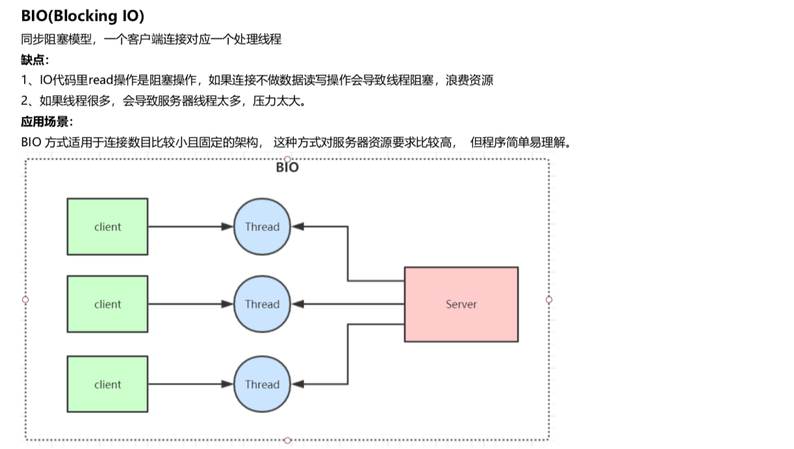
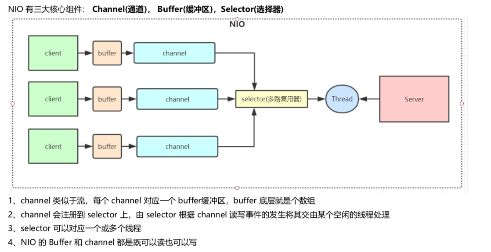
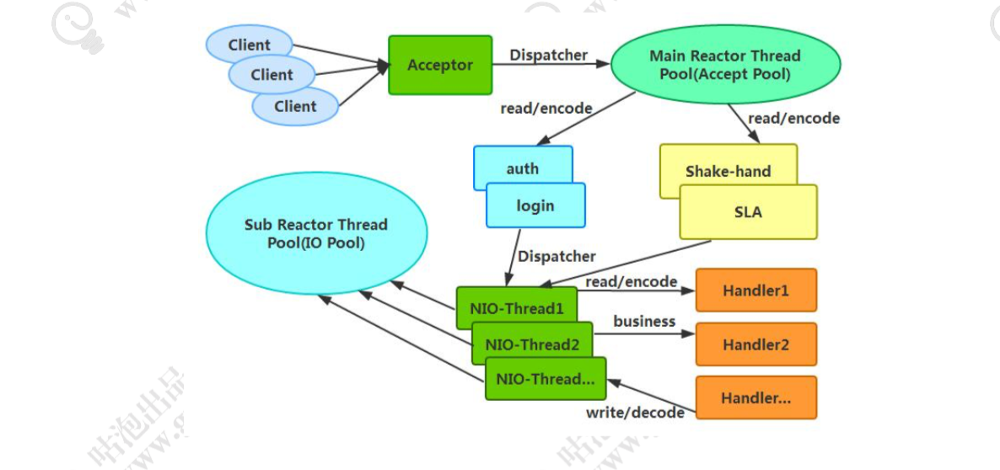
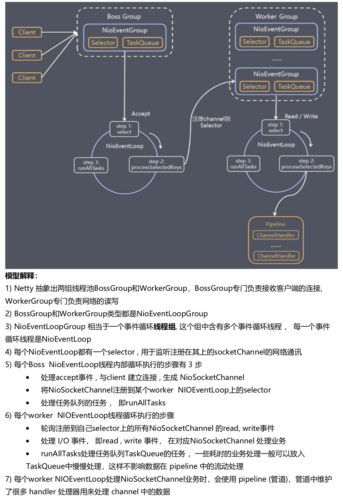
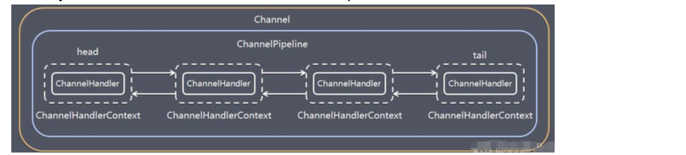

# I/O发展

## BIO



## NIO

同步非阻塞，服务器实现模式为一个线程可以处理多个请求(连接)，客户端发送的连接请求都会注册到多路复用器selector上，多路复用 器轮询到连接有IO请求就进行处理。

 I/O多路复用底层一般用的Linux API(select，poll，epoll)来实现，他们的区别如下表:

|          | select                                    | poll                                       | epoll                                                        |
| -------- | ----------------------------------------- | ------------------------------------------ | ------------------------------------------------------------ |
| 操作方式 | 遍历                                      | 遍历                                       | 回调                                                         |
| 底层实现 | 数组                                      | 链表                                       | 哈希表                                                       |
| IO效率   | 每次调用都进行线 性遍历，时间复杂 度为O(n | 每次调用都进行 线性遍历，时间 复杂度为O(n) | 事件通知方式，每当有IO事件 就绪，系统注册的回调函数就 会被调用 |
| 最大连接 | 有上限                                    | 无上限                                     | 无上限                                                       |

NIO相对于BIO非阻塞的体现就在，BIO的后端线程需要阻塞等待客户端写数据(比如read方法)，如果客户端不写数据线程就要阻塞， NIO把等待客户端操作的事情交给了大总管 selector，selector 负责轮询所有已注册的客户端，发现有事件发生了才转交给后端线程处 理，后端线程不需要做任何阻塞等待，直接处理客户端事件的数据即可，处理完马上结束，或返回线程池供其他客户端事件继续使用。还 有就是 channel 的读写是非阻塞的。

## AIO

异步非阻塞， 由操作系统完成后回调通知服务端程序启动线程去处理， 一般适用于连接数较多且连接时间较长的应用

## 同步、阻塞

阻塞、同步。针对的是磁盘的IO读写。

阻塞和非阻塞是进程在访问数据的时候，数据是否准备就绪的一种处理方式。阻塞需要等待缓冲区中的数据准备好过后才处理其他的事情。

同步和异步都是基于应用程序和操作系统处理 IO 事件所采用的方式。同步是应用程序要直接参与 IO 读写的操作。异步是所有的 IO 读写交给操作系统去处理，应用程序只需等待通知。

# netty高性能

## 异步非阻塞通信

Netty 的 IO 线程 NioEventLoop 聚合了多路复用器 Selector，可以同时并发处理成百上千个客户端 Channel，由于读 写操作都是非阻塞的，这就可以充分提升 IO 线程的运行效率，避免由于频繁 IO 阻塞导致的线程挂起。另外，由于 Netty 采用了异步通信模式，一个 IO 线程可以并发处理 N 个客户端连接和读写操作，这从根本上解决了传统同步阻塞 IO 一 连接一线程模型，架构的性能、弹性伸缩能力和可靠性都得到了极大的提升。

## 主从Reactor线程模型



服务端用于接收客户端连接的是一个独立的 NIO 线程池。Acceptor 接收到客户端 TCP 连接请求处理完成后(可能包含接入认证等)，将新创建的 SocketChannel 注册到 IO 线程池(sub reactor 线程池)的某个 IO 线程上，由它负责 SocketChannel 的读写和编解码工作。Acceptor线程池仅仅只用于客户端的登陆、握手和安全认证，一旦链路建立成功，就将链路注册到后端 subReactor 线程池的 IO 线程上，由 IO 线程负责后续的 IO 操作。

Netty 的线程模型并非固定不变，通过在启动辅助类中创建不同的 EventLoopGroup 实例并通过适当的参数 配置，就可以支持上述三种 Reactor 线程模型

## 无锁串行化设计思想 

Netty采用了串行无锁化设计，在IO线程内部进行串行操作，避免多线程竞争导致的性能下降。通过调整NIO线程池的线程参数，可以同时启动多个串行化的线程并行运行，这种局部无锁化的串行线程设计相比一个队列-多个工作线程模型性能更优。

Netty的NioEventLoop读取到消息之后，直接调用ChannelPipeline的fireChannelRead(Object msg)，只要用户不主动切换线程，一直 会由NioEventLoop调用到用户的Handler，期间不进行线程切换，这种串行化处理方式避免了多线程操作导致的锁的竞争，从性能角度 看是最优的。

## 支持高性能序列化协议 

Netty 默认提供了对 Google Protobuf 的支持。同时通过扩展 Netty 的编解码接口，用户可以实现其它的高性能序列化框架。

## 零拷贝(直接内存的使用) 

Netty 的接收和发送 ByteBuffer 采用 DIRECT BUFFERS，使用堆外直接内存进行 Socket 读写，不需要进行字节缓冲 区的二次拷贝。

 Netty 提供了组合 Buffer 对象，可以聚合多个 ByteBuffer 对象，用户可以像操作一个 Buffer 那样方便的对组合 Buffer 进行操作，避免了传统通过内存拷贝的方式将几个小 Buffer 合并成一个大的 Buffe

Netty 的文件传输采用了 transferTo()方法，它可以直接将文件缓冲区的数据发送到目标 Channel，避免了传统通过 循环 write()方式导致的内存拷贝问题

## ByteBuf内存池设计 

Netty 提供了基于内存池的缓冲区重用机制。

## 灵活的TCP参数配置能力 

Netty在启动辅助类ChannelOption中可以灵活的配置TCP参数，满足不同的用户场景。

## 并发优化

volatile的大量、正确使用。 CAS和原子类的广泛使用。 线程安全容器的使用。通过读写锁提升并发性能。

# Netty线程模型



# EventLoopGroup

NioEventLoopGroup，主要管理 eventLoop 的生命周期，可以理解为一个线程池，内部维护了一组线程，每个线程(NioEventLoop)负责处理多个 Channel 上的事件，而一个 Channel 只对应于一个线程。

NioEventLoop 中维护了一个线程和任务队列，支持异步提交执行任务，线程启动时会调用 NioEventLoop 的 run 方法，执行 I/O 任务和非 I/O 任务。

主从Reactor模型的设置

```java
EventLoopGroup bossGroup = new NioEventLoopGroup();
EventLoopGroup workerGroup = new NioEventLoopGroup();
ServerBootstrap b = new ServerBootstrap();
b.group(bossGroup, workerGroup);
```

单线程Reactor模型的设置

```java
EventLoopGroup bossGroup = new NioEventLoopGroup(1);
ServerBootstrap server = new ServerBootstrap();
server.group(bossGroup);
```

多线程线程Reactor模型的设置

```java
EventLoopGroup bossGroup = new NioEventLoopGroup(128);
ServerBootstrap server = new ServerBootstrap();
server.group(bossGroup);
```

# ChannelPipeline

保存 ChannelHandler 的 List，用于处理或拦截 Channel 的入站事件和出站操作。 ChannelPipeline 实现了一种高级形式的拦截过滤器模式，使用户可以完全控制事件的处理方式，以及 Channel 中各个的 ChannelHandler 如何相互交互。

一个 Channel 包含了一个 ChannelPipeline，而 ChannelPipeline 中又维护了一个由 ChannelHandlerContext 组成的双向链表，并且每个 ChannelHandlerContext 中又关联着一个 ChannelHandler。

ChannelHandler 是一个接口，处理 I/O 事件或拦截 I/O 操作，并将其转发到其 ChannelPipeline(业 务处理链)中的下一个处理程序。

 read事件(入站事件)和write事件(出站事件)在一个双向链表中，入站事件会从链表 head 往后传递到最 后一个入站的 handler，出站事件会从链表 tail 往前传递到最前一个出站的 handler，两种类型的 handler 互不干扰。



# 粘包拆包

TCP粘包拆包是指发送方发送的若干包数据到接收方接收时粘成一包或某个数据包被拆开接收。解决方案：

格式化数据:每条数据有固定的格式(开始符、结束符)，这种方法简单易行，但选择开始符和结束符的时候一定要注意每条数据的内部一定不能出现开始符或结束符。 

发送长度:发送每条数据的时候，将数据的长度一并发送，比如可以选择每条数据的前4位是数据的长度，应用层处理时可以根据长度 来判断每条数据的开始和结束。