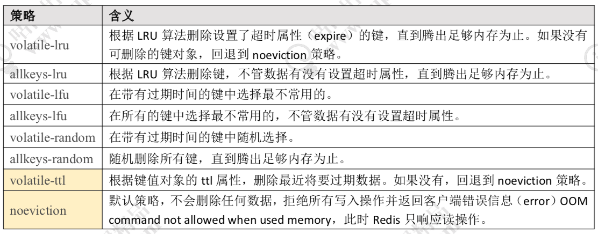
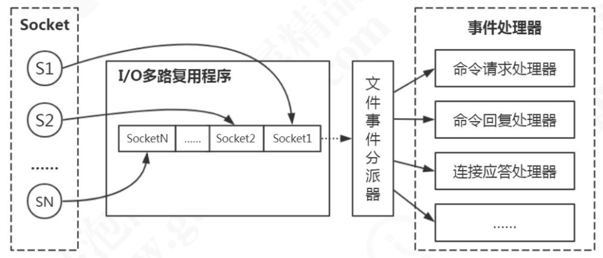

# 持久化机制

## RDB

RDB 是 Redis 默认的持久化方案。当满足一定条件的时候，会把当前内存中的数据写入磁盘，生成一个快照文件 dump.rdb。RDB文件是一个经过压缩的二进制文件，通过保存数据库中的键值对来记录。

RDB文件的载入会在服务器启动时自动执行，载入RDB时处于阻塞状态。AOF开启时服务器会优先使用AOF文件。

### 手动创建

save：生成快照的时候会阻塞，不能处理其他命令。

bgsave：通过 fork 操作创建子进程，持久化过程由子进程负责，不会记录 fork 之后后续的命令。服务器进程继续处理命令请求。

### 自动执行

redis.conf中配置save选项，shutdown 触发，flushall。

Redis服务器的serverCron函数默认执行时会检查save选项设置的条件，如果满足则会执行bgsave命令。

## AOF

AOF采用日志记录每个写操作，并追加到文中的形式来记录数据库状态。Redis 重启时会根据日志文件的内容把写指令从前到后执行一次以完成数据恢复。AOF默认不开启。

### AOF实现

AOF持久化实现可以分为命令追加、文件写入、文件同步三个步骤。

命令追加：Redis在执行一完一个写命令后，会将该命令追加到aof_buf缓冲区的末尾。

写入与同步：由于操作系统的缓存机制，AOF 数据并没有真正地写入硬盘，而是进入了系统的硬盘缓存。什么时候写入由配置决定

| appendfsync everysec配置 | 说明                             |
| ------------------------ | -------------------------------- |
| no                       | 不执行同步，由操作系统保证来同步 |
| always                   | 表示每次写入都执行同步           |
| everysec                 | 表示每秒执行一次同步，           |

### 载入还原

1. 创建一个不带网络连接的伪客户端来执行AOF文件保存的写命令。
2. 从AOF文件中分析并读取出一条写命令
3. 使用伪客户端执行被读出的写命令
4. 一直执行步骤2和3，直到AOF文件中的所有写命令都被处理完毕

### AOF重写

为了解决AOF文件体积膨胀问题，Redis 增加了重写机制。当 AOF 文件的大小超过所设定的阈值时，就会启动重写机制。AOF 重写直接读取服务器现有的键值对， 然后用一条命令去代替之前记录这个键值对的多条命令，生成一个新的文件后去替换。

AOF后台重写。将AOF重写放到子进程中执行。同时设置一个重写缓冲区，在重写过程中，执行的写命令会放入重写缓冲区中。在重写完成后将重写缓冲区中所有内容写入到新AOF文件。

## 总结

1. RDB 非常紧凑，保存了 redis 在某个时间点上的数据集。恢复大数据集的速度比 AOF 快，适合用于进行备份和灾难恢复。
2. RDB 方式数据没办法做到实时持久化/秒级持久化。
3. AOF 提供了多种的同步频率，即使使用默认的同步频率每秒同步，Redis 最多也就丢失 1 秒的数据而已。
4. AOF 文件通常会比 RDF 文件体积更大。

# 内存回收

内存回收主要分为两类，一类是 key 过期，一类是内存使用达到上限触发内存淘汰。

## 过期策略

redisDb结构的expires字典保存了数据库中所有键的过期时间，这个字典为过期字典。过期字典的键是一个指针，指向键空间中的某个对象。值是一个UNIX时间戳。

Redis 中同时使用了惰性过期和定期过期两种过期策略。

### 定时过期（主动淘汰）

每个设置过期时间的 key 都需要创建一个定时器，到过期时间就会立即清除。该策略可以立即清除过期的数据。对内存友好，但是会占用大量的 CPU 资源去处理过期的数据，从而影响缓存的响应时间和吞吐量。

### 惰性过期（被动淘汰）

只有当访问一个 key 时，才会判断该 key 是否已过期，过期则清除。该策略可以最 大化地节省 CPU 资源，却对内存非常不友好。极端情况可能出现大量的过期 key 没有再 次被访问，从而不会被清除，占用大量内存。

### 定期过期

每隔一定的时间，会扫描expires 字典中一定数量的 key，并清除其中已过期的 key。该策略是前两者的一个折中方案。通过调整定时扫描的时间间隔和 每次扫描的限定耗时，可以在不同情况下使得 CPU 和内存资源达到最优的平衡效果。

## 淘汰策略

Redis 的内存淘汰策略，是指当内存使用达到最大内存极限时，需要使用淘汰算法来 决定清理掉哪些数据，以保证新数据的存入。

### LRU

LRU，Least Recently Used。最近最少使用。判断最近被使用的时间，目前最远的数据优先被淘汰。

Redis LRU 对传统的 LRU 算法进行了改良，通过随机采样来调整算法的精度。 如果淘汰策略是 LRU，则根据配置的采样值 maxmemory_samples(默认是 5 个)，随机从数据库中选择 m 个 key， 淘汰其中热度最低的 key 对应的缓存数据。所以采样参数m配置的数值越大, 就越能精确的查找到待淘汰的缓存数据，但是也消耗更多的CPU计算，执行效率降低。

Redis 中所有对象结构都有一个 lru 字段, 对象被读写会记录 lru 值。设置为全局变量 server.lruclock 的值。默认每 100 毫秒调用函数更新一次全局变量的 server.lruclock 。

传统的LRU使用哈希表+双向链表的方式实现，需要额外的数据结构，消耗资源。同时访问次数多的可能因为访问时间晚会被先回收。

### LFU

lru 字段用作 LFU 时， 高16位用来记录访问时间，低8位用来记录访问频率。对象被读写的时候，lfu 的值会被更新。

访问频率是用基于概率的对数计数器实现的，8 位可以表示百万次的访问频率。减少的值由衰减因子 lfu-decay-time(分钟)来控制，如果值是 1 的话，N 分钟没有访问就要减少。

# 事务

Redis 的事务有两个特点：按进入队列的顺序执行。不会受到其他客户端的请求的影响。

Redis 的事务涉及到四个命令：multi(开启事务)，exec(执行事务)，discard (取消事务)，watch(监视)。

我们可以用 watch 监视一个或者多个 key，如果开启事务之后，至少有一个被监视 key 键在 exec 执行之前被修改了， 那么整个事务都会被取消(key 提前过期除外)。可以用 unwatch 取消。

事务执行遇到的问题分成两种，一种是在执行 exec 之前发生错误，一种是在执行 exec 之后发生错误。

在执行 exec 之前发生错误，比如入队的命令存在语法错误，包括参数数量，参数名等等编译器错误，在这种情况下事务会被拒绝执行，也就是队列中所有的命令都不会得到执行。

在执行 exec 之后发生错误，比如，类型错误，比如对 String 使用了 Hash 的命令等运行时错误，这种发生了运行时异常的情况下， 只有错误的命令没有被执行，但是其他命令没有受到影响。

Redis 的这种事务机制不能用来实现原子性，保证数据的一致。

# 事件

Redis 基于Reactor 模式开发了自己的网络事件处理器： 这个处理器被称为文件事件处理器。文件事件处理器由套接字、 I/O 多路复用程序、 文件事件分派器以及事件处理器四部分组成。

文件事件是对套接字操作的抽象， 每当一个套接字准备好执行连接应答、写入、读取、关闭等操作时， 就会产生一个文件事件。

I/O 多路复用程序负责监听多个套接字， 将所有产生事件的套接字都入队到一个队列里面， 然后通过这个队列向文件事件分派器传送套接字。

文件事件分派器接收 I/O 多路复用程序传来的套接字， 并根据套接字产生的事件的类型， 调用相应的事件处理器。这些处理器是一个个函数， 它们定义了某个事件发生时， 服务器应该执行的动作。

## I/O多路复用

在select/poll时代，服务器进程每次都把所有连接告诉操作系统(从用户态复制句柄数据结构到内核态)。让操作系统内核去查询这些套接字(socket)上是否有事件发生，轮询完后，再将句柄数据复制到用户态，让服务器应用程序轮询处理已发生的网络事件，这一过程资源消耗较大，因此，select/poll一般只 能处理几千的并发连接。

redis利用epoll来实现IO多路复用。epoll是poll的一种优化 。

epoll会再建立一个list链表，用于存储准备就绪的事件，当epoll_wait调用时，仅仅观察这个list链表里有没有数据即可。

