# 数据结构

## 简单字符串SDS

Redis中字符串的实现。

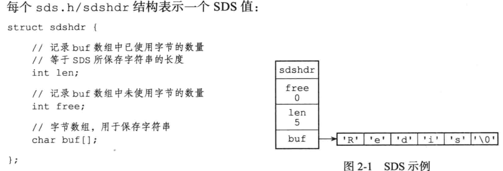

### SDS特点

1. 不用担心内存溢出问题，如果需要会对 SDS 进行扩容

2. 获取字符串长度时间复杂度为 O(1)，因为定义了 len 属性

3. 通过“空间预分配”( sdsMakeRoomFor)和“惰性空间释放”，防止多

   次重分配内存。

   * 空间预分配。对 SDS 进行扩展， 会为 SDS 分配修改所必须要的空间和额外的未使用空间。
   * 惰性空间释放。缩短 SDS 保存的字符串时， 不立即使用内存重分配来回收缩短后多出来的字节， 而是使用 free属性将这些字节的数量记录起来， 并等待将来使用。

4. 判断是否结束的标志是 len 属性，能保存二进制数据，二进制安全。

## 链表

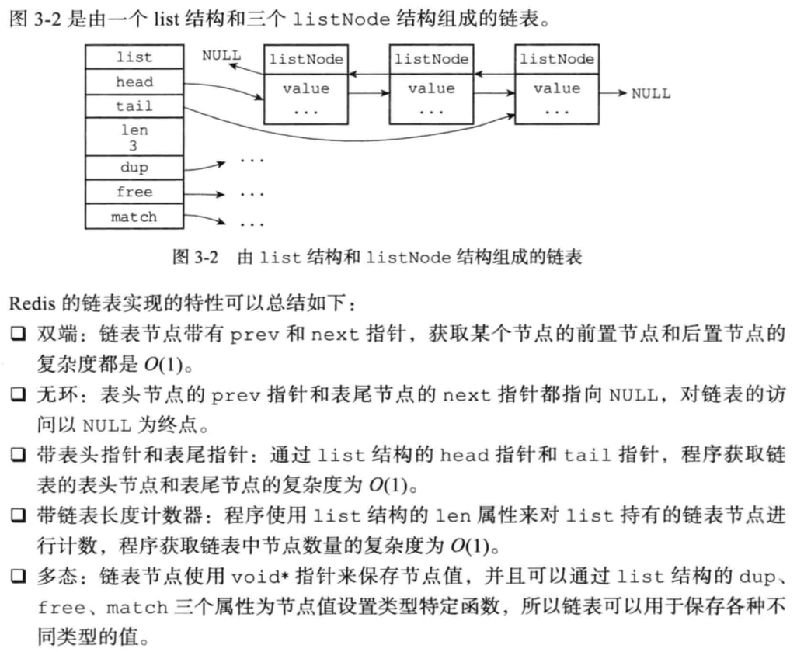

## 跳跃表skiplist

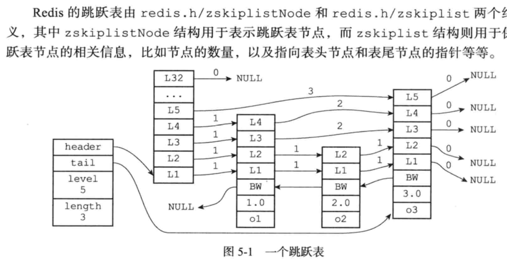

跳表查询、插入、删除的时间复杂度为O(log n)

### 跳跃表节点

```c
typedef struct zskiplistNode {
  //层
  struct zskiplistLevel { 
    //前进指针，对应 level 的下一个节点
    struct zskiplistNode *forward;
    //从当前节点到下一个节点的跨度(跨越的节点数)
    unsigned long span;     
  } level[]; 
  robj *obj; //成员对象
  double score; //分值
  struct zskiplistNode *backward; //后退指针 
} zskiplistNode;
```

1. 层。level数组可以包含多个元素。每个元素都包含指向其他节点的前进指针，即每一层都有一个前进指针。每次创建一个新节点时，根据幂次定律（越大的数出现的概率越小）随机生成一个1到32之间的层数。
2. 跨度。记录两个节点之间的距离。用来计算节点在跳跃表中的排位。
3. 后退指针。用于从表尾向前访问节点，每个节点只有一个后退指针。
4. 分值。节点按照分值大小进行排序。分值相同则按照字典序排序。

### 跳跃表

通过一个zskiplist结构来记录跳跃表节点。

1. header。指向跳跃表的表头节点。
2. tail。指向跳跃表的表尾节点。
3. level。层数最大的节点的层数。
4. length。包含节点的数量

## 压缩列表

 经过特殊编码的双向链表，它不存储指向上一个链表节点和指向下一 个链表节点的指针，而是存储上一个节点长度和当前节点长度，通过牺牲部分读写性能， 来换取高效的内存空间利用率，是一种时间换空间的思想。只用在字段个数少，字段值小的场景里面。

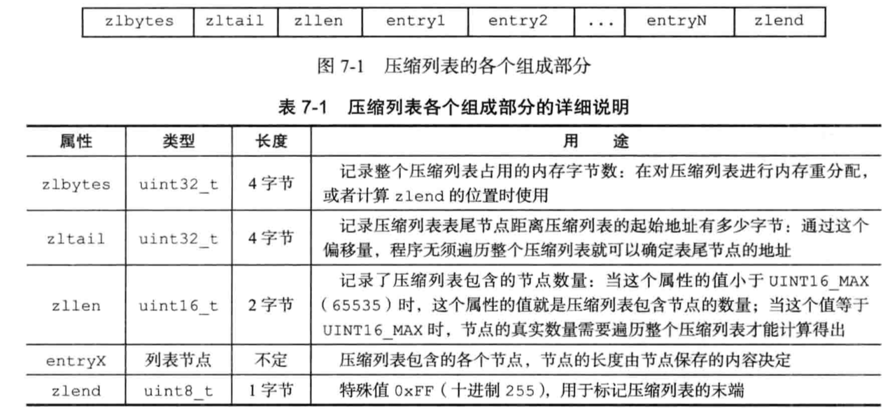

每个压缩列表节点可以保存一个字节数组或者一个整数值。每个压缩列表节点都由 previous_entry_length 、 encoding 、 content 三个部分组成。

previous_entry_length记录了压缩列表中前一个节点的长度。encoding记录了节点所保存数据的类型以及长度。content 保存节点的值。

### 连锁更新

 如果前一节点的长度小于 254字节， 那么 revious_entry_length需要用 1字节保存这个长度值。大于等于 254字节， 则需要5字节。

在一个压缩列表中， e1 至 eN的长度都介于250到253字节之间。如果e1中保存的revious_entry_length从一字节拓展为5字节，那么会引发e2到eN的拓展，需要不断对压缩列表执行空间充分配操作。

## 字典

Redis中字典使用哈希表作为底层实现。一个哈希表里面可以有多个哈希表节点， 而每个哈希表节点就保存了字典中的一个键值对。

### 哈希表和哈希节点

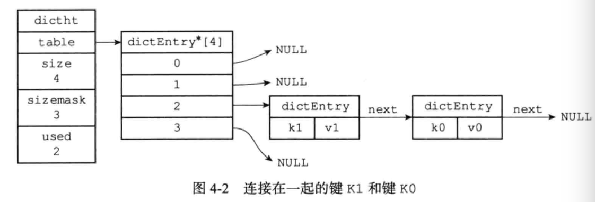

左边是哈希表结构，table属性是一个dictEntry 数组， 每个元素保存着一个键值对。size属性记录了哈希表的大小， 也即是 table数组的大小。used记录了哈希表目前已有节点（键值对）的数量。sizemask等于 size - 1， 这个属性和哈希值一起决定一个键应该被放到 table数组的哪个索引上面。

右边是哈希表节点，next 是指向另一个哈希表节点的指针，  以此来解决键冲突的问题。并且将新节点添加到链表表头。

### 字典

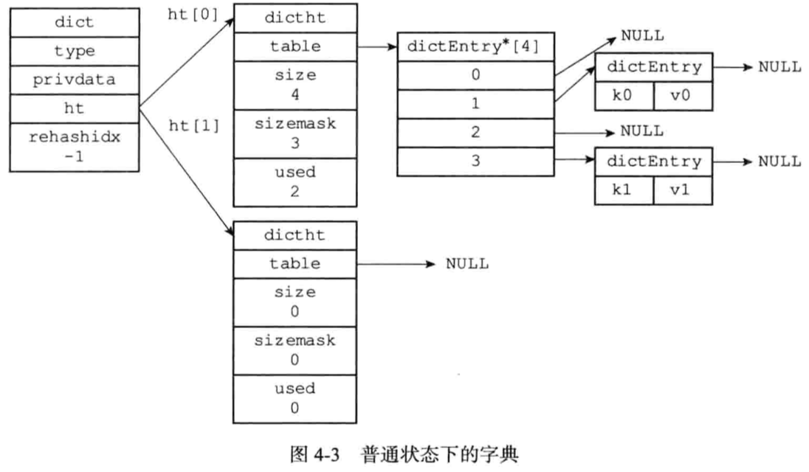

ht是一个包含两个哈希表的数组， 字典只使用 ht[0]，ht[1]只在对 ht[0]进行 rehash 时使用。rehashidx记录了 rehash 目前的进度，-1表示没有在进行 rehash 。type保存了一组操作健值对的函数，如计算hash值，复制值的函数等。

### rehash

哈希表的负载因子：`load_factor = ht[0].used / ht[0].size`

哈希表进行拓展：没有执行 BGSAVE 或 BGREWRITEAOF 命令， 负载因子大于等于 1；正在执行 BGSAVE 或 BGREWRITEAOF 命令， 负载因子大于等于 5 。

哈希表收缩：负载因子小于 0.1。

rehash步骤如下：

1. 为字典的ht[1]分配空间。如果执行的是扩展操作， ht[1]的大小为第一个大于等于 ht[0].used * 2 的 2^n。如果执行的是收缩操作， 那么 ht[1]的大小为第一个大于等于 ht[0].used的 2^n 。
2. 将保存在 ht[0]中的所有键值对 rehash 到 ht[1]上面。rehash 指的是重新计算键的哈希值和索引值， 然后将键值对放置到 `ht[1]` 哈希表的指定位置上。
3. 释放 ht[0] ， 将 ht[1]设置为 ht[0]， 并在 ht[1] 新创建一个空白哈希表， 为下一次 rehash 做准备。

### 渐进式rehash

1. 为 ht[1]分配空间， 让字典同时持有 ht[0] 和 ht[1] 两个哈希表。
2. 在字典中维持一个索引计数器变量 rehashidx ， 并将它的值设置为 0  表示 rehash 工作正式开始。
3. 在 rehash 进行期间， 每次对字典执行添加、删除、查找或者更新操作时， 程序除了执行指定的操作以外， 还会顺带将 ht[0]哈希表在 rehashidx索引上的所有键值对 rehash 到 ht[1] ， 当 rehash 工作完成之后， 将 rehashidx 属性的值增一。
4.  ht[0]的所有键值对被 rehash 至 ht[1]后， 将 rehashidx属性的值设为 -1 ， 表示 rehash 操作已完成。

在渐进式 rehash 进行期间， 字典的删除、查找、更新等操作会在两个哈希表上进行。新添加的键值对一律会被保存到 ht[1] 里面。

## 整数集合

用于保存整数值的数据结构。 它可以保存类型为 `int16_t` 、 `int32_t` 或者 `int64_t` 的整数值， 并且保证集合中不会出现重复元素。

每个整数集合包含了编码方式，元素个数，保存元素的数组。

## 快速列表quicklist

quicklist(快速列表)是 ziplist 和 linkedlist 的结合体。

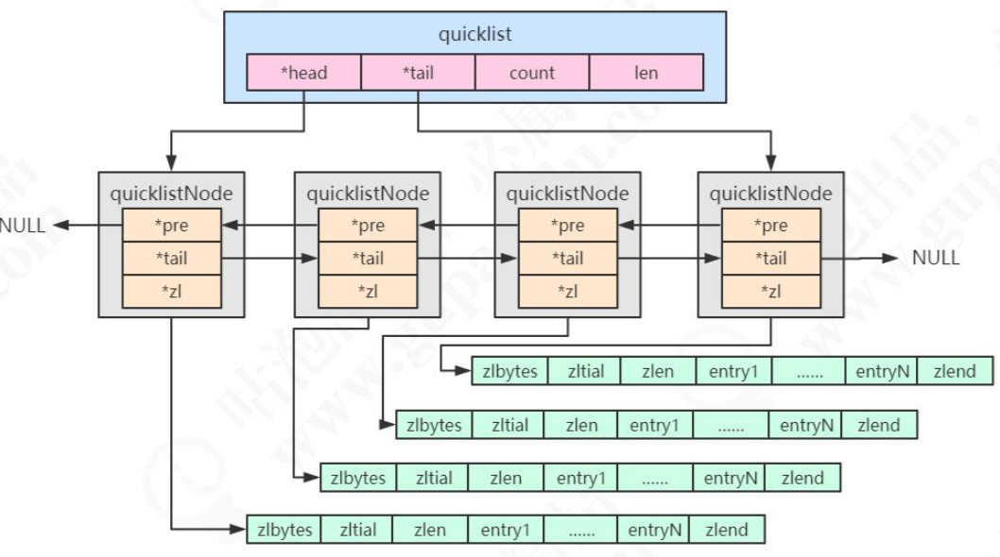

```c
typedef struct quicklist {
  quicklistNode *head; /* 指向双向列表的表头 */ 
  quicklistNode *tail; /* 指向双向列表的表尾 */
  unsigned long count;/* 所有的 ziplist 中一共存了多少个元素 */
  unsigned long len; /* 双向链表的长度，node 的数量 */
  int fill : 16;
  unsigned int compress : 16; /* 压缩深度，0:不压缩; */
} quicklist;

typedef struct quicklistNode {
  struct quicklistNode *prev; /* 前一个节点 */
  struct quicklistNode *next; /* 后一个节点 */
  unsigned char *zl; /* 指向实际的 ziplist */
  unsigned int sz; /* 当前 ziplist 占用多少字节 */
  unsignedintcount:16;/* 当前ziplist中存储了多少个元素，占16bit*/ 
  unsigned int   encoding : 2; //是否采用LZF压缩算法压缩节点
  unsigned int   recompress : 1; //ziplist是否被解压出来临时使用
} quicklistNode;
```

# 数据类型

## 键空间

Redis 基于数据结构创建了字符串对象、列表对象、哈希对象、集合对象和有序集合对象这五种类型的对象。 Redis 可以在执行命令之前， 根据对象的类型来判断一个对象是否可以执行给定的命令。同时针对不同的使用场景， 为对象设置多种不同的数据结构实现， 从而优化对象在不同场景下的使用效率。

Redis 中的每个数据库都由一个 redis.h/redisDb 结构表示。 其中， redisDb 结构的 dict 字典保存了数据库中的所有键值对， 我们将这个字典称为键空间（key space）。

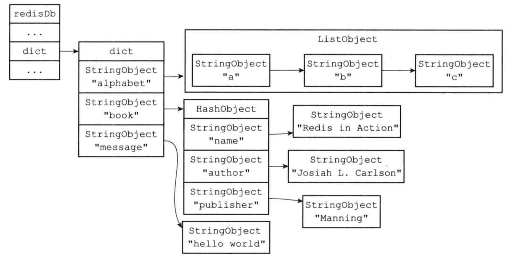

键空间的键也就是数据库的键， 每个键都是一个字符串对象。键空间的值也就是数据库的值，可以是任意一种 Redis 对象。通过 redisObject 来存储 。

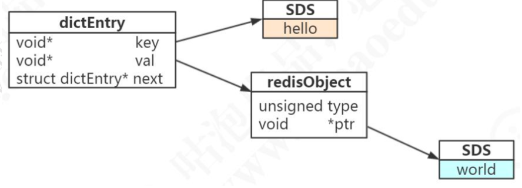

```c
typedef struct redisObject {
  unsigned type:4; // 对象的类型
  unsigned encoding; // 编码，具体的数据结构
  unsigned lru:LRU_BITS; //对象最后一次被访问的时间，与内存回收有关 
  int refcount; // 引用计数。 refcount为0的时可以进行垃圾回收了
  void *ptr; // 指向对象实际的数据结构的指针
} robj;
```


## 字符串

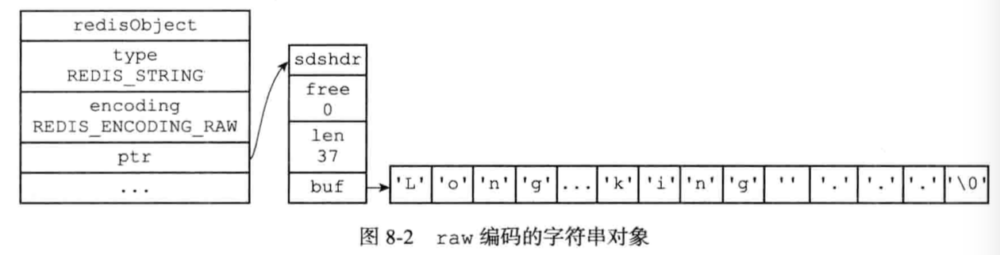

字符串类型的内部编码有三种；

1. int，存储long类型的整数
2. embstr。存储小于 44 个字节的字符串。通过调用一次内存分配获得一块连续的空间， 依次包含 redisObject和 sdshdr 两个结构。是只读的，在对 embstr 对象进行修改时，先转化为 raw。

3. raw。存储大于 44 个字节的字符串。调用两次内存分配函数来分别创建 redisObject 结构和 sdshdr 结构。

## 列表

在早期的版本中，数据量较小时用 ziplist 存储，达到临界值时转换为 linkedlist 进行存储，3.2 版本之后，统一用 quicklist 来存储。quicklist 存储了一个双向链表，每个节点 都是一个 ziplist。

## 哈希

哈希对象的编码可以是 `ziplist` 或者 `hashtable` 。

### 压缩列表

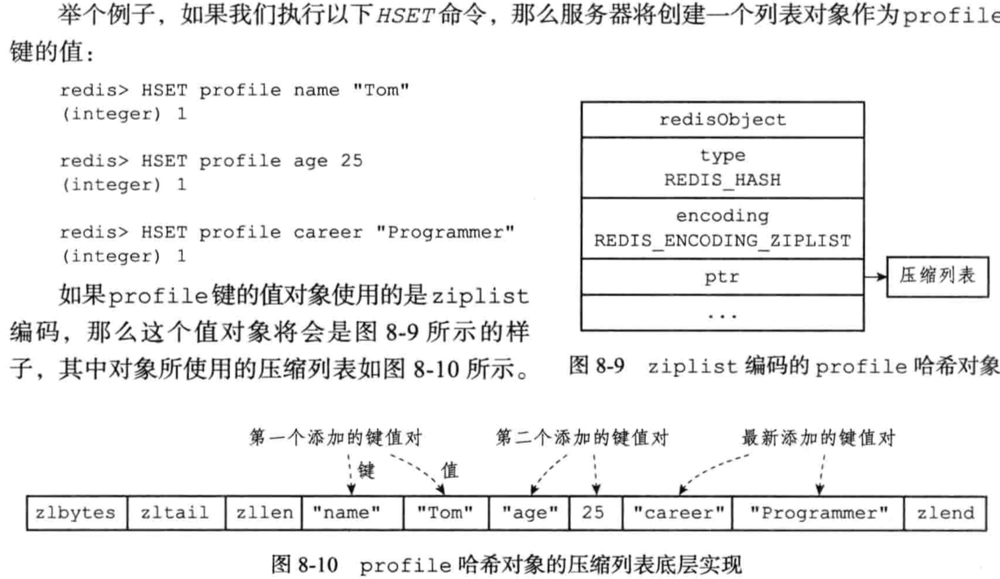

### 哈希

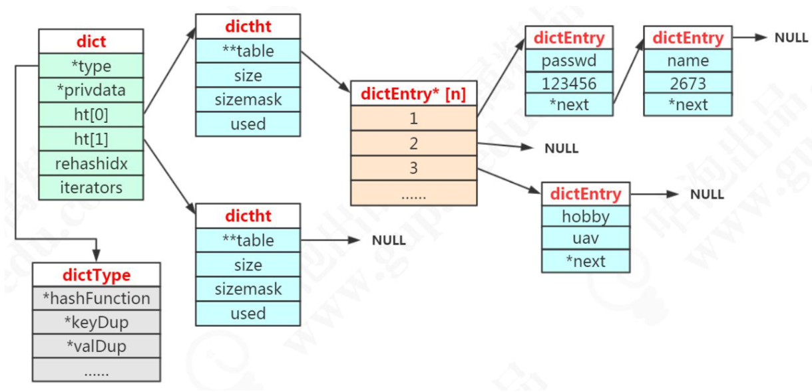

### 编码转换

当哈希对象可以同时满足以下两个条件时，哈希对象使用 `ziplist` 编码

1. 哈希对象保存的所有键值对的键和值的字符串长度都小于 `64` 字节；
2. 哈希对象保存的键值对数量小于 `512` 个；

## 集合

集合对象的编码可以是 `intset` 或者 `hashtable` 。

使用哈希作为底层实现时，key就是集合的值， value为null 。

intset编码：所有元素都是整数值或者保存的元素数量不超过 512 个

## 有序集合

有序集合的编码可以是 `ziplist` 或者 `skiplist` 。

 使用压缩列表时，每个集合元素使用两个压缩列表节点来保存， 第一个节点保存元素的值，第二个节点保存元素的分值。

使用跳跃表时，采用 `zset` 结构作为底层实现， 一个 `zset` 结构同时包含一个哈希表和一个跳跃表。这样查找和范围型操作都能快速执行。

使用 压缩列表：元素数量小于 128 个或者所有元素成员的长度都小于 64 字节。

## BitMaps

Bitmaps 是在字符串类型上面定义的位操作。一个字节由 8 个二进制位组成。

## **Hyperloglogs**

提供了一种不太准确的基数统计方法，比如统计网站的 UV，存在一定的误差。

