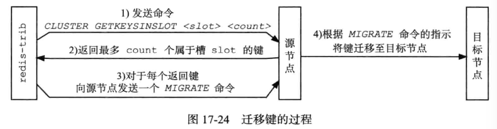
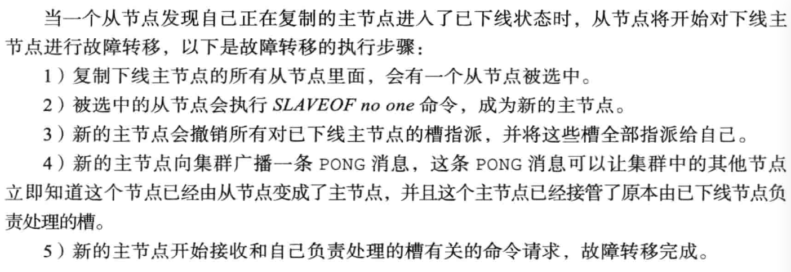
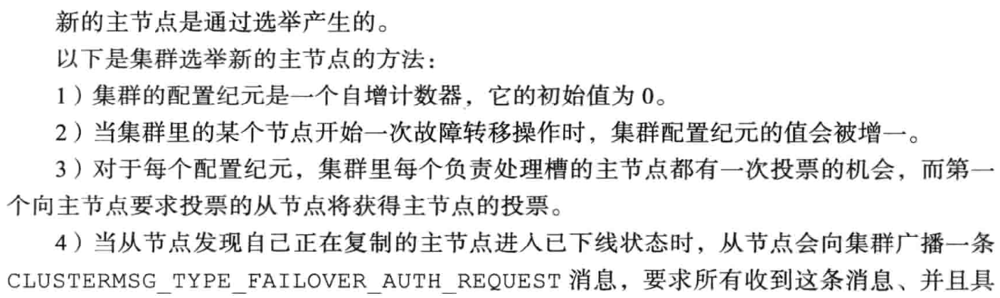
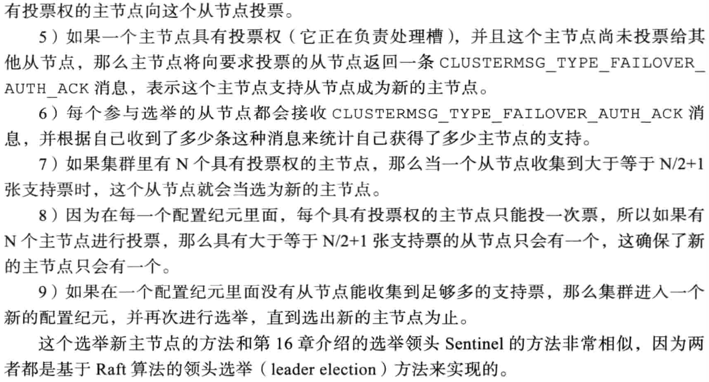

# 主从复制

## 配置

从节点不能写入数据(只读)，只能从 master 节点同步数据。

每个 slave 节点的 redis.conf 配置文件增加一行

`slaveof 192.168.8.203 6379`

## 原理

### 连接阶段

slave node 启动时(执行 slaveof 命令)，会在自己本地保存 master node 的信息。同时跟 master node 建立 socket 网络连接，如果连接成功，从节点为该 socket 建立一个专门处理复制工作的文件 事件处理器，负责后续的复制工作，如接收 RDB 文件、接收命令传播等。

slave node 内部有个定时任务每隔一秒钟检查是否有新的 master node 要连接和复制。当从节点变成了主节点的一个客户端之后，会给主节点发送 ping 请求。

### 数据同步阶段

#### 完整重同步

通过 bgsave 命令在本地生成一份 RDB快照，将RDB快照文件发给slave node。 slave node 首先清除自己的旧数据，然后用 RDB 文件加载数据。开始生成 RDB 文件时，master 会把所有新的写命令缓存在内存中。在 slave node保存了RDB之后，再将新的写命令复制给 slave node。

#### 部分重同步

主服务器和从服务器会分别维护一个复制偏移量。同时主服务器进行命令传播时还会将命令写入复制积压缓冲区中。

如果从服务器的复制偏移量仍然存在于复制积压缓冲区中，执行部分重同步，否则执行完整重同步。

### 命令传播

master node 持续将写命令，异步复制给 slave node。

## 缺点

主从模式解决了数据备份和性能(通过读写分离)的问题。但是RDB文件过大时同步非常耗时。如果主服务器挂了，对外提供的服务就不可用了，单点问题没有得到解决。

# Sentinel哨兵

Sentinel可以监视任意多个主服务器，并在主服务器下线时自动将下线主服务器下的某个从服务器升级为新的主服务器。 同时Sentinel之间也互相监控。Sentinel本质上是一个运行在特殊模式之下的 Redis。

## Sentinel初始化

1. `redis-sentinel /path/to/your/sentinel.conf`启动服务，将服务中代码替换成Sentinel专有代码。初始化Sentinel状态
2. 根据给定的配置文件， 初始化 Sentinel 的监视主服务器列表。创建命令连接和订阅连接。通过INFO命令获取主服务器和从服务器的信息
3. 通过接收其他Sentinel发送的信息，更新其他Sentinel信息。

## 故障转移

### 服务下线

Sentinel 默认以每秒钟 1 次的频率向 Redis 服务节点发送 PING 命令。如果在 down-after-milliseconds 内都没有收到有效回复，Sentinel 会将该服务器标记为下线。

这个时候 Sentinel 节点会继续询问其他的 Sentinel 节点，确认这个节点是否下线， 如果多数 Sentinel 节点都认为 master 下线，master 才真正确认被下线(客观下线)， 这个时候就需要重新选举 master。

### Sential选举

Sentinle 通过 Raft 算法，实现 Sentinel 选举。Raft 的核心思想是先到先得，少数服从多数。步骤如下：

1. Sentinel要求其他Sentinel将自己设置为局部领头Sentinel。即向目标Sentinel发送命令，包含自身的runID
2. 目标Sentinel将最先发送命令的Sentinel设置为局部领头Sentinel，并回复leader_runid参数和leader_epoch。
3. 源Sentinel在接收到命令回复之后，检查配置纪元和运行ID一致，如果相同表示目标 Sentinel将自己设置成了局部领头Sentinel。
4. 如果某个Sentinel被半数以上的Sentinel设置成了局部领头Sentinel，那么这个Sentinel成为领头Sentinel。
5. 如果在给定时限内，没有一个Sentinel被选举为领头Sentinel，那么各个Sentinel将在一段时间之后再次进行选举，直到选出领头Sentinel。

### 故障转移

1. 选出 Sentinel Leader 之后，由 Sentinel Leader 向某个节点发送 slaveof no one 命令，让它成为主服务器。
2. 向其他节点发送slaveof 命令去复制新的主服务器
3. 将旧的主服务器变为从服务器。

主节点选举，一共有四个因素影响选举的结果，分别是断开连接时长、优先级排序、复制偏移量、进程 id。

## 缺点

主从切换的过程中会丢失数据，因为只有一个 master。 只能单点写，没有解决水平扩容的问题。

# Redis Cluster

## 数据结构

`clusterNode` 结构保存了一个节点的当前状态， 比如节点的创建时间， 节点的名字，节点当前的配置纪元，节点的IP和地址。每个节点都会使用一个 `clusterNode` 结构来记录自己的状态， 并为集群中的所有其他节点（包括主节点和从节点）都创建一个相应的 `clusterNode` 结构。

每个节点都保存着一个 `clusterState` 结构， 这个结构记录了在当前节点的视角下， 集群目前所处的状态 —— 比如集群是在线还是下线， 集群包含多少个节点， 集群当前的配置纪元

## 槽（slot）

集群的整个数据库被分为16384个槽（slot），数据库中的每个键都属于其中一个槽。如果数据库中有任何一个槽没有得到处理，集群就处于下线状态。

Redis集群通过clusterState结构中的slots数组属性记录槽指派信息。slots数组包含18365个项，每一项都是一个指向clusterNode结构的指针。

clusterNode结构的slots属性和numslot属性记录了自己负责处理哪些槽。其中slots属性是二进制数组，长度是16384个二进制位。每个二进制位都代表一个槽位置，根据对应索引上的二进制为的值来判断节点是否处理该槽（0表示不处理，1表示处理）。节点会将自己的slots数组发送给其他节点来通知其他节点自己负责处理哪些槽。

节点利用跳跃表来保存槽和键之间的关系。跳跃表每个节点的分值都是一个槽号，每个节点的成员都是一个数据库键。

对象分布到 Redis 节点上时，对 key 用 CRC16 算法计算再%16384，得到一个 slot 的值，数据落到负责这个 slot 的 Redis 节点上。在 key 里面加入{hash tag}即可让某些数据分布到一个节点上。

### 重新分片

因为 key 和 slot 的关系是永远不会变的，当新增了节点的时候，需要把原有的 slot 分配给新的节点负责，并且把相关的数据迁移过来。

重新分片由redis-trib负责执行，redis向源节点和目标节点发送命令来进行重新分片。

## 复制

向一个节点发送 cluser replicae <node_id>，成为node_id所指定节点的从节点。然后进行主从复制。

## 故障转移

### 服务下线

集群中每个节点会定期的向集群中的其他节点发送PING消息，如果没有在规定时间内返回PONG消息，那么节点会被标记为疑似下线。

半数以上的主节点都将某个主节点标记为疑似下线，那么这个主节点将会被标记为已下线，并且会通过集群广播的方式发送主节点X被FAIL的消息，所有收到消息的节点都会将主节点X标记为已下线。

## 故障转移

### Master选举

