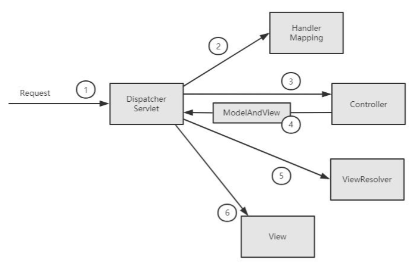

# Spring MVC 请求处理流程

1. 客户端发起request请求
2. 转发至对应的controller
3. 业务逻辑处理，设置Model和返回页面
4. 转发至视图处理器，基于模版和模型转化输出
5. 基于response返回



# 源码分析

## 1.初始化

IOC 容器初始化之后，最后调用了onRefresh()方法，初始化 Spring MVC 的九大组件。

```java
//多文件上传的组件 
initMultipartResolver(context); 
//初始化本地语言环境 
initLocaleResolver(context); 
//初始化模板处理器 
initThemeResolver(context); 
//handlerMapping 
initHandlerMappings(context); 
//初始化参数适配器 
initHandlerAdapters(context); 
//初始化异常拦截器 
initHandlerExceptionResolvers(context); 
//初始化视图预处理器 
initRequestToViewNameTranslator(context); 
//初始化视图转换器 
initViewResolvers(context);
//FlashMap 管理器
initFlashMapManager(context);
```

## 2.HandlerMapping

获取 ApplicationContext 容器中所有 bean 的 Name，遍历 beanNames,并找到这些 bean 对应的 url，保存 urls 和 beanName 的对应关系，Map<urls,beanName>。

## 3.调用

从 Map<urls,beanName>中取得 Controller 后，经过拦截器的预处理方法，再通过反射获取该方法上的注解和参数，解析方法和参数上的注解，然后反射调用方法获取ModelAndView 结果视图。最后，调用的就是 RequestMappingHandlerAdapter 的 handle()中的核心逻辑由 handleInternal(request, response, handler)实现。

整个处理过程中最核心的逻辑其实就是拼接 Controller 的 url 和方法的 url，与 Request 的 url 进行匹配，找到匹配的方法

Spring MVC 中提供两种 Request 参数到方法中参数的绑定方式

1. 通过注解进行绑定，@RequestParam。
2. 通过参数名称进行绑定。

使用注解进行绑定，我们只要在方法参数前面声明@RequestParam("name")，就可以 将 request 中参数 name 的值绑定到方法的该参数上。使用参数名称进行绑定的前提是 必须要获取方法中参数的名称，Java 反射只提供了获取方法的参数的类型，并没有提供 获取参数名称的方法。SpringMVC 解决这个问题的方法是用 asm 框架读取字节码文件， 来获取方法的参数名称。