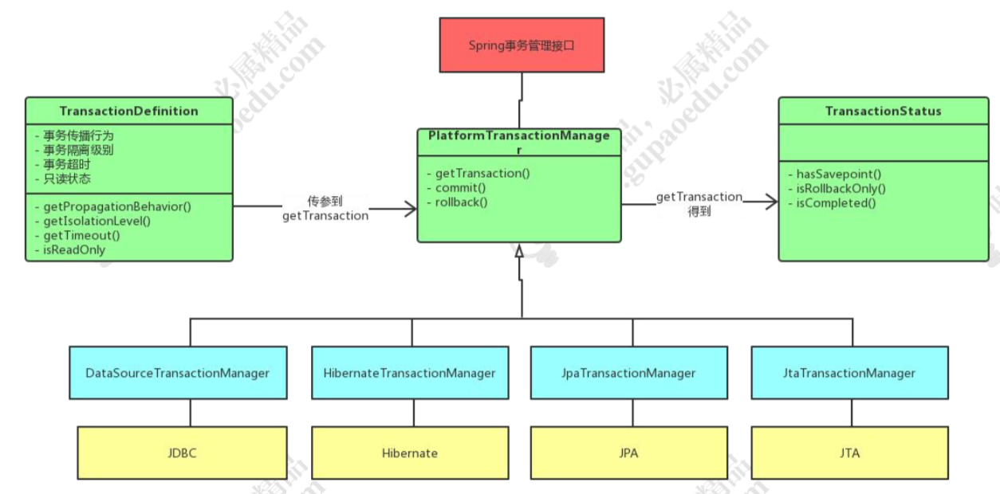

# 事务的传播属性

spring 事务的传播属性，就是定义在存在多个事务同时存在的时候，spring 应该如 何处理这些事务的行为。这些属性在 TransactionDefinition 中定义。

| 常量名称                  | 常量解释                                                     |
| ------------------------- | ------------------------------------------------------------ |
| PROPAGATION_REQUIRED      | 支持当前事务，如果当前没有事务，就新建一个事务，Spring 默认的事务的传播 |
| PROPAGATION_REQUIRES_NEW  | 新建事务，如果当前存在事务，把当前事务 挂起。新建的事务将和被挂起的事务没有任 何关系，是两个独立的事务，外层事务失败 回滚之后，不能回滚内层事务执行的结果， 内层事务失败抛出异常，外层事务捕获，也 可以不处理回滚操作 |
| PROPAGATION_SUPPORTS      | 支持当前事务，如果当前没有事务，就以非事务方式执行。         |
| PROPAGATION_MANDATORY     | 支持当前事务，如果当前没有事务，就抛出异常。                 |
| PROPAGATION_NOT_SUPPORTED | 以非事务方式执行操作，如果当前存在事务，就把当前事务挂起。   |
| PROPAGATION_NEVER         | 以非事务方式执行，如果当前存在事务，则抛出异常。             |
| PROPAGATION_NESTED        | 如果一个活动的事务存在，则运行在一个嵌套的事务中。如果没有活动事务，则按 REQUIRED 属性执行。它使用了一个单独的 事务，这个事务拥有多个可以回滚的保存 点。内部事务的回滚不会对外部事务造成影 响。它只对 DataSourceTransactionManager 事务管 理器起效。 |

# Spring隔离级别

| 常量                       | 解释                                                         |
| -------------------------- | ------------------------------------------------------------ |
| ISOLATION_DEFAULT          | 默认的隔离级别，使用数据库的事务隔离级别。                   |
| ISOLATION_READ_UNCOMMITTED | 允许另外一个事务可以看到这个事务未提交的数据                 |
| ISOLATION_READ_COMMITTED   | 保证一个事务修改的数据提交后才能被另 外一个事务读取          |
| ISOLATION_REPEATABLE_READ  | 这种事务隔离级别可以防止脏读，不可重复 读。但是可能出现幻像读。 |
| ISOLATION_SERIALIZABLE     | 这是花费最高代价但是最可靠的事务隔离 级别。事务被处理为顺序执行。 |

# 事务不生效

调用的方法必须是public，否则事务不起作用。这一点由Spring的AOP特性决定的。

Spring的事务管理默认只对出现运行期异常(java.lang.RuntimeException及其子类)进行回滚

在同一个类中一个无事务的方法调用另一个有事务的方法，事务是不会起作用的。没有通过代理去走此方法，从而没有开启事务.

propagation 设置错误

# Spring事务的三大接口

# 实现原理

## 创建

`Spring` 在初始化时候，如果遇到诸如 `<tx:annotation-driven>` 开头的配置后，将会使用 `AnnotationDrivenBeanDefinitionParser` 解析器的 `parse` 方法进行解析。

与 `AOP` 一样，在解析时，会创建一个自动创建代理器，在事务 `TX` 模块中，使用的是 `InfrastructureAdvisorAutoProxyCreator`。

`Spring` 中的事务默认是以 `AOP` 为基础。 `bean` 实例化时，`Spring`都会保证调用其`postProcessAfterInitialization` 方法。在匹配 `match`操作中，区别的是 `AOP` 识别的是 `@Before` 、`@After`，而我们的事务 识别的是 `@Transactional`标签。

## 调用

获取拦截器链时，判断是否调用事务拦截器。进行invokeWithinTransaction反射调用

反射调用过程中，获取事务的属性，加载事务管理器，获取事务信息。然后执行目标方法，最后提交或者回滚。