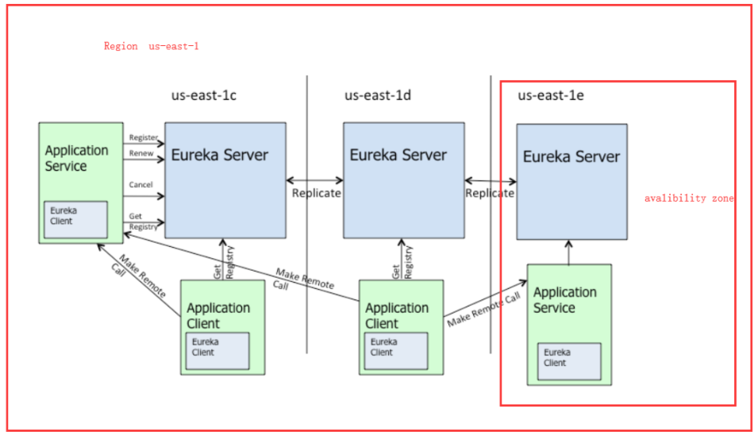
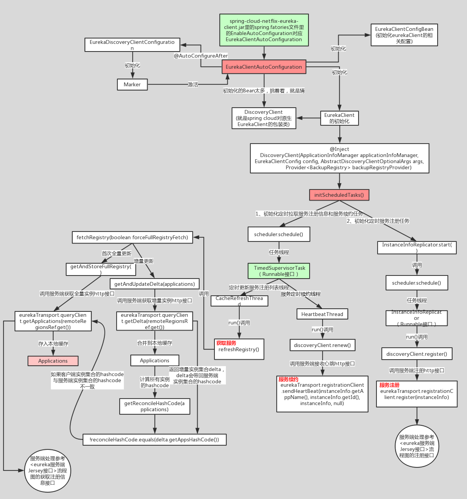
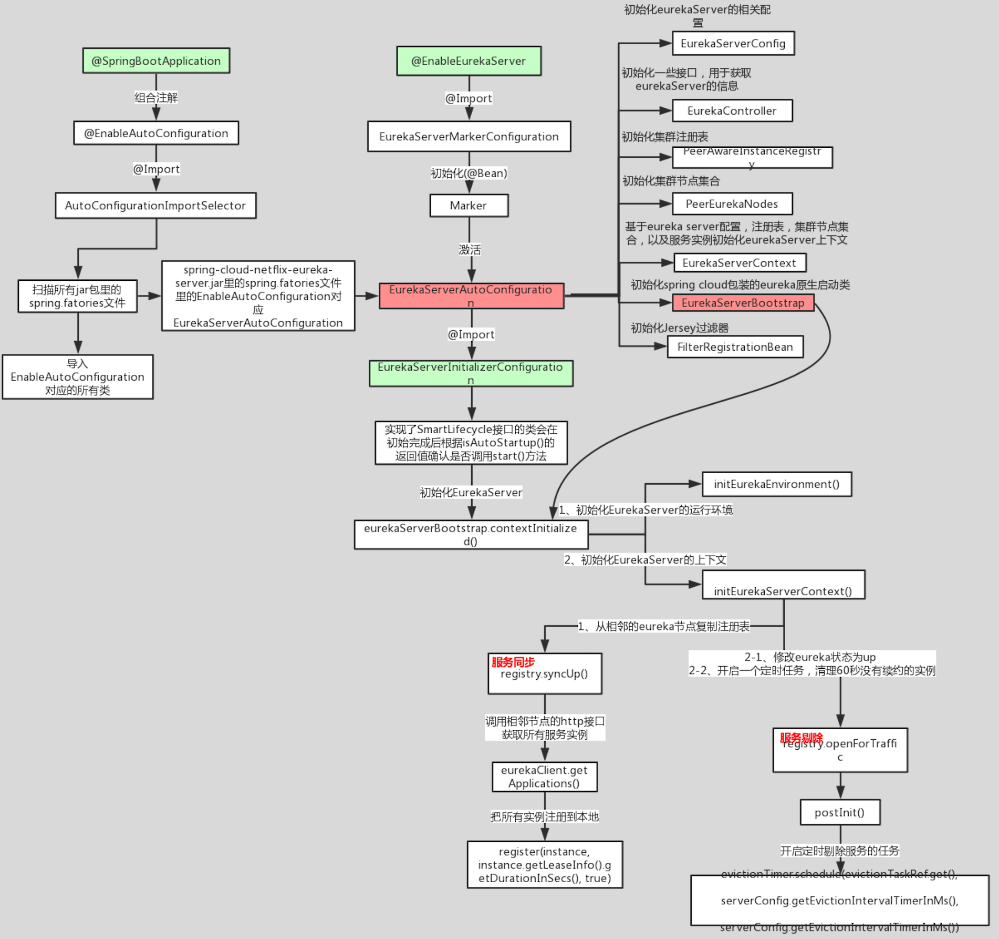
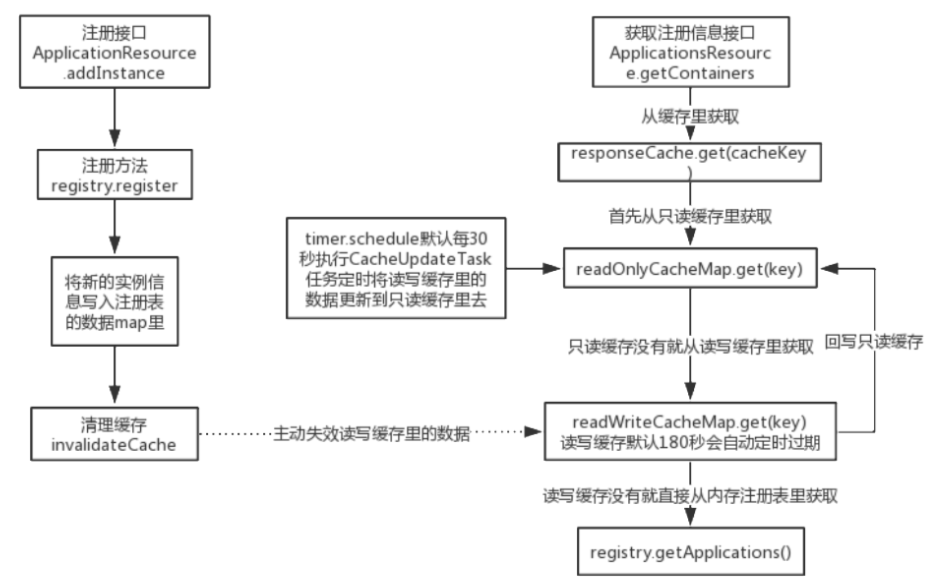

# 架构图



# 核心功能

## 服务注册

Eureka Client会通过发送REST请求的方式向Eureka Server注册自己的服务，提供自身的元数据，比如ip地址、端口、运行状况指标的url、主页地址等信息。Eureka Server接收到注册请求后，就会把这些元数据信息存储在一个双层的Map中。

## 服务续约

在服务注册后，Eureka Client会维护一个心跳来持续通知Eureka Server，说明服务一直处于可 用状态，防止被剔除。Eureka Client在默认的情况下会每隔30秒(eureka.instance.leaseRenewallIntervalInSeconds)发送一次心跳来进行服务续约。

## 服务同步

Eureka Server之间会互相进行注册，构建Eureka Server集群，不同Eureka Server之间会进行服务同步，用来保证服务信息的一致性。

## 获取服务

服务消费者(Eureka Client)在启动的时候，会发送一个REST请求给Eureka Server，获取上面注册的服务清单，并且缓存在Eureka Client本地，默认缓存30秒 (eureka.client.registryFetchIntervalSeconds)。同时，为了性能考虑，Eureka Server也会维护一份只读的服务清单缓存，该缓存每隔30秒更新一次。

## 服务调用

服务消费者在获取到服务清单后，就可以根据清单中的服务列表信息，查找到其他服务的地址，从而进行远程调用。Eureka有Region和Zone的概念，一个Region可以包含多个Zone，在进行服务调用时，优先访问处于同 一个Zone中的服务提供者。

## 自我保护机制

Eureka Server每分钟的续约数量要大于85%，如果低于 85%，Eureka Server 会将这些实例保护起来，让这些实例不会过期，但是在保护期内如果服务刚好这个服务提供者非正常下线了，此时服务消费者就会拿到一个无效的服务实例，此时会调用失败

# 客户端源码



## 服务注册

在两种情况下客户端会主动向服务端发送自己的注册信息

1. 当客户端刚刚启动的时候。
2. 当客户端的instance信息发生改变时，Eureka-Client和Server端信息不一致时。定时线程，每40秒执行一次。当instance的状态发生变更的时候，会有statusChangeListener 这个监听器监听到去执行服务注册。

```java
class InstanceInfoReplicator implements Runnable {   
  public void start(int initialDelayMs) {       
    if (started.compareAndSet(false, true)) {          
      // 首次进来设置一下。            
      instanceInfo.setIsDirty();  // for initial register            
      // 开启定时线程,每initialDelayMs秒执行一次该任务。服务注册也由这个任务完成            
      Future next = scheduler.schedule(this, initialDelayMs, TimeUnit.SECONDS);            
      scheduledPeriodicRef.set(next);        
    }    
  }       
  public void run() {        
    try {          
      // 刷新实例信息。            
      discoveryClient.refreshInstanceInfo();            
      // 判断实例信息是否不一致            
      Long dirtyTimestamp = instanceInfo.isDirtyWithTime();            
      if (dirtyTimestamp != null) {               
        // 注册自己的服务             
        discoveryClient.register();              
        instanceInfo.unsetIsDirty(dirtyTimestamp);            
      }       
    } catch (Throwable t) {            
      logger.warn("There was a problem with the instance info replicator", t);       
    } finally {            
      Future next = scheduler.schedule(this, replicationIntervalSeconds, TimeUnit.SECONDS);            
      scheduledPeriodicRef.set(next);      
    }
  }
```

## 服务拉取

TimedSupervisorTask是固定间隔的周期性任务，一旦遇到超时就会将下一个周期的间隔时间调大，如果连续超时，那么每次间隔时间都会增大一倍，一直到达外部参数设定的上限为止，一旦新任务不再超时，间隔时间又会自动恢复为初始值。TimedSupervisorTask的run方法里，run方法任务执行完最后，会再次调用schedule方法，在指定的时间之后执行一次相同的任务。

同时使用了CAS来控制多线程同步。

增量更新时从服务端获取了最近这段时间，新注册的客户端信息，有过修改的，被删除的， 这三大类的实例信息。然后通过覆盖本地的数据，移除数据，来达到数据合并的需求。

## 心跳发送

接口地址： apps/ + appName + /' + id ，如果接口返回值为404，就是说不存在，从来没有注册过，那么重新走注册流程。

当客户端的lastDirtyTimestamp大于服务端的instance的lastDirtyTimestamp时候，会认为服务端的信息是无效的，因此无法续约，需要重新发起注册请求。或者服务端的注册信息不存在。

# 服务端源码



## 注册请求



### 多级缓存

Eureka Server的缓存机制依赖于谷歌的gauva cache。

在拉取注册表的时候。 首先从ReadOnlyCacheMap里查缓存的注册表。 若没有，就找ReadWriteCacheMap里缓存的注册表。 如果还没有，就从内存中获取实际的注册表数据。

在注册表发生变更的时候。会在内存中更新变更的注册表数据，同时过期掉ReadWriteCacheMap。 此过程不会影响ReadOnlyCacheMap提供人家查询注册表。 默认每30秒Eureka Server会将ReadWriteCacheMap更新到ReadOnlyCacheMap里。默认每180秒Eureka Server会将ReadWriteCacheMap里是数据失效。下次有服务拉取注册表，又会从内存中获取最新的数据了，同时填充各级缓存。

多级缓存尽可能保证了内存注册表数据不会出现频繁的读写冲突问题。并且进一步保证对Eureka Server的大量请求，都是快速从纯内存走，性能极高

当eureka服务实例有注册或下线或有实例发生故障，内存注册表虽然会及时更新数据，但是客户端不一定能及时感知到，可能会过30秒才能感知到，因为客户端拉取注册表实例这里面有一个多级缓存机制。还有服务剔除的不是默认90秒没心跳的实例，剔除的是180秒没心跳的实例(eureka的bug导致)。

## 自我保护机制

```java
//每分钟续约数，注册和下线进行增减
expectedNumberOfRenewsPerMin = count * 2;
//计算每分钟最小续约数的值
numberOfRenewsPerMinThreshold =expectedNumberOfRenewsPerMin * 0. 85
```

## 集群同步

SyncUp()这个方法并不会去其他Eureka Server节点复制信息，而是从本地内存里面获取注册信息。

```java
## 是否作为一个Eureka Client 注册到Eureka Server上去
eureka.client.register-with-eureka = true  
## 是否需要从Eureka Server上拉取注册信息到本地。
eureka.client.fetch-registry = true             
```

开启了上面两个配置，那么集群节点在启动的时候，会初始化Eureka Client端的配置 ，会从其他Eureka Server拉取注册信息到本地，同时在初始化Eureka Server的时候，会从本地内存里面读取 注册信息，自动注册到本身的服务上。

判断集群节点是否为空，为空则返回。isReplication 代表是否是一个复制请求， isReplication  = true 表示是其他Eureka Server发过来的同步请求，这个时候是不需要继续往下同步的。否则会陷入同步死循环。循环集群节点，过滤掉自身的节点。发起同步请求 ，调用replicateInstanceActionsToPeers。

## lastDirtyTimestamp

客户端的信息，如果发生改变则更新lastDirtyTimestamp的值，同时对Eureka Server 重新发起注册。

服务端在接收renew ， stateUpdate, deleteStatusUpdate 的时候，都会要求客户端传入lastDirtyTimestamp 这个参数 ，注册的时候也会对这个值做对比。

renew续约完成之后，会判断传入的lastDirtyTimestamp 和客户端本地的lastDirtyTimestamp 是否一致，如果客户端的值大，那么就会返回404错误，客户端就需要重新注册了。

注册时lastDirtyTimestamp 是客户端向服务端发请求的版本号 ， 一切请求都以版本号大的为准。