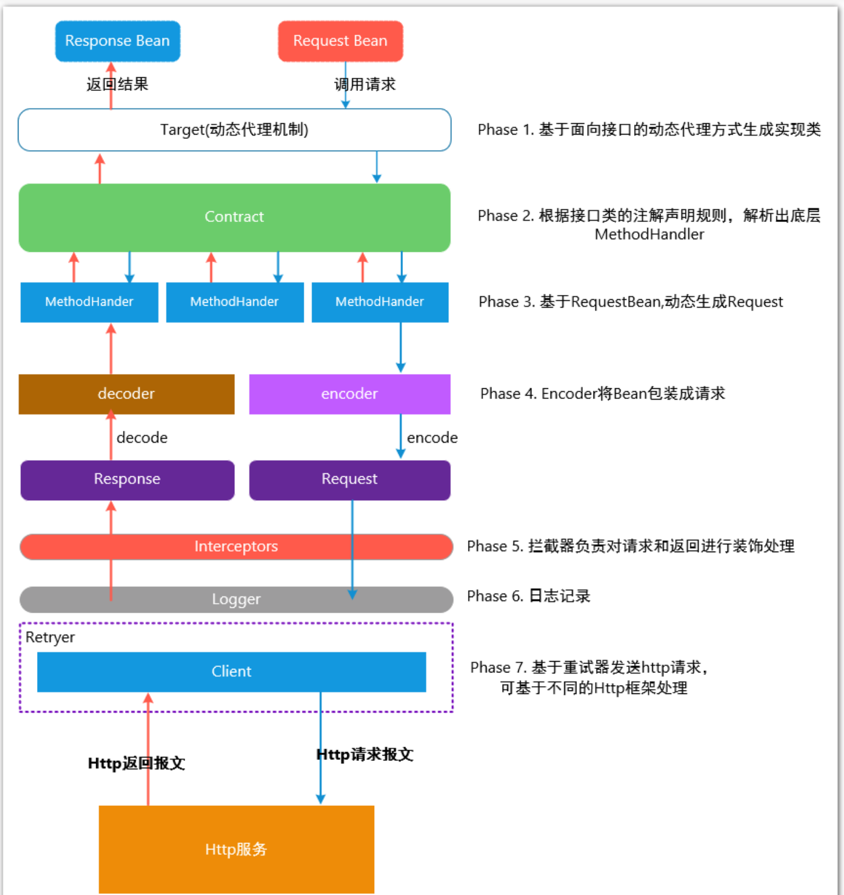
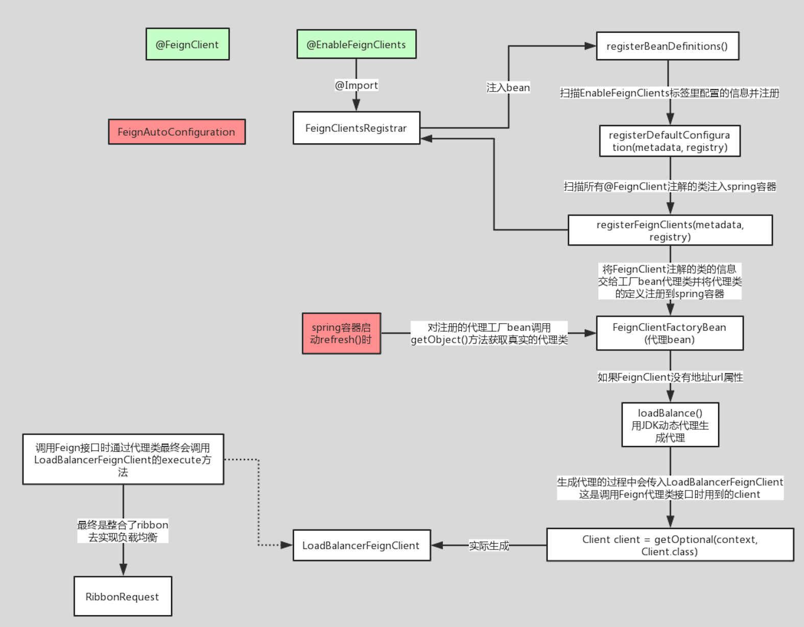

# 架构

# 流程

1. @EnableFeignClients 自动扫描。

   @EnableFeignClients 引入 FeignClientsRegistrar，

2. FeignClientsRegistrar

   调用registerDefaultConfiguration，将默认配置注入到容器中

   调用registerFeignClients，将 @FeignClient 标注的接口装配成 FeignClientFactoryBean 注入到容器中。

3. FeignClientFactoryBean。

   通过getObject方法，判断URL不存在则用负载均衡，通过JDK动态代理生成代理。

4. 实际调用LoadBalanceFeignClient.client，封装 RibbonRequest，包含 Client、Request、uri。通过executeWithLoadBalancer进行负载均衡，这是 Ribbon 提供了 API

   

   

   

   