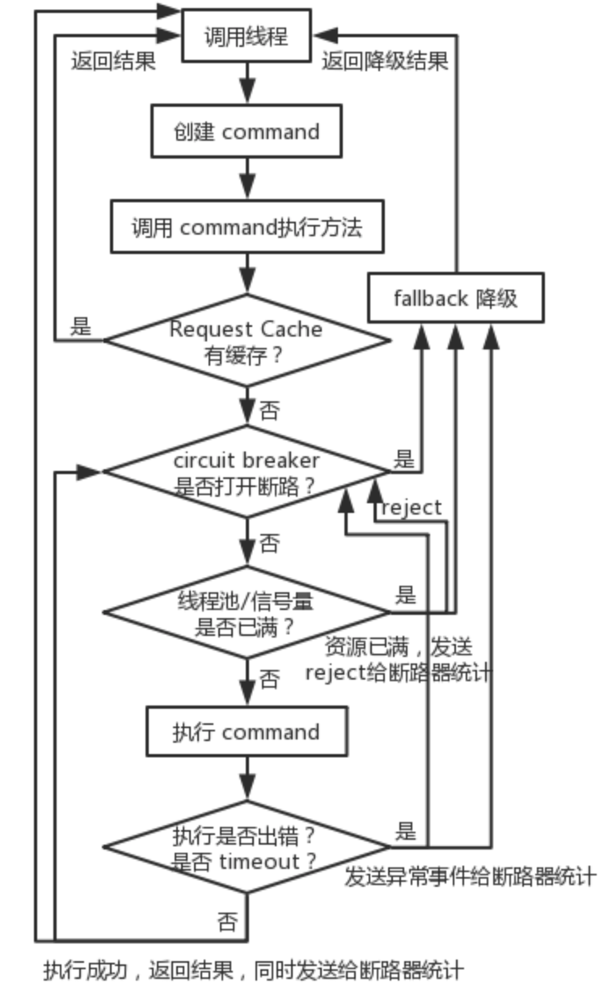
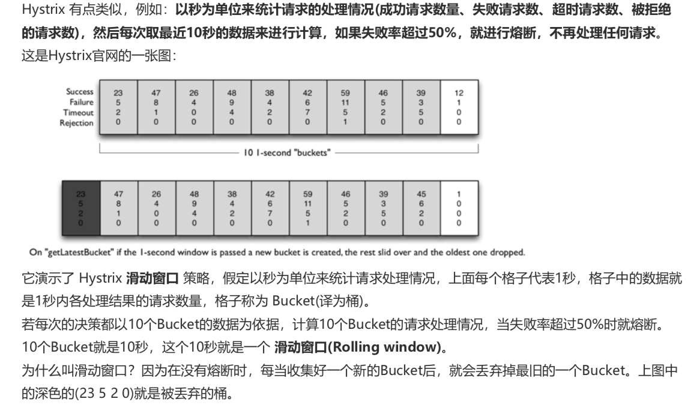

# 介绍

在分布式系统中，每个服务都可能会调用很多其他服务，被调用的那些服务就是**依赖服务**，有的时候某些依赖服务出现故障也是很正常的。

Hystrix 可以让我们在分布式系统中对服务间的调用进行控制，加入一些**调用延迟**或者**依赖故障**的**容错机制**。

Hystrix 通过将依赖服务进行**资源隔离**，进而阻止某个依赖服务出现故障时在整个系统所有的依赖服务调用中进行蔓延；同时Hystrix 还提供故障时的 fallback 降级机制。

总而言之，Hystrix 通过这些方法帮助我们提升分布式系统的可用性和稳定性。

## 设计原则

- 对依赖服务调用时出现的调用延迟和调用失败进行**控制和容错保护**。
- 在复杂的分布式系统中，阻止某一个依赖服务的故障在整个系统中蔓延。比如某一个服务故障了，导致其它服务也跟着故障。
- 提供 `fail-fast`（快速失败）和快速恢复的支持。
- 提供 fallback 优雅降级的支持。
- 支持近实时的监控、报警以及运维操作。

- 阻止任何一个依赖服务耗尽所有的资源，比如 tomcat 中的所有线程资源。
- 避免请求排队和积压，采用限流和 `fail fast` 来控制故障。
- 提供 fallback 降级机制来应对故障。
- 使用资源隔离技术，比如 `bulkhead`（舱壁隔离技术）、`swimlane`（泳道技术）、`circuit breaker`（断路技术）来限制任何一个依赖服务的故障的影响。
- 通过近实时的统计/监控/报警功能，来提高故障发现的速度。
- 通过近实时的属性和配置**热修改**功能，来提高故障处理和恢复的速度。
- 保护依赖服务调用的所有故障情况，而不仅仅只是网络故障情况。

# 资源隔离

Hystrix 实现资源隔离，主要有两种技术：

- 线程池
- 信号量

## 信号量机制

信号量的资源隔离只是起到一个开关的作用，比如，服务 A 的信号量大小为 10，那么就是说它同时只允许有 10 个 tomcat 线程来访问服务 A，其它的请求都会被拒绝，从而达到资源隔离和限流保护的作用。

适合说你的访问不是对外部依赖的访问，而是对内部的一些比较复杂的业务逻辑的访问，并且系统内部的代码，其实不涉及任何的网络请求，那么只要做信号量的普通限流就可以了，因为不需要去捕获 timeout 类似的问题。

## 线程池

资源隔离，就是说，你如果要把对某一个依赖服务的所有调用请求，全部隔离在同一份资源池内，不会去用其它资源了，这就叫资源隔离。哪怕对这个依赖服务，比如说商品服务，现在同时发起的调用量已经到了 1000，但是线程池内就 10 个线程，最多就只会用这 10 个线程去执行。此时再有请求过来，会先进入队列积压。如果说队列积压满了，再有请求过来，就直接 reject，拒绝请求，执行 fallback 降级的逻辑，快速返回。

**command key** ，代表了一类 command，一般来说，代表了底层的依赖服务的一个接口。

**command group** ，代表了某一个底层的依赖服务，这是很合理的，一个依赖服务可能会暴露出来多个接口，每个接口就是一个 command key。command group 在逻辑上去组织起来一堆 command key 的调用、统计信息、成功次数、timeout 超时次数、失败次数等，可以看到某一个服务整体的一些访问情况。一般来说，**推荐**根据一个服务区划分出一个线程池，command key 默认都是属于同一个线程池的。

如果你的 command key 要用自己的线程池，可以定义自己的 thread pool key

最大的好处，就是资源隔离，确保说任何一个依赖服务故障，不会拖垮当前的这个服务。线程池的健康状况随时会报告，比如成功/失败/拒绝/超时的次数统计，然后可以近实时热修改依赖服务的调用配置，而不用停机。当一个故障的依赖服务重新变好的时候，可以通过清理掉线程池，瞬间恢复该服务的调用

线程池机制最大的缺点就是增加了 CPU 的开销。每个 command 的执行都依托一个独立的线程，会进行排队，调度，还有上下文切换。

# 执行步骤

主要对加了@HystrixCommand注解的方法用AOP拦截实现类HystrixCommandAspect去拦截。

1. 创建 command
2. 调用 command 执行方法。
   - execute()：调用后直接 block 住，属于同步调用，直到依赖服务返回单条结果，或者抛出异常。
   - queue()：返回一个 Future，属于异步调用，后面可以通过 Future 获取单条结果。
   - observe()：订阅一个 Observable 对象，Observable 代表的是依赖服务返回的结果，获取到一个那个代表结果的 Observable 对象的拷贝对象。
   - toObservable()：返回一个 Observable 对象，如果我们订阅这个对象，就会执行 command 并且获取返回结果。
3. 检查是否开启缓存。这个 command 开启了请求缓存 Request Cache，而且这个调用的结果在缓存中存在，那么直接从缓存中返回结果。否则，继续往后的步骤。
4. 检查线程池/队列/信号量是否已满。是否开启了断路器。这个 command 对应的依赖服务是否开启了断路器。如果断路器被打开了，那么 Hystrix 就不会执行这个 command，而是直接去执行 fallback 降级机制，返回降级结果。
5. 如果这个 command 线程池和队列已满，或者 semaphore 信号量已满，那么也不会执行 command，而是直接去调用 fallback 降级机制，同时发送 reject 信息给断路器统计。
6. 执行 command。
7. 断路健康检查。Hystrix 会把每一个依赖服务的调用成功、失败、Reject、Timeout 等事件发送给 circuit breaker 断路器。断路器就会对这些事件的次数进行统计，根据异常事件发生的比例来决定是否要进行断路（熔断）。如果打开了断路器，那么在接下来一段时间内，会直接断路，返回降级结果。如果在之后，断路器尝试执行 command，调用没有出错，返回了正常结果，那么 Hystrix 就会把断路器关闭。
8. 调用 fallback 降级机制

# 断路器

Hystrix 经过断路器的流量超过了一定的阈值，才有可能触发断路。比如说，要求在 10s 内经过断路器的流量必须达到 20 个，而实际经过断路器的流量才 10 个，那么根本不会去判断要不要断路。

