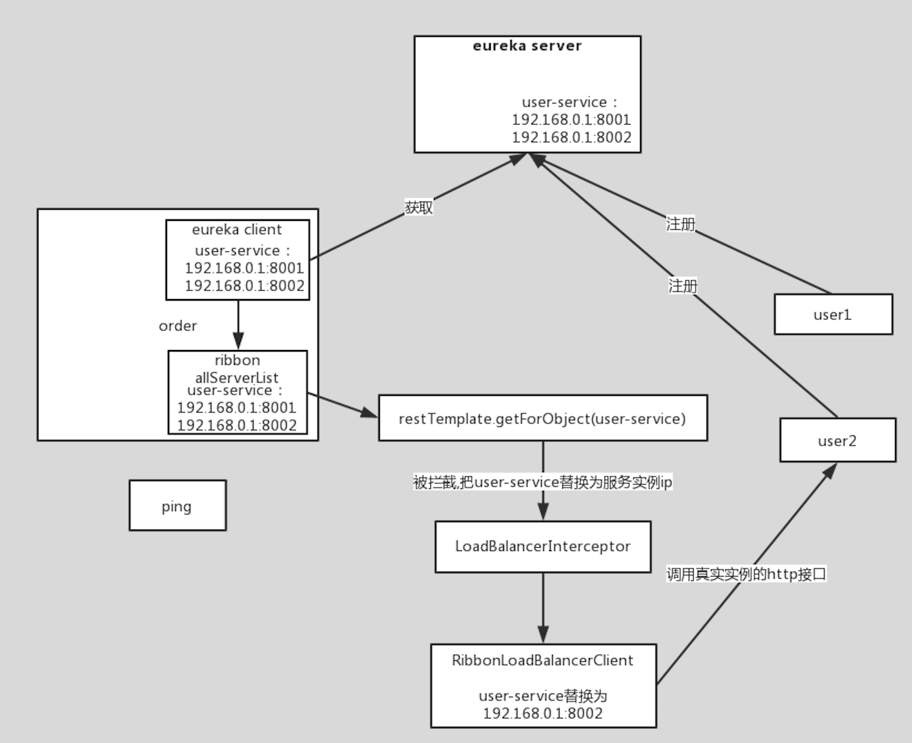
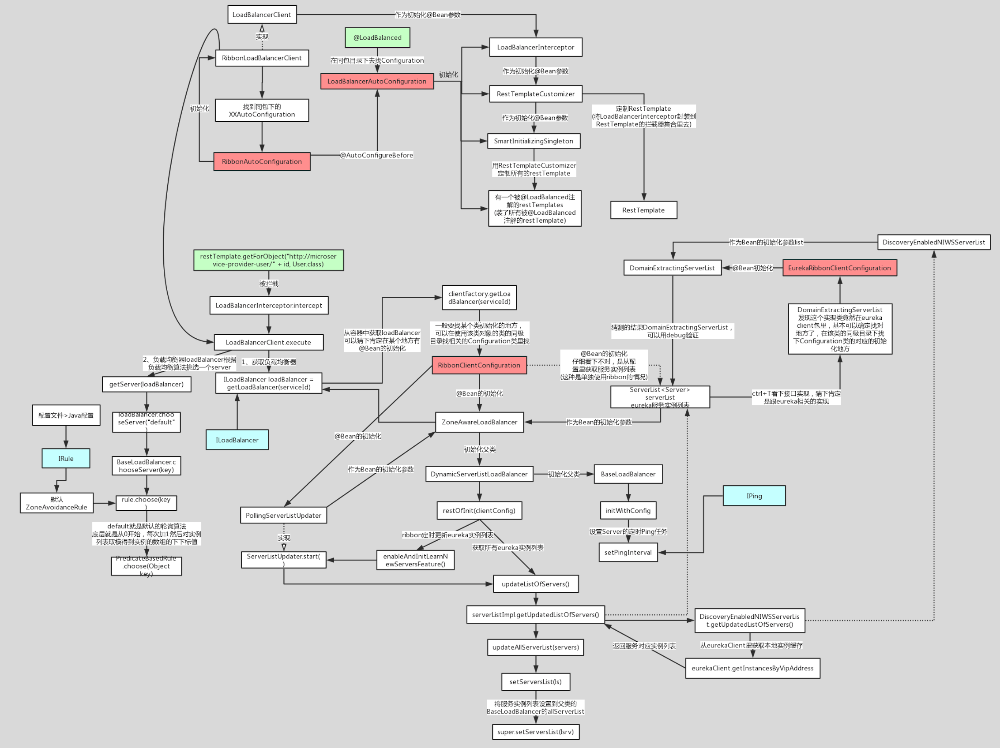

# 架构

# 负载均衡算法

## 随机选择

## 重试

对选定的负载均衡策略机上重试机制，在一个配置时间段内当选择Server不成功， 则一直尝试使用subRule的方式选择一个可用的server.

## 轮询

轮询index，选择index对应位置的Server

## AvailabilityFilteringRule

过滤掉一直连接失败的被标记为circuit tripped的后端Server，并过滤掉那些高并发的后端 Server或者使用一个AvailabilityPredicate来包含过滤server的逻辑，其实就就是检查 status里记录的各个Server的运行状态

## BestAvailableRule

选择一个最小的并发请求的Server，逐个考察Server，如果Server被tripped了，则跳过。

## WeightedResponseTimeRule

根据响应时间加权，响应时间越长，权重越小，被选中的可能性越低

## ZoneAvoidanceRule(默认是)

复合判断Server所在Zone的性能和Server的可用性选择Server，在没有Zone的情况下类是 轮询。

# 源码

1. @LoadBalanced

   经过以上的一堆注释可知，该类的主要作用就是给添加了@LoadBalanced注解的RestTemplate类，添加拦截器LoadBalancerInterceptor，该拦截器拦截到请求后将请求重新处理，就在这个拦截器中实现了负载均衡的相关功能。即在发出具体的HTTP请求时，拦截器会拦截该请求。

2. LoadBalancerClient是在初始化的时候，会向Eureka回去服务注册列表，并且向通过10s一次向EurekaClient发送“ping”，来判断服务的可用性，如果服务的可用性发生了改变或者服务数量和之前的不一致，则更新或者重新拉取。LoadBalancerClient有了这些服务注册列表，就可以根据具体的IRule来进行负载均衡。LoadBalancerClient具体交给了ILoadBalancer来处理

3. 执行负载均衡拦截，执行的是loadBalancer.execute方法。根据用户请求的serviceId来获取具体的LoadBalanced。

4. getServer获取就的service，也就是定位到哪台服务器的哪个端口号的具体服务信息

5. 执行http请求。