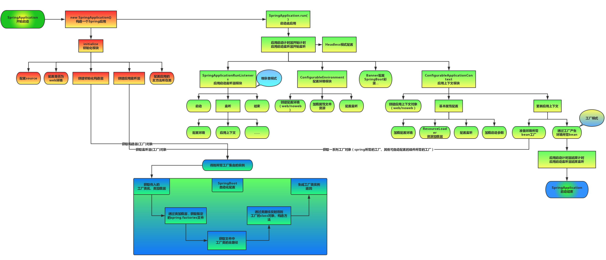

# 优缺点

Spring boot内嵌Tomcat、jetty等容器，可以以jar包形式独立运行。

将原有的xml配置，简化为注解的方式

提供了一系列的start 来简化Maven的依赖，对主流中间件的快速集成

缺点是集成度较高，使用过程中不太容易了解底层。

# 注解

@SpringBootApplication 这个注解，是一个复合注解。由三个注解组成，分别是\1. @Configuration、@EnableAutoConfiguration、@ComponentScan。

## @Configuration

它其实也是一个 IoC 容器的配置类。

## @ComponentScan

主要作用就是扫描指定路径下的标识了需要装配的类，自动装配到 spring 的 Ioc 容器中。

## @EnableAutoConfiguration

EnableAutoConfiguration 的 主 要 作 用 其 实 就 是 帮 助 springboot 应用把所有符合条件的@Configuration 配置都加载到当前 SpringBoot 创建并使用的 IoC 容器中。

该类中@Import(AutoConfigurationImportSelector.**class**)，它会通过 import 导入第三方提供的 bean 的配置类。

在分析 AutoConfigurationImportSelector 的源码时，会先扫描 spring-autoconfiguration-metadata.properties 文件，最后在扫描 spring.factories 对应的类时，会结合前面的元数据进行过滤。原因是很多 的@Configuration 其实是依托于其他的框架来加载的， 如果当前的 classpath 环境下没有相关联的依赖，则意味 着这些类没必要进行加载，所以，通过这种条件过滤可以有效的减少@configuration 类的数量从而降低 SpringBoot 的启动时间。

SpringFactoriesLoader 这个工具类的使用。它其实和 java 中的 SPI 机制的原理是一样的，不过它比 SPI 更好的点在于不会一次性加载所有的类，而是根据 key 进行加载。首先 ， SpringFactoriesLoader 的 作 用 是 从 classpath/META-INF/spring.factories 文件中，根据 key 来加载对应的类到 spring IoC 容器中。

# Starter

Starter 是 Spring Boot 中的一个非常重要的概念，Starter 相当于模块，它能将模块所需的依赖整合起来并对模块内的 Bean 根据环境( 条件)进行自动配置。使用者只需要依赖相应功能的 Starter，无需做过多的配置和依赖，Spring Boot 就能自动扫描并加载相应的模块。

## 日志Starter

```java
//定义注解
@Retention(RetentionPolicy.RUNTIME)
@Target(ElementType.METHOD)
@Documented
public @interface MyLogAnnotation {
  String model();
  String opType();
}
//定义切面类，定义了添加注解的所有方法作为连接点
//定义切入点
@Pointcut("@annotation()")
//环绕通知
@Around("logAnnotationAnnotationPointcut()")
 		Object obj = joinPoint.proceed();
//定义starter配置类
@Configuration
@ConditionalOnBean(Annotion=)//当有注解才加载
public class MyLogConfiguration {
    @Bean {reurn 切面类}
}
在resources目录下新建META-INF目录，并新建spring.factories文件，文件内填入自动配置的key和值，其中
key为org.springframework.boot.autoconfigure.EnableAutoConfiguration，
value为代码中的自动配置类全限定名路径com.logstarter.mylog.MyLogConfiguration。
```

# 启动流程



 上图为[SpringBoot启动结构图](https://www.processon.com/view/link/59812124e4b0de2518b32b6e)，我们发现启动流程主要分为三个部分，第一部分进行SpringApplication的初始化模块，配置一些基本的环境变量、资源、构造器、监听器，第二部分实现了应用具体的启动方案，包括启动流程的监听模块、加载配置环境模块、及核心的创建上下文环境模块，第三部分是自动化配置模块，该模块作为springboot自动配置核心，在后面的分析中会详细讨论。在下面的启动程序中我们会串联起结构中的主要功能。