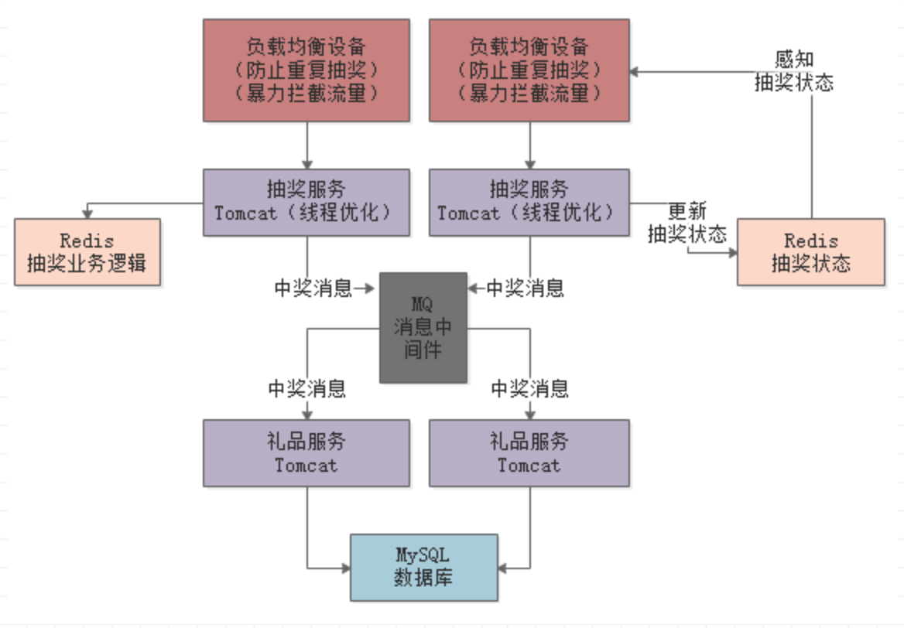

# 业务需求

假设现在有一个抽奖的业务场景，用户在某个时间可以参与抽奖，比如一共有1万个奖，奖品就是某个礼物。

然后参与抽奖的用户可能有几十万，一瞬间可能几十万请求涌入过来，接着瞬间其中1万人中奖了，剩余的人都是没中奖的。然后中奖的1万人的请求会联动调用礼品服务，完成这1万中奖人的礼品发放。

# 负载均衡层的限流

1. **防止用户重复抽奖**

我们可以在负载均衡设备中做一些配置，判断如果同一个用户在1分钟之内多次发送请求来进行抽奖，就认为是恶意重复抽奖，或者是他们自己写的脚本在刷奖，这种流量一律认为是无效流量，在负载均衡设备那个层次就给直接屏蔽掉。

2. **开奖后暴力拦截流量**

可能50万请求涌入，但是前1万个请求就把奖品都抽完了，或者把红包都抢完了，后续的流量其实已经不需要放到Tomcat抽奖服务上去了，直接暴力拦截返回抽奖结束就可以了。

让抽奖服务跟负载均衡之间有一个状态共享的机制。就是说抽奖服务一旦全部开奖完毕，直接更新一个共享状态。然后负载均衡感知到了之后，后续请求全部拦截掉返回一个抽奖结束的标识就可以了。

可以基于Redis来实现这种共享抽奖状态。

# Tomcate线程数量优化

**Tomcat线程数量在200~500之间**都是可以的，但是具体多少需要自己压测一下，不断的调节参数，看具体的CPU负载以及线程执行请求的一个效率。在CPU负载尚可，以及请求执行性能正常的情况下，尽可能提高一些线程数量。

# 基于Redis实现抽奖业务逻辑

把MySQL给替换成Redis，通常这种场景下，建议是基于Redis来实现核心的业务逻辑。Redis单机抗2万并发那是很轻松的一件事情

# 发放礼品环节进行限流削峰

抽奖服务把中奖信息发送到MQ，然后礼品服务假设就部署两个Tomcat，慢慢的从MQ中消费中奖消息，然后慢慢完成1完礼品的发放就可以了。

# 架构设计

