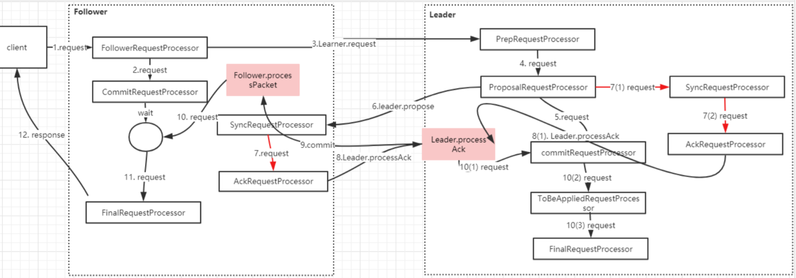

# 基本流程

ZooKeeper 的 Watcher 机制，总的来说可以分为三个过程。客户端注册 Watcher、服务器处理 Watcher 和客户端回调 Watcher。

客户端注册 watcher 有 3 种方式，getData、exists、getChildren。

# 客户端发起请求

在创建一个 ZooKeeper 客户端对象实例时，通过 new Watcher()向构造方法中传入一个默认的 Watcher。这个 Watcher 将作为整个 ZooKeeper 会话期间的默认 Watcher，会一直被保存在客户端 ZKWatchManager 的 defaultWatcher 中。

同时初始化 ClientCnxn，并且调用 cnxn.start()方法。 ClientCnxn是Zookeeper 客户端和 Zookeeper 服务器端进行通信和事件通知处理的主要类，它内部包含两个类，

1. SendThread。负责客户端和服务器端的数据通信, 也包括事件信息的传输 
2. EventThread。主要在客户端回调注册的 Watchers 进行通知处理

# 服务端接收请求

服务端有一个 NIOServerCnxn 类，用来处理客户端发送过来的请求。

zookeeper 启动的时候， 构建了一个NIOServerCnxnFactory，它实现了 Thread，所以在启动的时候，会在 run 方法中不断循环接收客户端的请求进行分发。

```java
NIOServerCnxn
  //处理客户端传送过来的数据包
  ->processPacket
  	//封装对象请求，在服务端提交当前请求
  	->Request,submitRequest
  		//对请求做一个调用链处理
  		->firstProcessor.processRequest
  			//将请求添加到阻塞队列，并从队列中拿到请求进行处理预处理
  			->PrepRequestProcessor
  				//将请求添加到阻塞队列，并从队列中拿到请求触发快照操作
  				->SyncRequestProcessor
  			      //根据客户端的 OP 类型进行处理
  						->FinalRequestProcessor
```

# 客户端接收响应

服务端处理完成以后，会通过 NIOServerCnxn.sendResponse 发送返回的响应信息， 客户端会在 ClientCnxnSocketNIO.doIO 接收服务端的返回。

```java
ClientCnxnSocketNIO.doIO
  //首先读取 header，如果其 xid == -2，表明是一个 ping 的 response，
  //如果 xid 是 -4 ，表明是一个 AuthPacket 的 response return
  //如果 xid 是 -1，表明是一个 notification,此时要继续读取并构造一个 enent，通过 EventThread.queueEvent 发送，return
  ->SendThread.readResponse
  	//如果是-1，从Packet中取出对应的Watcher并注册到ZKWatchManager中去
  	->finishPacket
  		//当前的数据包添加到等待事件通知的队列中
  		->eventThread.queuePacket
```

```java
static class ZKWatchManager implements ClientWatchManager { 
  private final Map<String, Set<Watcher>> dataWatches = new HashMap<String, Set<Watcher>>();
 private final Map<String, Set<Watcher>> existWatches =new HashMap<String, Set<Watcher>>();
  private final Map<String, Set<Watcher>> childWatches =new HashMap<String, Set<Watcher>>();
```

总的来说，当使用 ZooKeeper 构造方法或者使用 getData、exists 和
 getChildren 三个接口来向 ZooKeeper 服务器注册 Watcher 的时候，首先将此消息传递给服务端，传递成功后，服务端会通知客户端，然后客户端将该路径和 Watcher 对应关系存储起来备用。

# 事件触发

事件的触发，还得需要通过事务型操作来完成。

## 服务端的事件响应

根据类型，触发对应节点的 *NodeDataChanged* 事件。根据事件类型、连接状态、节点路径创建*WatchedEvent*，并移除该事件。调用`sendResponse(h, e, "notification")`， 发送了一个事件，事件对象为 *WatcherEvent*。

## 客户端处理事件响应

SendThread 接收到服务端的通知事件后，会通过调用 EventThread 类的 queueEvent 方法将事件传给 EventThread 线程，queueEvent 方法根据该通知事件， 从 ZKWatchManager 中取出所有相关的 Watcher，如果获取到相应的 Watcher，就 会让 Watcher 移除失效。

通过 dataWatches 或者 existWatches 或者 childWatches 的 remove 取出对应的watch，waitingEvents 是一个待处理 Watcher 的队列，EventThread 的 run() 方法会不断从队列中取数据，交由 processEvent 方法处理。最后调用客户端的回调函数。

# 集群模式下处理流程



