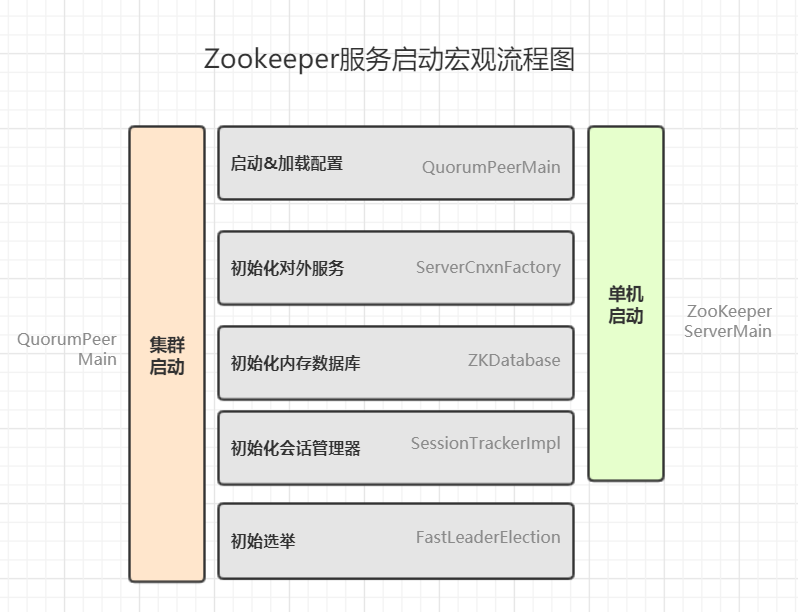
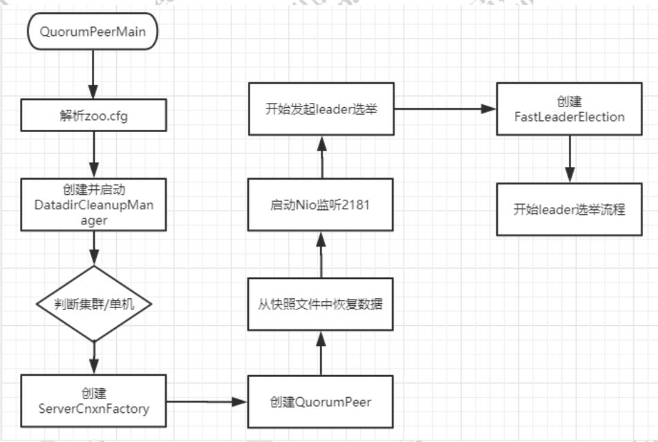
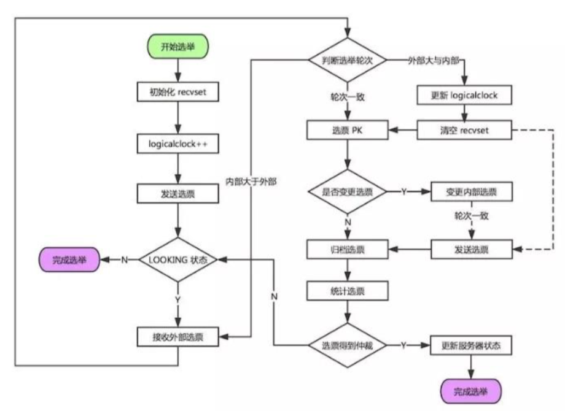
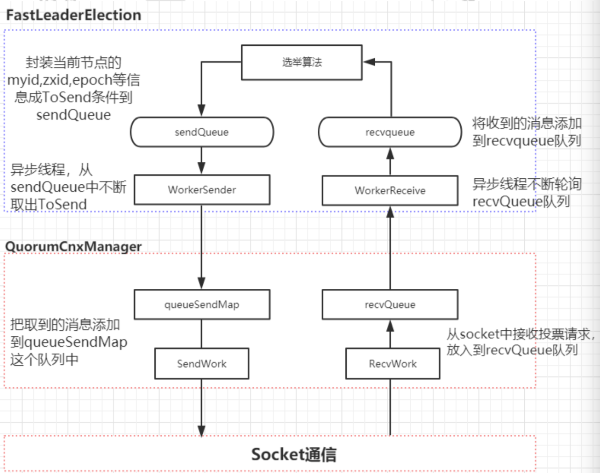

# 启动流程



## 代码堆栈

```java
>QuorumPeerMain#main  //启动main方法
 >QuorumPeerConfig#parse // 加载zoo.cfg 文件
   >QuorumPeerConfig#parseProperties // 解析配置
 >DatadirCleanupManager#start // 启动定时任务清除日志
 >QuorumPeerConfig#isDistributed // 判断是否为集群模式
  >ServerCnxnFactory#createFactory() //创建服务默认为NIO,推荐netty
 //***创建 初始化集群管理器**/
 >QuorumPeerMain#getQuorumPeer
 >QuorumPeer#setTxnFactory 
 >new FileTxnSnapLog // 数据文件管理器，用于检测快照与日志文件
   /**  初始化数据库*/
  >new ZKDatabase 
    >ZKDatabase#createDataTree //创建数据树，所有的节点都会存储在这
 // 启动集群：同时启动线程
  > QuorumPeer#start // 
    > QuorumPeer#loadDataBase // 从快照文件以及日志文件 加载节点并填充到dataTree中去
    > QuorumPeer#startServerCnxnFactory // 启动netty 或java nio 服务，对外开放2181 端口
    > AdminServer#start// 启动管理服务，netty http服务，默认端口是8080
    > QuorumPeer#startLeaderElection // 开始执行选举流程
    > quorumPeer.join()  // 防止主进程退出 
```



1.   main方法启动
  2.   加载zoo.cfg  配置文件
  3.   解析配置
  4.   创建服务工厂
  5.   创建集群管理线程
           1. 设置数据库文件管理器
                  2. 设置数据库
                         3. ....设置设置
  6.   start启动集群管理线程
           1. 加载数据节点至内存
                  2. 启动netty 服务，对客户端开放端口
                         3. 启动管理员Http服务，默认8080端口
                                4. 启动选举流程
  7.   join 管理线程，防止main 进程退出

# 快照与事务日志

ZK中所有的数据都是存储在内存中，即zkDataBase中。但同时所有对ZK数据的变更都会记录到事物日志中，并且当写入到一定的次数就会进行一次快照的生成。已保证数据的备份。其后缀就是ZXID（唯一事物ID）。

* 事物日志：每次增删改的记录日志都会保存在文件当中
* 快照日志：存储了在指定时间节点下的所有的数据

zkDdataBase 是zk数据库基类，所有节点都会保存在该类当中，而对Zk进行任何的数据变更都会基于该类进行。zk数据的存储是通过DataTree 对象进行，其用了一个map 来进行存储。

### 快照相关配置

|        dataLogDir         | 事物日志目录                                                 |
| :-----------------------: | :----------------------------------------------------------- |
|  zookeeper.preAllocSize   | 预先开辟磁盘空间，用于后续写入事务日志，默认64M              |
|    zookeeper.snapCount    | 每进行snapCount次事务日志输出后，触发一次快照，默认是100,000 |
| autopurge.snapRetainCount | 自动清除时 保留的快照数                                      |
|  autopurge.purgeInterval  | 清除时间间隔，小时为单位 -1 表示不自动清除。                 |

# 投票与选举

## 投票处理流程图



## 投票的网络通信流程




