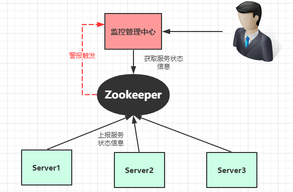

# 分布式集群管理

1. 主动查看线上服务节点

2. 查看服务节点资源使用情况

3. 服务离线通知

4. 服务资源（CPU、内存、硬盘）超出阀值通知

   

数据生成与上报：创建临时节点和定时变更节点状态信息：

主动查询：实时查询 zookeeper 获取集群节点的状态信息。

被动通知：监听根节点下子节点的变化情况,如果CPU 等硬件资源低于警告位则发出警报。

# 分布式注册中心

一个完整的注册中心涵盖以下功能特性：

* 服务注册：提供者上线时将自提供的服务提交给注册中心。
* 服务注销：通知注册中心提供者下线。
* 服务订阅：动态实时接收服务变更消息。
* 可靠：注册服务本身是集群的，数据冗余存储。避免单点故障，及数据丢失。
* 容错：当服务提供者出现宕机，断电等极情况时，注册中心能够动态感知并通知客户端服务提供者的状态。

## Dubbo注册中心存储结构

| **类别** | **属性** | **说明**                                                     |
| :------- | :------- | :----------------------------------------------------------- |
| Root     | 持久节点 | 根节点名称，默认是 "dubbo"                                   |
| Service  | 持久节点 | 服务名称，完整的服务类名                                     |
| type     | 持久节点 | 可选值：providers(提供者)、consumers（消费者）、configurators(动态配置)、routers |
| URL      | 临时节点 | url名称包含服务提供者的 IP 端口 及配置等信息。               |

# 分布式JOB

1. 多个服务节点只允许其中一个主节点运行JOB任务。
2. 当主节点挂掉后能自动切换主节点，继续执行JOB任务

# 分布式锁

## 获得写锁

基于资源ID创建临时序号写锁节点 /lock/888.R0000000002 Write。获取 /lock 下所有子节点，判断其最小的节点是否为自己，如果是则获锁成功。最小节点不是自己，则阻塞等待。添加lock/ 子节点变更监听。当节点变更监听触发，执行第2步。

# 获得读锁

1、基于资源ID创建临时序号读锁节点 /lock/888.R0000000002 Read 。获取 /lock 下所有子节点，判断其最小的节点是否为读锁，如果是则获锁成功。最小节点不是读锁，则阻塞等待。添加lock/ 子节点变更监听。当节点变更监听触发，执行第2步

## 释放锁

读取完毕后，手动删除临时节点，如果获锁期间宕机，则会在会话失效后自动删除。

## 惊群效应

在等待锁获得期间，所有等待节点都在监听 Lock节点，一但lock 节点变更所有等待节点都会被触发，然后在同时反查Lock 子节点。如果等待对例过大会使用Zookeeper承受非常大的流量压力。

为了改善这种情况，可以采用监听链表的方式，每个等待对列只监听前一个节点，如果前一个节点释放锁的时候，才会被触发通知。这样就形成了一个监听链表。

