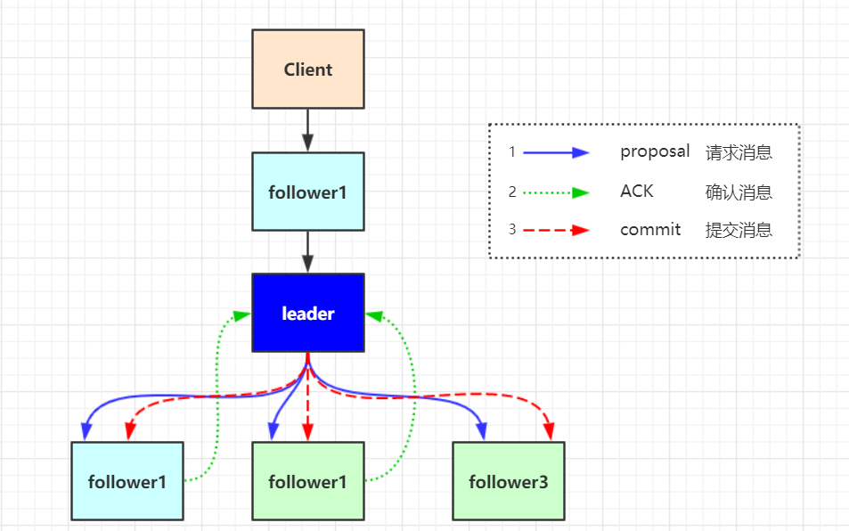

# 集群部署

配置语法：server.<节点ID(myid)>=<ip>:<数据同步端口>:<选举端口>

# 集群角色

| 角色         |                             描述                             |
| :----------- | :----------------------------------------------------------: |
| **leader**   | 主节点，又名领导者。用于写入数据，通过选举产生，如果宕机将会选举新的主节点。 |
| **follower** | 子节点，又名追随者。用于实现数据的读取。同时他也是主节点的备选节点，并用拥有投票权。 |
| **observer** | 次级子节点，又名观察者。用于读取数据，与fllower区别在于没有投票权，不能选为主节点。并且在计算集群可用状态时不会将observer计算入内。 |

# 数据同步

ZAB(Zookeeper Atomic Broadcast) 协议是为分布式协调服务 ZooKeeper 专门设计的一种支持崩溃恢复的原子广播协议。在 ZooKeeper 中，主要依赖 ZAB 协议来实现分布式数据一致性，基于该协议，ZooKeeper 实现了一种主备模式的系统架构来保持集群中各个副本之间的数据一致性。

ZAB 协议包含两种基本模式，分别是崩溃恢复和原子广播。

## ZXID

 zxid，也就是事务 id。zxid 是一个 64 位的数字，高32位是epoch，每次一个 leader 被选出来，它都会有一个新的epoch=(原来的 epoch+1)。低 32 位用于递增计数。

## 原子广播

zookeeper 中，客户端会随机连接到 zookeeper 集群中的一个节点，如果是读请求，就直接从当前节点中读取数据，如果是写请求，那么请求会被转发给 leader 提交事务，然后 leader 会广播事务，只要有超过半数节点写入成功， 那么写请求就会被提交(类 2PC 事务)。

1. leader 接收到消息请求后，将消息赋予一个全局唯一的64 位自增 id，叫:zxid，通过 zxid 的大小比较既可以实现因果有序这个特征。
2. leader 为每个 follower 准备了一个 FIFO 队列(通过 TCP协议来实现)将带有 zxid的消息作为一个提案(proposal)分发给所有的 follower。
3. 当 follower 接收到 proposal，先把 proposal 写到磁盘，写入成功以后再向 leader 回复一个 ack
4. 当 leader 接收到超过半数节点的 ACK 后，leader 就会向follower 发送 commit 命令，同时会在本地执行该消息
5. 当 follower 收到消息的 commit 命令以后，会提交该消息。

和完整的 2pc 事务不一样的地方在于，zab 协议不能终止事务，follower 节点要么 ACK 给 leader，要么抛弃 leader，虽然在某一个时刻follower节点和 leader 节点的状态会不一致，zab 协议提供了一种恢复模式来进行数据恢复。

## 崩溃恢复

当整个集群在启动时，或者当 leader 节点出现网络中断、 崩溃等情况时，ZAB 协议就会进入恢复模式并选举产生新的 Leader。或者在 Leader 节点正常工作时，启动一台新的服务器加入到集群，那这个服务器会直接进入数据恢复模式，和leader 节点进行数据同步。

崩溃恢复下 zab 协议需要做两件事，选举出新的 leader和数据同步。

ZAB 协议要设计一个 leader 选举算法：能够确保已经被 leader 提交的事务 Proposal 能够提交、同时丢弃已经被跳过的事务 Proposal。 

1. 如果 leader 选举算法能够保证新选举出来的 Leader 服务器拥有集群中所有机器最高编号(ZXID 最大)的事务 Proposal，那么就可以保证这个新选举出来的 Leader 一 定具有已经提交的提案。因为所有提案被 COMMIT 之 前必须有超过半数的 followerACK，即必须有超过半数节点的服务器的事务日志上有该提案的 proposal，因此， 只要有合法数量的节点正常工作，就必然有一个节点保 存了所有被 COMMIT 消息的 proposal 状态

2. 另外一个，zxid 是 64 位，高 32 位是 epoch 编号，每经 过一次 Leader 选举产生一个新的 leader，新的 leader 会将 epoch 号+1，低 32 位是消息计数器，每接收到一 条消息这个值+1，新 leader 选举后这个值重置为 0.这样设计的好处在于老的 leader 挂了以后重启，它不会被选举为 leader，此时它的 zxid 肯定小于当前新的 leader。当老的 leader 作为 follower 接入新的 leader 后，新的 leader 会让它将所有的拥有旧的 epoch 号的 未被 COMMIT 的 proposal 清除

# 一致性

zookeeper 是一个顺序一致性模型。顺序一致性是针对单个操作，单个数据对象。一个数据被更新后，能够立马被后续的读操作读到。

zookeeper 不保证在每个实例中，两个不同的客户端具有相同zookeeper 数据视图。如果客户端 A 和 B 要读取必须要读取到相同的值，那么 client B 在读取操作之前执行 sync 方法。

同时client 会记录自己已经读取到的最大的 zxid，如果 client 重连到 server 发现 client 的 zxid 比自己大。连接会失败。

# 集群选举

## 服务启动时leader选举

1. 每个Server发出一个投票。由于是初始情况，Server1和Server2都会将自己作为 Leader 服务器来进行投票，每次投票会包含所推举的服务器的myid 和 ZXID。
2. 接受来自各个服务器的投票。集群的每个服务器收到投票后，首先判 断该投票的有效性，如检查是否是本轮投票(epoch)、是否来自 LOOKING 状态的服务器。
3. 处理投票。针对每一个投票，服务器都需要将别人的投票和自己的投 票进行PK。优先比较 epoch，其次检查 ZXID，最后比较myid。根据规则进行重新投票。
4. 统计投票。每次投票后，服务器都会统计投票信息，判断是否已经有 过半机器接受到相同的投票信息。
5. 改变服务器状态。如果是 Follower，那么就变更为 FOLLOWING，如果是 Leader， 就变更为 LEADING。

## 运行过程中leader选举

当集群中的 leader 服务器出现宕机或者不可用的情况时，那么整个集群 将无法对外提供服务，而是进入新一轮的 Leader 选举，服务器运行期间 的 Leader 选举和启动时期的 Leader 选举基本过程是一致的。

1. 变更状态。Leader 挂后，余下的非 Observer 服务器都会将自己的服务器状态变更为 LOOKING，然后开始进入 Leader 选举过程。
2. 每个 Server 会发出一个投票。在运行期间，每个服务器上的 ZXID 可 能不同。将投票发送给集群中所有机器。接收来自各个服务器的投票。与启动时过程相同。
3. 处理投票。与启动时过程相同。
4. 统计投票。与启动时过程相同。
5. 改变服务器的状态。与启动时过程相同